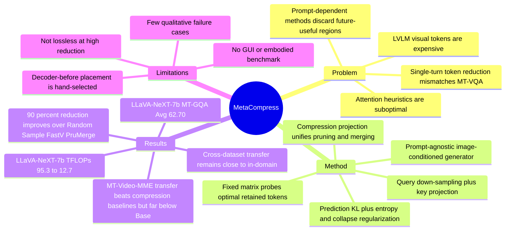

## Summary
这篇论文把 LVLM visual token reduction 从 single-turn VQA 重新放到更实际的 multi-turn VQA 场景中，指出 prompt-dependent pruning 会丢掉后续轮次可能需要的图像区域，而 attention heuristic 的 prompt-agnostic 方法也不是可靠的 token 保留准则。作者提出 MetaCompress：一个只依赖 image tokens 的轻量 compression matrix generator，用数据驱动方式学习 visual token pruning / merging，并在多个 MT-VQA benchmark 和 LVLM 架构上取得更好的 accuracy-efficiency trade-off。

## Problem & Motivation
现代 LVLM 通过 global + local multi-scale visual tokens 提升细粒度理解，但 visual token 数量会把 attention 的计算和显存成本推高，尤其影响低延迟和资源受限部署。已有 token reduction 方法主要面向 single-turn VQA：FastV 这类 prompt-dependent 方法会围绕当前 prompt 保留 token，在 MT-VQA 中无法知道后续问题会问图像哪个区域；PruMerge 这类 prompt-agnostic 方法虽然能用于多轮，但主要依赖 attention score 等人工 heuristic。论文的关键问题是：在不知道未来问题的情况下，能否学习一个 prompt-agnostic compression mapping，让压缩后的 visual sequence 尽量保持原 LVLM 的回答分布。

## Method
**统一视角：compression projection.** 作者把 token pruning 和 token merging 都写成对 visual sequence 的线性压缩：

$$\tilde{X}_{IMG}=P X_{IMG}, \quad P \in \mathbb{R}_{+}^{m \times n}, m \ll n$$

这里的 $P$ 是 sparse compression matrix。为了验证 heuristic attention 是否接近最优，作者先在单个 image-text pair 上直接优化 $P_{raw}$，用 row-wise Softmax 得到 $P$，目标是最小化原始 visual tokens 和压缩 visual tokens 下 LLM response distribution 的 KL divergence，并加 entropy regularization。这个 fixed-matrix 实验发现：被学习矩阵保留的 token 与常用 attention cues 没有明显对应关系，只有约 1.71% retained tokens 属于 high [CLS] attention token，prompt-token attention 的对应关系更弱。

**MetaCompress.** 真正用于部署的模块不是为每张图单独学 $P$，而是学习一个 image-conditioned generator $P_{meta}(X_{IMG})$。它由 position embedding、down-sampled query projection $\tilde{D}_q$、key projection $D_k$ 和 weighted inner product 组成：先对带位置编码的 image tokens 做 pooling 得到 queries，再对原 image tokens 做 key projection，最后通过带可学习 diagonal weight 的 dot product 和 Softmax 生成 compression matrix。由于 $P_{meta}$ 只看 image sequence，不依赖 prompt，因此同一张图在多轮对话中可以复用压缩后的 visual tokens。

**Training objective.** MetaCompress 的主目标是最小化压缩前后 response distribution 的 prediction discrepancy $L_{pred}$。为了避免压缩矩阵退化，作者加入 entropy regularization $L_{entropy}$ 和 collapse regularization $L_{collapse}$；实际训练中 collapse 项需要 gradient clipping，否则会因为惩罚过强导致训练不稳定。训练只使用约 20k samples，覆盖 MT-GQA train-balanced 和 MT-VQA-v2 training set 的小子集；LLaVA-NeXT-7B 在 90% reduction rate 下训练约 30 GPU hours，四张 RTX A6000 上约 9 小时。

## Key Results
**MT-VQA benchmark, 90% visual token reduction.** 在 Table 1 中，MetaCompress 在 3 个 multi-turn benchmark 和 5 个 LVLM 上整体优于 Random、Sample、FastV、PruMerge：

- **LLaVA-NeXT-7b**：MT-VQA-v2 Avg 75.18，优于 Sample 71.85 和 FastV 58.45；MT-GQA Avg 62.70，优于 Sample 61.03 和 FastV 50.31；ConvBench Avg 7.28，优于 Sample 5.60 和 FastV 1.23。无压缩 Base 分别是 80.59、66.15、9.00，说明 90% reduction 仍有明显性能损失，但 MetaCompress 保留得最好。
- **LLaVA-NeXT-13b**：MT-VQA-v2 Avg 75.26，MT-GQA Avg 63.12，ConvBench Avg 8.32；对应 Sample 是 73.08、61.95、7.69，FastV 是 58.43、50.64、4.02。
- **LLaVA-1.5-13b**：MetaCompress 在 MT-VQA-v2 / MT-GQA / ConvBench 上为 72.94 / 59.48 / 5.20，超过 PruMerge 的 70.68 / 58.11 / 4.68。
- **InternLM-XComposer-2.5-7b**：MetaCompress 为 75.76 / 58.68 / 9.88，优于 FastV 的 74.23 / 57.00 / 2.78，也略优于 Sample 的 70.05 / 56.61 / 9.76。

**Efficiency.** Table 2 在 MT-GQA、90% reduction rate 下报告了推理成本。LLaVA-NeXT-7b 上，Base 的 TTFT / E2ET / Mem / TFLOPs 是 484 ms / 830 ms / 16.7 GB / 95.3，而 MetaCompress 是 174 ms / 501 ms / 14.9 GB / 12.7；其 TTFT 和 TFLOPs 与 Random / Sample 基本一致，但 accuracy 更高。LLaVA-1.5-7b 上，MetaCompress 为 97.8 ms TTFT、480 ms E2ET、26.1 GB、13.3 TFLOPs，对比 Base 的 232 ms、676 ms、26.9 GB、71.4 TFLOPs。

**Ablation.** Table 3 显示 LLaVA-NeXT-7b 在 MT-GQA、90% reduction 下，$L_{pred}$ only 为 61.98，加入 $L_{entropy}$ 后到 62.42，$L_{collapse}$ 单独加入但无 gradient clipping 会掉到 56.34；最终 $L_{pred}+L_{entropy}+L_{collapse}$ 且 gradient clipping 达到 62.70。Table 6 在 LLaVA-1.5-7b / LLaVA-NeXT-7b / XComposer-2.5-7b 上给出类似趋势，最终设置分别达到 58.43 / 62.70 / 58.68。

**Transfer.** Table 7 的 cross-dataset transfer 表明 MetaCompress 不是完全依赖训练集分布：LLaVA-NeXT-7b 上，MT-GQA 训练后迁移到 MT-VQA-v2 为 73.61，而 MT-VQA-v2 in-domain 为 75.18；MT-VQA-v2 训练后迁移到 MT-GQA 为 61.43，而 MT-GQA in-domain 为 62.70。Table 8 在 MT-Video-MME 3-turn 版本上用 XComposer-2.5-7B 做 70% compression transfer，MetaCompress Avg 30.1，超过 Random 27.6、Sample 27.7、FastV 28.4，但仍远低于无压缩 Base 46.4。

## Strengths & Weaknesses
**已知的强点。**

1. **问题设定更贴近真实 LVLM 使用。** MT-VQA 中后续问题未知，这确实会破坏 prompt-dependent pruning 的基本假设；论文把这个 mismatch 讲清楚了。
2. **先证伪 heuristic，再提出 learning-based 方法。** 作者没有直接堆一个模块，而是先用 fixed compression matrix 探索“哪些 token 该保留”，并观察到 learned retained tokens 与 [CLS] / prompt attention heuristic 弱相关。这让 MetaCompress 的动机比普通 token pruning paper 更扎实。
3. **跨架构覆盖较好。** 实验覆盖 LLaVA-1.5、LLaVA-NeXT、InternLM-XComposer-2.5，其中后两者有 multi-scale / variable-length visual sequence，对 token reduction 更难。
4. **效率数字是真实收益。** 在 LLaVA-NeXT-7b 上，TFLOPs 从 95.3 降到 12.7，TTFT 从 484 ms 降到 174 ms；这不是只看 accuracy 的压缩方法。

**已知的限制。**

1. **90% reduction 下仍有明显 accuracy drop。** 例如 LLaVA-NeXT-7b 的 MT-VQA-v2 Avg 从 Base 80.59 降到 75.18，MT-GQA 从 66.15 降到 62.70，ConvBench 从 9.00 降到 7.28。MetaCompress 是更好的折中，不是无损压缩。
2. **训练目标是 response distribution matching，不是下游任务 reward。** 这使方法适合保留原模型行为，但如果原模型在某些视觉细节上本来就错，压缩模块不会主动修正。
3. **scope 主要是 VQA-style multi-turn，对 GUI / embodied 场景仍是间接相关。** 论文没有测试 screenshot GUI grounding、web/mobile agent、robot observation 等输入分布，因此不能直接声称适用于 GUI agent。
4. **模块位置仍有手工选择。** 作者把 reduction 放在 LLM decoder 前，并承认未来要探索所有 LLM layers 的 token reduction；这说明当前并不是 full-stage optimal compression。
5. **failure case 不充分。** 论文有 FastV / collapse regularization 的失败现象和 attention heuristic 的统计分析，但没有给出具体图像或问题级别的 qualitative failure cases，难以判断哪些视觉内容最容易被压缩掉。

**推测。** MetaCompress 对 GUI agent 可能有价值，因为 GUI / mobile / desktop agent 常面对高分辨率 screenshot 和多轮交互，未来动作可能依赖先前未被 prompt 点名的区域；这种场景与 MT-VQA 的“不知道后续问题会问哪里”有结构相似性。但这只是 problem-structure 层面的推测，论文没有给 GUI benchmark 证据。

**不知道。** 论文没有回答 compression matrix 是否会系统性丢失小文字、UI icon、OCR-heavy regions 或 spatial relation details；也不知道在需要跨 step state tracking 的 agent task 中，压缩误差是否会随多轮动作累积。

## Mind Map

## Notes
- **我的判断**：rating=4。这是 VLM efficiency 方向值得读的工作，主要价值不是“又省了一些 token”，而是把 token reduction 的 problem formulation 从 single-turn prompt relevance 改成 multi-turn general information preservation。
- **和 GUI Agent 的关系**：GUI agent 的 screenshot 常有大量暂时无关但未来可能相关的信息。MetaCompress 的 prompt-agnostic 设定比 FastV 式 prompt-conditioned pruning 更符合这种交互结构，但需要在 GUI grounding / computer-use benchmark 上重新验证。
- **最值得借鉴的实验范式**：先为单个输入优化 compression matrix，再检查 learned retained tokens 与 heuristic 的关系。这种“先找 oracle-ish behavior，再设计可部署模块”的路线比直接提出新 pruning score 更有说服力。
- **后续问题**：如果把 MT-VQA 换成需要 OCR 和精确坐标的任务，MetaCompress 是否会更偏向保留 spatially uniform tokens 而牺牲细粒度文本？论文的 Figure 6 / 7 显示它主要接近 equidistant down-sampling，并在部分 token 上适配，这既是效率优势，也可能是细节任务的风险。
