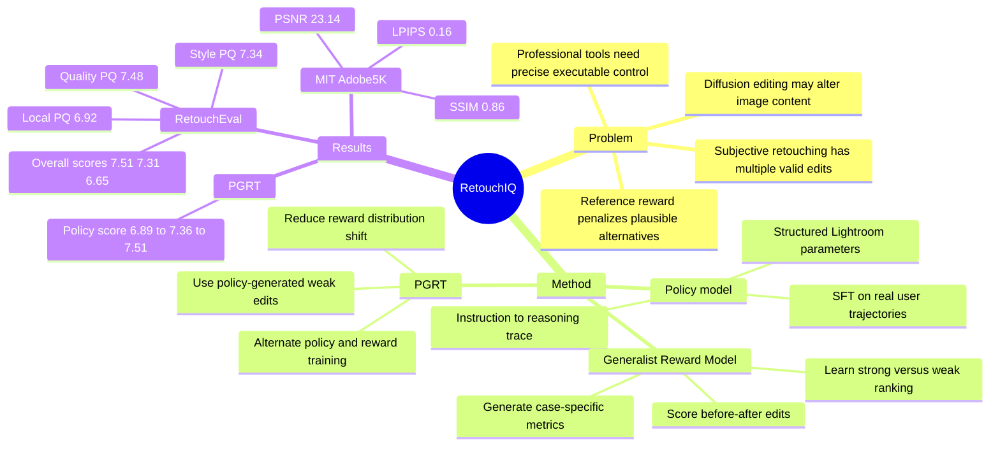

## Summary
RetouchIQ 解决 instruction-based image retouching 中“审美目标主观、单一 reference reward 不可靠”的问题，把 MLLM policy 训练成能从自然语言指令生成 reasoning trace 和可执行 Lightroom 参数的 agent。核心方法是用 Generalist Reward Model 动态生成评价 metrics 并给出 scalar reward，再通过 PGRT 让 reward model 接近 policy 真实输出分布。

## Problem & Motivation
作者关注的是 professional image editing software 的 tool-use agent：用户给出“更温暖”“更 cinematic”“局部加 golden glow”这类高层审美指令，系统需要生成可解释、可执行的参数调整，而不是直接生成一张不可控的新图。传统 image retouching 方法通常不处理细粒度自然语言目标；diffusion-based editing 虽能听懂 prompt，但论文指出它容易改变原始图像内容和环境。已有 MLLM agent 方法尝试用 RL 学习工具调用，但 image retouching 天然存在多解：同一指令可以通过不同 tone、warmth、color balance 达到合理效果，因此用单个 human-edited reference 计算 pixel-level 或 reference-based reward 会错误惩罚其他有效编辑。RetouchIQ 的问题设定是：如何在 subjective creative editing 中给 MLLM agent 提供更可靠的 reward，使它既对齐用户意图，又保持可执行和可解释。

## Method
RetouchIQ 包含一个 policy editing model 和一个 Generalist Reward Model。

**Policy model** 输入原图 `I0` 与用户指令 `g`，输出两类内容：一段解释审美意图和编辑策略的 reasoning trace `q`，以及一组结构化 editing operations `e`，例如 exposure、temperature、saturation、vibrance 等 Lightroom 参数。训练分两阶段：SFT 阶段用 instruction-reasoning-edit corpus 做 autoregressive learning；RL 阶段执行 policy 生成的编辑，并用 reward model 分数加 format reward 优化 policy。

**数据准备** 从真实用户编辑轨迹出发，包含 before-after image pair 和 editing sequence。由于源数据缺少用户当时的自然语言 goal 与 reasoning，作者用固定的 MLLM annotator 根据 `(I0, I, e)` 反推 editing goal `g`，并生成模拟 agent 的 reasoning process `q`；随后过滤 unclear editing intentions 或 goal/reasoning 不一致的样本。policy 训练集最终包含 **190K image-instruction pairs**，每张输入图有三种不同长度和复杂度的 instruction variants。

**Generalist Reward Model (GRM)** 不是直接把输出图与 reference 图做固定指标比较，而是基于 before-after image pair 与 instruction 先生成 case-specific metrics，再按这些 metrics 输出 scalar reward。GRM 的 SFT 数据由 strong edit 和 weak edit 组成：strong edit 是用户编辑后的图；weak edit 通过 MLLM-guided perturbation 修改原编辑配置，故意遗漏或误调关键参数，得到仍然 plausible 但更弱的版本。GRM 学习对同一指令下的 strong/weak 两张图生成 metrics 与分数，并保持 strong edit 分数更高。

**PGRT (Policy-Guided Reward Training)** 处理 reward model 的 distribution shift。作者观察到 perturbed weak edits 往往是 exposure、temperature 这类单参数扰动，而 policy model 的真实错误更常是 combined and complex edits；只用 perturbation 数据训练 reward model，可能无法正确评估 policy 生成的图。因此 PGRT 在 RL 阶段把 weak edit 从 perturbation 版本切换为 policy-generated result，让 reward model 在更接近 policy 分布的数据上学习 `R(user edit) > R(policy weak edit)`。实现上，policy 和 reward model 都基于 **Qwen2.5-VL-7B**，MLLM annotator 与 perturber 使用 **GLM-4.5V**，editing platform 使用 **Adobe Lightroom**；GRM 初始训练用 **10K perturbed samples**，alternating training 期间再生成 **5K samples** 微调 reward model。

## Key Results
- **RetouchEval**：作者构建了 **300 instruction-image pairs** 的 benchmark，分为 quality enhancement、style transformation、local retouching 三类。RetouchIQ-GRM 在 overall score `O` 上分别达到 **7.51 / 7.31 / 6.65**，高于 RetouchIQ-SFT 的 **6.69 / 7.00 / 6.40** 和 RetouchIQ-Rule 的 **6.87 / 7.04 / 6.51**；相对外部 baseline，quality enhancement 上高于 JarvisArt **6.90**、MonetGPT **6.78**，style transformation 上高于 JarvisArt **7.13**、GPT-5 **6.82**，local retouching 上高于 MonetGPT **6.48**、GPT-5 **6.47**。
- **RetouchEval 子指标**：quality enhancement 中 RetouchIQ-GRM 的 **L1 31.41、SC 7.57、PQ 7.48、O 7.51** 最强，但 **L2 44.99** 与 MonetGPT 的 **44.98** 基本持平且不是最低。style transformation 中 RetouchIQ-GRM 的 **PQ 7.34、O 7.31** 最强，但 JarvisArt 的 **L1 33.90** 和 **SC 7.39** 高于 RetouchIQ-GRM 的 **L1 34.08、SC 7.29**。local retouching 中 RetouchIQ-GRM 的 **PQ 6.92、O 6.65** 最强，但 RetouchIQ-SFT 的 **L1 26.41、L2 42.10** 更低，JarvisArt 的 **SC 6.45** 高于 RetouchIQ-GRM 的 **6.39**。
- **MIT-Adobe5K**：在 400 张随机测试图上，RetouchIQ-GRM 达到 **SSIM 0.86、LPIPS 0.16、PSNR 23.14**，高于 RetouchIQ-SFT 的 **0.84 / 0.20 / 22.37**，也高于 MonetGPT 的 **0.82 / 0.17 / 23.10**、JarvisArt 的 **0.76 / 0.23 / 21.03** 和 GPT-5 的 **0.72 / 0.26 / 20.82**。
- **PGRT ablation**：Figure 5 的 policy model bar score 从 off-the-shelf reward model 的 **6.89** 提升到 perturbed-data reward model 的 **7.36**，再提升到 combined-data / PGRT setting 的 **7.51**。论文同时报告 PGRT 让 reward model 在 actual policy-generated data 上的判断更好，但图中精确 accuracy 数值不完整，因此这里不写具体 accuracy。
- **Qualitative comparison**：论文指出 GPT-5 容易 over-edit，Flux Pro 在样例中不稳定地改变原始结构、身份或环境，MonetGPT 在 style changing 上较弱，JarvisArt 在 customized requests 中会误调 temperature 或漏掉 black-and-white conversion；RetouchIQ 在 nighttime balancing、tone harmonization 等例子中更符合指令。

## Strengths & Weaknesses
**已知**

- 这篇论文的核心贡献不是新的 image backbone，而是把 subjective image retouching 改写成一个 executable tool-use + generalist reward 的 agentic RL 问题。它明确指出 reference-based reward 与 creative editing 多解性之间的冲突，并用动态 metrics + scalar reward 来替代固定 pixel metric。
- RetouchIQ 的输出是 Lightroom 参数而不是 black-box image generation，因此保留了可执行性和一定解释性；这对 GUI/tool-use agent 研究有参考价值，尽管论文实际没有做 GUI grounding。
- PGRT 的动机有清晰 grounding：perturbed weak edits 与 policy-generated weak edits 分布不同，前者多是单参数扰动，后者更常是复杂组合错误。Figure 5 和 Table 1 都支持“让 reward model 看见 policy 分布”会提升 policy 结果。
- 实验不是全指标碾压。RetouchIQ-GRM 在 RetouchEval 的 overall score 和 perceptual quality 上最强，但 style changing 的 SC、local retouching 的 L1/L2/SC 等子指标仍有 baseline 或 SFT variant 更高。

**推测**

- Generalist reward 的思路可能适合迁移到其他 subjective agent task，例如 GUI workflow quality、web task completion aesthetics、creative tool automation；但这篇论文只验证了 image retouching，不能直接证明它能泛化到 GUI agent benchmark。
- GLM-4.5V 同时参与 annotation/perturbation 和 SC/PQ 自动评价，可能带来 evaluator/model-family coupling；论文没有证明这种自动评价与独立 human preference 完全一致。
- RetouchIQ 依赖真实用户编辑轨迹和专业软件参数空间，若换到没有高质量 human trajectories 或工具 API 不稳定的 domain，训练数据构造成本可能成为主要瓶颈。

**不知道**

- 正文没有报告独立 human preference study，也没有系统列出 RetouchIQ 自身的 failure cases 或 error taxonomy；因此很难判断它在边界指令、冲突指令、极端局部编辑上的失败模式。
- 论文没有给出 RetouchIQ 与 NanaBanana、Adobe Firefly 的直接比较；作者说明这些系统 closed-source 且架构未公开，所以改用 Flux Pro 作为 diffusion baseline。
- 论文正文没有提到公开代码链接，也没有说明 RetouchEval 或 190K training data 是否会释放；可复现性仍不确定。
- GRM 生成的 metrics 是否稳定、是否会被 prompt wording 操纵、是否存在 reward hacking，正文没有专门实验。

## Mind Map

## Notes
这篇论文对 GUI / computer-use agent 的启发在于：当任务结果本身有主观性时，传统“最终状态是否等于 reference”的 verifiable reward 可能过窄，reward model 需要先生成 task-specific criteria 再评分。RetouchIQ 的可执行参数输出也提醒我，agent 研究里“会编辑图像”与“能控制专业工具”是两种不同能力；后者更接近真实生产力工具自动化，也更容易审计。但目前证据仍局限于 Lightroom-like retouching，下一步值得看它的 GRM 是否能在更长 horizon、更强状态依赖的 GUI workflow 中避免 reward hacking。
