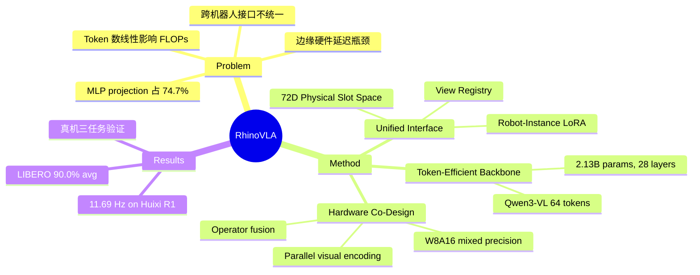

## Summary

一个为边缘硬件实时部署而生的 VLA 模型，通过 token-efficient Qwen3-VL backbone（64 vs 256 visual tokens）+ 72D 统一动作槽位空间 + robot-instance LoRA 实现跨机器人学习，配合 Huixi R1 芯片的硬件协同优化（混合精度、算子融合、并行编码）达到 11.69 Hz 实时控制，LIBERO 上 90.0% 平均成功率逼近 π₀.₅，证明边缘 VLA 部署的可行性。

## Problem & Motivation

现有 VLA 模型（π₀.₅、RDT）在边缘硬件上推理延迟过高，无法满足 10 Hz 闭环控制需求。Roofline 分析显示 NVIDIA Jetson AGX Orin 上 π₀.₅ 达到 5 Hz 已接近硬件极限。作者通过延迟分析发现 VLM 的 MLP projection 算子占总时间 74.7%，而该算子的 FLOPs 与输入 token 数线性相关（FLOPs = 2·B·S·d_in·d_out），因此减少 visual token 数是降低计算成本的直接路径。此外，跨机器人泛化需要统一的观察-动作接口来对齐异构机器人形态。

## Method

### Token-Efficient VLM Backbone

采用 2.13B 参数的 Qwen3-VL 作为视觉语言骨干，在 224×224 分辨率下每张图像产生 **64 个合并后的 visual tokens**，相比 PaliGemma-224 的 256 tokens 减少 4 倍。VLM 包含 28 层 text layers，使用 16 attention heads / 8 KV heads。预训练阶段冻结 Qwen3-VL 骨干，仅训练 LoRA 适配器。

### Action Expert

0.40B 参数的连续动作专家（18 层，hidden size 1024），条件化于：
- Qwen3-VL 最后 18 层的 KV cache
- 当前 72D robot state
- State/action 二值掩码
- Noisy action chunks（用于 flow-matching）
- Flow-matching time step
- Robot-instance index

通过 **masked flow-matching loss** 预测 flow velocities，仅对有效槽位计算损失：

$$L_{\text{FM}} = \frac{\sum_{h,d} m_a(d) \cdot w(h,d) \cdot ||\hat{v}_\theta(h,d) - (z(h,d) - a(h,d))||^2}{\sum m_a(d) \cdot w(h,d) + \epsilon}$$

### 跨机器人学习的三大机制

**Mechanism A — View Registry**: 每张图像打上相机角色和模态标签（如 `[head|rgb]`、`[left_wrist|rgb]`），解耦相机身份与数据集特定的图像顺序。

**Mechanism B — 统一 72D 物理槽位空间 + 二值掩码**: 固定物理坐标系为 72 维分配语义含义：
- D0–D6: Arm 0 标准关节（rad）
- D7–D13: Arm 1 标准关节（rad）
- D14–D15: 平行夹爪（闭合比例 [0,1]）
- D16–D31: Hand 0 主动自由度（16 槽位，4-3-3-3-3 手指分配）
- D32–D47: Hand 1 主动自由度
- D48–D50: 头部/颈部 RPY
- D51–D52: 躯干 pitch/lift
- D53–D54: 折叠腿机构关节
- D55–D57: 腰部 RPY
- D58–D60: 底盘速度命令（m/s, m/s, rad/s）
- D61–D71: 预留辅助槽位

二值掩码指示哪些槽位存在且有效用于监督，无效槽位被排除在 flow-matching loss 外。

**Mechanism C — Robot-Instance LoRA**: LoRA 模块插入 Action Expert 每层的 feed-forward network，attention 模块和最终投影保持共享。每个样本通过 instance_id 硬路由到一个 LoRA 适配器。支持统一部署图（LoRA 可合并）、稀疏适配器激活和低成本机器人扩展。

### 训练策略

**数据**: Open X-Embodiment 和 AgiBotWorld 轨迹，覆盖单臂、双臂、平行夹爪和灵巧手机器人。

**Pre-training**: 联合优化 VLM LoRA、共享 Action Expert 和 robot-instance LoRA。采用幂律平衡采样：$p_i = N_i^{0.43} / \sum_j N_j^{0.43}$。同时施加 residual regularization 使 LoRA 适配器专注于形态特定修正。

**Post-training**: 仅更新目标机器人的 instance LoRA，冻结 VLM 和共享 Action Expert，用最少目标任务数据实现迁移。

### Huixi R1 上的部署优化

**硬件**: Huixi R1 是 7nm 边缘 SoC，500 TOPS INT8 算力，8 核 SIMT 架构，200 GB/s 级内存带宽。

**优化技术**（累积效果从 5.84 Hz 基线到 11.69 Hz）：

1. **编译优化**:
   - 算子级：FlashAttention 风格 tiling 适配 R1 的软件管理片上内存（SPM），达到理论峰值吞吐 >80%
   - 图级：激进融合 Transformer block 中的 normalization、linear projection、bias、activation 和 residual 操作
   - 运行时级：跨计算核心的细粒度算子任务调度

2. **混合精度部署**: INT8 权重 + FP16 激活（W8A16）。自定义融合 GEMM kernel 将权重加载、反量化和矩阵乘累加在重叠流水线中。up_proj 算子：W16A16 需 191 μs vs W8A16 仅 113 μs（1.69× 加速，50.6% 计算利用率）。

3. **并行编码**: 三张相机图像在单个 batch 中处理而非串行，视觉编码延迟从 34.52 ms 降至 24.31 ms。

## Key Results

### LIBERO Benchmark（仿真）

| Model | Spatial | Object | Goal | Long | Avg |
|-------|---------|--------|------|------|-----|
| Diffusion Policy | 78.3 | 92.5 | 68.3 | 50.5 | 72.4 |
| OpenVLA | 84.7 | 88.4 | 79.2 | 53.7 | 76.5 |
| π₀ | 90.0 | 86.0 | 95.0 | 73.0 | 86.0 |
| SmolVLA | 93.0 | 94.0 | 91.0 | 77.0 | 88.8 |
| π₀.₅ | 98.8 | 98.2 | 98.0 | 92.4 | 96.9 |
| **RhinoVLA** | **93.0** | **91.0** | **93.4** | **82.4** | **90.0** |

单一联合训练 checkpoint 达到 90.0% 平均成功率，在 Long suite 表现突出（82.4%，超越 π₀ 9.4 个百分点）。与 π₀.₅ 仍有差距，后者使用多源协同训练和异构监督。

### Instance LoRA 消融

Instance LoRA 带来一致增益：masked FM loss 从 0.0192 降至 0.0191，arm MAE 从 0.0446 降至 0.0440，gripper MAE 从 0.1064 降至 0.1056。作者指出"arm 和 gripper 维度承载了大部分形态变化"。

### 真机评估

跨三个平台：AgiBot G1、AgiBot G2、Galbot G1（不在预训练数据中）。

| Robot | Task | Setting | π₀.₅ SR | RhinoVLA SR |
|-------|------|---------|---------|-------------|
| Galbot G1 | 红包→远箱 | Unseen | 100% | 100% |
| AgiBot G2 | 三步序列 | Seen | — | 58% |
| AgiBot G2 | 三步序列 | Unseen | 18% | 24% |
| AgiBot G1 | 折毛巾 | Seen | — | 67% |
| AgiBot G1 | 折毛巾 | Unseen | — | 43% |

RhinoVLA 在红包任务上与 π₀.₅ 持平，unseen AgiBot G2 序列上超越 6%。

### Huixi R1 端到端延迟

| Stage | Latency (ms) | % |
|-------|-------------|---|
| Vision Encoder（3 视角） | 24.31 | 28.4 |
| VLM Backbone | 20.78 | 24.3 |
| Action Expert | 36.71 | 42.9 |
| Others | 3.74 | 4.4 |
| **Total** | **85.54** | **100.0** |

实现闭环频率 **11.69 Hz**，满足 10 Hz 实时控制目标。

## Strengths & Weaknesses

### Strengths

1. **算法-系统协同设计清晰**: 从 roofline analysis 识别瓶颈（MLP projection 占 74.7% 延迟）→ 选用 token-efficient backbone（64 vs 256 tokens）→ 硬件优化（W8A16、算子融合、并行编码）达成 11.69 Hz，每个设计决策都有性能拆解支撑（Table 延迟占比透明）。
2. **统一接口设计有 taste**: View registry + 72D physical slot space + instance LoRA 的三机制组合优雅解决跨机器人对齐问题，LoRA 可合并支持统一部署图是工程实用细节。
3. **边缘部署实证价值高**: 在 7nm 边缘芯片上实现与 π₀.₅ 性能可比的 VLA 是首次，证明边缘 VLA 的可行性，延迟拆解和优化路径对后续边缘部署工作有参考价值。
4. **LIBERO-Long 表现突出**: 82.4% 超越 π₀ 9.4 个百分点，显示 flow-matching + 统一接口在长 horizon 任务上的优势。

### Weaknesses

1. **与 π₀.₅ 性能差距未充分分析**: LIBERO 平均 90.0% vs π₀.₅ 的 96.9%，6.9 个百分点差距的来源是 token reduction 的代价、训练数据规模差异，还是 flow-matching vs diffusion 的差异？论文未做 controlled ablation。
2. **真机实验覆盖有限**: 仅三个任务，AgiBot G2 三步序列 seen 设定下仅 58% SR 暴露问题但未分析原因。Galbot G1 虽不在预训练数据但 100% SR 过于简单（红包→远箱是 single-arm pick-and-place），不足以验证 cross-embodiment 泛化。
3. **72D 槽位空间的设计权衡未讨论**: 固定物理坐标系是 opinionated choice——对标准形态（humanoid + parallel gripper）友好，但如何扩展到 snake robot、soft manipulator、quadruped 等非标形态？预留 D61–D71 辅助槽位是否足够？
4. **Instance LoRA 的 scaling 未验证**: 实验仅覆盖 Open X-Embodiment 中的几个机器人，当 instance 数增长到 50+、100+ 时 LoRA 共享 backbone 是否还能保持性能？LoRA rank 如何调整？
5. **硬件绑定风险**: 深度优化 Huixi R1（SPM、SIMT 调度）使方法对该芯片架构依赖较强，迁移到其他边缘平台（Jetson、Rockchip、Apple Neural Engine）的成本不明。
6. **缺少与其他 token-efficient VLM 的对比**: Qwen3-VL 64 tokens 的优势是否来自 architecture 本身还是训练数据？与 Llama-3.2-Vision、Pixtral 等其他高效 VLM 的对比缺失。

## Mind Map

## Notes

- **Token efficiency 是正确方向**: 从 first principles 看，visual tokens 在 VLM 中的信息密度远低于 text tokens（一张图的 256 tokens 往往只编码 5-10 个关键 objects/relations），减少到 64 是合理的压缩。Qwen3-VL 选择可能是当前最优，但未来 VLA 应该进一步探索 adaptive token budget（根据场景复杂度动态分配）。
- **72D 槽位设计的哲学**: 本质是 "统一物理接口 vs 每个机器人独立接口" 的权衡。统一接口牺牲了 per-robot 最优性（如 dexterous hand 的 16 DoF 映射到固定槽位可能丢失某些运动模式），但换来 cross-embodiment 学习和部署便利。这与 [[2601-CycleVLA]] 的 subtask-level 统一、π₀.₅ 的 action expert per embodiment 形成对比——三种设计都是 valid trade-off，适用场景不同。
- **边缘部署的隐藏成本**: 11.69 Hz 是在 Huixi R1 上深度优化后的结果，包含自定义 GEMM kernel、SPM tiling、图融合等工程量。通用边缘芯片（如 Jetson）上直接运行 RhinoVLA 可能达不到 10 Hz。这提示边缘 VLA 的瓶颈不仅是模型设计，更是 deployment stack（compiler、runtime、kernel library）的成熟度。
- **与 π₀.₅ 的本质差异**: π₀.₅ 走 hierarchical VLA（subtask decomposition + per-subtask action expert），RhinoVLA 走 unified continuous action expert + cross-embodiment LoRA。两者在 LIBERO 上的差距（90.0 vs 96.9）可能暗示 hierarchical 在 long-horizon 上的优势更大，但 RhinoVLA 的 82.4% Long suite SR 也不弱，需要更长 horizon（>10 subtasks）的 benchmark 才能下结论。
- **想做的实验**: (1) 把 RhinoVLA 的 72D 接口接到更多机器人上（quadruped + arm、aerial manipulator），验证槽位空间的可扩展性；(2) 在 NVIDIA Jetson 上复现部署，对比 Huixi R1 的优化 gain 有多少来自通用技术（W8A16、并行编码）vs 专有优化（SPM tiling）；(3) 把 Qwen3-VL 换成 PaliGemma 但保持其他不变，isolate token efficiency 的贡献。

