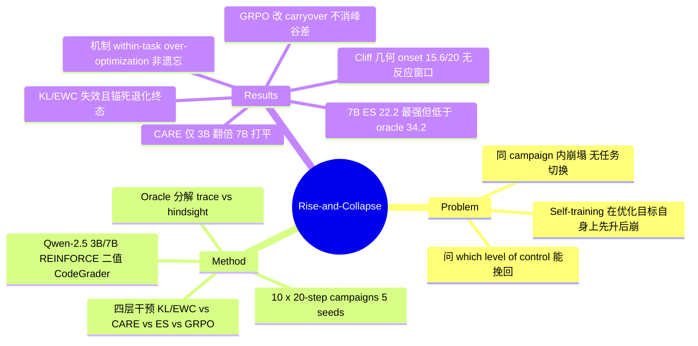

## Summary

在受控多 seed 测试床（Qwen-2.5-3B/7B、competitive programming 二值 CodeGrader reward、10 个连续 20-step REINFORCE campaign）上实证 LLM self-training 的 **rise-then-collapse** 失败模式：pass@1 在几十个梯度步内冲上峰值后在同一 campaign 内崩塌（单 run 案例 25%→81%→接近零）。机制定位为固定分布上的 **within-task policy over-optimization** 而非跨任务 catastrophic forgetting——KL/EWC 参数级约束不仅无效反而把模型锚死在退化终态。对四层干预的系统对比给出 scale 依赖结论：campaign 级记忆编排 CARE 仅在 3B 有效（4.9%→9.5%），7B 上 within-campaign early-stop（22.2%）与 GRPO（20.7%）更强，但没有任何干预消除峰谷差本身。

## Problem & Motivation

Self-improvement / self-training 循环（模型在自身 rollout + verifiable reward 上迭代 RL）通常默认"多训多得"。已有文献记录了 self-improvement 的副作用——非目标能力退化、diversity 丢失、OOD 泛化下降（self-improvement reversal 一系）——但关注的是"**什么**退化"。本文补上"**何时**退化"的时间结构：在被优化的目标指标本身上，性能会先升后崩，且崩塌发生在同一 campaign 内、无任务切换。与 2026 年并行的 RLVR entropy-collapse 工作（"prosperity-before-collapse"）在算法层做出相同诊断；本文把 cliff 当作固定经验现象，追问**哪一层的控制**（参数级正则 / campaign 级编排 / within-campaign 停止 / 算法级方差缩减）能真正挽回 end-of-chain 性能。

## Method

**测试床**：Qwen-2.5-3B/7B-Instruct（另有 Gemma-3-4B 单 seed、单 campaign pilot：peak 32.8%→end 0%；Qwen-2.5-32B 仅作 frozen 参照），competitive programming 任务（题池含 HumanEval/MBPP/APPS 域），二值 CodeGrader 执行验证 reward。REINFORCE，group size 16、temperature 0.7、lr 1e-6、每 prompt 16 samples。**Campaign** = 一段 20 梯度步的连续训练；headline 实验把 10 个 campaign 串成链（每 campaign 50 训练题 + 30 held-out 评测题），主结果 5 seeds、部分 baseline 3 seeds。

**对比的干预分四层**：

1. **参数级正则**：EWC、固定/自适应 KL penalty（Section 5.2，作为反面结果）。
2. **Campaign 级编排（CARE，作者提出、明确定位为 diagnostic foil 而非万能方案）**：三模块——Capability-Effect Memory ℳ（存 {strategy, context, capability delta, boundary, confidence}，linear Gaussian posterior 聚合）；Self-Improvement Transfer Gate 𝒢（输出 reuse/adapt/pilot/reject 四选一，实际部署退化为 end/peak pass@1 标量比值测试）；Regression-Aware Belief Revision ℛ（Mahalanobis 偏差超阈时收紧 gate）。v2 相比 v1 放弃了适得其反的累积 lr 减半，改为按检测结果调 per-campaign 步数预算（pilot 10 步 / 全额 20 步）。
3. **Within-campaign early-stop（ES）**：在线规则 max_steps = peak_step + 3，配 checkpoint 回滚。
4. **算法级**：GRPO（group-relative reward normalization）替换 REINFORCE，及 GRPO+CARE、GRPO+ES 组合。

**Oracle 分解**（Section 5.8）：trace oracle（在完整 trace 上事后模拟在线 early-stop）与 hindsight oracle（整链任意步的最佳 pass@1）用来分离"峰值存在"与"峰值可被在线捕获"两个命题。

## Key Results

- **Rise-then-collapse 稳健存在**：单 run 诊断（7B）pass@1 前约 50 步 25%→81%、step 200 接近零；跨 47 个 campaign（7B naive REINFORCE）统计平均 peak 34.3%、平均 end 16.6%、平均峰谷差约 17.6pp，36% 的 campaign 判定 collapse（gap>0.2）。
- **参数级正则失效且适得其反**（Table 1）：EWC 与 adaptive KL 的 end pass@1 接近零（EWC 0.07/0.10/0.08，adaptive KL 0.00/0.06/0.00），低于 naive；作者解释为 KL penalty 把策略锚在每个 campaign 的**退化终态**、阻断了下一 campaign 的恢复。
- **CARE 的收益是 scale 依赖的**（Table 6，10 campaigns，5 seeds）：3B 上 4.9%→9.5%（paired bootstrap CI [+0.4, +8.9] 不含零，4/5 seeds 为正，近乎翻倍）；7B 上 13.8% [2.8, 27.3] vs 11.8% [5.2, 18.3]，CI 重叠、打平。模块 ablation（Table 4）显示单独 memory 或单独 gate 都不优于 naive，gate 单用会 over-trigger（15.7%）。
- **7B 上 ES 最强**（Table 9）：22.2% [14.1, 28.0]（n=3），仅用约 51 总梯度步，是所有 orchestrated REINFORCE 配置最高；但仍显著低于 trace oracle 34.2%（naive 行；CARE 行 35.0%）与 hindsight oracle 37.8–47.9%——峰值在原理上可恢复，在线规则只吃到一部分。
- **GRPO 提升但不治本**（Table 10/11）：7B naive GRPO 20.7% [15.7, 25.1]；峰谷差在 REINFORCE 与 GRPO 下都约 17pt（0.176 vs 0.165），GRPO 的收益来自 between-campaign carryover（end 值稳在 20% 附近不随链衰减）而非 within-campaign 稳定化。**3B 上的相对关系须谨慎表述**：naive GRPO 6.8% 高于 naive REINFORCE 4.9%，但低于 REINFORCE+CARE 9.5%——原文 "GRPO underperforms REINFORCE at 3B" 的比较基准是 REINFORCE+CARE，不是 naive-vs-naive（后者方向相反）。GRPO+CARE 4.7% 组合反而更差；GRPO+ES 组合不稳（17.0% [0.0, 28.1]，2/3 seeds 为正、1 seed 灾难性失败归零）。
- **崩塌几何解释了干预的带宽上限**（Section 6）：cliff 式相变（naive 行 phase-transition score 0.78 [0.71, 0.85]；CARE 行 0.68）、平均 onset 在 step 15.6/20（Figure 3(c)；Table 16 naive 单行 16.7，两数并存于原文）——campaign 末端的 gate 没有可行动的 post-onset 窗口，这就是 CARE 在 7B 失效、而 ES 也吃不满 oracle 的原因。
- **CARE 不能替代 scale**（Section 5.11）：7B+CARE（5 campaigns，n=3）20.0%±10.8，远低于 frozen 32B（n=2）的 37.7%±4.7。计算效率上 CARE 相对 naive 有约 +38% 的 pass@1/步收益（141 vs 165 步，9.80 vs 7.11 per-100-step，Section 5.7），但 7B 两种方法 100% 的链仍至少崩一次——gate 缩短崩塌时长而非消灭崩塌。

## Evidence Ledger

| Claim ID | Claim | Type | Source locator | Evidence excerpt | Status |
|:--|:--|:--|:--|:--|:--|
| C1 | 单 run（7B）pass@1 前约 50 步 25%→81%，step 200 接近零 | number | Figure 1 / §5.1 | "pass@1 rises from 25% to 81% in the first 50 steps, then degrades to near-zero by step 200" | source-verified |
| C2 | 设置：Qwen-2.5-3B/7B、二值 CodeGrader reward、REINFORCE(group 16, temp 0.7, lr 1e-6)、10×20-step campaigns、headline 5 seeds | benchmark-setting | §5.1 | "10 sequential 20-step campaigns... 5 seeds each" | source-verified |
| C3 | 47 campaigns（7B naive）：mean peak 34.3% / mean end 16.6% / gap 17.6pp / 36% collapse (gap>0.2) | number | Table 11 | "n campaigns 47; mean peak 0.343; mean end 0.166; mean gap 0.176; collapse rate 36%" | source-verified |
| C4 | 崩塌是固定分布上 within-task policy over-optimization，非跨任务 catastrophic forgetting | causal-mechanism | Abstract / §6 | "This is not catastrophic forgetting across tasks; it is within-task policy over-optimization on a fixed distribution" | source-verified |
| C5 | EWC 与 adaptive KL end pass@1 接近零（0.00-0.10）；KL 锚在退化终态阻止恢复 | comparison | Table 1 / §5.2 | "KL penalty anchors the model to each campaign's degraded end-state, preventing recovery" | source-verified |
| C6 | 3B 上 CARE v2 end-of-chain 4.9%→9.5%，paired CI [+0.4, +8.9] 不含零（4/5 seeds 正） | number | Table 6 | "9.5 vs 4.9, n=5; paired bootstrap 95% CI [+0.4,+8.9], excludes zero" | source-verified |
| C7 | 7B 上 CARE v2 与 naive 打平（13.8% [2.8, 27.3] vs 11.8% [5.2, 18.3]） | comparison | Table 6 | "CIs overlap heavily" | source-verified |
| C8 | 7B ES(peak+3) 22.2% [14.1, 28.0]（n=3，51 步），orchestrated REINFORCE 最高；trace oracle 34.2%（naive 行）、hindsight 37.8-47.9% | number | Table 9 / §5.8 | "Deployed ES... 22.2 [14.1, 28.0] (n=3)... Steps 51" | source-verified |
| C9 | GRPO 7B 20.7% [15.7, 25.1]，峰谷差 REINFORCE/GRPO 均约 17pt，收益来自 between-campaign carryover | causal-mechanism | Table 10/11 + §5.9 | "mean peak-end gap ≈17 pt under both REINFORCE (0.176) and GRPO (0.165)" | source-verified |
| C10 | 3B：naive GRPO 6.8%、GRPO+CARE 4.7%；naive GRPO 高于 naive REINFORCE 4.9% 但低于 REINFORCE+CARE 9.5%（原文 "underperforms" 基准是后者） | number | Table 10 obs.(iii) / §5.9 | "Naive GRPO at 3B reaches only 6.8%... Both are below REINFORCE+CARE at 3B (9.5%)" | source-verified |
| C11 | GRPO+ES 不稳：17.0% [0.0, 28.1]（n=3），2/3 seeds 正、1 seed 灾难性归零 | number | §5.10 / Table 12 | "additive under GRPO on 2/3 seeds; s17... collapsed to 0.0% in c10" | source-verified |
| C12 | Cliff 几何：naive phase-transition score 0.78 [0.71, 0.85]（CARE 0.68）、mean onset 15.6/20（Table 16 载 16.7），末端 gate 无 post-onset 窗口 | number | Table 16 / Figure 3(c) / §6 | "end-of-campaign gate has zero actionable post-onset latency" | source-verified |
| C13 | CARE 计算效率 +38%（141 vs 165 步，9.80 vs 7.11 per-100-step）；7B 两法 100% 链 ≥1 次 collapse | number | §5.7 / Table 7/8 | "per-100-step efficiency is +38% higher (9.80 vs 7.11)" | source-verified |
| C14 | 7B+CARE（n=3，20.0%±10.8）追不上 frozen 32B（n=2，37.7%±4.7） | comparison | Table 13 / §5.11 | "CARE does not substitute for scale" | source-verified |
| C15 | 边界：仅 competitive programming + 二值 verifiable reward、Qwen-2.5 3B/7B（Gemma-3-4B 为 1 seed、1 campaign pilot，peak 32.8%→end 0%）、10×20-step 链长 | benchmark-setting | §7 Limitations | "single model family (Qwen-2.5-Instruct)... competitive-programming Python with a CodeGrader binary reward" | source-verified |
| C16 | 单作者 Jianzhe Lin（Meta AI，"Work done at Meta"）；无 code 链接；参考文献残留 "TODO: fill in author list" 未清理痕迹 | license-code | 标题页 / 全文 | "Jianzhe Lin, MetaAI"; 全文无 GitHub/code URL | source-verified |

## Strengths & Weaknesses

**Strengths**

- **负结果做成了受控实验而非轶事**：多 seed（headline n=5）、bootstrap CI、47 个 campaign 的 trajectory 统计（peak/end/gap/onset），是 self-training 崩塌文献里少见的量化时间结构刻画。cliff 几何（相变式、onset 集中在 campaign 末段）不只是描述，还直接解释了哪类干预在原理上没有反应窗口。
- **机制定位有排除法支撑**：无任务切换的固定分布 + EWC/KL 失效 + 能力向量追踪（主分布收益不迁移到 cpp/OOD）共同支持 "within-task over-optimization" 而非遗忘——这与"加 KL 锚住 reference 就安全"的 RLHF 常规直觉直接冲突，且给出了 KL 有害的具体机制（锚在退化终态）。
- **对自家方法诚实**：CARE 是作者提出的框架，但论文明确报告它在 7B 打平 naive、被简单 ES 超过、追不上 frozen 32B，并把它降级为"fragile-regime（小模型弱信号）niche"。oracle 分解把"峰值存在"与"在线可捕获"分开，量化了 ES 与上界的差距。

**Weaknesses / 边界**

- **单作者 preprint、单任务域、单 reward 类型**：只有 competitive programming + 二值 verifiable reward；数学推理、非验证式 reward、self-generated feedback 下是否同样崩塌未测（作者自认）。规模只到 7B（32B 仅 frozen 参照、n=2），对 70B+ 无外推依据。成稿粗糙（参考文献残留 camera-ready TODO；3B/A0 的 n 在正文两处自相矛盾：一处 n=4、obs.(iii) 标 n=5）。
- **每 campaign 仅 50 训练题**的极小固定分布可能放大 over-optimization——峰谷差幅度未必代表大规模数据下的 self-training（推测，论文未做数据规模 ablation）。
- **机制证据是干预式/排除式的**，缺少 policy 内部的直接测量（entropy、diversity、与 reward-correlated pattern 的对齐度），"narrows the policy around brittle reward-correlated patterns" 更多是解释性叙述而非被直接观测。
- ES 规则依赖每步 held-out 评测才能定位 peak，部署成本被 51 总梯度步的表述部分掩盖；collapse 判据（gap>0.2）为人为阈值。
- CARE 的 memory/gate 形式化（Gaussian posterior、Mahalanobis 阈值）与实际部署版（标量 end/peak 比值）落差较大，框架叙述重于实际生效机制。

**对本领域的意义**：这是 self-evolving/self-training 负结果证据链上的关键一环——它把"self-improvement 会退化"从终态观察（what）推进到时间结构（when）与控制层级（which level of control），并给出"参数级正则无效、算法级只改 carryover、编排级收益随 scale 消失、在线停止吃不满 oracle"的完整干预图谱。

## Mind Map

## Connections

- [[Papers/2509-Misevolution]]：同为 self-evolution 负结果实证，但轴不同——Misevolution 测的是 safety alignment 随自训练**累积性**衰减（跨 200 步单调下行），本文测的是**目标能力本身**在 campaign 内的相变式崩塌。两者合起来说明 self-training 的退化既有慢变量（safety）也有快变量（目标 metric cliff）。
- [[Papers/2604-RAGEN2]]：算法层的平行诊断。RAGEN-2 把 collapse 归因到低 reward variance 下 KL/entropy 正则梯度压过 task gradient（SNR 机制），本文则从控制层发现 KL 锚定退化终态、GRPO（组内方差归一化）只改 carryover 不消峰谷差——两篇从不同层面收敛到"KL 类正则在 self-training 崩塌中有害或无效"，是跨论文一致信号。
- [[Topics/SelfEvolvingAgents-Survey]]：路线 1（model evolution）的负结果核心证据。survey 已记录 self-improvement reversal（Progress-or-Regress, 2407.05013）与 [[Papers/2606-VisPlay]] 的伪标签质量递减（72→61）；本文补上时间几何（cliff + onset 分布）与干预层级图谱，且给出"干预有效性随 scale 分化"这一维度。
- [[Papers/2404-LLMSelfEvolutionSurvey]]：该 survey 的"self-evolution 能否突破外部监督上界"命题在此获得一个否定性数据点——7B+CARE 全套编排仍不及 frozen 32B。

## Notes

**疑问**：(1) 50 题/campaign 的分布是否小到让 over-optimization 必然发生？换 500 题会不会 cliff 推迟而非消失？(2) trace oracle (34.2%) 与 deployed ES (22.2%) 的 12pt 差距具体损失在哪——peak 检测延迟还是 seed 间 peak 时机方差？(3) "prosperity-before-collapse" 的 RLVR 并行工作（entropy collapse 归因）与本文的 capability-vector 证据是否可在同一 testbed 上互相区分？
