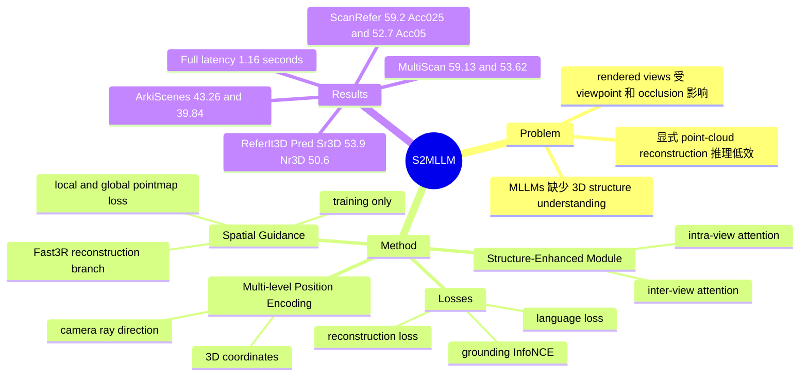

## Summary
S2-MLLM 解决 MLLM 用 2D visual inputs 做 3D visual grounding 时缺少 3D structure understanding 的问题，核心做法是在训练期引入基于 Fast3R 的 reconstruction supervision 作为 spatial guidance，并用 structure-enhanced module 融合 multi-level position encoding、intra-view attention 和 inter-view attention。已知结果上，它在 ScanRefer validation 达到 59.2 Acc@0.25 / 52.7 Acc@0.5，并在 MultiScan、ArkiScenes OOD 评测上超过 MCLN 和 SeeGround。它的关键价值不是重新构造 point cloud pipeline，而是让 MLLM 在 latent space 内学习 3D spatial reasoning，推理期不再运行显式 reconstruction branch。

## Problem & Motivation
3D visual grounding 要根据自然语言描述在 3D scene 中定位目标物体，是 embodied AI、robotics 和 AR 场景中的基础能力。相比 2D visual grounding，它需要理解 depth、viewpoint、layout、occlusion、relative position 等 3D spatial relationships，而普通 MLLMs 主要从 image-text data 训练，论文明确指出它们不能仅靠 2D images 理解 3D scenes。

已有 MLLM-based 3DVG 方法通常先显式重建 point clouds，再渲染 multi-view images 或 BEV images 给 MLLM 使用。这条路线给了结构信息，但有两个问题：一是 rendered images 受 viewpoint selection 和 occlusion 影响，无法稳定反映完整 3D structure；二是推理期需要 point-cloud reconstruction，效率低。

本文的动机是把 feed-forward 3D reconstruction 的 structure awareness 作为训练期 supervision，让 MLLM 内化 3D structure understanding；如果成功，模型推理时可以直接在 latent feature space 中做 spatial reasoning，而不是依赖额外 reconstruction/rendering。

## Method
S2-MLLM 输入 multi-view RGB-D frames、camera parameters、candidate object bounding boxes 和 language description，输出匹配描述的 target object category 与 3D bounding box。基础模型是 LLaVA-Video-7B，作者把 3D scene 表示为 video sequence，并在其视觉编码和语言推理路径上加入结构引导。

核心组件一是 spatial guidance strategy。作者基于 Fast3R 构建 reconstruction branch，但不用 Fast3R 的 ViT encoder，而是复用 MLLM visual encoder `Ev`，再接 projection layer `P` 和 Fast3R 的 fusion transformer / decoding heads `D`。该分支预测 local pointmap 和 global pointmap，并用 Fast3R 的 confidence-weighted pointmap regression loss 做 reconstruction supervision。重要约束是：reconstruction branch 只在训练期启用，推理期关闭。

核心组件二是 structure-enhanced module。它把 multi-view features 分成两类关系建模：inter-view attention 在相同 patch index 的跨视角 features 上建模 correspondence，intra-view attention 在单个 view 内建模 patch dependencies。这个设计针对 MLLMs 难以保持 multi-view semantic consistency 的问题，例如无法判断不同视角中的椅子是否对应同一个 physical object。

核心组件三是 multi-level position encoding。对每个 RGB-D pixel，作者用 depth、camera intrinsic matrix 和 extrinsic matrix 计算 global 3D coordinate，并构造 camera ray 的 origin、termination point 和 viewing direction。随后用 sinusoidal position encoding 编码 patch-level 3D coordinates，用 learnable MLP 编码 camera ray direction，再和 visual features 聚合，形成 position-aware visual representation。这个设计直接服务于 fine-grained spatial relations，例如 distance、direction、relative position 和 viewpoint。

训练目标包括三项：`Lground` 用 InfoNCE 对齐 object proposal feature 与 `<ground>` token hidden state；`Lrecon` 约束 local/global pointmaps；`Llang` 用 cross-entropy 监督模型生成目标类别相关文本，以降低 target category misclassification。训练数据是 ScanRefer、Nr3D、Sr3D 的 combined dataset；训练使用 LoRA，并在单张 A100 80GB 上完成；推理时用 Mask3D 生成 predicted bounding boxes 作为 object proposals。

## Key Results
ScanRefer validation 上，S2-MLLM 达到 Overall 59.2 Acc@0.25 / 52.7 Acc@0.5；Unique subset 为 87.4 / 77.8，Multiple subset 为 52.4 / 46.6。论文报告其 Overall Acc@0.5 比 previous methods 高 4.8 points；在 containing multiple similar objects 的 Acc@0.5 上，相对 previous SOTA method 有约 10.0% improvement。对比同样 LoRA-finetuned 的 Video-3D-LLM，S2-MLLM 的 Overall 从 54.1 / 47.9 提升到 59.2 / 52.7。

ReferIt3D validation 上，predicted boxes setting 中 S2-MLLM 在 Sr3D / Nr3D 分别达到 53.9 / 50.6；ground-truth boxes setting 中 Sr3D / Nr3D 为 63.2 / 59.8。这里需要谨慎解读：在 GT setting 的 Sr3D 上，MCLN 为 68.4、EDA 为 68.1，S2-MLLM 不是最好；作者解释 Sr3D 的 template-based queries 更容易被传统 supervised methods 利用，而 predicted-box setting 更接近真实推理。

OOD 评测中，S2-MLLM 在 MultiScan 达到 59.13 Acc@0.25 / 53.62 Acc@0.5，在 ArkiScenes 达到 43.26 Acc@0.25 / 39.84 Acc@0.5。相比 SeeGround，MultiScan Acc@0.25 从 53.41 提升到 59.13，ArkiScenes 从 38.82 / 38.43 提升到 43.26 / 39.84；相比 MCLN 的 12.91 / 6.00 和 17.21 / 6.35，差距更大。

效率上，S2-MLLM Full 训练成本为 72 GPU hours，trainable parameters 为 1767.50 MB，inference latency 为 1.16 s；Video-3D-LLM 为 256 GPU hours、8078.79 MB、1.04 s；SeeGround latency 为 3.97 s + point-cloud reconstruction time `t0`。论文强调 spatial guidance 只增加约 10% training time，推理期不增加 latency。

Ablation 支持主要设计：16 frames 下 full model 为 59.18 / 52.67；去掉 spatial guidance 降到 54.40 / 48.45，去掉 multi-level position encoding 降到 44.13 / 38.49，去掉 language guidance 降到 57.75 / 50.85，去掉 attention 为 59.13 / 52.30。24 frames full model 进一步到 60.59 / 53.66；但作者指出加 frames 带来更多 memory/training cost，而 spatial guidance 已经减少了对 dense multi-view inputs 的依赖。补充实验中，Base 只有 5.31 / 5.07，Base+Attn 到 41.74 / 35.78，说明 attention 单独加入时贡献很大；在完整系统里去掉 attention 影响较小，是因为其他模块贡献已经很强。

## Strengths & Weaknesses
已知亮点：这篇论文的核心 insight 比较清楚，即把 3D reconstruction 当作训练期 structural teacher，而不是推理期外部模块。这个设计同时回应了 3DVG 对 spatial reasoning 的需求和显式 reconstruction/rendering 的效率问题。实验覆盖 ScanRefer、Nr3D、Sr3D、MultiScan、ArkiScenes，并包含效率、ablation、qualitative comparison 和 error analysis，证据链比只报主表更完整。

已知亮点：multi-level position encoding 是最强 ablation signal。w/o MPE 从 59.18 / 52.67 掉到 44.13 / 38.49，说明仅靠 reconstruction supervision 或 video features 还不够，显式 3D coordinate 和 camera ray direction 对 fine-grained spatial relation 很关键。这对后续 embodied reasoning 很有启发：让 MLLM “看见”位置编码，可能比只让它看多视角 RGB 更有效。

已知局限：方法仍依赖 RGB-D frames、camera parameters 和 object proposals。论文推理时使用 Mask3D predicted boxes；因此最终性能不仅取决于 MLLM spatial reasoning，也受 detector/proposal 质量影响。补充材料的 error analysis 明确把 Detection 作为错误类型之一，错误来源包括 occlusion、partial visibility 和 sparse viewpoints 下 bounding boxes 不准。

已知局限：failure cases 包括 Spatial、Semantic、Detection 和 Other。Spatial errors 主要涉及多个 anchor objects 或需要 multi-step reasoning 的复杂关系；Semantic errors 来自细粒度属性误判，例如 keyboard color、curtain pattern/usage；Other 包含 dataset description 不准确，即预测对象符合描述但和 ground truth 不一致。论文展示了 error type figure，但正文没有给出各类错误的精确百分比，所以不能量化哪一类占主导。

推测：S2-MLLM 对 embodied agent 的价值主要在 3D scene grounding 与空间指令理解，而不是通用 GUI-agent。它可能启发 GUI agent 中的 “structural guidance during training” 思路，但本文没有做 GUI、web 或 desktop UI 实验，不能把结果外推到 2D GUI grounding。

不知道：论文只写了 “Code will be available upon acceptance”，没有给出具体 repository URL；实际复现时还需要等待代码或自行实现 training pipeline。不知道该方法在真实机器人传感器噪声、动态场景、长时间交互中的稳定性，也不知道 reconstruction supervision 是否会在更强 MLLM backbone 上保持同等边际收益。

## Mind Map

## Notes
对我的研究方向，最值得保留的是 “training-time structure guidance, inference-time latent reasoning” 这个取舍：它避免把昂贵的 3D reconstruction 留在 deployment path，同时让 MLLM 学到可迁移的 spatial features。下一步值得对比的不是单纯更大 MLLM，而是不同 structural teacher 的质量：Fast3R-style pointmap、BEV generation、scene graph、semantic map 是否会给 3D grounding 带来不同类型的 reasoning bias。另一个疑问是 object proposal bottleneck：如果 candidate boxes 错了，latent spatial reasoning 再强也可能无法输出正确物体，这一点和真实 embodied deployment 的 detector reliability 直接相关。
