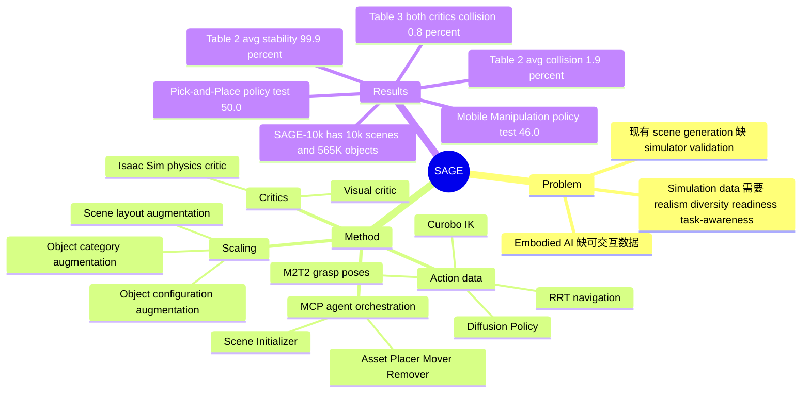

## Summary

SAGE 是一个面向 embodied AI 的 agentic 3D scene generation framework：给定开放文本任务，agent 通过 MCP 编排场景/资产生成器，并用 visual critic 与 Isaac Sim physics critic 迭代修正，产出 simulation-ready indoor scenes。论文进一步用 object/category/layout 级 augmentation 和 motion planning 自动生成 demonstrations，在 Pick-and-Place 与 Mobile Manipulation 上训练 Diffusion Policy，展示了随数据规模增长的策略成功率提升。

## Problem & Motivation

Embodied AI 的核心瓶颈是可交互数据：真实采集慢、贵且有安全风险，而 web 数据不能直接提供物理交互环境。作者认为可用的 simulation data 至少要满足四点：realism、diversity、simulation-readiness、task-awareness。

现有 3D scene generation 方法各有缺口。Rule-based systems 如 ProcTHOR / Infinigen 有物理约束但开放词汇和细粒度控制不足；data-driven layout 方法受限于训练数据和 closed taxonomy；LLM/VFM static pipeline 能从文本生成场景，但缺少 3D grounding、自我修正和 simulator-in-the-loop validation；SceneWeaver 虽然是 agent-based，但论文指出它没有把 physical attributes 和 simulator-validated outputs 作为默认产物。SAGE 的问题定义因此不是“生成好看的 3D 房间”，而是生成能直接用于机器人 policy learning 的、物理稳定且任务相关的仿真环境。

## Method

### Agent-driven Scene Generation

SAGE 把 agent 放在 Model Context Protocol (MCP) 之上：agent 作为 MCP client，根据当前场景状态和 critic feedback 动态调用外部 tools，直到它认为场景满足用户需求。论文强调这里没有 hard-coded tool order；生成过程是由 agent reasoning、generator outputs 和 critic feedback 共同驱动的闭环。

核心 generators 包括：

- **Scene Initializer**：根据 scene specification 生成空 3D room、floor/wall textures，并输出候选对象列表、物理属性估计和 placement constraints。Supplement 里说明 floor plan generation 用 LLM 先预测 room types / sizes，多房间时再生成 connectivity 和 doors；材质由 MatFuse 或 Flux.1-dev 生成。
- **Asset Placer**：根据文本 placement requirement 生成并放置对象。对象由 TRELLIS text-to-3D 生成，随后做 mesh decimation、non-manifold correction、hole filling；VLM 估计 height、mass、metallic/roughness 等物理和 PBR 属性；LLM 将 placement 分为 floor / wall / on-top，再用 grid sampling、DFS 和 collision checking 选择位置。on-top placement 支持 multi-layer scene graph，不只是一层支撑关系。
- **Asset Mover / Asset Remover**：用 LLM 定位目标对象，前者先移除再复用 placer relocation logic，后者删除 critic 认为不合适的对象。

两个 critics 是方法关键：

- **Visual Critic**：输入当前 object placements 和多视角 renderings（top-down + four corner views），评估 semantic/spatial coherence，提出新增对象、移动对象或删除对象的建议，也检查 task-relevant objects 是否缺失。
- **Physics Critic**：每次 object addition / movement / removal 后把场景加载到 Isaac Sim 做 stability validation；若相对平移超过 0.2m 或旋转超过 8 degrees（120 simulation steps 后），对象被视为 unstable。失败时 critic 会反馈给 agent，例如建议换更小对象或调整支撑位置。

### Scaling for Embodied AI

SAGE 用三类 augmentation 把一个 base scene 扩展成任务一致但多样的训练环境：

- **Object configuration-level**：重采样 task-relevant objects 的 pose，增加空间变化。
- **Object category-level**：对 task-relevant object 的文本描述做 LLM augmentation，变化形状、颜色、材料或 finish，再用 TRELLIS 合成新 3D asset。
- **Scene layout-level**：保留 task-relevant objects，重新生成 room geometry 和 task-irrelevant objects，让相同任务出现在不同布局中。

动作数据由 motion planning 自动生成。Pick-and-Place 使用 M2T2 从 depth image 预测 grasp pose candidates，并用 Curobo 做 collision-aware IK / motion planning；Mobile Manipulation 在 pick-and-place 前后加入 RRT navigation。失败样本会通过 collision checks 和目标位置验证过滤；论文明确说 motion planning 失败常来自 inaccurate grasp pose、unreachable target configurations 或 unexpected collisions。Policy learning 使用 Diffusion Policy，在 Robomimic 中训练，输入多视角 RGB-D 和 end-effector trajectories，输出 continuous actions。

## Key Results

- **Scene generation on common indoor scene types（Table 2, Bedroom/Kitchen/Living Room, 10 scenes per room type）**：SAGE 平均生成 **48.2 objects**，Realism / Functionality / Layout / Completeness 为 **8.8 / 9.5 / 7.9 / 8.2**，Collision ratio **1.9%**，Stability **99.9%**。对比 Holodeck 平均 **30.3 objects**, Collision **22.0%**, Stability **63.8%**；SceneWeaver 平均 **24.4 objects**, Collision **32.8%**, Stability **67.7%**。
- **Critic ablation（Table 3, 3 room types x 5 scenes）**：无 critics 时 Collision **7.8%**, Stability **80.3%**；只加 visual critic 后 **3.7% / 84.1%**；只加 physics critic 后 **1.9% / 99.6%**；visual + physics 同时使用达到 **0.8% Collision** 和 **100.0% Stability**，并有最高 Functionality **9.6** 与 Completeness **8.2**。
- **SAGE-10k dataset（Figure 6）**：作者预生成 **10k scenes**，覆盖 **50 room types** 和 **50 styles**，包含 **565K uniquely generated 3D objects**。
- **Policy learning data scale（Sec. 4.2.1）**：Pick-and-Place 收集 **28k+ demonstrations**、**264 unique objects**；Mobile Manipulation 收集接近 **50k demonstrations**、**50 diverse scenes**。评估在 **3 held-out scenes** 上进行，每个场景 **90 random robot spawning poses and object configurations**。
- **Policy rollout vs privileged motion planning（Table 4）**：Pick-and-Place 中 privileged agent Train/Test 为 **65.3 / 57.7**，policy rollout 为 **63.4 / 50.0**；Mobile Manipulation 中 privileged agent 为 **68.4 / 52.8**，policy rollout 为 **54.6 / 46.0**。
- **Cross-Evaluation（Table 5）**：用 SAGE 数据训练的 policy 在 Baseline 1 / Baseline 2 / SAGE 测试源上成功率为 **39.1 / 24.7 / 46.0**，高于 Baseline 1 训练源的 **13.2 / 9.3 / 14.4** 和 Baseline 2 训练源的 **13.5 / 16.2 / 13.1**。论文据此认为，即使测试分布偏向 baseline-generated scenes，SAGE-trained policy 仍有更好 generalization。
- **Runtime（Supplement A.3）**：TRELLIS 单 object generation 约 **15s**，8 GPUs parallel 后平均 **2-3s/object**；Isaac Sim stability validation 每个 placement candidate **1-2s**；20 objects 的 scene 约 **10 minutes**，额外对象近似线性增加。Pick-and-Place action generation 并行后约 **2-3s/demo**，Mobile Manipulation 约 **8-10s/demo**。

## Strengths & Weaknesses

**已知**：

- 方法把 3D generation 和 simulation validation 真正闭环起来：visual critic 处理语义/布局，physics critic 处理碰撞和稳定性，Table 3 支持两者互补。
- 对 embodied training 的链路比较完整：不是只展示场景图，而是从 task prompt 到 scene augmentation、motion-planned demonstrations、Diffusion Policy training，再到 held-out scene evaluation。
- 论文的 strongest evidence 是物理可用性数字：Table 2 平均 Stability **99.9%**、Collision **1.9%**，以及 ablation 中 physics critic 将 Stability 从 **80.3%** 提到 **99.6%** 或 **100.0%**。
- 下游 policy 结果仍是 simulation 内结果；论文没有展示 real-robot transfer。
- 任务范围有限：结论部分明确当前强调 indoor scenes 和 rigid-body physics；action generation 主要覆盖 pick、place、navigation 的组合。
- Motion planning 和 policy inference 都有明确 failure modes：grasp pose 不准、目标不可达、trajectory 意外碰撞、far-away objects、困难抓取位置、policy inference randomness。
- Policy comparison 的 baseline 不是直接统一接入 Holodeck / SceneWeaver 官方 pipeline，而是作者设计的 proxy baselines：Baseline 1 mimics SceneWeaver，Baseline 2 further replaces agent with fixed pipeline resembling Holodeck。这个设计合理地绕开 heterogeneous simulation setups，但也让 policy-learning 对比不等同于完整官方系统对比。

**推测**：

- SAGE 最有价值的应用可能不是单次生成高质量房间，而是作为“可验证的 synthetic embodied data engine”：当下游任务能被 pick/place/navigation 和 rigid objects 覆盖时，scene diversity 与 demonstration count 会直接转化为 policy scaling signal。
- Agentic orchestration 的收益可能随 generator / critic 质量上升而放大；如果 TRELLIS 生成资产质量或 VLM 物理属性估计出错，agent loop 只能部分补救，尤其是 semantic plausibility 和 object affordance 仍缺少真实交互验证。
- 对 GUI-agent 研究的间接启发在于：把 LLM/VLM agent 作为工具编排器，用 environment-in-the-loop critic 把开放生成约束到可执行状态，比纯文本 self-reflection 更接近可验证 agent workflow。

**不知道**：

- 论文没有给出 SAGE-10k 的下载 URL、license、数据格式细节或完整 code URL 的可读文本信息，只说 code/demos/dataset 在 project page。
- 不知道生成数据训练出的 policy 是否能 sim-to-real，也不知道在 deformable objects、outdoor scenes、复杂 articulated manipulation 上会怎样。
- 不知道 visual critic 的具体 prompt、失败分布、人工评分一致性，以及 GPT-4.1 视觉评分是否会偏向某类生成风格。

## Mind Map

## Notes

- 这篇的核心 insight 是把“生成”重新定义为一个可验证的 agentic control loop：每一步 generator output 都必须经过 semantic/spatial critique 和 physics validation，最终产物才算 simulation-ready。相比只追求 visual plausibility 的 3D generation，这更接近 embodied AI 真正需要的数据引擎。
- 与 [[2606-GRAIL]] 的关系：GRAIL 用 3D assets + video priors 生成 humanoid loco-manipulation trajectories；SAGE 更上游，关注 task-aware indoor scene 和 interaction-ready simulation data。两者可以互补：SAGE 负责多样、稳定、任务相关的场景，GRAIL 类方法负责从场景中合成更复杂的 motion priors。
- 需要后续追问：physics critic 目前主要验证 stability / collision，是否足以保证 affordance？例如抽屉、柜门、柔性物体或工具使用，需要的不是“不会倒”，而是可操作部件、接触动力学和任务级可达性。
- 对研究方向的价值：如果未来 GUI / embodied agents 都走“LLM/VLM planner + external tools + environment verifier”的路线，SAGE 是一个很好的 embodied 版本案例；它的关键不是某个单一模型，而是把开放生成压进可执行闭环。
