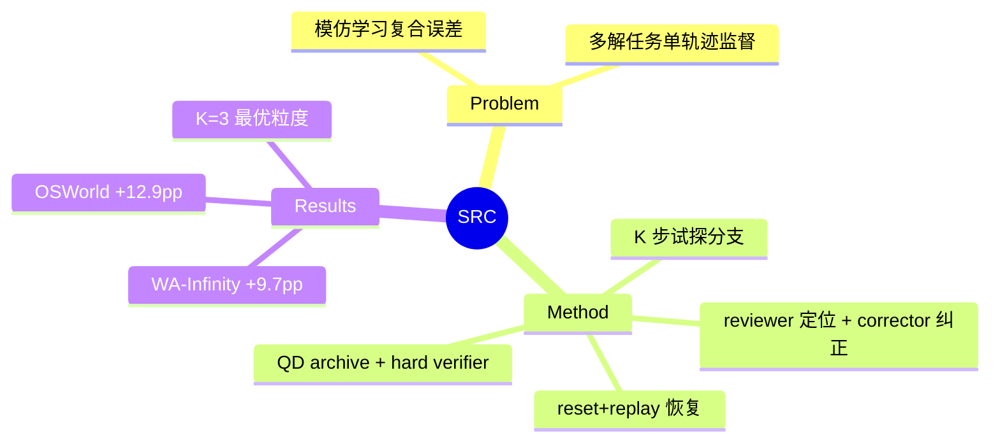

## Summary
把 rollback 变成模仿学习数据收集的核心原语：学生策略执行 K=3 步试探分支 → teacher reviewer 判定接受或定位最早有害动作 → 保留有用前缀、reset+replay 恢复到回退点 → teacher corrector 给纠正动作；成功轨迹经 hard verifier 过滤入 quality-diversity archive——WebArena-Infinity 最终无教师模型 +9.7pp、OSWorld 子集 +12.9pp。

## Problem & Motivation
GUI/web 模仿学习的两个结构性问题：(1) 复合误差/exposure bias——学生偏离专家轨迹后，后续观察反映学生错误而非专家状态分布；(2) GUI 任务天然多解（搜索 vs 浏览、不同导航序列），单路径专家监督要么把合法替代解坍缩成僵硬单轨迹、要么全盘接受包括循环在内的低质量偏离。DAgger 式在线纠正的 GUI 适配是空白。

## Method
- **Fixed-horizon branch review**：学生执行 K 步（K=3）speculative branch；teacher reviewer 判定该分支是否保持局部进展，拒绝时定位最早有害动作索引 j。
- **Rollback + 前缀保留**：j 之前的有用前缀 commit 进轨迹；**环境 reset 后重放全部已提交动作**恢复到回退点状态（依赖可重置+确定性重放）；teacher corrector 在恢复后的观察上生成纠正动作，策略从纠正态续跑。reviewer 定位失败 / corrector 生成恢复的两查询分工。
- **Quality-diversity archive + hard verifier**：完成轨迹过 binary success verifier；通过者按质量约束（≤60 步、≤4 重复动作、≤6 次干预）入档，按描述符分箱（路径长度桶、主导动作类型、干预次数），每任务/箱保留至多 3 条——保多样性而不保噪声。被拒分支可在 fork 预算内另生叶子，单次收集产多解轨迹。
- **训练**：纯 next-action 交叉熵 SFT（rollback 纠正点标签 + 归档轨迹标签），无 reward model 无偏好优化。

## Key Results
- **WebArena-Infinity**：base 15.8% → Expert SFT 25.3% → **Expert SFT + SRC 35.0%**（最终 teacher-free，+9.7pp）；收集期 SRC collector 42.5%。
- **OSWorld 子集**：27.22% → 40.15%（+12.9pp）；WebArena-Lite +3.5pp。
- **对照**：OEC 式随机专家切换 20.4%（反而低于 Expert SFT）；LEAP 式事后纠正 31.8% 且 ~27 次 teacher 查询/任务 vs SRC 12.01 次。
- **K 消融**：K=1（步级纠正）45.6% 但查询爆炸；K=3 最优 51.9%；K≥5 回退过迟 50.6%——**分支粒度存在最优点**。
- **多样性证据**：archive 从 147 箱增长到 259 箱；SRC collector 覆盖 78.4% 成功簇（成功率 92.6%），OEC 覆盖 75.7% 但成功率 0%。

## Strengths & Weaknesses
**亮点**：(1) rollback 的用途从推理期恢复拉到**训练数据工厂**——分支+回退+验证过滤直接改善下游 SFT，是 research statement 里 training-time 一翼的最直接实证；(2) K 消融给出"分支评审粒度"的成本-收益曲线，可迁移到 AFE 的 fork 预算设计；(3) QD archive 用最小机制保住多解性。

**局限**：(1) 作者明确列出 **resettable environment 假设**——不可重置流程、不可逆状态变化、隐藏 session 态的网站均不适用；reset+全前缀 replay 也是 O(depth) 昂贵路线（与 [[Papers/2407-TreeSearchLMAgents]] 同款），引擎级 snapshot 可直接换掉这层；(2) 固定 K 全任务统一；(3) 描述符分箱是浅层多样性，无语义级模式发现。

对本方向的意义：证明"engine-level recovery 改善 training-time trajectory generation"链路成立且收益可观（+9.7~12.9pp），但其恢复机制仍是 reset+replay 模拟——AFE 的 O(1) fork 能把这条数据管线的成本再降一个量级，且解除 resettable 假设。

## Mind Map

## Notes
- 与 [[Papers/2605-GUIRobustEval]]（error-depth 注入造恢复数据）对照：GUIRobustEval 靠 init 注入"已走错"初态，SRC 靠在线 rollback 采"走错后纠正"轨迹——同一目标（恢复能力训练数据）的环境侧 vs 交互侧两条实现。
- teacher 干预仅占训练样本 14.2% 却撬动全部增益——纠正点的信息密度远高于普通步。
