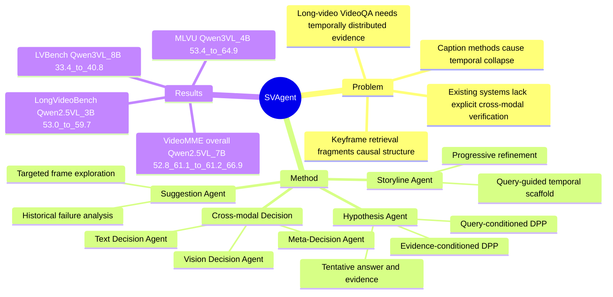

## Summary
SVAgent 面向 long-video VideoQA，把长视频理解组织成 query-guided storyline、DPP evidence selection、text/vision 双分支 decision 和 meta-agent verification 的闭环。核心贡献不是训练新的 Video MLLM，而是在现有 Qwen2.5-VL / Qwen3-VL 小模型上用 multi-agent collaboration 保持 temporal coherence、选择证据并检查 cross-modal consistency。

## Problem & Motivation
长视频 VideoQA 的难点在于证据稀疏、无关内容多、关键事件可能跨越很长时间，并且直接处理所有 visual tokens 会超过当前 multimodal model 的上下文预算。论文把既有方法分成三类：caption-based 方法容易把时间结构压扁并弱化 visual grounding；keyframe retrieval 方法能降成本但会破坏 temporal continuity；event/graph-based 方法有结构化优势，但依赖固定结构和准确 evidence identification。

作者的核心 problem formulation 是：VideoQA 不应只找 isolated relevant frames，而应像人一样围绕一个持续更新的 storyline 做推理。这个 formulation 对 long-video understanding 有意义，因为答案常常依赖 temporally distributed evidence，而不是单帧视觉显著性。

## Method
SVAgent 是一个 closed-loop multi-agent framework，包含 storyline construction、hypothesis testing、cross-modal decision 和 suggestion-driven refinement 四个阶段。

**Storyline Agent** 根据 sampled frames、captions 和 query 生成 query-conditioned storyline。初始轮使用 uniform sampling，后续轮由 suggestion agent 提供新的 frame subset；storyline 会随新证据更新，用作全局 temporal scaffold。

**Hypothesis Agent + DPP evidence selection** 先根据 storyline、sampled frames 和 query 生成 tentative answer hypothesis 与 evidence set。随后使用两个 DPP：一个以 query 为条件选择 frame set `Yq`，另一个以 evidence 为条件选择 frame set `Ye`。论文用 `|Yq ∩ Ye| / k` 作为一致性信号；当超过阈值 `alpha` 时进入 cross-modal decision，否则触发 refinement。DPP kernel 写作 `L = diag(r) S diag(r)`，其中 `S` 是 frame similarity matrix，`r` 是 relevance vector。

**Text / Vision Decision Agents** 分别基于 captions/storyline 和 frames/storyline 独立给出答案、证据和 frame-importance recommendation。论文有意不把 hypothesis decision 显式传给这两个 agents，理由是减少 explicit information leakage 和 error propagation。

**Meta-Decision Agent** 检查 text decision 与 vision decision 是否一致。如果两者一致，meta-agent 仍会二次验证 evidence 是否相互支持；如果最终迭代中两者不一致，meta-agent 会结合双方 evidence 与 frame importance 做 reconciliation。

**Suggestion Agent** 在 hypothesis test 失败或证据不足时查看历史使用过的 frames、storyline 和 query，选择未充分探索且可能含有相关证据的时间区域。实现细节中，视频以 1.0 FPS 建立 frame database，初始池为 10% uniform frames，DPP similarity 使用 `google/siglip-so400m-patch14-384`，intersection threshold `tau=0.3`，最大 refinement iterations 为 3；实验在 NVIDIA H100 80GB 上运行。

## Key Results
**Main benchmark results.** 在四个 long-video benchmarks 上，SVAgent 对 size-matched Qwen backbones 给出稳定增益：

- **LongVideoBench val (w/o subtitles)**：Qwen2.5-VL-3B 从 53.0 提升到 59.7（+6.7）；Qwen2.5-VL-7B 从 54.8 提升到 60.7（+5.9）；Qwen3-VL-8B 从 54.9 提升到 61.0（+6.1）。
- **MLVU test**：Qwen2.5-VL-3B 从 53.6 提升到 61.2（+7.6）；Qwen3-VL-4B 从 53.4 提升到 64.9（+11.5）；Qwen3-VL-8B 从 54.5 提升到 65.6（+11.1）。
- **LVBench test**：Qwen2.5-VL-7B 从 33.9 提升到 40.6（+6.7）；Qwen3-VL-8B 从 33.4 提升到 40.8（+7.4）。
- **VideoMME overall (w/o subtitles / w subtitles)**：Qwen2.5-VL-7B 从 52.8 / 61.1 提升到 61.2 / 66.9（+8.3 / +5.8）；Qwen3-VL-8B 从 55.8 / 63.8 提升到 63.1 / 69.8（+7.3 / +6.0）。

**Ablation.** Table 2 在 Qwen2.5-VL-7B 上显示，完整 SVAgent 达到 LongVideoBench 60.7、MLVU 62.7、LVBench 40.6、VideoMME overall 61.2 / 66.9。论文文字说明：去掉 storyline agent 会带来约 4-8 points 下降；textual verification 对 MLVU 贡献更明显（+3.8）；visual verification 对 VideoMME long videos 有帮助（+3.5）；meta-decision agent 在 LongVideoBench 和 MLVU 上分别带来 +3.0 和 +2.6。

**Retrieval backbone.** Table 3 比较 CLIP、LongCLIP、SigLIP 作为 DPP retrieval model。完整系统在 LongVideoBench 上分别为 60.2、59.9、60.7，在 MLVU 上为 61.9、63.1、62.7，在 VideoMME overall 上为 60.7 / 65.2、60.4 / 64.9、61.2 / 66.9；差距不大，说明 pipeline 对具体 retrieval encoder 不高度敏感。

**Efficiency / frame selection.** Figure 4 显示，在 VideoMME 上 uniform sampling 从 4 frames 的 41.2% 提升到 32 frames 的 59.8%，但增益趋缓；SVAgent 用 8 frames 达到 60.7%，64 frames 达到 63.9%。Figure 3 显示更严格的 intersection ratio 和更多 refinement iterations 会提高 accuracy 但增加 latency；例如 refinement iteration `T=10` 时 latency 到 57.3s。

**Statistical significance.** Table 4 在 MLVU 上做 10 个 random seeds 的 repeated runs：Raw baseline mean 54.68、StdDev 0.89；SVAgent mean 62.76、StdDev 0.31；one-sided paired t-test p-value 为 `7.09 × 10^-10`，Wilcoxon p-value 为 `9.77 × 10^-4`。

需要注意：Table 1 中 SVAgent 主要展示对同一 Qwen backbone 的增益，并不意味着小模型 SVAgent 全面超过所有大模型或 proprietary Video MLLMs。例如 Video-RAG-72B 在 VideoMME overall 上为 77.4，仍高于本文 3B-8B SVAgent 的对应数值。

## Strengths & Weaknesses
**已知亮点**：
- 问题切得清楚：long-video VideoQA 的失败不只是 frame budget 不够，还包括 temporal structure 丢失、evidence selection 片段化和 cross-modal inconsistency。
- 方法设计有可解释的分工：storyline 负责全局时间叙事，DPP 负责 query/evidence 约束下的 diversity-aware frame selection，text/vision agents 负责 modality-specific reasoning，meta-agent 负责一致性验证。
- 实验覆盖 LongVideoBench、MLVU、LVBench、VideoMME 四个 long-video benchmarks，并在 Qwen2.5-VL / Qwen3-VL 的 3B-8B backbones 上报告一致提升。
- Ablation 不只报告最终精度，也拆分了 storyline、textual verification、visual verification、meta decision 和 retrieval backbone，对理解增益来源有帮助。

**已知局限**：
- 论文没有单独的 limitations section，也没有系统 failure-case taxonomy；Figure 5 是正向 case study，而不是失败案例分析。
- SVAgent 是 inference-time multi-agent framework，会引入额外迭代与 agent calls。Figure 3 已显示 accuracy-latency tradeoff：更高 `tau` 或更大 `T` 会增加延迟，`T=10` 时 latency 达 57.3s。
- 实验主要把 SVAgent 套在 Qwen2.5-VL / Qwen3-VL 3B-8B 上；虽然表中列出 Gemini 1.5 Pro、GPT-4o、LLaVA-Video、Video-RAG 等强 baselines，但没有展示把 SVAgent 直接用于这些更大或 proprietary models 的结果。
- 方法依赖 captions、sampled frames、DPP retrieval 和多轮 LLM/VLM decision。论文没有报告不同 caption quality、ASR/subtitle availability、frame sampling FPS 或 noisy long videos 对系统稳定性的系统影响。

**推测**：
- 这篇最有价值的 insight 是把 long-video reasoning 从“更多帧或更强模型”转成“维护一个可更新的 temporal narrative，并用 cross-modal verification 检查答案”。这个方向可能比单纯扩 context 更适合证据稀疏的视频任务。
- Suggestion Agent 的有效性可能高度依赖 base model 能否从失败历史中定位未探索片段；如果 query 需要非常细粒度的视觉检测或时间戳级 localization，仅靠 storyline-level feedback 可能不够。

**不知道**：
- 在真实开放视频、低质量字幕、强剪辑、多事件并行或跨镜头遮挡场景下，storyline 是否会积累错误并误导后续 DPP selection。
- 多 agent prompt 的具体稳定性、token cost、以及不同 base Video MLLM 上的 prompt sensitivity。
- 代码和具体 prompts 是否公开；论文正文没有给出 repository URL。

## Mind Map

## Notes
- 和 GUI / embodied agent 的关系是间接但有启发：它不是 GUI agent 论文，但它的 storyline memory、evidence retrieval、cross-modal self-check 和 refinement loop 都是 long-horizon agent reasoning 中常见瓶颈的一个视频理解版本。
- 这篇更像 inference-time orchestration paper，而不是 representation learning paper。它的贡献取决于 multi-agent decomposition 是否比直接让强 Video MLLM long-context reasoning 更稳、更便宜。
- 后续值得追问：storyline 是否应该显式结构化成 event graph / temporal memory，而不是自然语言 narrative；meta-agent 的 consistency check 是否能变成可学习的 verifier；DPP 的 query/evidence intersection 是否能扩展到 GUI trajectory 中的 screenshot/action/state selection。
- date_publish 取论文首页可见 arXiv header 的 2026-04-06；venue 按 CVPR 2026 记录。正文未给 DOI 或具体 code repository，因此对应字段留空。
