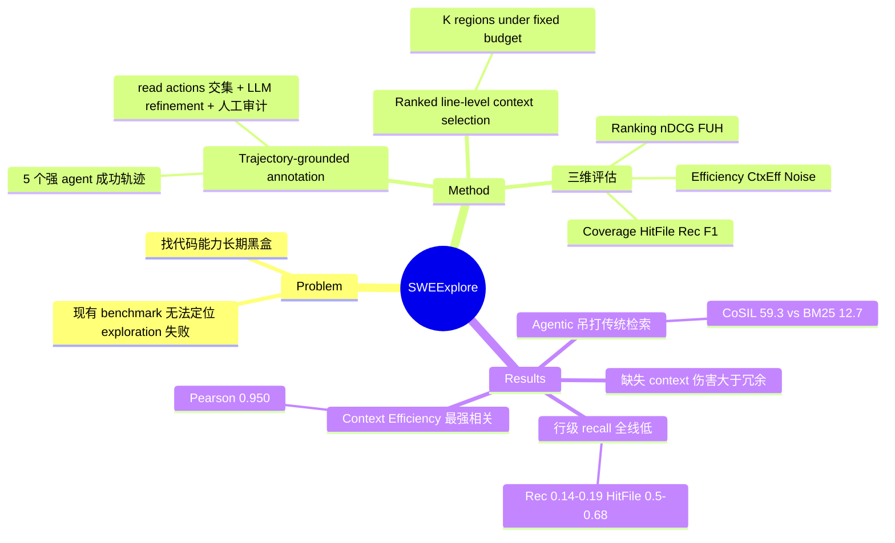

## Summary
针对 coding agent 的"找代码"能力设计了独立 benchmark，让 agent 在固定行数预算下返回 ranked 相关代码区域，用轨迹交集生成 ground truth，发现 agentic explorer 吊打传统检索，但所有 agent 行级 recall 都很低（~0.15）。

## Problem & Motivation
现有 benchmark（如 SWE-bench）把代码任务当二分类（解决/未解决），无法定位具体失败环节。实际上失败分两种：找不到相关代码 vs 找到了但写错 patch。前者——**repository exploration 能力**——长期缺乏独立评估。本文把它形式化为"给定 issue 和 repo，在固定行数预算下返回 ranked 相关代码区域"的任务，解耦了 patch 生成环节。

## Method
**任务定义**：给定 issue *q* 和 repo *R*，explorer 返回 K 个 ranked regions（file path + line range），不需要生成 patch 或执行代码。

**数据构建**（848 instances，10 语言，203 repos）：
1. 从 SWE-bench Verified/Pro/Multilingual 筛选有 ≥2 个成功轨迹的 instance
2. **Ground truth annotation pipeline**：
   - 收集 5 个强 agent（GPT-5.4、Gemini-3-Pro、Sonnet-4.6、GLM-5.1、Kimi-K2.6）的成功轨迹
   - 提取 read actions（editor view、grep、cat）转为 file-region pairs
   - 对所有成功轨迹取**交集**——所有 agent 都读过的区域作为 core candidates
   - LLM 辅助 refinement：提升 "load-bearing 但不是所有轨迹都访问" 的 optional reads
   - 人工审计每个 refined region
3. 平均每个 instance：4.3 个 ground-truth files、4.7 个 regions、1,578 行，嵌在平均 759 个文件的 repo 中

**评估指标**（三个维度）：
- **Coverage**：行级 Precision/Recall/F1，文件级和 region 级命中率（HitFile、HitRegion）
- **Ranking**：nDCG@B（主要用 B=500）、First Useful Hit（FUH，第一个有用证据出现的早晚）
- **Efficiency**：Context Efficiency（预测行中有多少是 ground-truth 或 optional context）、Noise Rate（预测 regions 中有多少跟 core/optional 都不重叠）

**下游验证**：把每个 explorer 的输出作为**唯一可见 repo context** 喂给固定 coding agent，用原版 SWE-bench harness 评估 patch，验证 exploration metrics 与 repair success 的相关性。

## Key Results
**Agentic vs 传统检索（Table 3，下游 resolve rate on n=150）**：
- CoSIL（最强 specialized localizer）：59.3%，逼近 Oracle（59.7%）
- Agentic explorers（Codex、Claude Code、OpenHands 等）：44.7%–50.3%
- 传统检索（BM25、TF-IDF、RAG）：12.7%–26.0%
- Random：4.7%

**Metric-downstream correlation（Table 4）**：
- Context Efficiency：Pearson r = 0.950（最高）
- Rec@100：Spearman ρ = 0.845（最高）
- nDCG@500、FUH、HitFile 的相关系数均 >0.92

**Exploration 质量（Table 6，K=5，GPT-5.4 backbone）**：
- 所有 agentic explorers：**HitFile ≈0.5-0.68**（文件级命中率尚可），但 **Recℓ ≈0.14-0.19**（行级 recall 极低）
- CoSIL（迭代 code-graph search）：Recℓ = 0.788（最高），但仍不到 Oracle 的 0.953
- BM25/TF-IDF：HitFile <0.14，接近 Random

**LLM 对比（Table 5，Mini-SWE-Agent scaffold）**：
- GPT-5.4 vs GPT-5.4-mini vs Sonnet-4.5 vs Kimi-K2.6：**HitFile 从 0.65 降到 0.51**，但 Recℓ 全部在 0.11-0.19 区间，换模型改善有限

**缺失 context 伤害更大**：受控降级实验显示，patch 性能在 α=50%-75% ground-truth 覆盖率处有明显阈值效应，**缺核心证据 >> 冗余 context**。

## Strengths & Weaknesses
**Strengths**：
- **解耦了 exploration 和 patch generation**，终于能单独评估"找代码"这个长期黑盒的能力
- **Trajectory-grounded annotation**：用多个 agent 的成功轨迹交集生成 ground truth，比纯人工标注更可靠且可扩展
- **下游验证强**：Context Efficiency、Recℓ 与 downstream resolve rate 的相关系数 >0.92，证明 upstream metrics 确实有预测力
- **诊断明确**：暴露了"文件级定位已经不错，但行级 recall 全线崩盘"的核心瓶颈，指出换 LLM 治标不治本

**Weaknesses**：
- **Coverage bias**：只包含至少一个 agent 能解决的 instance，对无解或全失败 case 没有覆盖
- **Ground truth = 经验近似**：轨迹交集只是"观察到的有用 context"，不是"唯一有效的证据集"，可能有其他解法依赖不同 regions
- **下游验证规模有限**：n=150 的 restricted-context 实验只是 sanity check，不能替代完整的 patch-generation benchmark
- **Model memorization 风险**：empty-context baseline 在 canonical repos 上可能因模型预训练时见过代码而虚高
- **多语言不平衡**：Python 占 64.5%，其他 9 种语言合计 35.5%，跨语言泛化性未充分测试

**影响**：这是第一个 **line-level repository exploration benchmark**，填补了 coding agent 评估的关键空白。低 recall 的发现直接指向未来方向：需要更好的 iterative search、code-graph reasoning、或 long-context selection 机制。但 trajectory-derived ground truth 的局限性意味着它更适合作为"已知成功路径的覆盖率测试"，而非"所有可能有效证据的完备集"。

## Mind Map

## Notes
- **Low recall 的根因**：是 search strategy 不够 iterative，还是 line-level grounding 本身就难？Table 6 显示 CoSIL 的 Recℓ=0.788 远超其他（0.14-0.19），说明 iterative code-graph search 确实有效，但即便如此仍达不到 Oracle 的 0.953。
- **与 SWE-bench 的关系**：SWE-Explore 是 SWE-bench 的"前置关卡"——探索能力的上限约束了最终 resolve rate。Table 3 里 CoSIL 的 59.3% 逼近 Oracle 59.7%，说明当探索做到位时，patch generation 已经不是瓶颈。
- **Trajectory intersection 的哲学**：用"所有成功 agent 都读过"作为 ground truth 是保守估计，避免了"某个 agent 偶然读到但其实不必要"的噪声，但代价是可能漏掉"某条路径依赖、但同样有效"的证据。LLM refinement 步骤部分缓解，但仍是经验启发式。
- **潜在应用**：这个 benchmark 可以用来快速评估新 retrieval/search 方法，而不用等跑完整 SWE-bench（后者耗时且 signal 混杂）。Context Efficiency r=0.950 的高相关性使得它可以作为 early-stage screening。

