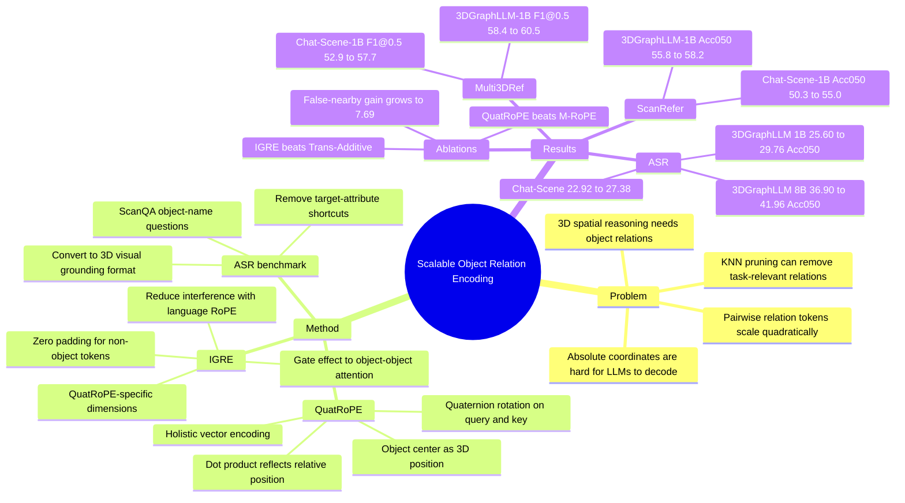

## Summary
QuatRoPE 解决 3D LLM 中对象关系编码的 scalability 与几何一致性问题：它把每个 object-related token 的 3D 绝对坐标用 quaternion rotation 注入 query/key，并让 attention dot product 显式转化为 pairwise relative positions。IGRE 进一步把 QuatRoPE 与 language RoPE 隔离，并将其作用 gate 在 object-object attention 上；论文还构造 ASR benchmark 来更直接评估 attribute-free 3D spatial reasoning。

## Problem & Motivation
3D spatial reasoning 的核心是根据 anchor objects 与 target object 的空间关系定位目标，这直接影响 3D Visual Grounding、3D VQA 和 embodied agents 的场景理解能力。由于 3D scene-language paired data 稀缺，从零训练强 spatial reasoning 模型困难，因此已有方法通常把 point cloud / object features 注入 LLM，借用 LLM 的预训练理解与推理能力。

论文指出现有 3D LLM 的对象位置表示主要有两类问题。第一，absolute position encoding 把 3D coordinates 融入 object feature，但坐标原点和朝向没有自然语义，且 premature feature fusion 会让 LLM 难以从有限数据中再抽取相对关系。第二，显式把所有 pairwise object relations 作为额外 input tokens 会产生 O(n^2) 序列长度；作者举例 InteriorGS 每个 scene 平均超过 554 个 objects，会产生超过 153,181 个 relations，容易超过 LLM input limit。3DGraphLLM 用 KNN pruning 只保留近邻关系，但 spatial proximity 不保证 task relevance，可能删掉关键关系。

作者的目标是保留显式 pairwise spatial relations，同时让 input length 只随 object count 线性增长，并尽量不破坏 pretrained LLM 原有的 language RoPE 与语言推理能力。

## Method
**QuatRoPE.** 方法以 object bounding box center 表示每个 object 的 3D position。对 LLM self-attention 中的 query/key vectors，QuatRoPE 将它们分组为 3D segments，并视为 real part 为 0 的 pure quaternion；随后根据该 token 对应 object 的 3D absolute coordinate 对 query/key 做 quaternion rotation。作者构造的目标是让两个旋转后向量的 dot product 只依赖两 object 的 relative position，而不是各自的 absolute coordinate。

关键点是 holistic vector encoding。不同于把 x/y/z 三轴独立编码的 M-RoPE 风格方案，QuatRoPE 用 quaternion rotation 把 3D coordinate 作为整体向量参与旋转，避免某一个 axis 上坐标接近时错误抬高 attention score。论文把这种错误称为 axis-wise encoding 的 "false nearby" 问题：两个物体整体相距很远，但某个坐标轴接近，会被独立轴编码误认为关系更强。

**IGRE.** 直接把 QuatRoPE 叠在已有 language RoPE 上会有两个干扰源：language RoPE 和 QuatRoPE 同时旋转 query/key；非 object tokens 没有 3D position，但如果不旋转，等价于被放在 (0, 0, 0)，会让模型错误关注靠近原点的 objects。IGRE 的做法是给 object-related tokens 额外拼接 QuatRoPE-specific dimensions，并在这些维度上执行 QuatRoPE；non-object tokens 则拼接 zero vector。这样 QuatRoPE 与 language RoPE 在维度上隔离，并且只有 query 和 key 都来自 object-related tokens 时，这些额外维度才会改变 attention score。

**ASR benchmark.** 论文认为 ScanRefer、Multi3DRef、SQA3D 等 benchmark 的文本描述常混有 object category、color、shape 等非空间线索，模型可能绕过 spatial reasoning。Attribute-free Spatial Reasoning (ASR) 从 ScanQA 中选择答案唯一、询问 object name 的 3D VQA questions，过滤掉暴露 target attributes 的样本，再转换成 3D VG 格式，让模型在 scene objects 中做选择，减少语言生成能力差异对评估的影响。

**Training / evaluation setting.** 实验把 QuatRoPE 通过 IGRE 接到 Chat-Scene 和 3DGraphLLM 两类 point cloud-based 3D LLM 上。训练数据混合 ScanRefer、Multi3DRef、ScanQA、SQA3D、Scan2Cap、ReferIt3D 和 Chat-Scene 的 object alignment task；LLM 用 LoRA fine-tune，rank r=16、scaling factor alpha=16，learning rate 为 2e-5。对 3DGraphLLM baseline，论文采用 KNN scene graph pruning，k=2。

## Key Results
**ASR benchmark.** 在作者构造的 attribute-free spatial reasoning benchmark 上，QuatRoPE 带来稳定提升。Chat-Scene + Llama-3.2-1B-Instruct 的 Acc@0.25 / Acc@0.5 从 **22.92 / 22.92** 提升到 **27.38 / 27.38**，均为 **+4.46**（19.48%）。3DGraphLLM + Llama-3.2-1B-Instruct 从 **25.89 / 25.60** 提升到 **29.76 / 29.76**，分别为 **+3.87** 和 **+4.17**；3DGraphLLM + Llama-3-8B-Instruct 从 **37.50 / 36.90** 提升到 **41.96 / 41.96**，分别为 **+4.46** 和 **+5.06**。

**ScanRefer / Multi3DRef / SQA3D main comparison.** 在 ground-truth segmentation 的 1B setting 中，Chat-Scene-1B + QuatRoPE 在 ScanRefer Acc@0.5 从 **50.3** 提升到 **55.0**，Multi3DRef F1@0.5 从 **52.9** 提升到 **57.7**，SQA3D EM@1 从 **50.7** 提升到 **53.1**。3DGraphLLM-1B + QuatRoPE 在 ScanRefer Acc@0.5 从 **55.8** 提升到 **58.2**，Multi3DRef F1@0.5 从 **58.4** 提升到 **60.5**，SQA3D EM@1 从 **51.1** 提升到 **53.2**。

**Predicted segmentation / 7B setting.** 在 Mask3D segmentation 的 7B setting 中，Chat-Scene-7B + QuatRoPE 在 ScanRefer Acc@0.5 从 **50.2** 到 **52.2**，Multi3DRef F1@0.5 从 **52.4** 到 **54.8**，SQA3D EM@1 从 **54.6** 到 **54.7**。3DGraphLLM-7B + QuatRoPE 在 ScanRefer Acc@0.5 从 **51.3** 到 **52.5**，Multi3DRef F1@0.5 从 **55.4** 到 **56.0**，SQA3D EM@1 从 **53.1** 到 **55.2**。这些增益小于 ground-truth segmentation setting，但方向一致。

**IGRE ablation.** 在 Chat-Scene baseline 上，None / Trans-Additive / IGRE 的 ScanRefer Acc@0.5 分别为 **50.33 / 52.79 / 55.00**，SQA3D EM@1 为 **50.72 / 52.96 / 53.14**。在 3DGraphLLM baseline 上，Trans-Additive 反而把 ScanRefer Acc@0.5 从 **55.75** 降到 **53.38**，而 IGRE 提升到 **58.15**；这支持作者关于简单叠加 RoPE 会产生干扰、IGRE 更适合与 language RoPE 组合的 claim。

**RoPE method ablation.** 在 Chat-Scene 上，Raw Coordinates、M-RoPE、QuatRoPE 的 ScanRefer Acc@0.5 分别为 **52.01 / 53.92 / 55.00**；在 3DGraphLLM 上，M-RoPE 和 QuatRoPE 的 ScanRefer Acc@0.5 分别为 **57.48 / 58.15**。值得注意的是，Raw Coordinates 在 3DGraphLLM 上严重崩溃：ScanRefer Acc@0.25 / Acc@0.5 只有 **3.60 / 3.44**，Multi@0.25 / Multi@0.5 只有 **3.57 / 3.46**，SQA3D EM@1 为 **35.50**，说明直接把 raw coordinates 加入 feature 可能破坏依赖 input tokens 理解 scene layout 的模型。

**Holistic encoding verification.** Table 5 按 "false nearby" severity 重新切分 ScanRefer；severity 用 anchor-target 位置差中的 min{Delta x, Delta y} / max{Delta x, Delta y} < delta 定义，delta 越小越严重。3DGraphLLM-1B + QuatRoPE 在所有切分上都优于 baseline，且 gain 随 severity 增强：delta=1(All) 时 **94.65 vs 93.72**（+0.93），delta=0.05 时 **92.31 vs 84.62**（+7.69）。这直接支持 holistic 3D vector encoding 缓解 axis-wise false nearby 的论点。

## Strengths & Weaknesses
**已知 Strengths.** 这篇论文的 formulation 很干净：不是把所有 pairwise relations 变成额外 tokens，也不是让 LLM 从 fused absolute features 中自己学相对几何，而是利用 attention dot product 把 O(n) object position encodings 转成 O(n^2) pairwise relation signals。这个设计在问题本质和 scalability 之间取得了较好的平衡。

**已知 Strengths.** IGRE 是必要且实用的工程设计。Ablation 显示 Trans-Additive 在 3DGraphLLM 上会显著低于 baseline，而 IGRE 稳定提升，说明作者没有只提出一个数学上漂亮的 positional encoding，还处理了它与 pretrained language RoPE 共存时的干扰问题。

**已知 Strengths.** ASR benchmark 的动机合理：已有 3D VL benchmark 中类别、颜色、形状等非空间线索确实可能成为 shortcut。ASR 通过 attribute-free questions 和 3D VG format 减少这些 shortcut，使 QuatRoPE 对 spatial reasoning 的作用有更直接证据；Table 2 的 zero-shot comparison 也比只看综合 benchmark 更有诊断价值。

**已知 Weaknesses / Boundaries.** 论文的实验仍主要是 ScanNet-derived 静态室内场景上的 3D VG / 3D VQA，没有验证真实机器人 closed-loop navigation、manipulation、active perception 或动态场景。它证明的是 3D LLM 在 object-level spatial reasoning benchmark 上受益，不等价于 embodied policy 的任务成功率会提升。

**已知 Weaknesses / Boundaries.** 方法依赖 object-level pipeline：需要 ground-truth segmentation 或 Mask3D 等 off-the-shelf segmentation，把 point cloud 分割成 objects，再用 bounding box center 表示 3D position。因此如果上游 object segmentation、object enumeration 或 bounding box center 估计错误，QuatRoPE 本身不能恢复这些信息；主文没有系统量化这些上游误差的敏感性。

**已知 Weaknesses / Boundaries.** QuatRoPE 把空间关系主要注入 attention score，对"近邻更相关"的 inductive bias 有明确帮助，也和作者引用的 Maxim of Relation 对齐；但这种 bias 不等同于完整关系语义。比如 "between"、"behind a larger occluder"、support/contact、functional affordance 或多步路径约束是否也能被同样的 relative-position attention 表达，主文没有单独验证。

**推测.** 对 GUI-agent 研究的启发不是 3D quaternion 本身，而是 representation placement：不要把结构化 relation 全部展开成 token，也不要过早融合进 opaque feature，可以把对象属性以可组合的位置编码放到 attention 机制能直接计算 pairwise relation 的地方。这个 insight 可能迁移到 GUI element relation encoding，但论文没有评估 GUI、web 或 desktop layout。

**不知道.** 主文没有出现 arXiv id 或 DOI；也没有报告 end-to-end latency、memory overhead、QuatRoPE-specific dimensions 的详细规模敏感性、ASR benchmark 的样本量统计、或系统性 failure case taxonomy。Figure 3 只展示了 ScanRefer qualitative success cases，对失败类型的证据不足。

## Mind Map

## Notes
这篇论文最值得记住的是一个简洁的 scaling pattern：把每个 object 的 position 编成 token-local signal，但让 relation 在 attention 内部按需计算。它避免了 scene graph relation token 的 quadratic context cost，也比 raw coordinate fusion 更尊重 Transformer 已有的 pairwise interaction 结构。

对 embodied / VLM 方向的直接价值在 3D scene understanding，而不是完整 agent loop。后续如果要把它用于真实 agent，需要补上三个问题：上游 object segmentation 的不确定性如何传播到 relation encoding；动态观察下 object coordinates 如何随时间更新；以及 spatial relation attention 如何和 task planning / affordance reasoning 接起来。

我对 rating 给 4：问题重要、方法简洁、ASR benchmark 和 ablation 有诊断价值；未给 5 的原因是实验还停在静态 3D VL benchmark，主文缺少系统 failure analysis 和部署效率证据。
