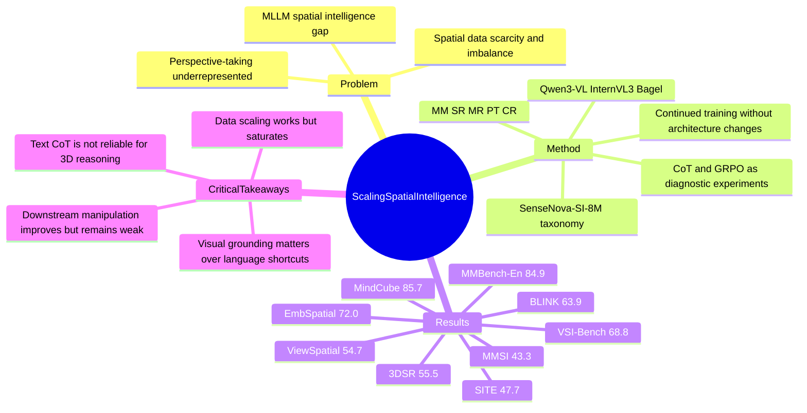

## Summary
这篇论文用 data-centric scaling 而非改架构的方式，在 Qwen3-VL、InternVL3、Bagel 等 multimodal foundation models 上继续训练 SenseNova-SI-8M/8.5M 级空间 QA 数据，以提升 spatial intelligence。核心贡献是把 Metric Measurement、Spatial Relations、Mental Reconstruction、Perspective-taking、Comprehensive Reasoning 组织成 taxonomy，并系统验证 spatial data scaling、generalization、shortcut 风险、text CoT 失效和 embodied downstream 迁移。结论强但也保守：数据扩展显著有效，尤其是 perspective-taking；但作者也承认 scaling 增益趋于饱和，text-based CoT 和 RL 不是直接解法。

## Problem & Motivation
已知：当前 MLLM 在通用 multimodal understanding 上进步很快，但在三维空间理解、视角变换、距离/方向/多视图推理上仍有明显缺陷，而这些能力对 embodied AGI、机器人操作和 GUI/physical-world grounding 都是基础能力。作者认为关键瓶颈不是单一 benchmark 上的模型技巧，而是 spatially grounded data 的稀缺、异质和不平衡，尤其是 Perspective-taking 数据长期不足。现有 spatial MLLM 路线大致分为引入 3D expert encoder 和构造 spatial-specific datasets；本文选择后者，并试图回答一个更基础的问题：在强 MLLM backbone 上，系统性扩大高质量空间数据到底能带来什么能力、在哪里会饱和、是否只是 language shortcut。

## Method
方法主线很简单：不改 Qwen3-VL、InternVL3、Bagel 的原始架构，只做 continued training，用统一 taxonomy 和数据管线构建 SenseNova-SI 系列模型。

- **Taxonomy**：数据覆盖 Non-SI、2D grounding，以及五类 spatial intelligence：Metric Measurement (MM)、Spatial Relations (SR)、Mental Reconstruction (MR)、Perspective-taking (PT)、Comprehensive Reasoning (CR)。其中 PT 被进一步拆成 View Correspondence、Camera Motion Reasoning、Allocentric Transformation，用来覆盖跨视角对应、相机运动、object-/human-/camera-centric 坐标转换。
- **Data**：General QA 使用 VSR、SPEC、GQA、VQA、IconQA，约 0.6M QA；community SI datasets 包括 Open3D-VQA、CLEVR-series、REL3D、SAT、GRiD-3D、MultiSpa、MindCube、ViCA、VLM-3R、VSI-590K，约 3.3M QA；进一步从 MessyTable、ScanNet、ScanNet++、SUN RGB-D、CA-1M、Ego-Exo4D、Matterport3D 生成 4.5M QA，总量到 8.5M QA pairs。
- **Data curation**：统一标注 3D camera poses、3D object poses、2D visibility、cross-view association，并通过 object semantic filtering、visibility filtering、view pose filtering、cross-view connectivity/difficulty control、balanced sampling 降低歧义。MessyTable 的同类多实例 hard cases 被用于减少 appearance shortcut。
- **Training**：三类 foundation models 各训练 1 epoch；使用 128 GPUs、batch size 2048、AdamW、learning rate 5e-6；video data 最多采样 16 frames。论文报告基于 SenseNova-SI v1.1，并公开 codebase 和 models。
- **CoT exploration**：额外比较 GPT-5-generated CoT、MindCube-style Aug-CGMap、作者的 procedural continuous CGMap，以及 GRPO；这是分析项，不是主方法。

## Key Results
- **主结果 (EASI-8 protocol, Tab. 1)**：SenseNova-SI InternVL3-8B 平均 61.5，在 VSI-Bench 68.8、MMSI-Bench 43.3、MindCube-Tiny 85.7、ViewSpatial 54.7、SITE 47.7、BLINK 63.9、3DSR 55.5、EmbSpatial 72.0。相对 base InternVL3-8B 的增益分别是 +15.8 Avg、+26.7 VSI、+15.3 MMSI、+44.2 MindCube、+16.0 ViewSpatial、+6.6 SITE、+10.4 BLINK、+11.2 3DSR；EmbSpatial 反而 -4.3。
- **对比 baselines**：SenseNova-SI InternVL3-8B 在 VSI-Bench 68.8 高于 GPT-5 的 55.0、Gemini-3-Pro-Preview 的 52.5，以及 Cambrian-S-7B 的 62.9；在 MindCube-Tiny 85.7 高于 GPT-5 的 56.3、Gemini-3-Pro-Preview 的 70.9、MindCube-3B-RawQA-SFT 的 51.7。MMSI 上 43.3 仍低于 Gemini-3-Pro-Preview 的 45.2，但高于 GPT-5 的 41.8 和 Cambrian-S-7B 的 27.1。
- **Scaling curve (Tab. 8)**：InternVL3-8B 从 0M 到 8M data，在 VSI-Bench 从 42.1 到 68.7，MMSI 从 28.0 到 43.3，MindCube-Tiny 从 41.5 到 85.6，SITE 从 42.1 到 47.7；但 3M 后若干指标出现波动或边际收益下降，例如 ViewSpatial 在 2M 达 56.7、8M 为 54.6。
- **Frame extrapolation (Tab. 2)**：SenseNova-SI InternVL3-8B 训练时最多 16 frames，但在 VSI 上 16/32/64/128 frames 分别为 64.6/68.7/68.8/66.3；在 VSI-Debiased 上为 58.9/62.8/62.4/59.7。已知结论是能外推到 32/64 frames，但 128 frames 不再提升。
- **Shortcut / overfit analysis**：MindCube 上 SenseNova-SI InternVL3-8B 从 Standard 85.6 降到 w/o Vis. 52.5，而 MindCube-SFT-RawQA 从 51.7 到 w/o Vis. 50.7，说明后者高度依赖 language priors。Hard circular test 中 SenseNova-SI 从 85.6 到 75.6，MindCube-SFT-RawQA 从 51.7 到 23.1；text-only SSI-800K 只把 MMSI 从 28.0 提到 28.2，而 full SSI-800K 到 36.4。
- **CoT 负结果 (Tab. 4)**：在 VSI-Bench Object Relative Direction subset 上，No CoT 为 40.6；CoT-GPT-5 降到 26.5，CoT-MindCube-Aug-CGMap 降到 17.0，CoT-SenseNova-SI-CGMap 为 31.8。Full set 上 CoT-SenseNova-SI-CGMap 为 49.2，加入 GRPO 后降到 43.1，作者据此认为 text-based CoT/RL 对 spatial reasoning 并不可靠。
- **Downstream embodied task (Tab. 5)**：EmbodiedBench spatial subset 上，InternVL3-8B 在 OP/SIP 为 10.4/20.8，SenseNova-SI InternVL3-8B 为 16.6/33.3，论文标注为 +59.6%/+60.0%；但 GPT-4o 仍为 37.5/45.8，高于 SenseNova-SI。
- **General capability retention (Tab. 9)**：SenseNova-SI InternVL3-8B 在 MMBench-En 为 84.9，高于 base InternVL3-8B 的 81.7；但 AI2D 从 85.2 降到 79.0，DocVQA 从 92.1 降到 84.9，MMMU 从 55.6 降到 49.4，说明保留通用能力不是无损的。

## Strengths & Weaknesses
**Strengths**
- 已知：问题 formulation 好。作者没有把 spatial intelligence 简化成单个 benchmark，而是按 MM/SR/MR/PT/CR 拆能力，并把 PT 的跨视角变换作为核心缺口来补，这比单纯堆 SpatialVLM-style relation QA 更接近 embodied 场景。
- 已知：实验覆盖面强。主表横跨 VSI、MMSI、MindCube、ViewSpatial、SITE、BLINK、3DSR、EmbSpatial，并附加 general multimodal benchmarks、frame ablation、text-only ablation、no-vision/circular shortcut tests、CoT ablation 和 embodied manipulation。
- 已知：负结果有价值。CoT-GPT-5、CogMap CoT 和 GRPO 没有稳定提升，且长 CoT case study 展示了局部空间错误如何累积，这对后续设计 spatial reasoning mechanism 很有参考价值。
- 推测：Perspective-taking 数据可能是主要增益来源之一，因为作者多次把 PT gap 与性能提升联系起来，且 single-task spill-over case 指向 Ego-Exo4D / MessyTable 数据对 Maze Pathfinding、Pos-Cam-Cam、Attr-Appr 有迁移。但论文没有给出完整的 PT-only vs non-PT mixture 主表，所以不能把全部提升归因给 PT。

**Weaknesses / Limitations**
- 已知：data scaling 出现饱和和波动。Tab. 8 中 ViewSpatial 在 2M 已高于 8M，SITE 3M/6M/8M 变化很小，作者也明确说 data scaling alone 可能不足以达到 human-level spatial intelligence。
- 已知：general capability retention 有代价。MMBench-En 保持甚至提升，但 AI2D、OCRB、DocVQA、MMVP、MMMU、Vid-MME 对某些模型有下降，说明 spatial continued training 仍会改变原模型能力分布。
- 已知：EmbodiedBench downstream 证明的是 zero-shot utility，但绝对成功率仍低于 GPT-4o；SenseNova-SI 在 OP/SIP 只有 16.6/33.3，离可部署机器人策略很远。
- 已知：failure cases 包括 visual state description 中对象识别错误导致错误 plan，以及即使 plan 正确也受 manipulation precision 限制。CoT failure case 也显示跨帧局部不一致会累积成错误最终答案。
- 不知道：论文没有在正文中给出完整数据生成模板、全部过滤阈值、训练数据与各 benchmark 的可审计 overlap 报告；因此 robustness 证据强于普通 benchmark report，但还不能完全排除 dataset proximity 对部分结果的贡献。

## Mind Map

## Notes
- 对 GUI-agent / embodied agent 的启发：screen-only GUI grounding 和 embodied spatial reasoning 都会遇到 coordinate transform、viewpoint shift、object correspondence 的问题；这篇的 PT taxonomy 可以直接迁移为 GUI benchmark 设计维度，例如多窗口/多页面之间的 element correspondence、relative layout transform、first-person task planning。
- 对 VLM 训练的启发：这篇像是 spatial domain 的 "data engine report"，结论不是复杂模型结构，而是高质量、task-balanced、多来源 spatial QA 能显著补齐 MLLM 缺口。值得警惕的是，如果没有公开可复现的数据引擎，只发布模型权重仍会让社区难以做 causal ablation。
- 我认为 rating=5 的原因：它对 VLM spatial intelligence、embodied reasoning 和后续 GUI/physical-world agent 都是高相关 baseline；但它不是最终方法论答案，更像是把 "data scaling baseline" 拉到足够高，让后续 algorithmic innovation 必须证明自己超过这个强基线。
