## Summary
Scene-VLM 把 video scene segmentation 从 encoder-based shot classifier 改成 fine-tuned VLM：每个 shot 输入 frames、dialogue 和可选 character metadata，模型在 context-focus window 中顺序输出 scene boundary 的 Yes/No 决策，并从 Yes/No token logits 中抽取 confidence。它在 MovieNet-318 和 BBC Planet Earth 上报告 SOTA 数字，同时展示了迁移到 video chaptering 和生成 post-hoc rationale 的可能性。对 VLM / video understanding 的价值在于，它把 narrative boundary detection 变成 multimodal sequential reasoning 问题，但代价是更高计算成本和较强的结构化输出约束。

## Problem & Motivation
Video scene segmentation 的目标是在 long-form video 中识别语义连贯 scene 的边界；scene 通常由一段连续 shots 组成，语义连贯性可能来自 location、time、characters 或 narrative theme。这个任务对 structured summarization、semantic retrieval 和 contextual advertising 有直接价值，但难点是 scene boundary 不等于低层视觉变化：有些剪辑很剧烈但叙事未变，有些叙事转折依赖 dialogue 或角色关系。

作者认为现有方法主要有三个限制。第一，BaSSL、TranS4mer、MEGA 等 encoder-based 方法仍有 visual-centric bias，dialogue 和 character presence 这类 narrative cues 利用不足。第二，多数方法是 mutual point-wise prediction：在局部窗口里独立分类每个 shot，没有让前面 boundary 决策因果影响后续决策。第三，encoder classifier 通常只能给 confidence，无法解释为什么某个 shot 是 scene boundary，限制了 human-in-the-loop 编辑流程。

这篇论文的 formulation 是：如果 VLM 能同时读视觉帧、字幕和角色 metadata，并按 shot 序列生成 boundary decisions，它可能比固定融合策略更适合捕捉 narrative semantics。这个动机和 GUI / embodied agent 的关系不是直接任务迁移，而是同样强调 multimodal observation + textual context + sequential decision 的接口设计。

## Method
Scene-VLM 使用 Qwen2.5-VL-7B 作为 base model，并把视频切成连续 shots。每个 shot representation 包含 K 个 sampled frames、同步 subtitles，以及可选 actor / character information；默认设置是 context window 20 shots、focus window 10 shots、每个 shot 采样 3 frames。

**Structured multimodal shot representation.** 输入 prompt 用 XML-style 结构组织 per-shot frames、subtitle 和 actor IDs。作者还在每帧左上角叠加小型 shot-ID marker，用来把视觉帧和 prompt 中的 shot index 对齐；ablation 显示移除 shot-ID 会从 62.1 F1 / 66.8 AP 降到 60.8 F1 / 64.1 AP。

**Sequential prediction.** 模型输出 focus window 内每个 target shot 的 `shot_id: Yes/No`。作者把 shot 标为 positive 的定义是：该 shot 标记一个新 scene 的结束边界。由于输出是一个序列，后一个 shot 的预测可以 condition on 先前生成的 Yes/No 决策，而不是像 encoder classifier 那样互相独立。

**Context-focus window.** 为避免窗口边缘的 shot 缺少前后文，Scene-VLM 用更大的 context window 提供 temporal padding，只在中心 focus window 上输出预测。默认 20-shot context + 10-shot focus；作者用 per-position F1 分析显示，没有 focus margin 时边缘位置性能会明显塌陷，而加 margin 后各位置更稳定。

**Confidence from token logits.** VLM 没有 classifier head，所以作者在每个 shot 的 Yes/No verdict token 位置取 softmax logits，定义 `conf_i = P(Yes) / (P(Yes) + P(No))`。这个设计让 VLM 也能画 precision-recall curve，并支持按 threshold 调 precision / recall。

**Explanation alignment.** 原始 Scene-VLM 只训练 boundary detection；如果直接 prompt 它解释边界，会出现格式错误和 hallucination。作者额外收集 35 个 human-annotated explanation samples，再 fine-tune 得到 Scene-VLM + Explain，用于生成简短的 post-hoc boundary rationale。

实现细节：MovieNet-318 fine-tuning 使用约 29k samples，LoRA rank 8、alpha 16，8×A100 40GB，训练 4 epochs；论文报告 MovieNet-318 fine-tuning 约 2-4 小时，chaptering 任务约 1 小时。推理时把每部电影划分为 non-overlapping context windows，batch-wise sequential decoding 后聚合输出。

## Key Results
**MovieNet-318 scene segmentation.** Scene-VLM 在 MovieNet-318 test split 上达到 62.1 F1 / 66.8 AP。对比方法中，MEGA 为 55.3 F1 / 58.6 AP，TranS4mer 为 48.4 F1 / 60.8 AP，BaSSL 为 47.0 F1 / 57.4 AP，Chapter-LLaMA adaptation 为 38.6 F1 / 41.5 AP。因此 Scene-VLM 相比 MEGA 提升 +6.8 F1 / +8.2 AP，相比 TranS4mer 提升 +13.7 F1 / +6.0 AP。

**BBC Planet Earth zero-shot.** 模型在 MovieNet-318 上训练后 zero-shot 评估 BBC Planet Earth，Scene-VLM 达到 45.8 AP，高于 TranS4mer 43.6、TimeSformer 42.2 和 BaSSL 40.0。论文没有给 BBC 的 F1，因为 prior work 不报告该指标。

**VidChapters-7M subset video chaptering.** 在 matched Qwen2.5-VL-7B backbone 下，Scene-VLM 达到 32.2 F1 / 63.9 tIoU / 10.6 SODA / 52.2 CIDEr，高于 Chapter-LLaMA(Qwen2.5-VL-7B) 的 28.4 / 59.5 / 10.1 / 45.5。但原版 Chapter-LLaMA(LLaMA 3.1-8B) 仍是 42.6 F1 / 70.6 tIoU / 16.4 SODA / 82.4 CIDEr，所以这里的结论应限定为 matched backbone 下 Scene-VLM 的方法设计更好，而不是绝对 chaptering SOTA。

**Input ablation on MovieNet-318.** Full model 为 62.1 F1 / 66.8 AP。去掉 visual frames 后降到 32.0 / 34.7，说明视觉仍是主信号；去掉 subtitles 后为 61.1 / 62.2，去掉 actor-ID 后为 61.3 / 62.0，说明文本和 metadata 主要提供互补增益。Single-component 设置中，visual-only 为 58.6 / 61.4，subtitle-only 为 31.5 / 33.2，actor-only 为 24.8 / 28.6。

**Window / sequence ablation.** 20-context / 10-focus 是 62.1 F1；20-context / 5-focus 为 61.9，20-context / 1-focus 为 60.1。更短 context 下性能下降：10-context / 10-focus 为 58.4，5-context / 5-focus 为 55.8。这个结果支持两个设计点：较长 temporal context 有用，且一次输出多个顺序相关 shot 决策通常优于 point-wise 单 shot 输出。

**Frames and model size.** 每个 shot 采 1 / 2 / 3 frames 时分别为 61.8 / 65.3、61.9 / 65.2、62.1 / 66.8，增益存在但较小。模型规模从 1.5B 到 3B 再到 7B 时，MovieNet-318 从 55.9 / 58.7 提升到 59.6 / 62.8，再到 62.1 / 66.8。

**Confidence and alternative output schemes.** Comprehensive Yes/No scheme 为 62.1 F1 / 66.8 AP，平均 87.2s / movie。Concise scheme 只输出 detected boundary，速度快到 10.5s / movie，但只有 53.4 F1 且没有 meaningful AP；repeated sampling 版本为 52.6 F1 / 34.7 AP，平均 105.2s / movie。论文还报告 F1-threshold curve 在 threshold 约 0.438 处峰值 F1=0.641，在 0.321 附近约 P=0.60 / R=0.69，在 0.50 附近约 P=0.71 / R=0.58。

**Zero-shot VLM baselines.** 不 fine-tune 的 Qwen2.5-VL-7B 在 MovieNet 上只有 11.1 F1，parse error 7.9%；Claude 4.5 Sonnet 为 37.6 F1，parse error 0.03%。Scene-VLM(7B, 1 frame) fine-tuned 后为 61.8 F1 / 65.3 AP，parse error 0%。这支持作者关于 fine-tuning 对可靠结构化 scene segmentation 必要的结论。

**Explainability probe.** 在 30 个随机 sampled transitions 上，base Scene-VLM 直接要求解释时有 22/30 parsing failures 和 14/30 hallucinations；Scene-VLM + Explain 在同一评估中为 0/30 parsing failures、0/30 hallucinations。这个结果很强，但样本数小，且只衡量 parseability / hallucination，不等于解释对人类编辑决策一定有用。

**Computational comparison.** TranS4mer-3F 只有 37M parameters、1GB peak memory、0.24s / 10 samples，MovieNet 为 48.4 F1 / 60.8 AP；Scene-VLM-7B-3F 是 18GB、2.34s / 10 samples，62.1 / 66.8。Scene-VLM 显著更准且可解释，但不是轻量替代。

## Strengths & Weaknesses
**已知 Strengths.** 论文抓住了 scene segmentation 的核心：boundary 往往是 narrative-level transition，而不是单帧视觉差异。把 frames、subtitles、actor IDs 放进同一个 VLM prompt，并让模型顺序生成多个 boundary decisions，是比固定 encoder fusion 更自然的 formulation。

**已知 Strengths.** 实验比较完整：MovieNet-318、BBC Planet Earth、VidChapters-7M subset 覆盖 in-domain、out-of-domain 和 related task；ablation 覆盖 input components、context-focus window、frames per shot、model size、prediction scheme、zero-shot VLM baseline 和 computational cost。尤其 zero-shot baseline 明确说明不是“现成 VLM prompt 一下就能做”，而是 fine-tuning 和结构化输出都关键。

**已知 Limitations / boundary.** 成本明显高于 encoder-based methods。论文自己的 computational table 显示 Scene-VLM-7B-3F 的 memory / latency 分别是 18GB 和 2.34s / 10 samples，而 TranS4mer 是 1GB 和 0.24s / 10 samples。对于大规模视频库离线处理还可能接受，但实时或低成本 deployment 需要进一步优化。

**已知 Limitations / boundary.** Confidence extraction 依赖 structured Yes/No output。作者明确说这个格式为了可靠 confidence 牺牲了 generative flexibility；Concise output 虽快，但 confidence 不可靠，因为一旦模型输出 shot ID，后续 Yes token 近似变成 obligatory token。

**已知 Limitations / boundary.** Explanation 结果还只是小规模 probe。Scene-VLM + Explain 只用 35 条 explanation supervision，评估 30 个 transitions；指标是 parsing failures 和 hallucinations，而不是 explanation faithfulness、human editor time saved 或 causal attribution accuracy。因此它证明“可以把输出格式和事实性校准得更稳”，但还不能证明解释真实反映模型内部决策机制。

**已知 Failure / sensitivity.** 视觉输入仍是主导信号：无 visual frames 时 F1 从 62.1 掉到 32.0，subtitle-only 和 actor-only 更低。这说明 Scene-VLM 并没有完全摆脱 visual cue 依赖；非视觉模态是补充而非替代。context-focus margin 也很敏感，没有 margin 时边缘位置性能会塌陷。

**推测.** 对 GUI-agent / computer-use agent 的启发在于：长交互轨迹也可能需要 context-focus window，把一个 action/state 的判定放在前后操作上下文里，而不是独立判断每一帧 screen。Yes/No token-logit confidence 也可能迁移到“是否发生任务阶段切换”“是否进入错误状态”等二分类事件检测。但这是跨任务外推，论文没有在 GUI、web、robotics 或 embodied setting 上实验。

**不知道.** 不知道 Scene-VLM 在更长 context、更密集 dialogue、更复杂 multi-character narrative 或非电影视频上的错误类型分布。论文没有给系统性的 failure taxonomy，也没有报告不同 genre、scene length、字幕质量、Whisper transcript error 或 actor metadata missing 时的分层性能。

**不知道.** 论文没有提供 code link，也没有报告 end-to-end shot boundary detection error 对 scene segmentation 的影响；实验可以使用 standard shot detection 或 provided annotations，但真实 pipeline 中 shot detection / ASR / metadata extraction 的错误如何级联仍不清楚。

## Mind Map

```mermaid
mindmap
  root((SceneVLM))
    Problem
      Video scene segmentation
      Narrative boundaries beyond visual cuts
      Prior encoder methods are point-wise
      Limited explainability
    Method
      Qwen2.5-VL-7B fine-tuning
      Multimodal shot representation
        Frames
        Subtitles
        Actor IDs
        Shot-ID markers
      Sequential Yes No outputs
      Context-focus window
      Confidence from token logits
      Explanation alignment
    Results
      MovieNet-318
        62.1 F1
        66.8 AP
      BBC Planet Earth
        45.8 AP zero-shot
      VidChapters matched backbone
        32.2 F1
        63.9 tIoU
      Ablations
        No visual drops to 32.0 F1
        1.5B to 7B improves 55.9 to 62.1 F1
        Comprehensive scheme best but slower
    Limits
      Higher memory and latency than TranS4mer
      Structured output constrains generation
      Explanation eval is small-scale
      No GUI or embodied validation
```

## Notes
这篇论文最值得记住的是 confidence extraction 的工程设计：只要输出格式让 Yes/No 成为真实二选一 token，就可以从 autoregressive VLM logits 中恢复类似 classifier score 的 operating point 控制。这个细节比“VLM 做 scene segmentation”本身更可迁移。

另一个有用的启发是 context-focus window。对于长视频、GUI trajectory 或 robot rollout，很多状态判定都存在 edge effect：如果只看局部窗口边缘，模型缺少前后证据；如果只输出中心区域，就能用额外 context 换稳定性。

需要谨慎引用的点：attention analysis 中关于模型“信任 previous predictions、更多看 future shots”的解释是作者假设，不是独立因果证明；chaptering 部分也不能说 Scene-VLM 全面超过 Chapter-LLaMA，因为原始 LLaMA backbone 的 Chapter-LLaMA 仍显著更强。
