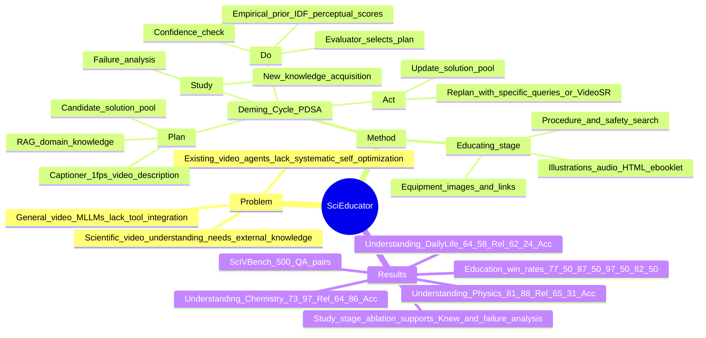

## Summary
SciEducator 面向 scientific video understanding and educating，把 Deming Cycle 的 Plan-Do-Study-Act 机制改写成一个可迭代 self-evolving multi-agent workflow，用于回答科学现象视频问题并生成 multimodal educational e-booklet。论文同时构建 SciVBench，包含 500 个 expert-verified、literature-grounded QA pairs，并报告 SciEducator 在科学视频理解和教育内容生成上优于 GPT-4o、Gemini、Claude 与 VideoAgent 系列 baseline。

## Problem & Motivation
现有 video MLLMs 已能处理一般视频理解，但论文指出它们难以有效利用 external resources 和 specialized tools；而已有 video agent / multi-agent systems 虽可调用工具，却仍受 hallucination、能力不稳定、初始 plan 不可行以及缺少系统性 workflow self-optimization 影响。Scientific video understanding 更难，因为它需要把视频细节、专业科学知识和 step-wise reasoning 结合起来，错误的物理/化学解释会直接导致 misleading answer 或不可复现实验指导。

作者把问题定义为：给定用户 query \(Q\) 和 scientific video \(V\)，multi-agent system \(S\) 需要返回 accurate、self-consistent answer \(A\)，并可选生成 educational booklet。核心动机不是训练新 video foundation model，而是让 agent 在失败分析、新知识获取和 replanning 之间形成闭环，使它在复杂科学现象上逐步提高 confidence。

## Method
SciEducator 分成 understanding 和 educating 两个阶段。Understanding 阶段使用 PDSA loop：Plan 阶段先以 1 fps 采样视频，由 Captioner 生成 temporally grounded video description，再从内部知识库检索 domain knowledge，并由 Planner 生成 candidate plan pool；Do 阶段由 Evaluator 用 objective metrics 和 LLM-based perceptual criteria 选择最佳 plan，执行后由 Planner 根据 query、video context 和 execution result 估计 confidence；若 confidence 足够高则 synthesize final answer，否则进入 Study/Act。

Evaluator 的 objective side 包括工具/agent 的 empirical prior：每个 tool/agent 做 20 次 randomized probe calls，估计 average latency、average token usage 和 success probability；同时用 IDF 衡量 plan keywords 在 84 个 physics/chemistry knowledge documents 中的 discriminativeness。Perceptual side 比较 coverage、logical coherence、scientific soundness 和 clarity。Study 阶段会诊断低 confidence 的原因，例如 tool failures、retrieval 过宽或 caption detail 不足，并把新证据并入 knowledge base；Act 阶段根据 failure analysis 与新知识更新 solution pool，例如对 blurry frames 调 VideoSR、提高 captioning fps，或重写 search query。

Educating 阶段在理解出 scientific phenomenon 和 underlying principle 后，生成 child-friendly multimodal e-booklet。流程会检索实验步骤、安全注意事项、器材图片和 purchase links，再生成 text instructions、visual guides、audio narration、hyperlinks 和 HTML e-booklet layout。论文正文称系统集成 16 个 specialized components，包括 10 agents 和 6 tools；补充材料中可见 Planner/GPT-4o、Captioner/Gemini 2.0 Flash、Evaluator/GPT-4o、Web/Paper Search、VideoSR、Procedure Search、Entity Recognition、Safety Alert、RAG、IDF Calculator、Equipment Search、Illustration Generation、Speech Generation 和 E-booklet Generation 等组件。

## Key Results
- **SciVBench / understanding**：SciVBench 含 500 个 QA pairs，覆盖 54 个 physics experiment videos、54 个 chemistry experiment videos、103 个 daily life phenomenon videos；QA 分为 terminology、principle、prediction、reading、design 五类，视频输入去掉 subtitles 和 audio narrations。理解评测用 Qwen3-Max 作为 evaluator，指标为 Relevance 和 Accuracy，分数取 0 / 0.5 / 1 后按百分比报告。
- **Scientific video understanding on SciVBench**：SciEducator 在 Physics 上达到 **Rel 81.88 / Acc 65.31**，高于 Gemini 2.0 Flash **52.81 / 38.75**、GPT-4o **47.50 / 34.69**、Claude 3.7 Sonnet **44.06 / 31.88**、VideoAgent **49.06 / 36.56** 和 videoagent **46.25 / 35.31**。在 Chemistry 上为 **73.97 / 64.86**，高于最强 baseline videoagent **46.62 / 37.16**；在 Daily Life 上为 **64.58 / 62.24**，高于 Gemini 2.0 Flash **34.64 / 31.25** 和其他 baseline。
- **SciVBench Education Subset / education**：教育评测在 40 videos 上进行，用 Qwen-VL-Plus 比较 anonymized model responses，并报告每个指标的 win rate。SciEducator 的 Relevance / Instructional Quality / Attractiveness / Educational Value 为 **77.50 / 87.50 / 97.50 / 82.50**，明显高于 Gemini 2.0 Flash **10.00 / 2.50 / 0.00 / 5.00**、GPT-4o **7.50 / 5.00 / 2.50 / 7.50**、Claude 3.7 Sonnet **5.00 / 5.00 / 0.00 / 5.00**。
- **PDSA ablation / education**：max rounds 从 1 到 3 再到 5 时，Education Subset 上 win rate 持续上升；1 round 为 **2.50 / 0 / 2.50 / 15.00**，3 rounds 为 **7.50 / 7.50 / 32.50 / 35.00**，5 rounds 为 **90.00 / 92.50 / 65.00 / 50.00**，对应 Relevance / IQ / Attractiveness / EV。
- **Evaluator Agent ablation**：完整 EA 归一化 Time/Token 为 **1.00 / 1.00**，Average Rounds **3.79**，Acc **64.00**；去掉 empirical prior \(E\) 后为 **1.20 / 1.18 / 4.09 / 57.50**，去掉 IDF 后为 **1.08 / 1.06 / 3.99 / 59.90**，去掉 \(A_{percep}\) 后为 **1.14 / 1.13 / 4.17 / 54.50**。这支持 Evaluator 的三类信息都在 accuracy 与资源消耗上有贡献。
- **Study Stage ablation**：完整 SciEducator 在 Physics/Chemistry/Daily Life 为 **81.88/65.31、73.97/64.86、64.58/62.24**；去掉 \(K_{new}\) 和 failure analysis \(F\) 降到 **59.69/45.94、53.04/45.27、35.94/32.55**；只去掉 \(K_{new}\) 为 **65.94/50.94、61.82/54.05、38.28/34.64**；只去掉 \(F\) 为 **71.56/55.63、66.55/57.09、48.95/45.83**。
- **Cost**：补充材料报告 understanding 阶段 max PDSA rounds = 1 / 3 / 5 时，平均每题耗时约 **105s / 158s / 206s**，money cost 为 **$0.0542 / $0.0783 / $0.1051**。

## Strengths & Weaknesses
**已知 / Strengths**
- 贡献组合比较完整：不只是提出 agent workflow，还构造了 SciVBench，并覆盖 scientific video QA 与教育内容生成两个 output surface。
- PDSA 不是纯概念包装，论文给了多个 ablation：增加 PDSA rounds 提升教育 win rate，完整 Study Stage 明显优于移除 \(K_{new}\) 或 \(F\) 的版本，完整 EA 也比去掉 empirical prior、IDF 或 perceptual evaluation 的版本更准且更省资源。
- 对 agent 设计有启发：Evaluator 同时显式考虑 time、token、success probability、IDF relevance、scientific soundness 和 clarity；这比只让 LLM 自评“哪个 plan 好”更可审计。
- 科学教育 output 的 multimodal design 比单纯 answer generation 更接近真实应用：正文明确包含 materials、step-by-step procedures、safety precautions、audio prompts、diagrams、shopping links 和 summary。

**已知 / Caveats**
- 系统严重依赖 closed-source 或外部 API components：Planner/Evaluator 多处用 GPT-4o，Captioner 用 Gemini 2.0 Flash，evaluation 又依赖 Qwen3-Max / Qwen-VL-Plus；论文没有给出完全 open-source/self-hosted 版本的结果。
- Understanding 评测输入只保留 visual content，去掉 subtitles 和 audio narrations；这能控制泄漏，但也意味着结果不覆盖需要 speech/audio grounding 的 scientific videos。
- Education quantitative comparison 只比较 shared textual modality，但 SciEducator 的输出本身包含 images/audio/hyperlinks/layout；这让文本 win rate 能说明 instructional text 更好，却不能完全量化多模态 booklet 的端到端学习效果。
- SciVBench 规模是 500 QA pairs、211 videos，教育子集是 40 videos；作为新 benchmark 有价值，但仍不足以证明其覆盖所有科学视频长尾现象。
- 成本不可忽略：max PDSA rounds = 5 时平均每题约 206s 和 $0.1051，这对大规模在线服务或低延迟交互是实际约束。

**推测 / Open Questions**
- 这个 PDSA loop 对 GUI-agent / embodied-agent 的潜在迁移点在于：当 observation 不足、工具失败或 retrieval 太泛时，agent 应该显式记录 failure reason、获取新证据并重写 plan；但本文只在 scientific videos 上验证，不能直接推出 GUI 或 robotics 场景有效。
- SciVBench 的 expert-verified QA 可能更适合评估“视觉证据 + 科学知识”的结合，而不一定能区分 video temporal grounding、external retrieval 和 LLM prior knowledge 各自贡献；需要更细粒度诊断集才能确认。

**不知道 / 未报告**
- 正文没有给 DOI、代码仓库或数据集发布链接。
- 论文没有系统报告 SciEducator 自身失败案例 taxonomy；只在 Study Stage 设计中列举了可能失败原因，并用 ablation 间接说明 failure analysis 有用。
- 没有看到人工用户学习效果评估，因此 e-booklet 的 “educational value” 目前是 Qwen-VL-Plus comparative judge 的结果，不是儿童学习实验或教师评分。

**个人判断**
这篇值得读，评分 4：它对 video-agent / multimodal-agent workflow 的价值大于单纯科学教育应用，尤其是把 failure analysis、新知识更新和 plan pool refinement 放进同一闭环；但系统依赖强闭源组件、benchmark 规模有限、真实教育效果未被人类实验验证，因此还不是通用 agentic video reasoning 的终局证据。

## Mind Map

## Notes
- 与 [[2606-HierarchicalLongVideo]]、[[2606-VideoARM]] 放在一起看：三者都把 video understanding 从“一次性 VLM answer”转成可迭代 agentic workflow，但 SciEducator 更强调外部科学知识、failure analysis 和教育材料生成，而不是长视频 memory/index。
- 最值得借鉴的是 Evaluator Agent 的资源感知 plan selection：time、token、success probability、IDF 和 perceptual criteria 共同决定 tool chain，这个思路可迁移到 GUI-agent 的 action planning。
- 需要谨慎引用 “first” 类 claim：论文称 SciEducator 是 first iterative self-evolving multi-agent system for scientific video comprehension and education，以及 SciVBench 是 first benchmark for scientific-phenomenon video analysis；这些 claim 来自作者表述，尚需与同期工作交叉核对。
