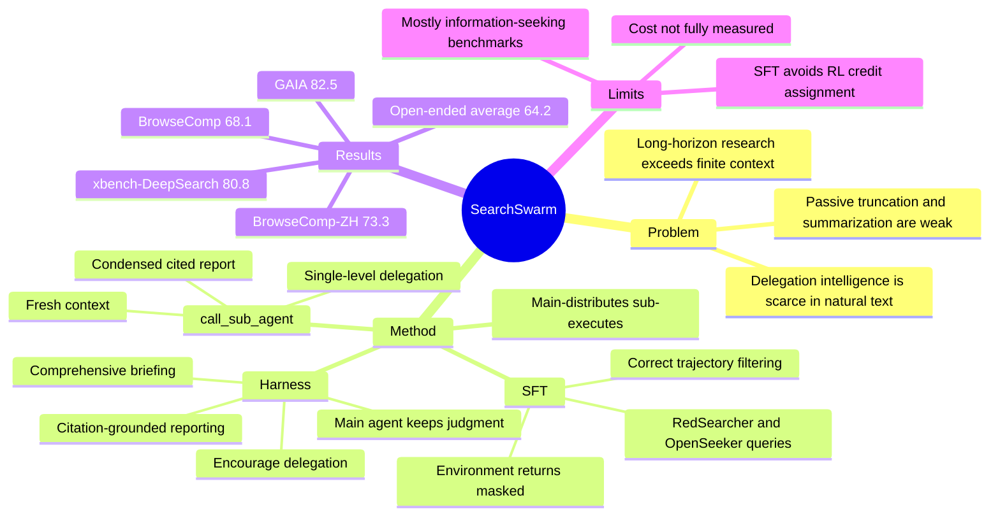

## Summary

SearchSwarm 把 long-horizon deep research 中的 multi-agent delegation 重新解释为 **active context management**：主 agent 不直接吞下所有 search / visit 原始轨迹，而是把有边界的信息搜集任务交给 fresh-context subagents，再只接收 condensed、带引用的报告。论文的核心贡献不是提出一个复杂新架构，而是给出一套 harness-guided trajectory synthesis + SFT recipe，让 30B-A3B 级模型学会何时委派、如何 briefing、如何验证和整合 subagent 返回结果。

## Problem & Motivation

这篇论文针对的是长时域 research agent 的一个结构性矛盾：真实任务的信息需求可以无界增长，但模型 context window 有界。传统 context management 多是被动策略，例如超长后总结、截断历史、保留最近几轮 tool outputs；这些方法等到 context 爆了才压缩，而且压缩规则通常不理解任务结构。

作者把替代路线定义为 **delegation intelligence**：主 agent 需要会拆分复杂任务、判断哪些子任务值得委派、给 subagent 足够上下文、再把返回结果纳入全局判断。这个能力在自然语料中很少显式出现，因此不能指望单纯预训练自然学会。论文要回答的关键问题是：能否先用 harness 在 inference 时诱导出高质量 delegation trajectories，再把这些轨迹作为 SFT 数据内化进模型权重。

这个 framing 对 agent 研究有价值，因为它把 "multi-agent" 从系统包装降级为更清晰的问题：**同一个模型如何主动把 context 切片、压缩、再合并**。作者明确指出，subagents 是同一个模型在独立 fresh context 中被调用，不是不同模型协作；因此 SearchSwarm 更接近 content-aware context compression，而不是传统多智能体系统。

## Method

**1. Formulation: main-distributes, sub-executes。** 主 agent 以 ReAct 形式与工具环境交互，每一步包含 thought、action 和 observation。普通 action 包括 search、visit、google_scholar、python；额外加入 `call_sub_agent(b)`。当主 agent 调用该工具时，subagent 只看到 brief `b`，在独立 context 中完成自己的多轮搜索/访问，最后返回 report `r`；主 agent 看不到 subagent 的中间轨迹，只把报告作为 observation 继续推理。

**2. Harness design。** Harness 由工具集和 system prompts 组成，目标是诱导四类行为：

- **Encouraging delegation**：把多步、低层、token-expensive 的信息搜集交给 subagent，主 agent 保留 context 做 decomposition、verification 和 synthesis。
- **Comprehensive briefing**：brief 不能只写任务指令，还要交代为什么该子任务重要、目前已确认什么、还不确定什么、哪些方向已经尝试或排除。
- **Main agent retains core judgment**：subagents 只负责取证和测试局部假设；是否改方向、是否接受结论、如何处理冲突仍由主 agent 决定。
- **Citation-grounded reporting**：subagent 的关键结论必须带 source citation，否则主 agent 无法验证报告可靠性，也无法把引用链传递到最终答案。

Subagents 只拥有普通信息检索工具，不允许继续调用 `call_sub_agent`，因此 delegation 是单层的。这是一个保守但清晰的设计：降低 orchestration 复杂度，也避免无限递归和 credit assignment 混乱。

**3. Training data synthesis。** 作者从 RedSearcher 和 OpenSeeker 的 open-source query datasets 取任务，在 harness 下运行模型并记录完整 trajectories。数据收集有两种配置：(a) 同一模型同时做主 agent 和 subagent，保留两种角色轨迹；(b) 更强模型做主 agent、较弱模型做 subagent，只保留主 agent 轨迹。第二种配置的动机是弱 subagent 会迫使主 agent 更谨慎地拆任务、验证返回结果，从而产生更有价值的 delegation-control 样本。

**4. Filtering and SFT objective。** 过滤时只保留最终答案正确的 main-agent trajectories；subagent trajectories 只有在对应 main trajectory 正确时才保留，并下采样过短 subagent 轨迹。作者还移除重复 identical tool calls、hallucinated citations、以及通过 python interpreter 试图 web access 等 tool misuse。训练目标是 next-token prediction，但对 environment returns 做 mask，只在模型输出的 thought/tool-call tokens 上计算 loss。

**5. Artifact release。** 官方项目页和 GitHub 已释放 code、harness、training scripts、model weights 和 SFT dataset。GitHub 仓库包含 `harness/` 与 `train/`，但 full benchmark test sets 不随仓库重分发；HF dataset `SearchSwarm-SFT` 为 6,732 rows / 2.12 GB，格式是一行包含 main conversation 与它 dispatch 的 subagent conversations，训练前需 streaming 展开。

## Key Results

**Main deep-research benchmarks。** SearchSwarm-30B-A3B 在论文主表中达到 BrowseComp 68.1、BrowseComp-ZH 73.3、GAIA 82.5、xbench-DeepSearch-2505 80.8。相比同规模的 Tongyi DeepResearch base，BrowseComp 从 43.4 提到 68.1，绝对提升 24.7。相比同规模 best baselines，它略高于 MiroThinker-1.7-mini 的 BrowseComp 67.9、BrowseComp-ZH 72.3、GAIA 80.3，并高于 LongSeeker 在 xbench-DeepSearch 的 78.0。

**Harness alone is not enough。** 作者报告 Tongyi DeepResearch 在只加 SearchSwarm harness、但不 fine-tune 的情况下从未调用 `call_sub_agent`，表现等同 base model。这是一个重要负结果：delegation 行为不是给一个工具 schema 就会自然涌现，必须通过数据/训练让模型学会何时使用。

**Harness ablation。** 在 BrowseComp 200-question subset 上，用 DeepSeek V3.2 对比三种框架：原 Tongyi DeepResearch framework 得 47.7；只增加 `call_sub_agent` 参数 schema 得 50.0；完整 SearchSwarm harness 得 57.7。说明工具本身只带来 +2.3，完整 prompt/harness 原则带来 +10.0。

**Different base model。** 用相同数据 fine-tune Qwen3-30B-A3B-Thinking-2507，在 BrowseComp 200-question subset 得 66.5、BrowseComp-ZH 得 64.0。因为该 base 没有专门做 deep search 优化，这支持一个结论：数据本身确实携带了可迁移的 deep-research/delegation pattern，而不只是 Tongyi DeepResearch base 的 continuation。

**Single-agent generalization。** 禁用 `call_sub_agent`、只保留 128K single context 时，SearchSwarm 仍在 BrowseComp subset / BrowseComp-ZH 上达到 52.0 / 53.3，高于 Tongyi DeepResearch 的 43.5 / 46.5。论文认为这说明训练学到的不只是工具调用，而是系统性 decomposition、sub-question resolution 和 research-progress maintenance。

**Open-ended deep research。** 训练数据只包含 short-answer deep research queries，但 SearchSwarm 在 ScholarQA-v2 / HealthBench / ResearchQA / DeepResearchBench 上平均 64.2，高于 Tongyi DeepResearch 50.0，接近 OpenAI DeepResearch 64.9，低于 Dr.Tulu 65.6。单项上 ScholarQA-v2 从 46.5 到 79.2，ResearchQA 从 66.7 到 80.2。

**Behavior analysis。** Tool distribution 支持作者的机制解释：主 agent 的 `call_sub_agent` 占比在 BrowseComp / BrowseComp-ZH 超过 70%，GAIA / xbench 为 43%-51%；主 agent 直接用 `visit` 多于 `search`，更像是在核查 subagent citation；subagents 则以 `search` 和 `visit` 为主，承担探索式取证。

## Strengths & Weaknesses

**Strengths**

1. **问题定义清楚。** SearchSwarm 最有价值的点是把 delegation intelligence 明确定义为 context management 能力，而不是泛泛地说 multi-agent collaboration。这个定义让问题可训练、可测量，也能和 Summary / Discard-all / Hide-Tool-Result 等被动压缩策略公平比较。
2. **方法简单且可复用。** 单层 subagent、comprehensive brief、citation-grounded report、main-agent verification 都是朴素设计，但组合后形成了一个稳定 recipe。它比复杂的 multi-agent communication protocol 更容易迁移到 coding agent、web agent、paper reading agent 或 GUI task verifier。
3. **负结果有信息量。** Tongyi DR Swarm 不经训练不会调用 subagent，说明 "tool exposure != tool competence"。这对许多 prompt-only agent orchestration claim 是一个直接提醒。
4. **开源程度比同类 frontier agent work 更高。** 论文不只放模型权重，还放 harness、training scripts 和 SFT data。虽然 benchmark 数据需从官方来源另取，但 delegation trajectory 数据本身可被社区复用。
5. **和实际研究工作流贴近。** Subagent 必须带 citation report，主 agent 必须验证并整合，这和真实 deep research / literature review 的证据纪律一致，也和本 notebook 的 "source-of-truth first" 工作习惯匹配。

**Weaknesses**

1. **核心训练仍是 SFT，不回答 RL credit assignment。** 论文避开了 subagent / main-agent 的 credit assignment 难题，用 correctness-filtered trajectories 做监督学习。这很实用，但没有解决当 subagent 报告局部错误、主 agent 局部修正、最终答案部分正确时应如何分配奖励的问题。
2. **成本收益没有被充分量化。** 作者主张 delegation 节省 main context，但主表主要报 accuracy，没有系统报告总 token、wall-clock、search/visit 调用数、并行成本或 dollar cost。对 deep research agent 来说，这些指标决定方法是否可部署。
3. **benchmark 仍偏 information-seeking。** BrowseComp、GAIA、xbench、ScholarQA 等都能体现 long-horizon research，但还不足以证明 delegation intelligence 可以迁移到 GUI control、coding、workflow automation 等带环境状态变化和不可逆副作用的任务。
4. **baselines 可比性仍有限。** 表中许多 baseline 数字来自各自 technical reports 或 model cards，且只用 `*` 标记 context management；不同系统的工具栈、搜索后端、judge、上下文预算、并行度并不完全一致。因此 "同规模 SOTA" 可以接受，但更细的机制比较还需要统一 harness 复测。
5. **filtering 会带来 success-only bias。** 只保留正确最终答案的 main trajectories，可能让模型学到成功案例的表面模式，却较少看到如何从错误 delegation 中恢复。Appendix 有失败分布统计，但训练侧是否系统保留 recovery trajectories 仍不清楚。
6. **单层 delegation 是保守选择。** 单层设计降低复杂性，但也限制了真正大型 research task 的 recursive decomposition。作者没有探索多层 delegation 的 failure mode、停止条件或 report aggregation collapse。

**Impact**

这篇比很多 "multi-agent" 论文更值得读，因为它没有把多 agent 当卖点，而是抓住了一个真实瓶颈：长时域 agent 需要主动决定什么信息该进入主 context，什么信息应该在分支 context 中被探索后压缩回来。对我们当前的 agent-facing environment / verifier / research assistant 方向，最可迁移的是三件事：

1. **Subagent 是 context boundary，不只是并行 worker。** 这能和 [[2606-FastContext]] 的 read-only exploration subagent、[[2606-Dockerless]] 的 verifier subagent 对齐，形成 "evidence work offload" 这一组件级模式。
2. **Brief 是训练对象。** 好的 delegation 不只是决定调用谁，还包括把任务边界、已知事实、未知缺口写清楚。这个能力可以被单独收集、评分和训练。
3. **Citation-grounded report 是最低可审计接口。** 如果主 agent 看不到 subagent 的中间轨迹，report 必须自带证据定位；否则 delegation 只是在把 hallucination 藏进黑箱。

## Mind Map

## Notes

- **代码/数据可得性**：官方项目页 `https://search-swarm.github.io/`，代码 `https://github.com/Search-Swarm/SearchSwarm`，模型 `https://huggingface.co/SearchSwarm/SearchSwarm-30B-A3B`，SFT 数据 `https://huggingface.co/datasets/SearchSwarm/SearchSwarm-SFT`。GitHub 为 MIT license，仓库含 `harness/` 与 `train/`；HF model card 显示 base model 是 `Alibaba-NLP/Tongyi-DeepResearch-30B-A3B`，模型约 31B params / BF16。
- **和 [[2602-KimiK25]] 的关系**：KimiK25 的 Agent Swarm 更强调 PARL 训练 orchestrator 和并行加速；SearchSwarm 更强调 harness + SFT 数据 recipe，并把 subagents 定义为主动 context compression。前者更像 RL-trained orchestration，后者更像可开源复现的 delegation-data construction。
- **和 [[2604-GenericAgent]] 的关系**：GenericAgent 讲 context information density maximization，SearchSwarm 给了一个具体机制：把低层检索的信息密度优化外包给独立 context，再用 citation report 回流主线。
- **和本 notebook workflow 的关系**：paper-digest / literature-survey 本身就常需要 subtask delegation。SearchSwarm 的 "brief must include rationale + established facts + uncertainty" 可以直接作为未来 subagent prompt 模板。
- **待验证问题**：如果把 SearchSwarm 用在 GUI / computer-use，subagent report 需要的不只是 URL citation，还应包括 screenshot/state/action trace evidence。否则对于有状态环境，主 agent 很难确认 subagent 的局部结论是否真的来自同一环境状态。
