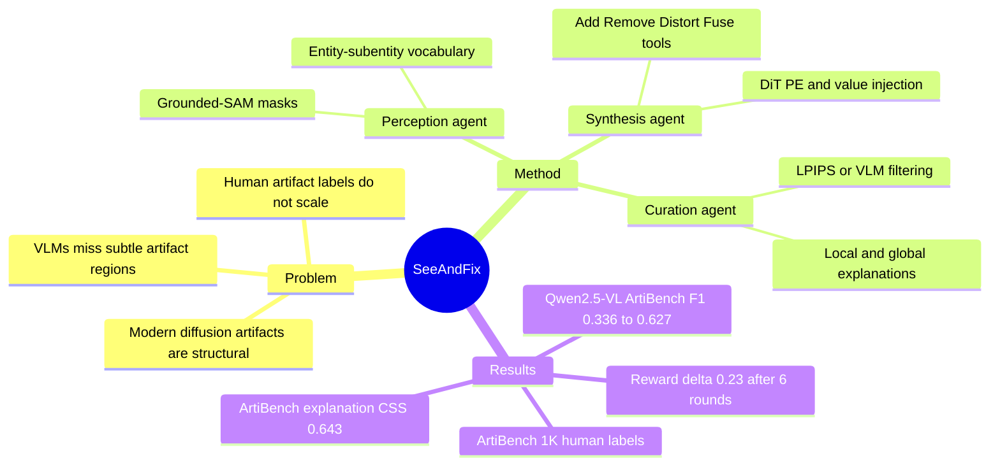

## Summary
ArtiAgent 把 visual artifact 理解问题转化为可扩展的 agentic data synthesis：从真实图像中识别 entity / subentity，用 DiT self-attention 的 patch-wise PE/value injection 合成 duplication、omission、distortion、fusion 四类结构性 artifact，再由 curation agent 过滤并生成局部/全局解释。作者用 50K clean-artifact pairs / 100K training samples 训练 VLM，并构建 1K human-labeled ArtiBench，证明 synthetic supervision 可以显著提升 artifact detection、localization、explanation，同时用于 reward-guided generation 和 VLM-guided correction。

## Problem & Motivation
现代 diffusion / multimodal generation 的 artifact 已经不只是早期 SD1.x 常见的 Gaussian noise 或 blur，而更多是看起来像真实图像但违反物理/结构常识的 failure：多手指、缺少身体部件、局部扭曲、实体融合。作者把这类问题定义为 **structural visual artifacts**：prompt 中的内容大体存在，但对象内部结构违反 commonsense plausibility；这与 text-to-image misalignment 区分开。

动机有两层。第一，现代模型仍会产生结构性 artifact：作者用 MS-COCO 的 100 个 caption 测了五个模型，artifact frequency 分别为 SD3.5-Large 36%、FLUX-schnell 28%、Qwen-Image 17%、FLUX-dev 12%、Nano-Banana 5%。第二，现有 artifact-aware 数据/方法依赖人工标注，PAL 有 10K pixel-level annotations，SynthScars 有 12K images，DiffDoctor 从 25K seed set 扩展；这类路线很难覆盖现代 diffusion artifact 的长尾。

关键观察是：out-of-the-box VLM 对这些 artifact 并不可靠。Table 3 中 GPT-4o / Gemini-2.5-Pro / GPT-5 在 ArtiBench binary detection 上只有 0.619/0.601、0.582/0.575、0.599/0.577 的 Acc/F1，localization F1 也只有 0.084、0.147、0.099。这说明 VLM 不能直接当作 artifact critic，需要专门的 supervision。

## Method
**ArtiAgent = perception agent + synthesis agent + curation agent。**

**Perception agent** 先用 out-of-box VLM 生成 entity-subentity vocabulary，把 subentity 分成 peripheral（如 finger、paw、wheel）和 intermediate/core（如 face、door、window）两层；再用 Grounded-SAM ground entity 和 subentity masks，并通过 overlap ratio 关联 parent entity 与 subentity。

**Synthesis agent** 有四个 tool，把 perception 的 grounding 转成 target-reference patch mapping：Add 复制 peripheral subentity，Remove 用邻域背景替换 subentity，Distort 对 intermediate subentity 做 shuffle / Gaussian jitter / strip shift，Fuse 在两个 overlap entity 的边界 band 中混合内容。核心不是 pixel-level copy-paste，而是 **inversion-injection**：先把图像 inversion 到 noisy latent，缓存 DiT self-attention 的 value embeddings；denoising 时对 target patch 注入 reference patch 的 positional embedding 和 cached value，让模型在目标位置“认为自己在 reference 位置去噪”，从而生成更自然的结构性 artifact。背景 patch 保持原始 positional information 和 value，以减少整体场景漂移。

实现细节上，作者在 FLUX.1-dev + FireFlow 上做 inversion-injection。为了避免 shortcut features，PE/value injection 限制在 early-to-middle layers，并在最后 denoising steps 关闭；补充材料中写明 value injection 只做前 15/25 denoising steps，且在 FLUX.1-dev 的 single stream blocks 20-38 中执行。distortion filtering 用 LPIPS，阈值为 τ1=0.5、τ2=0.9；duplication/omission/fusion filtering 用 VLM 对 original masked image、original crop、artifact crop 三元组作严格判断。

**Curation agent** 对每个 candidate region 生成 local explanation，再把所有 bbox + local explanations 汇总为 global explanation。训练数据来自 COCO、Caltech-101、11K Hands、Celeba HQ；作者收集 50K artifact-injected pairs，并由 paired clean/artifact image 生成 binary detection、localization、explanation 的 VQA supervision。

**ArtiBench** 是独立 human-labeled benchmark：1K images，来自 SD3.5、FLUX-schnell/dev、Qwen-Image、Nano-Banana，prompts 来自 MS-COCO、PartiPrompts、FuseCap；12 名 annotators 标注 binary artifact label、artifact bbox、short abnormality description，并保持 artifact-free / artifact-containing 平衡。

## Key Results
**Artifact understanding（Table 3，ArtiBench + RichHF / LOKI / SynthScars）**：
- ArtiBench binary detection：Qwen2.5-VL-7B 从 0.501/0.336 Acc/F1 提升到 **0.627/0.627**；InternVL3.5-8B 从 0.498/0.357 提升到 **0.630/0.620**，超过 GPT-5 的 0.599/0.577。
- ArtiBench localization：Qwen2.5-VL-7B + ArtiAgent 达到 **0.111 mIoU / 0.168 F1**，InternVL3.5-8B + ArtiAgent 达到 **0.119 / 0.176**；GPT-5 为 0.061 / 0.099，DiffDoctor 为 0.081 / 0.137，LEGION 为 0.062 / 0.099。
- ArtiBench explanation：Qwen2.5-VL-7B + ArtiAgent 达到 **0.233 ROUGE / 0.643 CSS**，InternVL3.5-8B + ArtiAgent 达到 **0.226 / 0.625**；GPT-5 为 0.145 / 0.434，Gemini-2.5-Pro 为 0.159 / 0.420。
- Cross-benchmark localization 也提升：Qwen2.5-VL-7B + ArtiAgent 在 RichHF / LOKI / SynthScars 上分别为 **0.119/0.198、0.129/0.198、0.137/0.214 mIoU/F1**，均高于 base Qwen2.5-VL-7B。

**Scaling & human supervision comparison**：
- Figure 6 报告 Qwen2.5-VL-7B 随 ArtiAgent data size 增大在 detection / localization / explanation 上整体上升；作者特别指出 localization 和 explanation 用 1K samples 已超过 GPT-5，binary detection 则持续受益到 100K scale。
- Table 4 中，1K ArtiAgent synthetic supervision 与 500 SynthScars + 500 clean samples 的 human-supervised setting 对比：binary detection 基本持平（0.555/0.550 vs. 0.555/0.548 Acc/F1），localization 较弱（0.074/0.121 vs. 0.094/0.147 mIoU/F1），explanation 更强（**0.222/0.606 vs. 0.156/0.521 ROUGE/CSS**）。

**Downstream diffusion mitigation**：
- Reward-guided generation：用 clean-artifact pairs 训练 CLIP + Bradley-Terry reward model，在 FLUX-schnell 上对 100 个 MS-COCO prompts 做 6 轮 test-time scaling，Δ Reward 从 0 增至 **0.23±0.08**。
- VLM-guided correction：Qwen2.5-VL-7B + ArtiAgent 先定位 artifact region，再由 FLUX inpainting 修复，并循环验证；论文只展示 Figure 8 的 qualitative examples，没有给出 quantitative correction score。

**Ablation（Table 5）**：
- Injection steps 的 ablation 显示 15/25 最好：5/25 为 0.513 Acc / 0.377 F1，10/25 为 0.583 / 0.565，**15/25 为 0.586 / 0.570**，20/25 降到 0.540 / 0.477。作者解释为 steps 太少会导致 artifact injection 失败，steps 太多会破坏整体 image quality。

## Strengths & Weaknesses
**已知的强点**：
1. 问题 formulation 清楚：把 artifact 从 generic image corruption 收窄到 structural visual artifacts，并和 prompt misalignment 区分开，这让 benchmark 和 synthesis target 更可控。
2. 方法不是简单 image editing，而是在 DiT inversion-restoration 中操纵 PE/value embeddings；ablation 表明 injection strength 存在可解释的 sweet spot。
3. Supervision 形式完整：binary label、bbox localization、local/global explanation 都覆盖，训练目标和 ArtiBench evaluation task 一致。
4. Baseline 覆盖较完整：PAL、DiffDoctor、LEGION、GPT-4o、Gemini-2.5-Pro、GPT-5，以及 Qwen2.5-VL / InternVL3.5 base 和 fine-tuned variants 都在同一表中比较。

**已知的局限 / failure cases**：
1. ArtiBench 上绝对性能仍不高：最佳 binary Acc 只有 0.630，说明即使 100K synthetic data 也没有把 artifact detection 变成可靠 solved problem。
2. Localization 是明显短板：1K setting 中 ArtiAgent synthetic data 的 ArtiBench localization 低于 SynthScars human supervision（0.074/0.121 vs. 0.094/0.147），作者将 gap 归因于 ArtiAgent labels 的 patch-level granularity。
3. Downstream correction 只给 qualitative result；没有报告修复成功率、artifact residual rate、inpainting side effects 或 human preference。
4. 训练数据生成虽然不需要人工标注，但 curation/filtering 依赖 GPT-4o 和 hand-designed artifact prompts；这不是纯 self-supervised 信号。

**推测 / 不知道**：
- 推测：这条路线对 VLM-as-verifier 很有价值，因为它把“模型能否看到局部结构不合理”拆成了 detection、grounding、explanation 三个可训练接口，比只做 real/fake classification 更可迁移。
- 不知道：论文声称 inversion-injection 可以用于任意 DiT model，但主要实现和数据收集基于 FLUX.1-dev + FireFlow；正文没有给出跨 DiT backbone 的定量泛化实验。
- 不知道：正文只写 “Code is available at link”，没有给出可解析的具体 code URL；数据集链接明确给了 ArtiBench 的 HuggingFace URL。

## Mind Map

## Notes
- 对 GUI / computer-use agent 的间接启发：很多 GUI benchmark 的失败也可能来自“看不出局部异常/不一致”，ArtiAgent 的 paired clean-corrupt supervision 形式可以作为 screen artifact / UI state inconsistency critic 的参考，但论文没有在 GUI 场景验证。
- 这篇的真正价值不是“修图”，而是给 VLM 增加一种视觉 commonsense debugging 能力：发现局部结构是否违反世界知识，并把它定位、解释、反馈给生成模型。
- 需要小心不要把 ArtiBench 分数解读成 artifact understanding 已解决；最佳 Acc/F1 仍在 0.63 左右，说明现代 artifact 的 subtlety 仍然是核心难点。
