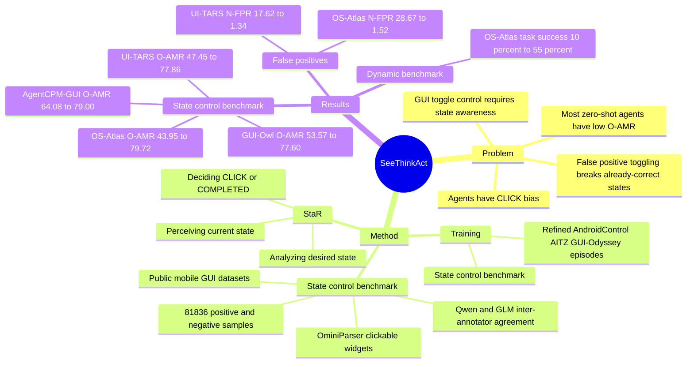

## Summary

这篇论文指出 GUI agents 在执行 toggle control instruction 时有系统性短板，尤其容易在目标状态已经满足时仍然点击，造成 false positive toggling。作者构建 state control benchmark，并提出 State-aware Reasoning (StaR)，通过训练让 agent 显式执行 perceive current state、analyze desired state、decide action 三步推理。

## Problem & Motivation

GUI 中的 toggle、switch、checkbox 是移动设备设置、汽车系统、smart home、工业控制等场景中的基础交互单元，本质上要求 agent 不只是“找到控件并点击”，还要判断当前状态是否已经满足用户意图。论文的核心观察是：现有 multimodal GUI agents 对这类二值状态控制并不可靠，典型错误包括当前状态不同却不点击的 false negative，以及当前状态已匹配仍重复点击的 false positive。

这个问题重要，因为 toggle 操作常出现在 Wi-Fi、Bluetooth、alarm、notification、privacy setting 等精确状态控制场景；一次多余点击就会把正确状态翻转成错误状态。作者认为简单 prompt agent 关注 toggle state，或引入额外 annotator agent 提供状态，都不能从根本上提升 action agent 的内在 state-aware reasoning：前者提升有限，后者还会引入协作复杂度和“若 annotator 已能可靠识别状态，为什么不用它直接做 action agent”的悖论。

## Method

论文先构建了一个 state control benchmark。数据来自 AMEX、RICOSCA、GUIAct-Mobile、AndroidWorld、AITW 和 OS-Atlas grounding dataset：先抽取与 toggle control instruction 相关的 screenshot 和原始 widget bounding box，再用 OminiParser 扩展 clickable widget；随后用 Qwen-2-VL-72B 与 GLM-4V/GLM-4V-Flash 作为独立 annotator 识别 toggle，并用 inter-annotator agreement 保留一致样本；最后继续标注 toggle state 与 functionality。这个流程得到 40,918 个 `screenshot, bbox, state, functionality` quadruplet，并扩展成 81,836 个正负样本，其中 73,652 个训练样本、8,184 个测试样本。作者人工核验 200 个样本，functionality 与 state annotation 分别有 92.5% 和 91% 与 ground truth 一致。

StaR 的方法本身很简洁：把 toggle instruction 的决策链显式拆成三步。

- **Perceiving**：从 screenshot 中识别目标 toggle 的当前状态 `sigma`。
- **Analyzing**：从用户 instruction 中推断 desired state `sigma_u`。
- **Deciding**：比较 `sigma` 与 `sigma_u`；若不同则输出 CLICK，若相同则输出 COMPLETED / finished。

作者没有只依赖 test-time prompting，而是在 state control benchmark 的训练 split 上进一步训练 OS-Atlas-7B、UI-TARS-7B、AgentCPM-GUI-8B 和 GUI-Owl-7B。为了不牺牲一般 agentic ability，他们还在 AndroidControl、AITZ、GUI-Odyssey 的训练数据中，将涉及 toggle control 的 episode 改写成 StaR-style reasoning，对非 toggle episode 保留原 reasoning；附录还说明，在非关键页面会插入类似 “Target toggle not found in this screen” 的阶段，使模型学会只在关键 toggle 步骤启用 StaR。训练使用 LLaMA-Factory，learning rate 为 `5e-6`，训练 3 epochs。

## Key Results

- **State control benchmark / zero-shot baseline**：GPT-5、GPT-4o、Gemini-2.5-Pro 的 O-AMR 分别为 37.05%、27.17%、30.25%，都低于 40%；开源 GUI agents 表现更好但仍不稳定，OS-Atlas-7B 为 43.95%，UI-TARS-7B 为 47.45%，GUI-Owl-7B 为 53.57%，AgentCPM-GUI-8B 为 64.08%，Qwen-2-VL-72B 为 66.42%。这些数字支持作者的核心诊断：多数现有 agent 在 toggle state control 上接近或低于可用水平。
- **StaR training / state control benchmark**：StaR 将 OS-Atlas-7B 的 O-AMR 从 43.95% 提升到 79.72%（+35.77），UI-TARS-7B 从 47.45% 到 77.86%（+30.41），AgentCPM-GUI-8B 从 64.08% 到 79.00%（+14.92），GUI-Owl-7B 从 53.57% 到 77.60%（+24.03）。负样本收益尤其明显：OS-Atlas-7B 的 N-AMR 从 35.80% 到 96.48%，N-FPR 从 28.67% 降到 1.52%；UI-TARS-7B 的 N-AMR 从 39.96% 到 96.53%，N-FPR 从 17.62% 降到 1.34%。
- **Prompting baseline 对比**：State-focused Prompt Engineering、StaR-style Prompting、Ground Truth Toggle State Prompting、Ground Truth Toggle State + StaR-style Prompting 都不能稳定追上 StaR training。以 OS-Atlas-7B 为例，StaR-style Prompting 的 O-AMR 只有 50.07%，Ground Truth Toggle State + StaR-style Prompting 为 51.78%，而 StaR training 达到 79.72%，说明论文的结果主要来自训练学到的状态推理与 grounding，而不是 prompt wording。
- **Ablation / OS-Atlas-7B**：完整 StaR 的 O-AMR 是 79.72%；去掉 Perceiving 后降为 73.39%，去掉 Analyzing 后为 73.94%。这说明 perceive current state 和 infer desired state 都有贡献，但即使去掉一个组件仍优于 vanilla 的 43.95%。
- **General agentic benchmarks**：在 AndroidControl-H、AndroidControl-L、AITZ、GUI-Odyssey 上，论文报告 StaR 对 UI-TARS-7B 能保持或提升 TMR、AMR、TSR、GMR；对更复杂的 GUI-Odyssey，文中称四个指标接近 10% 的整体提升，TSR 增益为 7.14% 到 20.17%。附录 Figure 7 报告 OS-Atlas-7B、AgentCPM-GUI-8B、GUI-Owl-7B 也总体保持或提升，但 AgentCPM-GUI-8B 在 AITZ 和 GUI-Odyssey 有 outlier degradation。
- **Dynamic evaluation benchmark**：作者在 AndroidStudio emulator + AndroidWorld framework 上构造 20 个真实 toggle control tasks。文本明确报告 OS-Atlas-7B 的 task success rate 从 10% 升到 55%；case study 中，未训练模型在 “turn wifi on” 且 Wi-Fi 已经打开时误判为 off，反复 toggle 进入循环，而 StaR-trained agent 正确识别为 on 并 finished。

## Strengths & Weaknesses

**已知亮点**：

- 问题 formulation 很具体：不是泛泛讨论 GUI reasoning，而是抓住 toggle state control 这个高频、低层、但非常容易被“点击偏置”破坏的交互单元。
- 方法简洁且可解释：StaR 的三步 reasoning 与人类执行 toggle control 的过程一致，适合作为 GUI agent training data 的可读中间格式。
- 论文不只报总体 accuracy，还拆解了 positive / negative sample、false negative / false positive，并显示主要收益来自降低 negative false positive toggling，这比单一 AMR 更有诊断价值。
- 实验覆盖多个已有 GUI agents，并比较了多种 prompting / ground-truth-state prompting baseline；这让“training is necessary”的 claim 比只对比 vanilla prompt 更有说服力。

**已知局限**：

- state control benchmark 的标注依赖 Qwen-2-VL-72B 与 GLM 系列 annotator 的一致性，虽然人工抽样质量达到 92.5% functionality / 91% state，但仍存在约 8%-9% 的标注噪声。
- benchmark 主要围绕 mobile GUI toggles；论文没有证明同样方法在 desktop app、web app、复杂 enterprise UI 或无障碍语义树可用的环境中仍然同等有效。
- dynamic evaluation benchmark 只有 20 个任务，覆盖 Wi-Fi、Bluetooth、alarm、YouTube caption、Chrome setting 等常见场景；这能说明可行性，但还不足以证明真实世界长尾 UI 的鲁棒性。
- general agentic benchmark 的主文 Figure 5 / Figure 7 主要是图形结果，缺少完整数值表；AgentCPM-GUI-8B 在 AITZ 和 GUI-Odyssey 的退化说明 StaR 训练仍可能引入 model-specific grounding drift。
- Ablation 主要在 OS-Atlas-7B 上做，尚不清楚三步组件对 UI-TARS、AgentCPM-GUI、GUI-Owl 是否有完全一致的边际贡献。

**推测**：

- StaR 的实际价值可能不只在 toggle，而在提醒 GUI agent 区分 “state-changing action” 与 “idempotent action”。许多 GUI 操作失败本质上不是找不到元素，而是没有判断当前 UI state 是否已经满足目标。
- 这类 training signal 可能与 GUI grounding 数据质量强相关；如果目标 toggle 很小、视觉状态不明显、主题样式变化大，Perceiving 仍可能成为瓶颈。

**不知道 / 不应推断**：

- 论文没有给出 DOI。
- 论文没有证明 StaR 可直接迁移到非 toggle 的多值状态控件，例如 dropdown、slider、multi-select 或权限弹窗。
- 论文没有报告真实用户设备上的长期在线评测，也没有报告训练数据规模变化、模型规模变化与收益之间的系统 scaling law。

**个人判断**：这篇对 GUI-agent research 很值得读，贡献不在复杂架构，而在把一个常被忽略的状态控制瓶颈形式化成 benchmark 和训练信号。评分给 4 而不是 5，是因为 benchmark 标注和 dynamic evaluation 规模仍有边界，且方法目前主要验证在 mobile toggle control 上。

## Mind Map

## Notes

- 可以和 [[2400-You Only Look at Screens- Multimodal Chain-of-Action Agents]]、[[2400-Android in the Zoo- Chain-of-Action-Thought for GUI Agents]]、[[2400-SeeclickHarnessingGuiGrounding]]、[[2606-AdapAction]] 放在一起看：这篇强调 state-aware reasoning，SeeClick 强调 grounding，CoAT 强调 action thought，AdapAction 则从安全角度说明 GUI action policy 的上下文一致性也可能被滥用。
- 一个后续问题：GUI agent benchmark 是否应该系统区分 reversible / irreversible、idempotent / non-idempotent、state-changing / navigation action？toggle 是最小例子，但这个 taxonomy 可能影响更广泛的 agent safety。
- 对 idea 的启发：可以把 StaR 扩展成 UI state verifier，在 action 前判断“当前状态是否已满足目标、动作是否会改变持久状态、改变是否可逆”，作为 agent policy 的轻量 safety layer。
