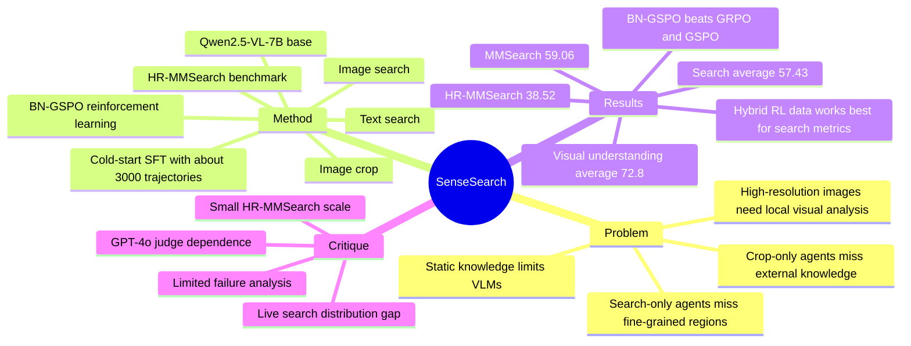

## Summary
SenseSearch 是一个基于 Qwen2.5-VL-7B-Instruct 的 agentic VLM，通过 cold-start SFT 和 BN-GSPO RL 学会在多轮推理中协调 text search、image search 和 image crop，用于高分辨率、知识密集、需要细粒度视觉定位的问题。论文同时提出 HR-MMSearch，并报告 SenseSearch-RL 在 search-oriented benchmark 平均 57.43、HR-MMSearch 38.52、visual understanding 平均 72.8。

## Problem & Motivation
VLM 的两个核心短板在这篇论文里被放到同一个 problem formulation 中：一是 static knowledge 导致知识密集和实时信息问题难以回答，二是对高分辨率图像中小目标、小文本或局部区域的 fine-grained analysis 不足。已有 search-based agentic VLM 主要使用 text search 和 image search，能够补外部知识，但对局部细节观察不够；已有 "Thinking with images" / crop-tool 类方法能做局部视觉分析，但缺少 open-web external knowledge。

作者要解决的问题不是单纯提高 VQA accuracy，而是让 VLM 在同一个 multi-turn reasoning loop 中判断何时搜索、何时反搜图片、何时裁剪局部，以及何时给出最终答案。这个设定对 GUI / web / computer-use agent 有间接价值：真实界面和网页任务常常也需要先定位局部视觉证据，再用外部知识或工具补全语义；但本文本身没有评测 GUI 操作或浏览器控制。

## Method
**Task formulation.** 输入是自然语言 query `q` 和初始图像 `I0`。每一轮模型观察完整历史 `Tt`，先生成 reasoning step，再从四类 action 中选择一个：text-based web search、reverse image search、image crop、final answer。工具返回的文本或图像会追加到历史中；若一轮缺少 reasoning 或合法 action，trajectory 被视为 invalid。训练和评测中单条 trajectory 最多允许 `T = 10` 轮，每轮最多 8,192 tokens，整条 trajectory 上限 32,768 tokens。

**Tool set.** text search 由 Serper Search API 支持，返回前五条结果经 Qwen3-32B 汇总后给 agent；image search 也是 Serper Image Search API，训练时为了降低 cost 和 latency，预先缓存每个 prompt 的 top-5 image titles 和 thumbnails；image crop 接收已见图像的 index 和归一化 bbox `[0.0, 1.0]`，返回局部裁剪图像用于细粒度视觉分析。

**Two-stage training.** 第一阶段是 cold-start SFT，只 fine-tune language model，冻结 vision encoder 和 multi-modal projector，使用 learning rate `1e-5` 训练 3 epochs。冷启动数据约 3,000 条，来源于 FVQA train、Pixel-Reasoner warm-start corpus 和 expert-annotated multimodal QA；作者先用 Qwen2.5-VL-7B-Instruct 对每个样本 rollout 8 次，把正确次数不超过 1 次的样本视为 hard QA，再用 Gemini-2.5-Flash 合成完整 tool-use trajectory，最后用 GPT-4o 检查 format compliance、logic coherence 和 answer plausibility。

**BN-GSPO RL.** 第二阶段用 RL 细化 tool invocation 和 reasoning policy。BN-GSPO 基于 GSPO 做 sequence-level optimization，先在同一 prompt 的 `G` 个 response 内做 group-level reward standardization，再在 optimizer minibatch 内对 advantage 做 batch normalization，以缓解不同 prompt、不同工具轨迹长度和 reward scale 带来的训练不稳定。reward 是 `Racc + Rformat`：accuracy reward 由 GPT-4o 作为 LLM-as-a-judge 判断答案与 ground truth 的语义一致性，format reward 检查 reasoning tags、JSON tool schema、非最终轮必须包含一个 tool call、最终轮必须包含 answer。

**HR-MMSearch.** 论文构造了 305 张 4K-resolution image，覆盖 8 个 domain，图像均来自 2025 年事件以降低预训练知识泄漏风险。每个问题都围绕一个关键视觉主体设计，通常是占图像面积小于 5% 的小物体或文字，并要求结合视觉定位与外部搜索知识。

## Key Results
- **Search-oriented benchmarks.** 在 MMSearch、HR-MMSearch、FVQA-test、InfoSeek、SimpleVQA、LiveVQA、MAT-Search 七个 benchmark 的平均分上，SenseSearch-RL 为 57.43，高于 MMSearch-R1 的 52.49、SenseSearch-SFT 的 53.06 和 Visual-ARFT 的 40.13；但低于 zero-shot agentic GPT-4o 的 60.93，略低于 Gemini-2.5-Flash 的 58.05。HR-MMSearch 上，SenseSearch-RL 得到 38.52，MMSearch-R1 为 20.33，GPT-4o zero-shot agentic 为 35.08，Gemini-2.5-Flash 为 40.00；abstract 中概括为相对 baseline 提升 19.18%。
- **单项 search results.** SenseSearch-RL 在 MMSearch 上为 59.06，高于 MMSearch-R1 的 53.80；FVQA-test 为 61.17，高于 MMSearch-R1 的 58.40；InfoSeek 为 55.23，基本持平 MMSearch-R1 的 55.10；SimpleVQA 为 61.20，高于 57.40；LiveVQA 为 48.47，基本持平 48.40；MAT-Search 为 78.33，高于 74.00。
- **Fine-grained visual understanding.** 在 V* Bench、HR-Bench 4K、HR-Bench 8K、MME RealWorld 的平均分上，SenseSearch-RL 为 72.8，高于 DeepEyes 的 72.5、Pixel-Reasoner 的 71.9、GPT-4o 的 71.5 和 Qwen2.5-VL-7B 的 64.9。分项看，SenseSearch-RL 在 HR-Bench 4K/8K 分别为 73.6/69.8，是表中最高；但 V* Bench 的 83.8 低于 Pixel-Reasoner 的 84.3，MME RealWorld 的 63.9 低于 Pixel-Reasoner 的 64.4 和 DeepEyes 的 64.1。
- **BN-GSPO ablation.** 在不使用 cold-start、直接从 Qwen2.5-VL-7B-Instruct 做 pure RL 的对照中，BN-GSPO 在 MMSearch / V* Bench / HR-Bench 4K 上为 56.72 / 79.05 / 69.12，高于 GRPO 的 50.88 / 67.54 / 61.38，也显著高于 GSPO 的 53.80 / 53.93 / 44.50，支持作者关于 batch normalization 能稳定 multi-tool RL 的 claim。
- **RL data distribution ablation.** SenseSearch-SFT 在 MMSearch / HR-MMSearch / V* Bench 上为 53.80 / 29.80 / 82.20；只用 search data 做 RL 得到 54.97 / 36.80 / 82.72；只用 perception data 得到 54.09 / 33.11 / 85.24；混合 search + perception data 后得到 59.06 / 38.52 / 83.84。已知结论是 hybrid RL data 对 search-oriented metrics 最好，而 perception-only 会让 V* Bench 更高但 search-oriented task 受损。
- **Tool-use behavior.** 论文报告 base Qwen2.5-VL-7B 极度偏向 text search，几乎忽略 image crop；SenseSearch 在 V* Bench 几乎只用 image crop，在 MMSearch 主要使用 search tools，在 HR-MMSearch 采用 mixed tool strategy。RL 过程中平均 tool calls 从约 4 次下降到约 2 次，作者据此认为 RL 同时提升了能力和操作效率。

## Strengths & Weaknesses
**已知 strengths.**

1. 方法把 external knowledge retrieval 和 high-resolution local visual analysis 放进同一 agent loop，比只做 RAG/search 或只做 crop-tool RL 更贴近复杂视觉问答的实际需求。
2. 训练 recipe 的 ablation 比较清楚：cold-start 负责建立基础 tool-use format，BN-GSPO 负责在 heterogeneous multi-tool trajectory 上稳定 RL，hybrid RL data 避免 search / perception 单侧过拟合。
3. HR-MMSearch 的设计明确针对高分辨率小目标和知识密集问题，305 张 4K 图像来自 2025 年事件，这比普通 holistic image QA 更能暴露 static knowledge 和 fine-grained perception 的共同短板。

**已知 weaknesses / limitations.**

1. HR-MMSearch 只有 305 张图像，虽然 domain 多样且手工构造问题，但规模仍小；论文主文没有报告标注一致性、人类上限或更细粒度的难度分层。
2. Agentic search 的主要 metric 是 GPT-4o judge 的 Pass@1，训练 reward 中的 answer reward 也使用 GPT-4o judge；因此结果依赖 judge model、prompt 和 ground-truth 表达方式。论文说明 evaluation prompt 在 Appendix，但主文没有展开 judge sensitivity。
3. 对比 closed-source model 时，GPT-4o / Gemini-2.5-Flash 是 zero-shot agentic workflow，而 SenseSearch 是针对 tool-use RL 训练的 7B 模型；这能说明小模型经训练后竞争力很强，但不能直接说明 backbone reasoning 能力更强。
4. 论文没有给出明确 failure case taxonomy。已知 base model 的 failure mode 是过度依赖 text search、忽略 image crop；但 SenseSearch 自身在哪些题型失败、失败来自 search API、crop bbox、reasoning 还是 judge mismatch，主文没有系统展开。
5. image search 在 RL training 中预取并缓存 top-5 titles/thumbnails 以降低 cost 和 latency；这对训练可行性很重要，但也意味着训练环境与 live web search 的时变性之间仍有 gap。

**推测.** SenseSearch 的 active perception + external retrieval pattern 对 GUI agent 可能有启发：很多 GUI 任务也需要先 crop/zoom 局部 UI，再结合文档、网页或工具查询完成决策。但这个迁移需要重新定义 action space、environment feedback 和 reward，本文没有验证。

**不知道.** 论文正文未给出 arXiv id、DOI、完整 latency/cost 分析、HR-MMSearch 的 public/private split 细节、以及失败样例分布；这些信息不能从当前论文内容中确认。

## Mind Map

## Notes
- **我的判断**：rating=4。它不是 GUI agent paper，但对 VLM + agentic-RL + tool-use 的相关性很高，尤其是把 search 和 crop 统一到同一个 RL-trained reasoning loop 中。
- **对研究的启发**：可把它视为 "tool-use RL for active visual information gathering" 的一个强 baseline。若迁移到 GUI agent，关键问题不是简单添加 crop tool，而是让 agent 学会在 screenshot 局部证据、DOM/API/文档检索、历史状态之间做 routing。
- **需要后续关注**：HR-MMSearch 是否公开、benchmark 是否会快速被 contamination 影响、BN-GSPO 在更复杂工具集合上的稳定性、以及 GPT-4o judge 替换为 deterministic verifier 或 human evaluation 后结论是否保持。
