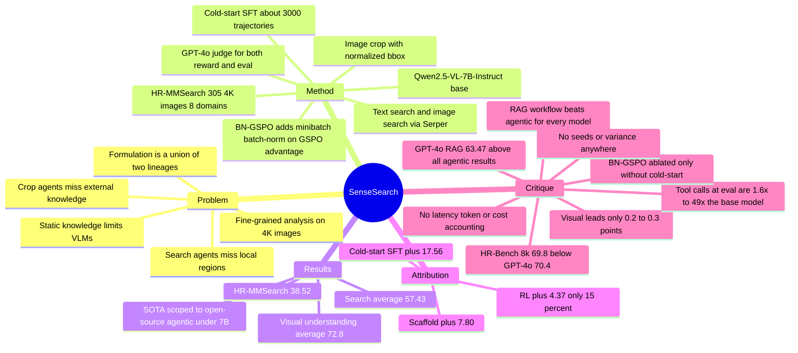

## Summary
SenseSearch 把 text search、reverse image search、image crop 三个工具放进同一个 multi-turn reasoning loop，用约 3,000 条 cold-start SFT 加 BN-GSPO RL 训练 Qwen2.5-VL-7B-Instruct，并配套构造 305 张 4K 图像的 HR-MMSearch benchmark。SenseSearch-RL 在七个 search-oriented benchmark 上平均 57.43（MMSearch-R1 52.49、自身 SFT 53.06），HR-MMSearch 38.52，fine-grained visual understanding 四项平均 72.8。但同一张 Table 1 显示，training-free 的 RAG workflow 对表中每一个模型都优于 agentic workflow，GPT-4o 的 RAG 63.47 高于本文所有 agentic 结果——论文正文的 SOTA 断言实际被限定在 "open-source agentic models under 7B parameters"。

## Problem & Motivation
论文把 VLM 的两个短板放进同一个 problem formulation：一是 static knowledge 让知识密集与实时问题无法回答，二是对高分辨率图像中小目标、小文本的 fine-grained analysis 不足。已有 search-based agentic VLM（MMSearch-R1、WebWatcher）只有 text/image search，能补外部知识但看不清局部；已有 "thinking with images" 路线（SEAL/v\*、Pixel-Reasoner、DeepEyes、Mini-o3）能 crop-and-zoom 做局部视觉分析，但缺 open-web 外部知识。作者的定位是把两条线合并，让同一个 policy 学会何时搜、何时反搜图、何时裁剪、何时作答。

需要说清楚的是，这个 problem formulation 本身不新——它是两条既有 lineage 的并集。真正可能新的只有两点：把三工具统一进一个 end-to-end RL 训练的 policy，以及 BN-GSPO 这个 GSPO 的 advantage 归一化改动。对 GUI / computer-use 方向而言本文只有间接价值：action space 是 search API 调用与 bbox 裁剪，不涉及浏览器或 OS 状态转移，论文也未评测任何 GUI 任务。

## Method
**Task formulation.** 输入自然语言 query `q` 与初始图像 `I0`。每一轮模型先生成 reasoning step，再从四类 action 中选一个：text search、reverse image search、image crop、final answer。工具返回的文本或图像追加进历史 `T_t`；若某轮缺 reasoning 或缺合法 action，整条 trajectory 判为 invalid。RL 阶段单条 trajectory 最多 `T = 10` 轮，每轮 8,192 tokens，累计上限 32,768 tokens。

**Tool set.** text search 走 Serper Search API，top-5 结果先由 Qwen3-32B 汇总再返回 agent（为控 context 长度）；image search 走 Serper Image Search API，训练时把全部 prompt 的 top-5 image titles 与 thumbnails 预取并缓存，作者明说这是为了 "minimize financial cost and reduce latency during RL training"；image crop 接收目标图像 index 与归一化 bbox `[0.0, 1.0]`，返回裁剪图。

**Stage 1 — cold-start SFT.** 只 fine-tune language model，冻结 vision encoder 与 multi-modal projector，lr `1e-5`，3 epochs，LLaMA-Factory 实现。数据管线三步：先合并 FVQA train set、Pixel-Reasoner warm-start corpus 与 expert-annotated multimodal QA 构成 data pool；用 Qwen2.5-VL-7B-Instruct 对每条 rollout 8 次，答对次数 ≤1 的判为 hard；再用 Gemini-2.5-Flash 合成完整 tool-use trajectory，最后由 GPT-4o 检查 format compliance / logical coherence / answer plausibility，保留约 3,000 条。

**Stage 2 — BN-GSPO RL.** veRL 实现，global batch 128，lr `1e-6`，KL 系数 β `1e-4`，采用 DAPO 的 Clip-Higher（ε_low 0.2 / ε_high 0.28）。BN-GSPO 在 GSPO 的 sequence-level 目标上加了两级归一化：先在同 prompt 的 `G` 个 response 内做 group standardization 得 `Ā`，再在 optimizer minibatch 内对 `Ā` 做 batch normalization 得 `Ã`，动机是多工具轨迹长度与 reward scale 在不同 prompt 间差异大、直接优化不稳。reward `R(τ) = R_acc(τ) + R_format(τ)`，两项都是二值，`R_acc = 1.0`、`R_format = 0.5`，均由 GPT-4o 作 LLM-as-a-Judge 判定；format 要求非最终轮恰含一个 tool call、最终轮含 answer、内容包在指定 tag 与 JSON schema 内。RL 数据为 FVQA-train 加 VisualProbe-train 与 DeepEyes-4K-train（后者在文中引到 [21] Mini-o3）。

**HR-MMSearch.** 305 张 4K 分辨率图像，覆盖 8 个 domain（Sports 21.6%、Leisure & Culture 16.7%、Science & Technology 16.1%、Business & Finance 10.8%、Games 10.5%、Geography & Travel 10.5%、Academic Research 9.5%、Others 6.6%），全部取自 2025 年事件以降低预训练泄漏。问题围绕一个关键视觉主体人工撰写，作者举例说该主体常"占图像面积不足 5%"（这是举例措辞，不是对每一条的硬性构造约束）。

## Key Results
**Search-oriented（Table 1，七个 benchmark 加 Average）。** SenseSearch-RL 平均 57.43，分项 MMSearch 59.06 / HR-MMSearch 38.52 / FVQA-test 61.17 / InfoSeek 55.23 / SimpleVQA 61.20 / LiveVQA 48.47 / MAT-Search 78.33。对照：MMSearch-R1 平均 52.49（HR-MMSearch 20.33），SenseSearch-SFT 53.06（29.80），Visual-ARFT 40.13。

**同一张表里更重要的三条对照，原笔记漏掉。**

1. **Training-free 的 RAG Workflow 全面优于 agentic workflow。** 表中每一个模型都如此：GPT-4o 63.47（agentic 60.93）、Gemini-2.5-Flash 62.29（58.05）、GPT-4o-mini 58.36（45.65）、Qwen2.5-VL-32B 58.09（53.45）、Qwen2.5-VL-7B 50.04（35.50）。SenseSearch-RL 的 57.43 低于其中四个 RAG 结果，只高于同 backbone 的 Qwen2.5-VL-7B RAG（+7.39）。论文正文没有讨论这个现象。
2. **未训练但同工具集的 scaffold baseline 是存在的**（这是 RL/SFT 归因的关键对照）：Qwen2.5-VL-7B-Instruct 在 Agentic Model (zero-shot) 下平均 35.50，Direct Answer 27.70。据此可分解全部增益：工具 scaffold 本身 27.70→35.50（+7.80，占 26%），cold-start SFT 35.50→53.06（+17.56，占 59%），RL 53.06→57.43（+4.37，占 15%）。**RL 只贡献了总增益的约七分之一，SFT 才是主力。**
3. **SOTA 措辞在文内不一致。** §4.2 明确限定为 "a new SOTA among open-source agentic models under 7B parameters, surpassing MMSearch-R1 by an average of 4.94 points"，并承认 "performs on par with Gemini-2.5-Flash and GPT-4o"（后两者 agentic 平均 58.05 / 60.93，均高于 57.43）。但 abstract 写 "achieves state-of-the-art performance on open-source search and fine-grained image understanding benchmarks"，intro 写 "attains a leading score of 59.06 in MMSearch"——后者不加限定，而 Table 1 里 GPT-4o agentic 61.40、GPT-4o RAG 64.33、Gemini RAG 64.91 都更高，Gemini agentic 恰好也是 59.06。

**Abstract 的 "19.18%" 无对照对象。** 论文从未说明这个数字相对谁。算术上 38.52 − 19.34 = 19.18 恰好对应未训练的 Qwen2.5-VL-7B agentic zero-shot；相对真正的 method baseline MMSearch-R1（20.33）只有 18.19。

**Fine-grained visual understanding（Table 2）。** SenseSearch-RL 7B：V\* Bench 83.8 / HR-Bench 4k 73.6 / HR-Bench 8k 69.8 / MME-RealWorld 63.9 / Avg 72.8。领先幅度极薄：Avg 只高出 DeepEyes（72.5）0.3，HR-Bench 4k 只高出 GPT-4o（73.4）0.2。且分项并非全胜：V\* Bench 83.8 低于 Pixel-Reasoner 84.3；MME-RealWorld 63.9 低于 Pixel-Reasoner 64.4 与 DeepEyes 64.1；**HR-Bench 8k 的 69.8 低于 GPT-4o 的 70.4**，只在 "Agentic Model" 分块内最高（原笔记称其"是表中最高"，与原文冲突，此处更正）。

**BN-GSPO ablation（Table 3）。** MMSearch / V\* Bench / HR-Bench 4K 上，BN-GSPO 56.72 / 79.05 / 69.12，GRPO 50.88 / 67.54 / 61.38，GSPO 53.80 / 53.93 / 44.50。但这组对照是 **pure RL、无 cold-start** 的设定（原文明说 "To isolate the influence of SFT, this comparison uses a pure RL setup ... without a cold-start"）。因此论文并未在最终 recipe（cold-start + RL）下验证过 BN-GSPO 优于 GRPO/GSPO。另外 GSPO 在 V\* Bench 53.93、HR-Bench 4K 44.50，远低于未训练 base model 的 75.3 / 65.5，这更像训练崩溃而非调优后的公平对照，全文无 seed、方差或重复实验。

**RL 数据配比（Table 4，MMSearch / HR-MMSearch / V\* Bench）。** SFT 53.80 / 29.80 / 82.20；仅 search 数据 54.97 / 36.80 / 82.72；仅 perception 数据 54.09 / 33.11 / **85.24**；两者混合 59.06 / 38.52 / 83.84。混合对 search 指标最好，但 V\* Bench 的最高分反而属于 perception-only，说明混合是在两类能力间做权衡而非纯增益。

**工具调用行为（Fig. 4）。** base Qwen2.5-VL-7B 极度偏向 text search（总体 96.2%），几乎不用 crop；SenseSearch 在 V\* Bench 几乎只用 crop、在 MMSearch 只用 search、在 HR-MMSearch 混合。**但推理开销是上升的**：评测期总 tool call 数 SenseSearch vs base 为 MMSearch 535 vs 327、HR-MMSearch 910 vs 562、V\* Bench 341 vs 7（约 1.6× / 1.6× / 49×）。正文那句 "average number of tool calls decreases from ~4 to ~2" 是沿 **RL training step**（Fig. 4 右下，横轴 Step 0-80）测的，既不是相对 base model、也不是在评测集上，不能用来支持"推理更高效"。

## Evidence Ledger

| Claim ID | Claim | Type | Source locator | Evidence excerpt | Status |
|:--|:--|:--|:--|:--|:--|
| C1 | SenseSearch-RL search-oriented 平均 57.43，分项 59.06 / 38.52 / 61.17 / 55.23 / 61.20 / 48.47 / 78.33 | number | p.7 Table 1, Agentic Model 末行 | "SenseSearch-RL 57.43 59.06 38.52 61.17 55.23 61.20 48.47 78.33" | source-verified |
| C2 | HR-MMSearch：SenseSearch-RL 38.52，MMSearch-R1 20.33，SenseSearch-SFT 29.80 | number | p.7 Table 1 | "MMSearch-R1 [42] 52.49 53.80 20.33"；"SenseSearch-SFT 53.06 53.80 29.80" | source-verified |
| C3 | 视觉理解四项平均 72.8，仅高于 DeepEyes 72.5 共 0.3 分 | number | p.8 Table 2 | "SenseSearch-RL 7B 83.8 73.6 69.8 63.9 72.8"；"DeepEyes [52] 7B 83.3 73.2 69.5 64.1 72.5" | source-verified |
| C4 | Table 1 的 RAG Workflow 块中 GPT-4o 63.47、Gemini-2.5-Flash 62.29、GPT-4o-mini 58.36、Qwen2.5-VL-32B 58.09 均高于 57.43 | comparison | p.7 Table 1, RAG Workflow 块 | "GPT-4o [15] 63.47 64.33 41.97 69.28 61.45 67.32 57.27 82.67" | source-verified |
| C5 | 存在未训练但同工具集的 scaffold baseline：Qwen2.5-VL-7B agentic zero-shot 35.50，Direct Answer 27.70，RAG 50.04 | benchmark-setting | p.7 Table 1, 三个块 | "Agentic Model (zero-shot) Qwen2.5-VL-7B-Instruct [1] 35.50 32.16 19.34 36.00" | source-verified |
| C6 | §4.2 的 SOTA 断言限定为 open-source agentic <7B，且承认与 Gemini-2.5-Flash / GPT-4o "on par"；abstract 与 intro 的同类断言不加限定 | sota-novelty | p.7 col.2 §4.2；p.1 Abstract；p.2 Intro | "establishes a new SOTA among open-source agentic models under 7B parameters, surpassing MMSearch-R1 by an average of 4.94 points" | source-verified |
| C7 | 旧笔记称 HR-Bench 4K/8K "是表中最高"——8K 一项与原文冲突 | comparison | p.8 Table 2, Direct Answer 块 | "GPT-4o [15] - 81.2 73.4 70.4 61.0 71.5" | contradicted（GPT-4o 8k=70.4 > 69.8；69.8 仅在 Agentic Model 块内最高） |
| C8 | abstract 的 "19.18%" 未在文中指明对照对象；算术上等于 38.52−19.34（未训练 base agentic），而非 38.52−20.33=18.19 | number | p.1 Abstract；p.7 Table 1 | "outperforming baselines by 19.18% on HR-MMSearch" | source-verified（数值与"未指明"均经核；具体归属为算术推断） |
| C9 | Table 3 数值与其 "无 cold-start 的 pure RL" 设定 | number | p.8 Table 3；p.8 col.1 §4.3 | "this comparison uses a pure RL setup where all models are initialized from Qwen2.5-VL-7B-Instruct [1] without a cold-start" | source-verified |
| C10 | 全文不存在完整 recipe（cold-start+RL）下的 BN-GSPO vs GRPO/GSPO 对照；全文无 seed / 方差 / error bar / 重复实验 | causal-mechanism | 全文检索；p.8 Table 3 | "To isolate the influence of SFT, this comparison uses a pure RL setup" | source-verified（缺失性核查） |
| C11 | Table 4 四行数值；perception-only 的 V\* Bench 85.24 为该表最高 | number | p.8 Table 4；p.8 col.2 | "This boosts V\* Bench performance to 85.24" | source-verified |
| C12 | HR-MMSearch 为 305 张 4K 图、8 domain、2025 年来源；**未报告题目总数、标注一致性、人类上限** | benchmark-setting | p.6 col.1 §3.4；Fig. 1(b) | "This dataset consists of 305 4K-resolution images curated from 8 diverse, high-impact domains" | source-verified（含缺失性核查） |
| C13 | 评测期 tool call 总数 SenseSearch vs base：MMSearch 535 vs 327，HR-MMSearch 910 vs 562，V\* Bench 341 vs 7 | number | p.8 Fig. 4 bottom-left | "Bottom Left: The tool use number in different benchmarks." | source-verified |
| C14 | "tool calls 从 ~4 降到 ~2" 是沿 RL training step 测的，非相对 base model、非评测集指标 | causal-mechanism | p.8 Fig. 4 bottom-right（横轴 Step 0-80）；p.8 col.2 | "the average number of tool calls decreases steadily from ~4 to ~2" | source-verified（据此下调旧笔记的"操作效率提升"表述） |
| C15 | 论文未报告推理 wall-clock latency、inference token 数、金额成本或 GPU 小时，也未声明给 baseline 匹配算力/工具预算；唯一成本相关叙述在训练侧（image search 预取缓存、Qwen3-32B 摘要压缩 context） | number | p.6-p.7 §4.1 Baselines；p.6 col.2 | "To minimize financial cost and reduce latency during RL training, the top five image search titles and thumbnails ... are pre-fetched and cached" | source-verified（缺失性核查；但 Fig. 4 的 tool-call 计数构成部分开销披露） |
| C16 | crop-and-zoom lineage 被引用且部分进表：SEAL/v\*、Pixel-Reasoner、DeepEyes 进 Table 2；Mini-o3、OpenAI-o3 仅被引不作 baseline；Chain-of-Focus 与 ZoomEye 全文（含参考文献）不出现 | sota-novelty | p.3 §2.2；p.8 Table 2；参考文献 [21][30][35][43][52] | "SEAL [43] 7B 74.8"；"Similarly, Mini-o3 [21] observes that pure RL cannot generate the deep trajectories" | source-verified |
| C17 | 训练配置：Qwen2.5-VL-7B-Instruct；SFT 冻结 vision encoder 与 projector、lr 1e-5、3 epochs；RL batch 128、lr 1e-6、β 1e-4、DAPO ε 0.2/0.28；T=10、8,192 tokens/轮、32,768 累计；LLaMA-Factory + veRL | number | p.6 col.1 §4.1 | "we use a global batch size of 128, a learning rate of 1 × 10−6, and a KL coefficient β of 1 × 10−4" | source-verified |
| C18 | reward = R_acc + R_format，二值（1.0 / 0.5 / 0.0），均由 GPT-4o judge；评测主指标 Pass@1 由 GPT-4o judge，视觉理解用 Avg@8 EM（V\*/HR-Bench）与 Pass@1 EM（MME-RealWorld） | benchmark-setting | p.5 col.2；p.6 col.1；p.7 col.1 | "Each component is a binary score determined by GPT-4o acting as the LLM-as-a-Judge" | source-verified |
| C19 | cold-start 约 3,000 条（FVQA train + Pixel-Reasoner warm-start + expert-annotated QA，8 rollouts 且答对 ≤1 判 hard，Gemini-2.5-Flash 合成、GPT-4o 校验）；RL 数据为 FVQA-train + VisualProbe-train + **DeepEyes-4K-train**（引到 [21] Mini-o3） | number | p.5 col.2 §3.3 | "For RL, we use FVQA-train [42] together with VisualProbe-train and DeepEyes-4K-train [21]" | source-verified |
| C20 | 本文与 arXiv:2512.24330 "SenseNova-MARS" 为同一工作线（作者一致且多 Dahua Lin，同 BN-GSPO / HR-MMSearch / 同一 repo）；但该 preprint v2 报告 32B 模型与不同数值 | license-code | CVPR PDF 本身不含 arXiv id/DOI；对照来自 arXiv API | "All code and data are released at https://github.com/OpenSenseNova/SenseNova-MARS." | not-checkable（本文未自述 arXiv 身份，同一性为外部比对推断） |
| C21 | 无法把 Table 2 的 0.2-0.3 分领先换算成题目数——论文未报告 V\* Bench / HR-Bench / MME-RealWorld 的题量；HR-MMSearch 只给图像数 305，未给题数 | benchmark-setting | p.6-p.7 §3.4、§4.1 | "For each image, we manually craft knowledge-intensive, search-oriented questions"（无计数） | not-checkable |

## Strengths & Weaknesses
**已知 strengths.**

1. 三工具统一进一个 end-to-end RL 训练的 policy，确实是把 search-agent 与 crop-tool 两条 lineage 首次合到同一个 policy 里；并且论文没有回避最近的竞争者——SEAL/v\*、Pixel-Reasoner、DeepEyes 都进了 Table 2，Mini-o3 与 OpenAI-o3 在 related work 里被正面讨论。这一点上"相关工作避重就轻"的质疑不成立。
2. Ablation 的对照设计比同类论文诚实：Table 1 同时给出 Direct Answer、RAG Workflow、Agentic zero-shot 与 SenseSearch-SFT 四条线，让读者可以自己做 scaffold / SFT / RL 的增益分解——尽管作者自己没做这个分解，做出来对论文并不有利（RL 只占 15%）。
3. HR-MMSearch 的构造动机清楚：4K 图、2025 年来源、围绕小面积视觉主体设计问题，把 static knowledge 与 fine-grained perception 两个短板压在同一条题目上，这是现有 benchmark 没有的组合。代码与数据声明全部开源。
4. BN-GSPO 是一个简洁的改动（在 GSPO 的 group-normalized advantage 之上再加 minibatch batch-norm），符合 simple 的审美，动机（跨 prompt 的轨迹长度与 reward scale 差异）也说得通。

**已知 weaknesses.**

1. **增益归因不利于 RL。** 按 Table 1 的搜索平均分，工具 scaffold 本身贡献 +7.80，cold-start SFT 贡献 +17.56，RL 只贡献 +4.37。论文标题与 abstract 都把 RL 放在中心位置，但数据显示主要功劳在 SFT 数据管线。
2. **一个更强、更便宜的对照被摆在表里却未被讨论：RAG Workflow 对表中每一个模型都优于 agentic workflow。** 训练无关的 GPT-4o RAG 拿到 63.47，高于本文全部 agentic 结果。至少在这套 benchmark 上，"让模型自己决定何时用工具"相对"直接把 image search 结果喂进去"是负收益。这动摇了 agentic 范式在此任务上的必要性，而论文一句未提。
3. **视觉理解的领先在噪声量级。** Avg 领先 0.3、HR-Bench 4k 领先 0.2，且 V\* Bench 与 MME-RealWorld 两项落后于 Pixel-Reasoner / DeepEyes，HR-Bench 8k 落后于 GPT-4o。论文未报告各 benchmark 题量，Avg@8 也未给方差，因此这些领先无法与随机波动区分。旧版笔记把 HR-Bench 说成"表中最高"正是这种薄领先容易被读错的后果。
4. **推理成本无核算，且实际是上升的。** 全文没有 latency、inference token、金额或 GPU-hour，baseline 也没有匹配算力或工具调用预算。Fig. 4 显示评测期 SenseSearch 的 tool call 总数比 base model 高 1.6×（MMSearch/HR-MMSearch）到 49×（V\* Bench）。把 "~4→2" 那句读成推理更高效是误读——那是训练曲线。因此"多次前向换来的准确率"这一质疑在本文未被排除。
5. **BN-GSPO 的证据只在无 cold-start 的设定下成立。** 最终 recipe 里没有换 GRPO/GSPO 的对照，所以"BN-GSPO 提供了关键的 refinement"这句话没有直接实验支撑。而且 Table 3 里 GSPO 把 V\* Bench 打到 53.93（低于未训练 base 的 75.3），更像单次崩溃；无 seed、无方差，无法排除这是运气。
6. **评测与 reward 共用 GPT-4o judge。** 训练的 accuracy reward 与评测的 Pass@1 都由 GPT-4o 判定，存在同源偏置；judge sensitivity 分析在正文缺席（作者称细节在 Appendix，而 CVF 的 10 页版本不含 Appendix）。
7. **HR-MMSearch 的规格不完整。** 只给了 305 张图，没给题目总数、标注一致性、人类上限、难度分层，也没有 public/private split 说明。这使得 38.52 vs 20.33 这样的差距无法换算成"多少道题"。
8. **训练环境与真实 web 有分布差**：RL 期间 image search 结果被预取缓存，评测时是否走 live API 未说明；对一个以"实时信息"为卖点的系统，这个 gap 值得写清楚。

**推测（未经验证）。** active perception + external retrieval 的 routing 结构对 GUI agent 可能有迁移价值——GUI 任务同样需要先定位局部 UI 证据再查文档/接口。但 action space、environment feedback 与 reward 都要重定义，本文没有任何 GUI 实验支持这个迁移。

**不知道。** Appendix 内容（完整超参、reward 协议细节、evaluation prompt）；HR-MMSearch 的题量与发布形式；failure case 分布；评测时 search API 是否 live。

## Mind Map

## Notes
- **本笔记于 2026-09-07 依 CVF PDF 全文重做**，替换 2026-06-26 venue-backfill 批量 pass 的版本。相对旧版的实质更正：(1) 旧版称 HR-Bench 4K/8K "是表中最高"，8K 一项与 Table 2 冲突（GPT-4o 70.4 > 69.8），已改；(2) 旧版把 "tool calls 4→2" 读作推理效率提升，实为训练曲线，评测期调用数反而高于 base model，已改；(3) 补入 Table 1 的 RAG Workflow 块与 agentic zero-shot 行——前者说明训练无关的 RAG 对每个模型都更强，后者是做 SFT/RL 归因所必需的 scaffold baseline；(4) 补 Evidence Ledger、`content_scope`、`verification_status`。
- **rating 由 4 下调为 3。** 理由：problem formulation 是两条既有 lineage 的并集，算法贡献只有 BN-GSPO 且其证据仅在无 cold-start 的设定下成立；正文级 SOTA 限定在 "open-source agentic <7B"，视觉理解领先 0.2-0.3 分且分项互有胜负；论文自己的 Table 1 显示 training-free RAG 更强。真正沉淀下来的资产是 HR-MMSearch 与开源代码，属"有参考价值"而非"重要"。
- **tag 更正**：旧版标 `web-agent`，违反 `references/tags.md` 的规定（该 tag 仅用于会观察并改变网页/浏览器状态的 agent，纯开放网络检索应用 `deep-research`）。SenseSearch 只调用 Serper API，无浏览器状态转移，故改为 `deep-research`。
- **preprint 关系**：arXiv:2512.24330 "SenseNova-MARS: Empowering Multimodal Agentic Reasoning and Search via Reinforcement Learning"（v1 2025-12-30，v2 2026-01-25）作者与本文一致（另含 Dahua Lin），同样提出 BN-GSPO 与 HR-MMSearch，指向同一 repo，应视为同一工作线的 preprint。**但 v2 的实验换成了 SenseNova-MARS-32B（MMSearch 74.3、HR-MMSearch 54.4，并宣称超过 Gemini-3-Pro 与 GPT-5.2），与本文 7B 的数字不可混用。** frontmatter 的 `arxiv_id` 因此留空：填入会让 `fetch_bibtex.py` 把标题为 "SenseNova-MARS" 的 BibTeX 写到 `chng2026sensesearch` 之下。若要引用 32B 结果，应另建一条 preprint 笔记。
- **相关笔记**：[[2605-OpenSearchVL]]（多模态 search agent 的开放 recipe，同一问题域的直接对照）、[[2607-Beacon]]（何时以及如何触发 agentic visual reasoning，正对本文"该不该 agentic"的空白）、[[2608-VisLens]]（single-pass 可解释 visual search，是迭代式搜索在推理成本上的反面参照）、[[2607-FaithEyes]]（多 agent 过程-图像校验，针对工具使用的忠实性）、[[2606-ARMThinker]]（同为 CVPR 2026 的 agentic tool-use + 视觉推理 RL）、[[2608-GUILens]]（coarse-to-fine cropping 用于 GUI grounding，crop 思路的 GUI 侧对应物）、[[2504-ScreenSpotPro]]（高分辨率专业界面 grounding，GUI 侧的高分辨率难题）、[[2605-SenseNovaU1]]（同一实验室的多模态基座工作）、[[VLM-Survey]]。
- **值得追问的问题**：(1) 如果给 baseline 匹配工具调用预算，Table 2 的 0.2-0.3 分领先是否还在？(2) 为什么 RAG workflow 在这套 benchmark 上稳定优于 agentic workflow——是任务本身不需要自适应 routing，还是 agentic 的失败集中在"该搜而没搜"？这是比本文方法更有价值的问题。(3) 把 GPT-4o judge 换成 deterministic verifier 或人工评测后，57.43 与 52.49 的差距是否保持。
