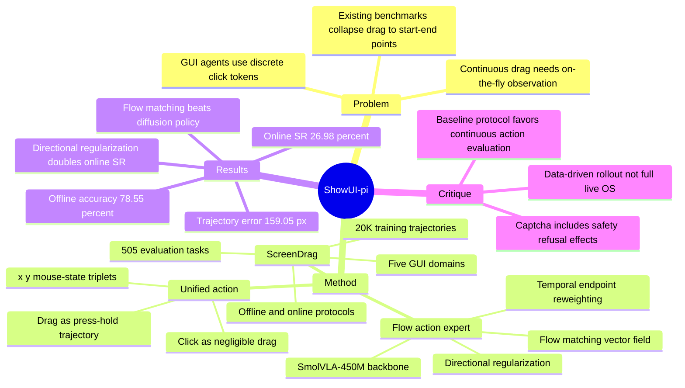

## Summary

ShowUI-π 把 GUI agent 的动作从离散 click / start-end drag token 推进到连续鼠标轨迹生成：用 SmolVLA-450M + flow matching action expert 统一建模 click 和 drag。论文同时提出 ScreenDrag：20K drag training trajectories 和 505 个 evaluation tasks，覆盖 PowerPoint、OS Desktop/File Manager、Handwriting、Adobe Premiere Pro、Captcha 五类需要 on-the-fly visual feedback 的 GUI 操作。

## Problem & Motivation

现有 GUI agents 大多把动作表示成离散文本或坐标 token，例如 `click(x,y)` 或 `drag(start,end)`。这种表示对单步点击足够，但对旋转图形、拖动时间轴、手写轨迹、旋转 Captcha 这类连续操作不够，因为 agent 需要在动作过程中持续观察 UI 状态并做增量调整。

作者的核心类比是 physical dexterous hand vs. digital dexterous hand：机器人 VLA 已经用 diffusion / flow matching 等连续动作生成方法处理细粒度控制，而 GUI agent 仍主要停留在离散坐标预测。ShowUI-π 因此把问题 formulation 改成：给定初始 observation 和 instruction，policy 顺序预测连续轨迹 \(\tau=\{a_t\}_{t=0}^{T}\)，每个 action 是鼠标坐标或带 mouse-state 的动作点。

ScreenDrag 的 motivation 也很明确：已有 benchmark 往往把 drag 简化成起点-终点对，只给单张 screenshot，不评估拖动过程中的中间 UI 状态变化；但真实 drag 任务存在多条可行轨迹，并且 success 取决于闭环过程而不是静态 endpoint。

## Method

**ScreenDrag data and benchmark.** ScreenDrag 包含 20K manually collected and synthesized drag trajectories，覆盖五个 domain 和 11 类任务；evaluation benchmark 有 505 trajectories，每个 domain 101 个任务。训练数据记录 high-resolution screen recording、UI state changes、dense cursor trajectories 和 instruction；平均 recording 时长 9.62 秒，平均 577 frames。

**Data construction pipeline.** 自动数据生成分三步：先用 Windows UI Automation SDK 解析 UI element metadata，例如 bounding box；再用 Qwen-2.5-72B 生成 drag instruction 和期望 metadata change；最后合成带 dense trajectory 的 PyAutoGUI code，在真实 software environment 中执行，并用 rule-based verifier 检查执行前后的 UI metadata 是否满足预期。作者也补充了 human demonstrations，每个 demo 包含 60 FPS screen recording、dense trajectory 和 instruction。

**Evaluation protocol.** ScreenDrag 同时提供 offline open-loop 和 online closed-loop 两种评估。Offline 评估使用 Average Trajectory Error 和 Trajectory Endpoint Accuracy，后者以 endpoint 是否落入容忍半径为准，文中示例为 20 pixels。Online 评估不是简单比较 endpoint，而是基于记录的视频状态做 data-driven rollout：模型预测动作后，系统匹配到最近的 recorded state，再给出下一步 observation，最终用 Task Success Rate 统计是否达到 goal region。

**Unified action representation.** ShowUI-π 把 click 视作“negligible movement 的 drag”，统一表示为 \((x,y,m)\) triplets，其中 \(m \in \{\texttt{down}, \texttt{up}\}\)。Click 是两步 trajectory `[(x,y,down),(x,y,up)]`；drag 是按住鼠标的连续增量轨迹，直到最后 `up`。这个设计避免了 click head / drag head 的任务级切换。

**Model architecture.** ShowUI-π 基于 SmolVLA-450M，包含一个由 SmolVLM-2 初始化的 VLM 和一个 flow matching action expert。Action expert 是 16 层 transformer，与 VLM backbone 做 interleaved self-attention / cross-attention；上一时刻 action state 会投影回 VLM backbone 以条件化后续预测。推理时模型按 chunk 生成动作，执行后重新观察屏幕，再生成下一段动作。

**Flow-based trajectory generation.** Action expert 学习条件向量场 \(v_\theta(\hat{a}(s),s\mid o_t,Q)\)，从 noisy action state 生成 clean action trajectory。论文没有只用 standard flow matching，而是对起点和终点加 temporal reweighting：start / end points 权重为 10，其余为 1，因为 GUI drag 的起始抓取和最终落点对 success 特别关键。另一个关键项是 directional regularization，使用 \(1-\cos(\hat{a}_t,u_t)\) 约束方向一致性，\(\lambda=0.1\)。

## Key Results

**ScreenDrag online success rate.** ShowUI-π-450M 在 ScreenDrag online closed-loop evaluation 上达到 26.98% overall success rate，高于 Gemini-2.5-CUA 的 22.18%、OpenCUA-7B 的 21.98%、OpenCUA-32B 的 20.79%、Seed-1.6-Vision 的 19.01%、UI-TARS-1.5-7B 的 17.03% 和 Operator 的 13.27%。按 domain 看，ShowUI-π 为 OS 13.11%、PowerPoint 22.93%、Premiere 8.64%、Captcha 55.91%、Handwriting 34.32%；它的优势主要来自非线性 drag 和需要过程反馈的任务，而不是 OS file drag。

**ScreenDrag offline metrics.** 在 offline endpoint accuracy / trajectory error 上，ShowUI-π-450M 得到 78.55% / 159.05 px；Gemini-2.5-CUA 为 20.00% / 189.15 px，OpenCUA-7B 为 21.58% / 425.55 px，Operator 为 11.09% / 422.17 px。需要注意的是，语言动作 baseline 只用 endpoint 计算 trajectory error，而 ShowUI-π 用所有 waypoints，指标口径并不完全等价。

**Action modeling ablation.** 在相同 SmolVLM backbone 和 20K trajectories 上，Flow Matching 明显优于 Diffusion Policy 和 language modeling：SmolVLM language modeling 为 0.40% endpoint accuracy / 412.10 px error，Diffusion Policy 为 47.33% / 267.92 px，Flow Matching 为 78.55% / 159.05 px。

**Temporal weighting.** Temporal weight \(w=10\) 的 overall online success rate 为 26.98%，高于 \(w=1\) 的 10.49%、\(w=5\) 的 14.49% 和 \(w=15\) 的 20.80%。Captcha 上的提升尤其大：从 \(w=1\) 的 7.41% 到 \(w=10\) 的 55.91%，论文解释为 start / end accuracy 对旋转或滑动类任务非常关键。

**Unified head vs. separate heads.** Unified Head 使用 450M 参数，online SR 26.98%、offline accuracy 78.55%；Separate Heads 使用 550M 参数，online SR 23.25%、offline accuracy 79.22%。这说明 separate heads 稍高的 offline accuracy 没有转化成 online success，且带来额外 100M 参数和 head selection 问题。

**Directional regularization.** 加 directional regularization 后 overall online SR 从 12.63% 提升到 26.98%。其中 Captcha 从 14.92% 提升到 55.91%，Handwriting 从 14.78% 提升到 34.32%，支持作者关于“方向一致性对连续 GUI drag 很关键”的 claim。

**Observed baseline failures.** 论文报告 Operator 在 Captcha tasks 上全失败，原因是 safety policy 拒绝 solving Captcha；Gemini-2.5-CUA 在 handwriting tasks 中总是错误调用 open-browser tool。这些 failure cases 说明 ScreenDrag 不只测定位精度，也暴露了 tool routing 和 policy constraint 对 GUI manipulation 的影响。

## Strengths & Weaknesses

**已知：贡献成立的地方。**

1. 问题 formulation 有价值：把 GUI action 从 endpoint grounding 推到 closed-loop continuous trajectory，这比普通 click benchmark 更接近真实鼠标操作。
2. ScreenDrag 的 offline + online 双协议比只看 endpoint 更合理，尤其适合旋转、手写、时间轴拖动等中间状态重要的任务。
3. Ablation 比较扎实：Flow Matching、temporal reweighting、directional regularization、unified head 都有对应表格，不只是主结果 claim。
4. 450M model 超过 Gemini-2.5-CUA / Operator 等大模型 baseline，说明 action representation 和 evaluation mismatch 是当前 GUI agent 的真实瓶颈之一，而不只是参数规模问题。

**已知：论文自己暴露或承认的局限。**

1. 作者明确承认 ShowUI-π 训练在 small model size 和 limited training data scale 上，future work 是扩大模型规模。
2. Online evaluation 是 data-driven closed-loop rollout，依赖 recorded states 和 nearest-state matching，不是完整 OS / application live simulator。它比 offline endpoint 更接近真实交互，但仍不是完全真实的可执行环境。
3. Baseline 适配存在口径差异：offline 中 language-action models 只用 first predicted action / endpoint，online 中 baseline 最多三步 interaction。这是为了公平控制成本，但也说明结论更应解读为“离散 action baselines 在 ScreenDrag protocol 下表现弱”，不能直接推广为所有 GUI 任务都弱。
4. Captcha 结果要谨慎解读：Operator 的 0.00% 来自 safety refusal，而不是纯 dexterity failure；因此 Captcha 分数同时混入 policy boundary、tool routing 和操作能力。

**推测。**

这篇论文最重要的启发不是“flow matching 一定是 GUI action 的最终答案”，而是 GUI agent 需要从 point prediction 过渡到 continuous motor-control interface。若未来 computer-use agent 真的要操作 timeline、canvas、editor、map、diagram 等复杂控件，action head 可能需要像 VLA 一样变成低层 policy，而不是仅靠 VLM 产出文本动作。

**不知道。**

论文正文没有给出更大规模模型、更长 horizon workflow、真实 live OS rollout、跨应用泛化或安全策略隔离后的结果；也没有在正文中给出 DOI、arXiv header 或 GitHub code link。因此目前不知道 ShowUI-π 的收益在更复杂 multi-step computer-use tasks 中能否保持，也不知道 ScreenDrag 的 recorded-state online evaluation 与真实 live desktop success rate 的相关性有多高。

## Mind Map

## Notes

- **我的判断**：rating=4。它非常贴近 GUI-agent / computer-use 方向的一个核心空白：当前 agents 会“点”，但不会像人一样连续操控鼠标。贡献不是 SOTA 数字本身，而是把 GUI 操作重新建模为 digital dexterous manipulation。
- **和 VLA / embodied 的连接**：ShowUI-π 是把 robotics VLA 的 flow-based action head 移植到 GUI world 的直接尝试。它支持一个更一般的 pattern：当 action space 有连续控制和实时反馈时，VLM 负责语义理解，低层 generative policy 负责 motor control。
- **后续可追问题**：ScreenDrag 如果能扩展成 live application environment，并把 click、typing、scroll、drag、tool invocation 放进同一个 long-horizon workflow，可能成为 GUI agent 训练和评估之间更好的桥。
- **我不完全买账的地方**：论文把 Captcha 作为 dexterity domain 很有诊断价值，但也容易把安全策略差异误读成操作能力差异。未来报告最好拆出 “policy refusal / tool misuse / motor-control failure” 三类原因，否则 online SR 的因果解释会混在一起。
