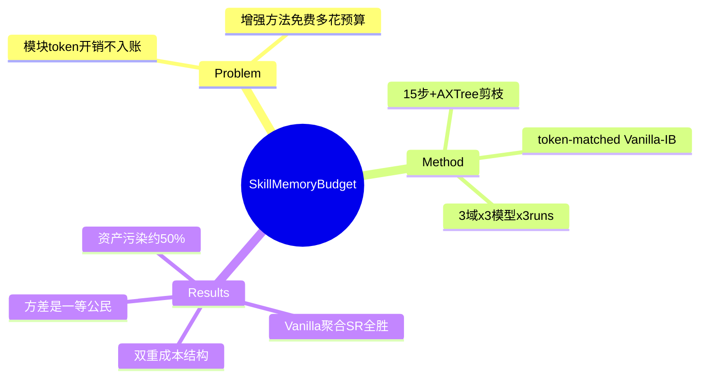

## Summary

对 online skill/memory 增强（AWM workflow 记忆 / ASI 技能归纳 / ReasoningBank 推理记忆）的预算匹配证伪研究：给 vanilla actor 同等 token 预算（10→15 步 + 确定性 AXTree 剪枝），三模型 × 三 WebArena 域上 Vanilla-IB 聚合成功率全面追平或反超三种增强方法，且多数配置下 token 更省——online 模块的表面收益大部分是预算不对称的产物，而非能力增益。

## Problem & Motivation

Online 增强模块（每个任务都要付检索/归纳/注入的 token 开销）的评测惯例只报成功率、不报模块开销，等于让增强方法免费多花预算。本文把"总推理预算固定"作为对照原则重新评估：如果把模块的 token 花在让 actor 多走几步上，模块还剩多少净收益？这直接检验了"记忆/skill 模块整体有效"这一广泛引用的主张。

## Method

- **对照设置**：AWM（从轨迹归纳 natural-language workflow）、ASI（合成/验证/复用 Python skill 函数）、ReasoningBank（从成败轨迹蒸馏推理策略）各限 10 步；**Vanilla-IB** 用同等预算换 15 步交互上限 + rule-based accessibility tree 剪枝（父子节点去重，零 LLM 调用）。作者承认预算匹配不精确（动态动作选择使 token 逐任务浮动），实用控制杆是 max step count；多数情形 Vanilla-IB 仍有未用完的预算余量。
- **评测**：WebArena 三域（Shopping 187 / Reddit 106 / Admin 182 任务）× 三模型（Gemini 3 Flash / GPT-5.4-mini / Qwen 3.6-27B）× 每配置 3 独立 runs；另加 WorkArena-L1（33 企业任务，仅 Qwen，每 task type 3 seeds）。

## Key Results

| 模型 | Vanilla-IB | AWM | ASI | ReasoningBank |
|:--|:--|:--|:--|:--|
| Gemini 3 Flash | **50.74%** (71.9K tok) | 44.98 (102.0K) | 47.86 (107.1K) | 45.54 (86.4K) |
| GPT-5.4-mini | **36.63%** (90.4K) | 30.74 (85.8K) | 32.14 (101.4K) | 28.42 (85.4K) |
| Qwen 3.6-27B | **47.44%** (93.1K) | 43.58 (119.8K) | 45.61 (127.7K) | 43.09 (108.0K) |

- **WorkArena-L1**：Vanilla-IB 55.56% 与 ReasoningBank 并列最高（AWM 53.53 / ASI 48.49）——效应延伸到企业知识工作任务。
- **双重成本结构**（Table 3，Gemini Admin 例）：模块显式成本（AWM 7.2K / ASI 20.8K）之外，注入检索内容使 actor prompt 膨胀（Vanilla 98.4K → AWM 135.0K / ASI 118.1K）。
- **模块资产污染**：AWM 归纳的 workflow 中 49.5%（Gemini）/52.3%（GPT）来自失败轨迹；ReasoningBank 标为 success 的条目 52.9%/59.5% 实际源自失败轨迹；ASI 技能首步失败率跨 9.8–72.2%（Gemini Shopping 单元格 33.3%、失败后 69.0% 靠 actor 兜底恢复——坏函数照样入库）。
- **Reddit 表面平局被拆穿**：AWM 与 Vanilla 同为 47.48%（Gemini），但 step-sweep 显示 Vanilla 从 15 步起追平、更大 horizon 反超，且到 25 步前 token 都更省——"workflow 记忆在 Reddit 有效"至少部分是 budget asymmetry。
- **归因消融**：延长 horizon 是提分主因（Admin 未剪枝 10 步 48.72 → 未剪枝 15 步 57.14；部署配置剪枝 15 步 55.68），剪枝主要省 token 不提分。
- **方差是一等公民**：any-of-3 vs all-of-3 差距可达 18.7pp（GPT-5.4-mini Vanilla Shopping：46.52 vs 27.81）；单 run 成功率是不完整估计，对跨任务积累状态的方法尤甚。
- **工程附带优势**：Vanilla 独立 episode 可 N 路并行、故障局部化；三种增强方法因跨任务状态积累本质串行，且早期任务失败会污染后续全部知识状态。

## Evidence Ledger

| Claim ID | Claim | Type | Source locator | Evidence excerpt | Status |
|:--|:--|:--|:--|:--|:--|
| C1 | 对照设置：三增强法 10 步 vs Vanilla-IB 15 步+剪枝；3 域×3 模型×3 runs | benchmark-setting | §3 | "keeping the actor's interaction horizon to at most 10 steps"; "extended to 15 steps" | source-verified |
| C2 | 三模型聚合 SR Vanilla-IB 全最高；Gemini/Qwen 上同时 token 最省 | comparison | §4 Table 1 | "50.74 / 36.63 / 47.44 vs …" | source-verified |
| C3 | WorkArena-L1：Vanilla 55.56 与 RB 并列最高 | number | §4 Table 2 | "Vanilla-IB 55.56, ReasoningBank 55.56" | source-verified |
| C4 | 双重成本：module 显式（AWM 7.2K/ASI 20.8K）+ actor prompt 膨胀（98.4→135.0/118.1K） | causal-mechanism | §4 Table 3 | "a double cost, combining auxiliary inference with larger actor prompts" | source-verified（ASI module=20.2+0.6=20.8K） |
| C5 | 资产污染：AWM 失败轨迹占比 49.5/52.3%；RB 伪 success 52.9/59.5%；ASI 首步失败 9.8–72.2% 全表 range | number | §5.2 Table 6-8 | "49.5% under Gemini and 52.3% under GPT" | source-verified（33.3%/69% 仅 Gemini-Shopping 单元格） |
| C6 | Reddit 平局由 step-sweep 拆穿：15 步起追平、更大 horizon 反超、token 优势至 25 步 | number | §4 Fig 2 | "matching AWM from 15 steps onward and surpassing it at larger horizons" | source-verified（25 步是省 token 区间上界非交叉点） |
| C7 | any-of-3 46.52 vs all-of-3 27.81（GPT Vanilla Shopping）；建议 multi-run 方差+总 token 为一等评测标准 | number | §5.1 Table 4 | "evaluations should report multi-run variance" | source-verified |
| C8 | 提分主因是延长 horizon（未剪枝 10 步 48.72→15 步 57.14），剪枝省 token 不提分 | number | §5.3 Table 5 | "extended horizon is the main success-rate improvement" | source-verified（部署配置剪枝 15 步 Admin=55.68） |
| C9 | 边界：仅 online augmentation；offline 摊销需不同 accounting；仅 3/5 域；WorkArena 单模型 | benchmark-setting | §8 | "does not apply to offline approaches that amortize discovery costs" | source-verified |
| C10 | Vanilla 可并行+故障局部化；增强方法本质串行、早期失败污染后续知识状态 | causal-mechanism | §6 | "reducing end-to-end wall-clock time by up to a factor of N" | source-verified |

## Strengths & Weaknesses

**Strengths**：
- 把"模块 token 也是预算"这个显而易见却被普遍忽略的对照原则做成了系统实验，且跨 3 模型 × 4 域方向一致——是 [[Reports/2026-07-27-WebAgent-RL-and-Context-Landscape]] §4 "记忆/skill 模块整体有效" 争议行的直接证据。
- 污染测量（AWM ~50% workflow 源自失败轨迹、ReasoningBank >50% 伪 success 标签、ASI 坏函数入库）给出了机制解释：online 自积累资产的质量控制缺失不是偶发 bug 而是三种方法共有的结构问题——与 [[Papers/2509-Misevolution]] 的 memory 路径 misevolution、[[Papers/2607-SEED]] 静态 skill 库负迁移（−7.4）、[[Papers/2607-KnowActGUIClaw]] 跨演化阶段 skill 过期同向，为「监督资产是 policy/阶段相对的」再添 budget 维度的证据。
- 方差报告主张（any/all-of-3 差 10-19pp）与 [[Papers/2607-TeachStop]] 的 bimodal run distribution 相互印证：web agent 单 run 数字接近不可用。

**Weaknesses / 边界**：
- 结论严格限于 **online** 每任务付费模式；offline 摊销（如 [[Papers/2504-SkillWeaver]] 的预构建 skill 库、[[Papers/2606-Resource2Skill]] 的离线蒸馏）不在打击范围——本文自己强调这点，引用时不可扩大化。
- Vanilla-IB 的预算匹配是步数近似而非严格 token 相等（多数情形 Vanilla 有余量，属保守设置；少数情形略超）。
- 三种方法均为原论文默认配置；未调 retrieval 条数/注入策略等超参，"污染可否被更强的资产过滤器修复"未测——这恰是 evolution-step gating（agenda Self-Improving 方向）的切入位置。
- WebArena 3/5 域 + WorkArena 单模型；对更同质任务分布、更长部署 horizon 的环境，作者自认 tradeoff 可能反转。

**对领域**：online 增强的举证责任被翻转——今后任何 online skill/memory 论文若不做 budget-matched vanilla 对照 + 多 run 方差，其增益主张应默认存疑。

## Mind Map

## Notes

- 入队来源：[[Reports/2026-07-27-WebAgent-RL-and-Context-Landscape]] §6 证伪型对照 top-1。检验结果：§4 争议行"记忆/skill 模块整体有效"**不能松绑**——在 online 设置下该主张被预算匹配对照否定；幸存形式收窄为"offline 摊销 + 特定域（如 WorkArena 上 ReasoningBank 追平）"。
- 对 Self-Improving 方向（literature-only）：资产污染数字（~50% 失败轨迹混入）是 evolution-step verifier gating 必要性的又一量化论据；且指出现有三方法的"验证"环节（ASI 的 skill verification 有 69% 假阳恢复）本身不合格——gate 家族论文（GRASP/SKILL.nb 等，agenda next_action 待 digest）应以此为 baseline 对照。
- 与 [[Papers/2606-GUIvsCLI]] 互补：那篇测的是 skill 接口**覆盖不足**（CLI 侧 93.8% 失败源），本篇测的是 online skill **积累的净值为负**——skill 生态的两端（覆盖、质量）都有量化否定证据，"skill 资产"叙事在 2026 年中同时受到两面夹击。
