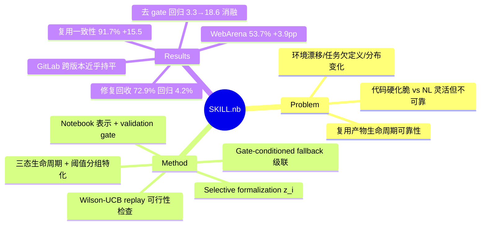

## Summary
SKILL.nb 让 agent 复用的工作流"不会用一次以后就悄悄坏掉"：它按执行证据逐步决定哪些步骤固化成可执行代码、哪些保留成自然语言指导，运行时每步先跑代码、gate 校验不过就地降级回退。核心贡献不在单次成功率（WebArena-Verified 53.7% 只比最强 baseline 高 3.9pp），而在复用与漂移下的可靠性——三次重跑保住 91.7% 初始成功任务（比次优高 15.5 分），有限修复后回收 72.9% 失败且把修复后回归压到 4.2%（baseline 是 15–17%）。

## Problem & Motivation
- Agent 越来越会把过去的经验沉淀成可复用的产物（代码、workflow、procedural memory）。复用能省算力，但引入一个**生命周期可靠性**问题：一次成功的产物在环境漂移、任务欠定义、任务分布变化下会失效——web 自动化尤其明显，因为 UI 变化发生在系统控制之外（不像 version-pinned 应用或会预告 breaking change 的 API）。
- 已有两条路都不理想：把步骤硬化成代码（如 CodeAct）控制力强但界面一变就脆；全用自然语言指导（如 ReasoningBank / Agent Workflow Memory）灵活但可靠性弱。作者把自己定位在"证明助手式完全形式化"与"纯自然语言指导"之间的中间点，让证据来决定形式化程度。

## Method
- **Selective formalization（选择性形式化）**：用执行证据判定每个步骤该走哪种实现——固化为可执行代码、保留为 NL 指导、还是需要被修订。每个步骤带一个二元形式化指示 `z_i ∈ {0,1}`。
- **Notebook 原生表示**：workflow 存成可审计、带版本的 notebook，交织自然语言指导、多语言可执行 cell、validation gate、fallback path，以及 multimodal evidence（输出、截图、error trace）。作者称这是把 SKILL.md 的执行边界与 gate 提升为一等可审计对象。
- **Gate-conditioned execution（门控执行）**：gate `γ_i = (γ_pre, γ_post)` 是对**环境可观测状态**的谓词，不接触隐藏的 evaluator 标签。运行时按级联 `代码 C_i → NL 过程 P_i → 裸意图 I_i` 执行——gate 校验通过就跑代码，漂移让代码实现失效就地回退。
- **三态生命周期 + 阈值策略**：workflow 在 `{provisional, released, retired}` 间流转。四个阈值 `θ = (τ_create, τ_form, τ_demote, τ_retire)` 自动管理晋升/降级：创建与形式化看 trace-support 计数，步骤降级看 repair 计数，退役看 token-weighted 修复负担；阈值按 workflow/step 类型**分组特化**，避免一刀切。
- **可行性检查是 replay-relative 的**：用 Wilson UCB 置信上界在**离线 replay** 上界定 violation rate，选出验证失败率在预算内的低维护策略——这是保守的 replay 过滤器，**不是**对未来任意 workload 的保证（作者自己在 §5 强调这一点）。
- **离线维护循环**：Retrieve → Execute → Distill → Promote；只有被接受的 repair 才更新 repair evidence 与仓库。

## Key Results
- **WebArena-Verified（全 812 任务，Table 1）**：53.7% [50.3–57.1] 单轮成功，比最强 baseline ReasoningBank 高 3.9pp（p=0.029），比 AWMonline 高 7.3、比 CodeAct 高 15.4。分站点 GitLab +9.2、Maps +5.5。
- **复用一致性（§4.2 / Fig 1）**：第 1→5 轮 53.7%→55.7%，是唯一越复用越好的方法（baseline 反而掉 4.6–7.0 分）；三次重跑保住 91.7% 初始成功任务，比次优（ReasoningBank 76.2% / AWMonline 71.6%）高 15.5 分。
- **有限修复（budget 2，§4.2）**：回收 72.9% 后续失败，修复后回归仅 4.2%，而持续型 baseline 是 15.0–17.0%。
- **Mind2Web 迁移（Table 2）**：cross-website step SR 38.1%（ReasoningBank 34.9%），cross-domain 39.7%（36.6%）。
- **GitLab 版本迁移（§4.3 / Fig 2）**：冻结在 GitLab 15.7 上学到的状态复用到新版本，frozen-vs-fresh 差距仅 −1.7 分（16.11）、+0.6 分（18.9）；同条件下 baseline 大幅退化（AWMonline −14.4、ReasoningBank −11.1）。
- **组件消融（258 任务 hard subset，Table 3）**：完整系统 38.4% SR / 3.3% 回归；NL-only 33.3 / 8.8；code-only 31.0 / 14.7；**No gates 32.6 / 18.6**——去掉 gate 对 SR 只掉 ~6 分，但回归从 3.3% 爆到 18.6%，说明 gate 的价值主要在"防越改越坏"而非提升能力上限。
- **阈值特化（Appendix C.2）**：分组特化阈值第 3 轮 38.3% / 3.3% 回归，对照 loose fixed 阈值 27.1% / 22.0%。token/成功成本第 5 轮降到第 1 轮的 69.2%。

## Evidence Ledger
| Claim ID | Claim | Type | Source locator | Evidence excerpt | Status |
|:--|:--|:--|:--|:--|:--|
| C1 | WebArena-Verified 53.7% 单轮成功，比 ReasoningBank 高 3.9pp（p=0.029） | number/comparison | Table 1 / §4.1 | "achieves the highest SR at 53.7%, outperforming ReasoningBank by 3.9 percentage points (p=0.029)" | source-verified |
| C2 | 三次重跑保住 91.7% 初始成功任务，比次优高 15.5 分 | number | §4.2 / Fig 1 | "retains 91.7% of initially successful ... 15.5 percentage points above the next best method" | source-verified |
| C3 | 有限修复回收 72.9% 失败，修复后回归 4.2%（baseline 15–17%） | number/comparison | §4.2 | "recovers 72.9% ... post-repair regressions to 4.2%, compared with 15.0–17.0% for persistent baselines" | source-verified |
| C4 | GitLab 迁移 frozen-vs-fresh 差距 −1.7（16.11）/ +0.6（18.9） | number | §4.3 / Fig 2 | "frozen-versus-fresh target-version gaps of only −1.7 points on GitLab 16.11 and +0.6 points on GitLab 18.9" | source-verified |
| C5 | 消融：No gates 32.6/18.6 vs 完整 38.4/3.3（SR%/回归%） | number/causal | Table 3 | "SKILL.nb 38.4 / 3.3 ... No gates 32.6 / 18.6" | source-verified |
| C6 | Mind2Web cross-website 38.1（vs 34.9）/ cross-domain 39.7（vs 36.6） | number/comparison | Table 2 | "Cross-Website SSR: SKILL.nb 38.1, ReasoningBank 34.9; Cross-Domain: 39.7 vs 36.6" | source-verified |
| C7 | 53.7%（全 812 任务 Table 1）与 38.4%（258 任务 hard subset Table 3）是不同评测集，非矛盾 | benchmark-setting | Table 1 vs Table 3 | "53.7% = all 812 tasks; 38.4% = 258-task hard subset" | source-verified |
| C8 | 安全性是 replay-relative：Wilson-UCB 只界定 replay/阈值估计样本的 violation，不覆盖未来 workload 或界面漂移 | causal-mechanism | §3.3 / §5 | "the Wilson bound is a conservative replay filter rather than a uniform ... safety guarantee" | source-verified |

## Strengths & Weaknesses
**亮点**
- 问对了单次成功率 benchmark 测不到的问题：**复用与漂移下的可靠性**，而非首次成功。这条轴（复用一致性 91.7%、修复后回归 4.2%、GitLab 跨版本近乎持平）比 +3.9pp 的头条数字有信息量得多。
- Gate 是承重构件，且被消融证据钉死：去掉 gate 对 SR 只掉 6 分、对回归却从 3.3% 爆到 18.6%——收益来自"验收/门控"而非"会写技能"。这和 [[Papers/2605-GRASP]] 的核心结论完全同构（GRASP 去掉验收闸门塌回 63.5%），是 evolution-step gating 家族的第二个独立数据点。
- Selective formalization（逐步用证据决定代码 vs NL）是与既有 skill-library 工作正交的新轴：不像 CodeAct 把一切硬化、也不像 ReasoningBank/[[Papers/2409-AgentWorkflowMemory]] 全留 NL；三级 fallback 级联是合理的鲁棒性设计。
- GitLab 15.7→18.9 真实 DOM/selector 漂移是罕见且具体的 drift stress test，frozen-vs-fresh 近乎持平是强可靠性信号。

**局限与边界**
- **两个 WebArena 数字不在同一集上**：头条 53.7% 是全 812 任务，消融的 38.4% 是 258 任务 hard subset——绝对 SR 差一大截，易被误读为同一设定下的对照。
- **安全性是 replay-relative**（作者自陈）：gate 通过 ≠ 在新漂移下安全，Wilson-UCB 只在 replay/阈值估计样本上界定 violation。
- **强依赖 gate 质量**：方法建立在可靠 gate、metadata 质量、group 分配、任务复现结构之上；gate 出错或复现稀疏会导致无效执行。而 gate 本身（对可观测状态的谓词）的 precision 未被独立测量——这是整套机制的命门却没给数。
- 成本代理只数 LLM inference token，不含 wall-clock、存储、人工 review；评测全在受控 benchmark 环境，生产部署可能不同。
- 单轮 SR 增益本身温和（+3.9pp）；真正的故事在 regression/reuse，不在 single-round success。

**对领域/vault 的意义**：直接补上 [[Topics/SelfEvolvingAgents-Survey]] 的 "evolution-step verifier gating" 空白，与 [[Papers/2605-GRASP]] 构成两个粒度互补的实例——GRASP 在 skill-库编辑级用 held-out probe 的净修>净坏判据，SKILL.nb 在步骤级用 code-vs-NL 形式化 + 运行时 gate-conditioned fallback + 生命周期 demote/retire。二者共同指向"收益在验收闸门、不在写技能"。gate 作为**环境可观测、非 oracle 的 agent-facing validator**，也与 AFE verify affordance（[[Ideas/HybridVerifier-GUIRuntime]]）的设计空间正相关。

## Mind Map

## Notes
- 与 [[Papers/2605-GRASP]] 并读：两篇都证明"gate/验收闸门是自我改进收益的真正来源"。若做 SelfEvolvingAgents-Survey 的 gating 家族小节，SKILL.nb 提供"步骤级 + 运行时回退 + 漂移复用"的粒度，GRASP 提供"编辑级 + held-out probe"的粒度——可作两轴对照（何时 gate、gate 在哪一层、gate 依据什么证据）。
- 未解疑问：gate（对可观测状态的谓词）的 precision/recall 全文未给，而整套可靠性都押在 gate 判定上——这正是与 [[Papers/2607-KnowActGUIClaw]] 的 state contract 校验、VAGEN 交互式 verifier 可对话的地方（gate 精度边界 70–85% 的老问题在此换了个形态）。
- 待办：本篇记账 → SelfEvolvingAgents-Survey（gate 家族第 2/8 篇）；survey Open Problem 2（"演化步验证机制无系统工作"）在积够后随批修订。
