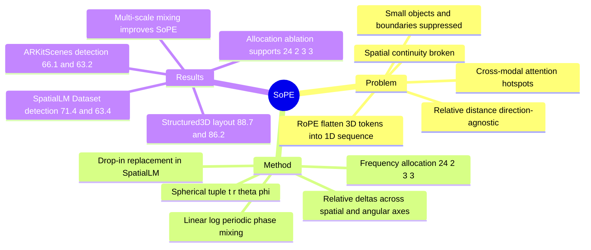

## Summary
SoPE 指出 3D LVLM 直接继承 RoPE 会把 point-cloud tokens 压成 1D raster index，使相对位置主要依赖序列距离而忽略真实 3D 位置与方向，从而产生 spatial perception bias。它把 token 位置重参数化为 spherical tuple `(t, r, θ, ϕ)`，再配合 `t:r:θ:ϕ = 24:2:3:3` 的 frequency allocation 和 linear/log/periodic multi-scale phase mixing；接入 SpatialLM 后，在 Structured3D layout estimation 与多个 3D object detection benchmark 上带来稳定增益。

## Problem & Motivation
3D LVLM 需要把点云或 3D scene representation 对齐到 LLM input space，但许多模型沿用 LLM 中的 RoPE：先把 point-cloud tokens flatten 成一维序列，再用相对 index 差建模位置。论文的核心诊断是，这种做法把 3D spatial continuity 破坏成离散序列关系，并且 RoPE 的 `Δt = t1 - t2` 是 direction-agnostic，无法表达 angular / orientation variation。

作者用 information flow visualization 展示了 RoPE 的 spatial perception bias：cross-modal attention 会集中在少数 hotspots，大量位置和朝向明显不同的 3D tokens 得到近似相同或很低的 attention；小物体和结构边界即使几何上重要，也容易被 suppress。已有 2D image / video RoPE variants 主要针对 grid 或 temporal sequence，RoPE-3D 虽然把 Cartesian `(x, y, z)` 编入位置，但论文认为它仍没有显式处理方向变化。

## Method
论文以 SpatialLM 为 baseline 3D LVLM：point cloud encoder 使用 Sonata，LLM 使用 Qwen2.5-0.5B，并用 two-layer MLP 连接点云 embedding 与 text embedding。SpatialSoPE 是把 SoPE 作为 RoPE 的 drop-in replacement 接入 SpatialLM。

**1. Spherical Coordinate Positional Projection**：SoPE 保留原始 sequence index `t`，同时从 point-cloud token 的 Cartesian coordinates `(x, y, z)` 计算 spherical components：

- `r = sqrt(x^2 + y^2 + z^2)`
- `θ = arccos(z / r)`
- `ϕ = atan2(y, x)`

最终每个 token 的 position index 从单一 `t` 扩展为 `(t, r, θ, ϕ)`，相对位置也从 `Δt` 扩展为 `Δt, Δr, Δθ, Δϕ`。这一步的目标是同时编码 spatial location 与 directional angle，而不是只依赖 flatten 后的序列位置。

**2. Multi-dimensional Frequency Allocation**：论文把 RoPE frequency spectrum 按 `t:r:θ:ϕ = 24:2:3:3` 分配。三个 spherical components 被映射到前部高频 subbands，用于捕捉 fine-grained spatial / angular variation；temporal component `t` 放在后部低频 subbands，用于保持更慢的 long-range temporal continuity。

**3. Multi-scale Frequency Mixing**：对每个 coordinate component `u ∈ {t, r, θ, ϕ}`，SoPE 在 RoPE phase level 混合三种 deterministic transforms：linear scale 保留 absolute positional precision，log-compressed scale 强调 local neighborhood structure，periodic scale 捕捉 global patterns / long-range dependencies。三种 scale 使用 fixed uniform weights，不引入额外 learnable parameters。

## Key Results
**Structured3D layout estimation**：在 pretrain-then-finetune 设置下，SpatialSoPE 在 Structured3D 上达到 `IoU2D@0.25/0.5 F1 = 88.7 / 86.2`，高于 SpatialLM 的 `86.5 / 84.6`（+2.2 / +1.6），也高于 SceneScript 的 `83.1 / 80.8`。在只 fine-tune Structured3D 的设置下，SpatialSoPE 为 `33.5 / 29.5`，SpatialLM 为 `32.8 / 17.9`。

**ARKitScenes 3D object detection**：SpatialSoPE 在 ARKitScenes 上达到 `IoU3D@0.25/0.50 F1 = 66.1 / 63.2`，高于 SpatialLM 的 `63.9 / 60.7`（+2.2 / +2.5），也高于 Table 2 中的 VoteNet、H3DNet、NeRF-Det、UniDet3D。

**SpatialLM Dataset 与 Structured3D 3D object detection**：在 SpatialLM Dataset 上，SpatialSoPE 为 `71.4 / 63.4`，SpatialLM 为 `69.7 / 62.0`（+1.7 / +1.4）。在 Structured3D 上，SpatialSoPE 为 `33.3 / 17.9`，SpatialLM 为 `31.8 / 17.6`（+1.5 / +0.3）。

**Positional encoding baselines / component comparison**：Table 4 中，SpatialSoPE 在 ARKitScenes 上的 `66.1 / 63.2` 优于 `+MCA 63.7 / 60.2`、`+CCA 64.1 / 60.5`、`+RoPE-3D 64.2 / 61.4`；在 SpatialLM Dataset 上的 `71.4 / 63.4` 也优于这些 variants。

**Ablation: frequency allocation**：Table 5 显示最终 `24:2:3:3` 配置在 ARKitScenes 上达到 `66.1 / 63.2`，高于 Angular-Biased `(8:6:9:9)` 的 `65.5 / 62.7`、Uniform `(1:1:1:1)` 的 `63.0 / 59.0`、Temporal-Biased `(5:1:1:1)` 的 `65.0 / 62.7`。

**Ablation: multi-scale frequency mixing**：Table 6 中，SpatialSoPE 去掉 multi-scale 后在 ARKitScenes 上为 `65.4 / 61.4`，加入后为 `66.1 / 63.2`；在 SpatialLM Dataset 上从 `71.0 / 62.5` 提升到 `71.4 / 63.4`。同一策略加到 SpatialLM+RoPE-3D 上也有较小增益：ARKitScenes `64.2 / 61.7 → 64.8 / 62.1`，SpatialLM Dataset `69.4 / 62.3 → 70.3 / 62.9`。

## Strengths & Weaknesses
**已知**：
- 方法切入点简洁：不是重新设计 3D LVLM，而是替换 connector / LLM positional encoding 中的 RoPE，使 point-cloud positional modeling 更接近 3D geometry。
- 实验覆盖了 layout estimation、3D object detection、positional encoding variants、frequency allocation、multi-scale mixing 和 real-world robot integration，能支持“spherical reparameterization + frequency design 对 SpatialLM 有帮助”这个 claim。
- qualitative case study 显示 SpatialSoPE 相比 SpatialLM 减少 small / geometrically intricate objects 的 false detections，并提升跨视角 detection consistency；这是论文报告的定性现象，不是量化 failure-rate。
- real-world validation 集成了 MASt3R-SLAM、SpatialSoPE scene understanding、scene graph、navigation target generation、LLM high-level planner、AnyGrasp、Grounded SAM、A* / DWA 与 GPT-4o feedback，但正文和 supplementary 给的是系统流程与 prompt，没有给出任务成功率、latency、FPS 或 power 的具体数值。

**推测**：
- 对 embodied / 3D agent 的价值比对传统 2D GUI-agent 更直接：它改善的是 3D point-cloud token 的 spatial / directional encoding，可能更适合机器人场景理解、3D spatial memory、navigation / manipulation 前端感知。
- 论文只在 SpatialLM + indoor scene benchmarks 上验证；因此对其他 3D LVLM backbone、outdoor scenes、dynamic scenes、不同 point-cloud encoder 的收益仍需要实验确认。

**不知道**：
- 论文没有报告 SoPE 自身的明确 failure cases，只报告了 RoPE / SpatialLM 的 spatial perception bias 和 SpatialSoPE 的定性改善。
- 没有看到 DOI 或 code URL。
- 没有量化 SoPE 的 computational overhead，也没有给出 real-world robot task 的成功率表。

## Mind Map

## Notes
- 这篇论文的贡献更像是一个“positional encoding diagnosis + minimal replacement”而不是大模型架构创新。它的 taste 在于指出 3D LVLM 继承 RoPE 时的 inductive bias mismatch：3D geometry 被当作 1D text-like sequence 处理。
- 对后续阅读，值得把 SoPE 和 SpatialLM、SpatialVLM、3D-LLM、LLaVA-3D、3DLLM-MEM 放在一起看：问题从“有没有 3D features”进一步推进到“LLM 内部 positional mechanism 是否真的尊重 3D structure”。
- 一个重要未解问题是 benchmark 是否足够测出 direction-aware positional encoding 的真正能力。当前结果主要是 layout / object detection F1；如果要服务 embodied agent，还需要 navigation、manipulation、spatial QA、long-horizon memory 中的因果验证。
