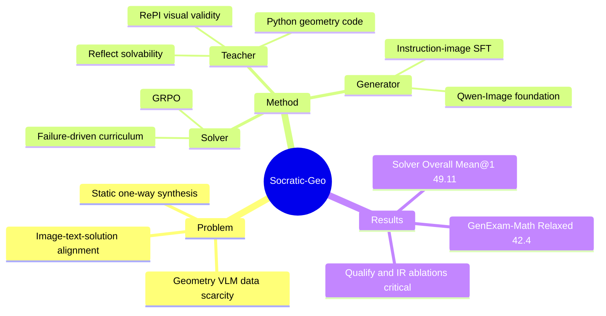

## Summary
Socratic-Geo 针对几何 VLM 推理中的高质量 image-text pair 稀缺问题，把 Teacher、Solver、Generator 连接成闭环：Solver 的失败触发 Teacher 用 Python 几何代码合成并验证新题，Generator 则从累积的 image-code-instruction 数据中蒸馏画图能力。实验上，Socratic-Solver-Geo 用 2.5k 合成样本在几何推理 Overall Mean@1 达到 49.11，比 zero-shot 高 4.13 点、比最强数据 baseline GeoReasoning 高 2.43 点；Socratic-Generator-Image 在 GenExam-Math Relaxed Score 达到 42.4。

## Problem & Motivation
几何推理要求模型同时理解图形结构和文本约束，瓶颈不是普通语言数据，而是数学正确、图文对齐、能训练出推理能力的几何 image-text pair。作者把既有自动生成路线分成三类：image-based textual augmentation 只能改已有图的描述，symbolic-driven random generation 依赖盲目探索和后验过滤，LLM-driven augmentation 容易成为 black-box amplifier，缺少对几何结构的细粒度控制。核心问题是：数据生成和模型学习通常是静态单向流程，无法根据 learner 的失败动态补足 curriculum。

这篇论文的动机和 GUI-agent / embodied-reasoning 有间接相关性：它不是研究 GUI 操作或真实物理环境，但它处理的是视觉结构、文本约束、工具验证和 learner-driven data synthesis 的闭环问题，这些机制对需要精确视觉-grounded reasoning 的 agent 训练有参考价值。

## Method
Socratic-Geo 是一个三 agent 闭环。

- **Solver**：以 Qwen2.5-VL-7B-Instruct 为基础，通过 GRPO 在当前 curriculum 上训练；每道题会生成多次解答，Teacher 用 reference answer 给二值 reward。
- **Teacher**：以 Qwen3-VL-235B-A22B-Instruct 为核心，分析 Solver 的失败路径，并用参数化 Python 几何代码修改图形与题目。Teacher pipeline 包括 Verify、Analyze、Invent 和 Qualify：Reflect 检查题目是否可解，RePI / Python tools 检查渲染和几何有效性。
- **Generator**：以 Qwen-Image 为 foundation model，独立于 reasoning loop 训练；Teacher 把新题的结构化信息转成 drawing instruction，Generator 用这些 instruction-image pair 做 SFT，从程序化绘图数据中学习几何图生成。

关键设计是 failure-driven synthesis：只有当 Solver 在当前 curriculum 的题目上失败时，Teacher 才诊断错误并生成有针对性的新题。论文中的例子是 Solver 错把含 60 度角的三角形当作直角三角形处理，Teacher 随后引入点 P 和圆交点关系，迫使模型使用圆周角与几何约束，而不是套公式。

## Key Results
- **几何推理主结果**：在 MathVerse、GeomVerse、GeoQA、MathVision、MathVista、WeMath 六个 benchmark 上，Socratic-Solver-Geo Stage3 使用 2.5k 数据，分别达到 MathVerse 45.05、GeomVerse 6.67、GeoQA 49.20、MathVision 26.19、MathVista 63.55、WeMath 61.58。Table 1 的 Overall 不含 GeomVerse，Socratic-Solver-Geo 为 49.11；zero-shot Qwen2.5-VL-7B-Instruct 为 44.98，最强 baseline GeoReasoning 为 46.68。
- **数据效率**：baseline 使用 7.2k-10k 训练样本，R-CoT Overall 46.05、PGPS9k 45.89、Geo170k 46.26、GeoReasoning 46.68；Socratic-Solver-Geo 用 2.5k 达到 49.11。论文还强调框架从 108 个 seed problems 启动。
- **图生成结果**：在 GenExam-Math 上，Socratic-Generator-Image Strict Score 6.0、Relaxed Score 42.4，超过 Qwen-Image base 的 0.0 / 18.9，也超过开源 T2I / unified MLLM baselines；但仍低于 GPT-Image-1 的 Relaxed 52.0，也略低于 Gemini-2.5-Flash-Image 的 Relaxed 43.1。
- **跨任务扩展**：Table 2 报告 Chart Reasoning 上 ChartQA 87.3 -> 91.2、CharXiv 66.6 -> 74.2、ChartQAPro 41.3 -> 46.3、ChartMinic 40.2 -> 45.3；Multimodal Coding 上 Design2Code 29.1 -> 34.3、UIFlow2Code 75.9 -> 81.5。
- **Ablation**：去掉 Qualify 后，训练数据从 0.4k 增到 1.3k，但 MathVerse 从 40.33 降到 37.09，低于 zero-shot 39.59，说明未验证数据会引入几何和逻辑噪声。去掉 Instruction Rewriting 后，GenExam-Math Strict / Relaxed 只有 0.0 / 20.1；加入 IR 后达到 6.0 / 42.4。

## Strengths & Weaknesses
**已知亮点**：这篇工作把几何数据生成从“生成后过滤”推进到“根据 Solver 失败定向生成”，并且用可执行 Python code 把图形、题目和答案绑定在一起。Qualify ablation 很关键：更多未验证数据反而伤害模型，说明这类任务里 data purity 比 data scale 更重要。

**已知局限**：Generator 的 Strict Score 仍只有 6.0，说明即使 Relaxed Score 接近 Gemini-2.5-Flash-Image，严格满足所有几何约束的比例仍然很低。评测依赖 LLM-as-judge / GPT-5 judge，论文正文提到完整细节在 appendix，但主文没有充分展开判分稳定性、human agreement 或按题型的 failure breakdown。训练基础设施使用 32xA100，Teacher 又是 Qwen3-VL-235B-A22B-Instruct，复现成本不低。

**推测**：对 GUI-agent / embodied agent 最有价值的不是几何任务本身，而是“失败诊断 -> tool-verified visual data synthesis -> learner update”的闭环范式；如果 GUI 状态、动作后果或空间关系也能被程序化验证，类似机制可能用于构造更高纯度的视觉交互数据。但论文没有在 GUI、robotics 或真实 embodied 环境中验证这一点。

**不知道**：论文没有报告代码链接，也没有在正文中给出 arXiv id 或 DOI。它也没有清楚说明 108 个 seed problems 的来源、覆盖度，以及 Teacher 生成失败或验证失败样本的比例。

## Mind Map

## Notes
这篇论文的核心 taste 在于把“数据合成”视为一个被 learner failure 驱动的控制问题，而不是离线扩数据。需要继续追的问题是：如果 verification function 不像几何 Python code 这么明确，这个闭环还能否保持 data purity；以及在 GUI / web / embodied 场景中，哪些状态转移可以被设计成可执行、可验证的 synthetic data engine。
