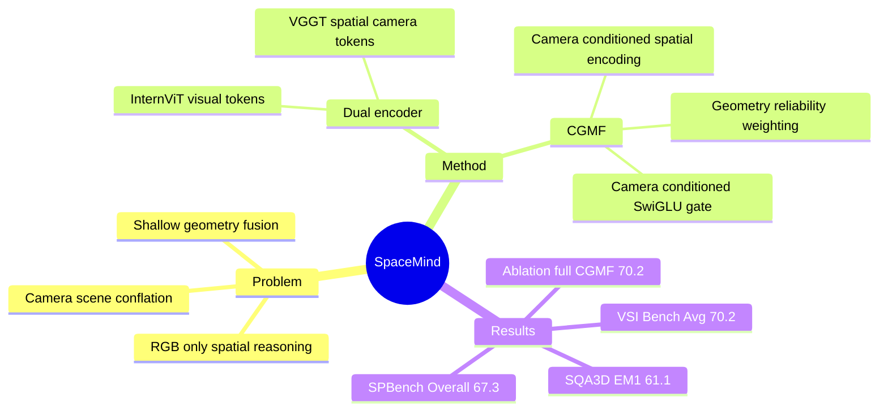

## Summary
SpaceMind 解决 RGB-only VLM 在 3D spatial reasoning 上对 camera/viewpoint 建模不足的问题：它把 camera representation 当作主动 guiding modality，而不是被动 metadata，并通过 Camera-Guided Modality Fusion (CGMF) 在 LLM 前融合 visual/spatial/camera tokens。最终版 CVF PDF 中，SpaceMind 在 VSI-Bench 达到 70.2 Avg，在 SQA3D 达到 61.1 EM@1 / 63.8 EM@R1，在 SPBench 达到 67.3 Overall。

## Problem & Motivation
现有 VLM/MLLM 在 open-ended multimodal understanding 上很强，但在 distance estimation、size comparison、layout inference、multi-view consistency 这类 3D-aware task 上不稳定。论文把已有方法分成两类：一类依赖 point cloud、depth map、mesh、BEV/voxel 等 explicit 3D inputs，但受 specialized hardware、pre-scanned environments、multi-stage reconstruction 和 scale ambiguity 约束；另一类从 monocular/multi-view RGB 出发，用 geometry encoder 给 VLM 注入 spatial tokens，但通常用 MLP projection、concatenation 或 one-stage cross-attention 进行浅层融合。

作者的核心判断是：camera/viewpoint 与 scene/geometry 在 3D vision 中扮演不同角色，不能简单混成同一个 homogeneous feature space。SpaceMind 因此把 camera tokens 作为独立控制信号，指导 spatial evidence 如何进入 visual tokens；这比只增加一个 3D encoder 更接近问题本质，也更符合 RGB-only、可扩展的 VLM 使用场景。

## Method
SpaceMind 采用 InternVL3-8B 作为 LLM backbone，InternViT-300M 作为 visual encoder，VGGT 作为 spatial encoder。输入是 text prompt 和一组 RGB frames；visual stream 产生 semantic visual tokens，spatial/camera stream 由 VGGT 产生 geometry-aware spatial tokens 和 per-frame camera tokens。CGMF 输出保持与 visual tokens 相同的 shape，因此不需要改变预训练 LLM 的接口。

CGMF 包含三个关键操作。第一，camera-conditioned spatial encoding：用每个 frame 的 camera token 与 spatial token 一起生成 geometric bias，并加到 attention 的 key/value 上，使 spatial evidence 以当前 viewpoint 为条件。第二，geometry-reliability weighting：为 spatial token 预测 query-independent importance weight，模拟 DUSt3R/VGGT 中 confidence map 的作用，在 attention 前压低不可靠几何证据。第三，camera-conditioned output gating：用 camera summary 生成 SwiGLU-style gate，控制 fused spatial evidence 对 visual backbone 表示的影响强度。

训练设置也很关键：模型在 SpaceMind-700K 上 fine-tune 2 epochs；该数据混合 VLM-3R-data、ViCA-322K 和 SQA3D training split。训练时 freeze visual encoder 和 spatial encoder，完整更新 CGMF，并对 InternVL3-8B 使用 LoRA，rank 256、scaling factor 512；learning rate 为 2 × 10^-5，warm-up ratio 为 0.03，global batch size 为 64，全流程约 25 小时，使用 64 张 NVIDIA H100 80GB GPU。预处理上每个 scene sample 34 frames，丢弃首尾后使用 32 frames；InternViT 输入 resize 到 448 × 448，VGGT 输入 zero-pad 到 518 × 518。

## Key Results
VSI-Bench：SpaceMind 在最终版表 1 中达到 70.2 Avg，高于最强 specialized baseline VLM-3R 的 60.9，提升 9.3；也高于 GPT-5 的 55.0、Gemini-2.5 Pro 的 53.5、Gemini-3 Pro 的 56.0、Grok-4 的 47.9。分项上，SpaceMind 为 object counting 73.9、absolute distance 61.5、object size 77.6、room size 74.8、relative distance 67.7、relative direction 88.6、route planning 46.9、appearance order 70.7；appearance order 相比 VLM-3R 的 40.1 高 30.6，是表中最明显的 cross-view gain。需要注意：route planning 46.9 低于 Gemini-3 Pro 61.9、GPT-5 50.2、Grok-4 47.4，因此不能把最终版表格解读为每个子任务都超过所有 proprietary model。

SQA3D：SpaceMind 在 test split 上达到 61.1 EM@1 和 63.8 EM@R1，高于 Video-3D LLM 的 58.6 / 60.8，并且 SpaceMind 是 video-input only，而表中 PQ3D、3D-VisTA、LEO、SIG3D、Scene-LLM、ChatScene、Video-3D LLM 都不是 video-input only。分 question type 看，SpaceMind 在 What 54.1、Is 74.8、How 61.7、Can 71.0、Which 51.9 上很强；但 Others 为 53.6，低于 Video-3D LLM 的 56.0 和 ChatScene 的 55.0。

SPBench：所有方法都不使用 SPBench training data。SpaceMind Overall 为 67.3，高于 VILASR-7B 54.0、SpaceR-7B 53.5、Gemini-2.0-Flash 53.0、Spatial-MLLM-4B 52.5、GPT-4o 46.2。细分上，SpaceMind 在 SPBench-SI 的 NQ/MCQ/Avg 为 66.3 / 53.2 / 59.7，在 SPBench-MV 的 NQ/MCQ/Avg 为 76.2 / 70.5 / 73.8；但 SPBench-SI MCQ 53.2 低于 VILASR-7B 63.7、Qwen2.5-VL-7B 60.5、Gemini-2.0-Flash 60.4，说明 single-view multiple-choice 不是绝对强项。

Ablation：表 4 把 VSI-Bench Avg 从 InternVL3-8B ft 的 63.7 提到 +VGGT 的 64.6，说明 spatial encoder 有帮助但单独增益有限；两种 naive camera integration 策略达到 ConcatCam 67.4 和 MultiAttn 67.9；CGMF components 中，+twMLP 为 67.8，+twMLP+geoMLP 为 69.4，full SpaceMind 为 70.2。表中也显示 spatial encoding 不是全维度单调收益：例如 +VGGT 相比 InternVL3-8B ft 让 absolute distance 从 51.1 到 54.9、relative direction 从 73.2 到 82.6，但 object size 从 74.7 降到 72.2、relative distance 从 64.9 降到 59.7、appearance order 从 66.6 降到 65.2；真正稳定提升来自 camera-guided fusion 组件叠加。

Baselines 覆盖三类：proprietary models 包括 GPT-5、Gemini-2.5 Pro、Gemini-3 Pro、Grok-4、GPT-4o、Gemini-2.0-Flash；open-source VLMs 包括 InternVL3-78B、LLaVA-NeXT-Video-7B/72B、Qwen2.5VL-7B、LLaVA-OneVision-7B/72B、InternVL-2.5、Kimi-VL；specialized spatial reasoning models 包括 Spacer/SpaceR、ViLaSR/VILASR、Spatial-MLLM、VLM-3R、Video-R1，以及 SQA3D 的 PQ3D、3D-VisTA、LEO、SIG3D、Scene-LLM、ChatScene、Video-3D LLM。

## Strengths & Weaknesses
**已知**：这篇论文的贡献不只是“加一个 3D encoder”，而是把 camera 作为独立 modality 来控制 spatial tokens 的 bias、weighting 和 gating；ablation 支持这个设计，因为 naive camera fusion 到 67.4/67.9，而完整 CGMF 到 70.2。另一个已知强点是 RGB-only/video-only 场景下仍能在 VSI-Bench、SQA3D、SPBench 三个 benchmark 上取得强结果，尤其 VSI-Bench Avg 70.2 与 SPBench Overall 67.3 都明显高于 prior specialized spatial models。

**已知的弱项 / failure-case 线索**：论文未提供独立 qualitative failure case section，因此具体失败模式论文未提及；但表格暴露出几个薄弱点。VSI-Bench 的 route planning 为 46.9，低于多个 proprietary model；SQA3D 的 Others 为 53.6，不是表中最高；SPBench-SI MCQ 为 53.2，明显低于 VILASR-7B 和 Qwen2.5-VL-7B。也就是说，SpaceMind 的优势主要体现在整体 spatial reasoning 和多视角/度量相关任务，不应 overclaim 成所有细粒度 task 都最强。

**已知的 limitations**：论文没有单独的 limitations section；从正文可确认的边界是它依赖 VGGT 产生 spatial/camera tokens，并在训练和推理中默认使用 RGB frame sequences。虽然作者展示了 SPBench single-image transfer，但模型训练时使用 32-frame clips per QA；对于真实 embodied agent 中的 long-horizon memory、active perception、online camera control、动态场景和行动闭环，论文未评估。

**推测**：camera-guided fusion 对 appearance order 和 relative direction 提升大，可能是因为 camera token 帮助模型把跨视角证据重新对齐到当前 viewpoint；但这只是由 ablation 和分项结果支持的机制解释，不是直接可观测因果证明。进一步的 causal probing 需要移除或扰动 camera tokens、替换 VGGT camera estimates、或者在 camera pose 噪声下测 robustness。

**不知道**：论文未给出代码 URL，虽然称会 release code and model checkpoints；也未报告在更多 outdoor、dynamic scene、robot navigation 或 GUI/desktop spatial layout 任务上的表现。论文没有说明失败样例的分布、不同 frame sampling 策略的敏感性、VGGT 错误会如何传导到 reasoning output，也没有和显式 pose/depth oracle 做上界比较。

## Mind Map

## Notes
这篇论文对我的启发是：spatial reasoning 的瓶颈不一定只在“有没有 3D features”，而在于不同几何信号的角色有没有被正确建模。camera/viewpoint 是一种控制信息，scene/geometry 是被控制的证据，visual semantics 是最终要被 LLM 消化的接口；CGMF 的价值在于让这三者保持角色分工，而不是追求更复杂的 3D reconstruction pipeline。

后续值得追的问题：第一，CGMF 是否能迁移到 GUI Agent 的 screen navigation / visual grounding，其中“camera”可类比为 viewport、scroll state 或 interaction perspective；第二，若把 camera token 换成 explicit pose、depth confidence 或 action-conditioned viewpoint prediction，是否能进一步提升 route planning 这类当前仍弱的任务；第三，SpaceMind 的 gains 到底来自 VGGT 的 camera representation，还是来自 CGMF 对 noisy geometry token 的 regularization。
