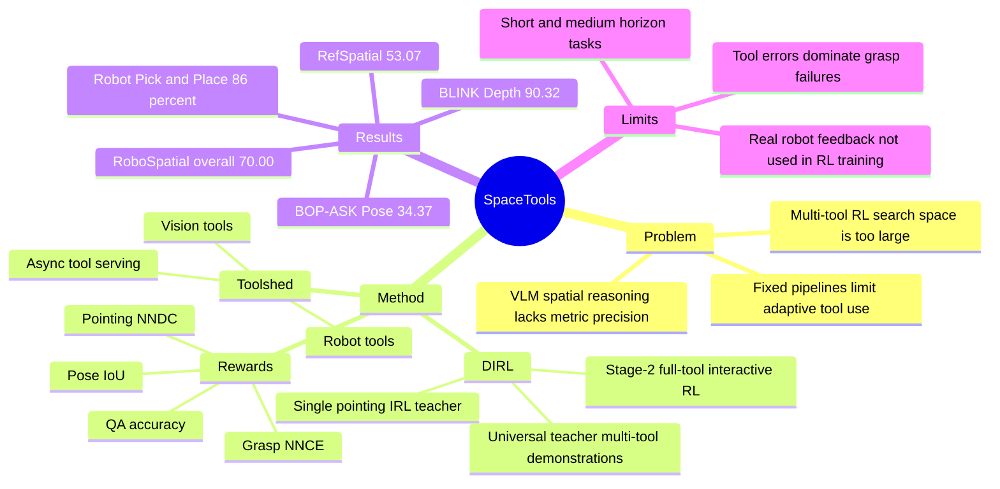

## Summary

SpaceTools 提出 Double Interactive Reinforcement Learning (DIRL)，让 Qwen2.5-VL-3B-Instruct 学会在 spatial reasoning 中多轮调用 pointing、segmentation、depth、3D bbox、grasp 和 robot tools。核心不是把所有几何能力塞进 VLM，而是通过 Toolshed 把真实工具输出接入 SFT + interactive RL，使模型学习 tool selection、tool ordering 和 error recovery。实验覆盖 RoboSpatial-Home、BLINK、RefSpatial、CVBench、BOP-ASK 与真实 7-DOF robot manipulation，显示 tool-augmented interactive training 对精确空间推理和 embodied control 都有实质收益。

## Problem & Motivation

已知：VLM 在开放视觉问答上表现强，但对 embodied applications 需要的 metric spatial reasoning、3D awareness、precise geometric perception 仍不稳定。传统路线通常依赖 task-specific fine-tuning 或把 depth、pointing、3D-awareness 等能力逐个 baked into model，需要大规模标注和数据工程。

已知：tool-augmented reasoning 的自然想法是让 VLM 调用 depth estimator、segmentation、pose/grasp estimator 等外部模块，但已有方法多依赖 handcrafted prompting、固定工具 pipeline，或只在 single visual tool 上做 RL。论文的问题 formulation 是：如何在训练时允许模型真实、交互式地调用多个 heterogeneous tools，同时避免 naive multi-tool RL 的巨大搜索空间导致 exploration failure。

## Method

**DIRL: two-phase training.** 已知：DIRL 包含 teaching phase 和 exploration phase。Teaching phase 先训练一个 single pointing tool 的 IRL teacher，因为该搜索空间更小、更容易收敛；再用 frontier model Claude Sonnet 4.5 + full Toolshed 生成 multi-tool demonstrations，只保留成功轨迹。最终 teaching SFT dataset 由 8k high-quality tool-use trajectories 组成，其中 2k 来自 IRL-trained teacher，6k 来自 universal teacher。

**SFT initialization + full-tool interactive RL.** 已知：base model 是 Qwen2.5-VL-3B-Instruct；Stage-1 SFT 用 multi-turn dialogue 的 assistant turns 做 next-token cross-entropy，学习工具 signature、输出格式和基本信息流。Exploration phase 从 SFT policy 继续训练，允许模型访问全部 tools，并用 GRPO 做 interactive RL；每个输入异步生成 5 个 multi-turn rollouts，用 task-specific reward 更新策略。

**Toolshed.** 已知：Toolshed 是为 interactive VLM-RL 服务的工具运行平台，目标是把 compute-heavy tools 从 policy inference loop 解耦，支持 resource/environment isolation、asynchronous workers、independent scaling 和 multimodal data passing。论文提供的 vision tools 包括 image ops、SAM2 segmentation、RoboRefer/Molmo pointing、DepthPro depth/point cloud、3D bbox、GraspGen grasp、code executor；robot tools 包括 capture image/depth、execute grasp、place object，也有 mock robot tools 用于数据生成。

**Rewards.** 已知：任务奖励按输出类型定义，而不是统一 reward：multiple choice 用 binary accuracy，2D bbox 用 mean IoU，pointing 用 NNDC 并用 binary accuracy clipping，pose estimation 用 projected 3D box corner convex hull IoU，grasp estimation 用 NNCE。作者试过 structural format score，但报告没有 measurable improvement，因此最终训练不用 format reward。

## Key Results

**Spatial reasoning benchmarks.** 已知：Table 2 报告 normalized accuracy (%)。SpaceTools-3B 在 RoboSpatial overall 上为 **70.00**，高于 Gemini-ER 1.5 的 62.50、RoboRefer-8B-SFT 的 59.43、tool-free SFT 的 58.00 和 tool-free RL 的 54.00；在 BLINK Depth 上为 **90.32**，高于 RoboRefer-8B-SFT 的 88.71；在 RefSpatial 上为 **53.07**，高于 RoboRefer-8B-SFT 的 48.37 和 Gemini-ER 1.5 的 41.72；在 BOP-ASK Pose 上为 **34.37**，高于 GPT-5 的 9.03 和 tool-free RL 的 12.00；在 BOP-ASK Grasp-SR 上为 **50.00**，高于 Claude Sonnet 4.5 的 48.33、GPT-5 的 41.67 和 tool-free RL 的 36.67。

**与同 base tool-free training 对比.** 已知：SpaceTools-3B 相对 Qwen2.5-VL-3B-Tool-free SFT 在 RoboSpatial overall 上从 58.00 提到 **70.00**（+12），相对 Tool-free RL 从 54.00 提到 **70.00**（+16）。这支持论文的主要 claim：提升不是仅来自 base model fine-tuning 或普通 reasoning RL，而来自 interactive tool use。

**Real robot manipulation.** 已知：Table 3 在真实 robot manipulation 上报告 success / partial success rate。SpaceTools 在 Pick 为 **86% (6/7)**，Relation Pick 为 **83% (5/6)**，Pick & Place 为 **86% (12/14)**，TTFM 为 **10s**；Claude Sonnet 4.5 + Toolshed 分别为 86% / 50% / 79%，TTFM 30s；GPT-5 + Toolshed 为 71% / 33% / 65%，TTFM 36s；Qwen2.5-VL-3B + Toolshed 和 π0.5 在这些任务上报告为 0。

**Ablation.** 已知：Table 4 中完整 SpaceTools 的 RoboSpatial / RefSpatial / Pose / Mean 为 **70.00 / 53.07 / 34.37 / 52.48**。去掉 IRL-trained teacher 后为 61.14 / 29.60 / 34.29 / 41.68；去掉 universal teacher 后为 65.14 / 54.51 / 8.92 / 42.86；去掉 Stage-2 IRL 后为 67.71 / 51.98 / 33.28 / 50.99；非 interactive 的 Tool SFT 和 Tool NIRL mean 只有 39.19 和 38.06。Table 13 还显示 direct IRL all tools 的 mean 只有 **19.79**，远低于 DIRL 的 52.48，直接支持“先建立可学习的 tool grounding，再做 multi-tool exploration”的设计。

**Toolshed efficiency / tool IRL details.** 已知：Table 8 中 8 个 simultaneous RoboRefer calls，Toolshed 3 instances 的 wall-clock time 为 **2.7 ± 0.1s**，naive HTTP 1 instance 为 8.5 ± 0.3s，speedup **3.2x**。Table 11 中 constrained Tool IRL 在 RoboSpatial overall 为 **72.30**，RefSpatial 为 **34.30**，而 tool-free SFT / tool-free RL 的 RefSpatial 都是 0.00；这说明 single-tool IRL teacher 不只是 in-domain trick，也有一定 out-of-domain transfer。

## Strengths & Weaknesses

**已知 Strengths.** 论文的核心 taste 是把空间推理从“让 VLM 直接学会所有低层几何”改成“让 VLM 学会何时、如何调用已有几何工具”。这条路线简洁且模块化：DepthPro、SAM2、RoboRefer、GraspGen、robot APIs 都可以作为外部能力接入，VLM 主要学习 coordination policy。

**已知 Strengths.** 实验覆盖面较好：benchmark 包含 RoboSpatial-Home、BLINK、RefSpatial、CVBench、BOP-ASK，任务类型覆盖 spatial relationship、relative depth、vacant-space pointing、pose、grasp；baseline 覆盖 proprietary models、general open-source VLMs、spatial VLMs、同 base tool-free SFT/RL。Ablation 也能区分 IRL teacher、universal teacher、Stage-2 IRL 和 non-interactive tool learning 的贡献。

**已知 Strengths.** 真实 robot 被暴露为 tool，而不是把 action 放在模型外部流程里；SpaceTools 通过 capture_image → point/segment/depth/grasp → execute_grasp/place_object 形成闭环 perception-action sequence。这对 embodied reasoning 很关键，因为它验证了 tool-call policy 可以把空间推理过渡到实际控制接口。

**已知 Weaknesses / boundaries.** 当前应用范围主要是 short- or medium-horizon tasks，例如 spatial QA、grasp-and-place manipulations；论文自己指出更复杂、longer-horizon、multi-stage tasks 仍是 future direction。训练时 robot-in-the-loop latency 太高，因此使用 mock robot tools 构造 robot SFT data，interactive learning stages 本身不使用 synthetic robot-tool component；这限制了从真实物理反馈中学习的证据强度。

**已知 Weaknesses / boundaries.** Toolshed 当前主要探索返回 structured text / variables 的工具，虽然支持 image-level tool outputs，但论文说尚未充分研究让模型直接对工具输出图像进行推理。系统层面仍有 latency 和 memory bottlenecks，尤其是 high-resolution vision tools 或 robot-in-the-loop execution；elastic scaling 是设计能力，但未在训练实验中启用。

**已知 failure / sensitivity.** Appendix 的 failure analysis 显示 grasp benchmark 的 30 个失败中，Tool Error 23、Reasoning Error 7、Planning Error 0；robot manipulation 的 4 个失败中，Tool Error 2、Planning Error 2、Reasoning Error 0。定性失败包括 cluttered scenes 中 wrong object localization、inaccurate pose estimation，以及 robot placement 选点靠近 bin boundary 导致放置失败。Pick up the soft toy 任务中所有模型都失败，原因是 pointing tool 不能区分 soft toy 与 rigid toy。

**推测.** 这篇对 GUI / computer-use agent 的启发不是“空间推理 benchmark 数字可直接迁移到 GUI”，而是 training pattern：先用 tractable single-tool RL 学会 grounding，再用 demonstration + interactive RL 学多工具协调，可能适用于 screenshot grounding、element parser、OCR、browser/OS action tools 的组合训练。但论文没有评估 GUI、web 或 desktop agent，所以这只能作为方法论启发。

**不知道.** 论文首页显示 Project Page 和 Code 链接标签，并在 appendix 说会基于最新 Verl fork open-source code，但当前正文没有给出可核验的代码 URL。也不知道 SpaceTools 在动态场景、长任务、真实机器人失败后 retry、多相机 active perception、工具输出冲突、以及工具版本替换后的稳定性如何；这些不是 Table 2/3 能直接证明的。

## Mind Map

## Notes

这篇值得 5 分：它同时命中 spatial reasoning、agentic-RL、VLM tool use 和 embodied control，而且 ablation 对 DIRL 的必要性给出了比较直接的证据。最重要的 insight 是“工具不是 prompt trick，而是训练时可交互的 environment action”；这让 tool-use VLM 更接近 agent policy，而不是带外部 API 的静态 VQA 模型。

需要警惕的点是 benchmark success 不等于 real-world autonomy。失败统计里 tool error 占大头，说明模块化路线的上限强依赖工具可靠性；但这也是模块化的价值所在，因为改进单个 tool 或加入 verification / retry policy 可能比重新训练整个 VLM 更可控。
