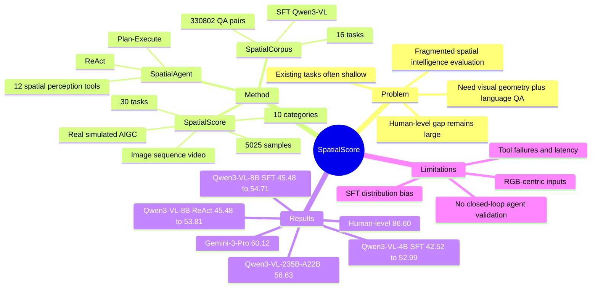

## Summary
SpatialScore 是一个面向 MLLM spatial intelligence 的综合评测与改进工作：作者构建 5,025 个手工验证样本、30 个任务、10 个类别的 benchmark，并在 49 个 MLLM 上显示当前模型距离 human-level 仍有大 gap。论文进一步给出两条改进路线：用 330,802 个 SpatialCorpus QA 样本做 SFT，以及用包含 12 个 spatial perception tools 的 SpatialAgent 做 training-free tool-based reasoning。

## Problem & Motivation
已知：现有 MLLM 在 general semantic QA、math reasoning 上进展快，但 spatial intelligence 评测仍然碎片化。作者指出两个核心问题：第一，很多 benchmark 只覆盖 object presence、coarse position relation 等较浅任务，缺少 camera pose、homography、depth、motion 等 visual geometry perception；第二，已有评测常局限在 Yes/No、单图像或单一能力，难以整体衡量 spatial perception 与 spatial understanding。

已知：SpatialScore 的问题设定对 embodied AI、autonomous navigation、GUI / physical-world agent 都相关，因为这些系统需要从视觉输入中恢复距离、方向、视角变化、物体定位和时间顺序，而不是只做语义识别。论文把问题统一成 QA：给定 textual question `q` 与 visual input `v`（single image、multi-frame sequence 或 video），模型输出回答 `r`。

推测：这篇工作的主要价值不是提出一个新 backbone，而是把 spatial intelligence 的评测边界向 “visual geometry + language QA + tool-use reasoning” 扩展。它更像一个强 benchmark / data resource / agent baseline 组合，为后续 spatial MLLM 与 embodied reasoning 工作提供统一压力测试。

不知道：论文没有验证这些离线 QA 分数能在真实 closed-loop embodied task、GUI agent task 或 navigation success rate 上带来多少转化收益。

## Method
论文包含三个 artifact：SpatialScore、SpatialCorpus 和 SpatialAgent。

**SpatialScore benchmark**：作者先从 ScanNet++、Omni3D、WildRGB-D、PointOdyssey、CA-1M 等带 3D annotations 的数据集中随机采样 500 scenes，把 depth、3D bounding boxes、camera intrinsics / extrinsics、point correspondence 等 metadata 转成 QA。生成过程包括 question templates、DeepSeek-v3 rephrasing、同类标注采样 / 数值扰动 / LLM 生成 distractors，并把部分 open-ended QA 转为 multi-choice 或 judgment 形式。

**Data integration & curation**：作者还整合 23 个已有 spatial / general QA datasets 中的相关样本，得到 63,857 candidates；用 GPT-OSS-120B 过滤掉不需要视觉信息即可回答的问题后剩 40,238 个；5 名志愿者再按 correctness、spatial relevance、duplicate removal、category balance 选出 8,793 个 valid samples；最终经人工 verification 和 reclassification 得到 5,025 个 SpatialScore 样本，其中 1,091 个来自新构造的 3D repurposing 数据。最终 benchmark 覆盖 10 类能力：mental animation、counting、depth estimation、object distance、object motion、camera pose & motion、temporal reasoning、view reasoning、object size、object localization。

**SpatialCorpus**：训练集使用与 SpatialScore 类似的 3D annotation repurposing，但排除 CA-1M，因为它只有 class-agnostic annotations；为了降低大规模 LLM rephrasing 成本，训练数据主要使用 rule-based templates，并加入 simulator 生成的 spatial map、multi-view projection、2D/3D rotation 等 mental animation 数据。最终 SpatialCorpus 包含 330,802 QA pairs，覆盖 16 tasks / 7 categories；其中 multi-choice 262,601，judgment 9,776，open-ended 58,425；single-image 270,812，multi-image 59,990。作者用它对 Qwen3-VL-4B/8B 做 1 epoch SFT，8x A100，bfloat16，batch size 512，peak LR 1e-5，visual encoder fixed，优化 MLP projector 与 LLM parameters。

**SpatialAgent**：这是 training-free 路线，保持 MLLM backbone fixed，通过 prompt-driven multi-agent orchestration 调用 spatial perception tools。Plan-Execute 包含 planner、executor、summarizer，先生成完整 tool plan 再执行；ReAct 包含 observer、executor、summarizer，用 memory 记录 intermediate observations，并逐步选择下一步 action。工具箱包含 12 个 spatial perception tools，覆盖 localization、counting、segmentation、3D detection、optical flow、point matching、homography、intrinsics / extrinsics、depth、orientation、3D distance 等能力，另有 Terminate / SelfThinking 作为 orchestration utilities；底层工具包括 Rex-Omni、SAM2、DetAny3D、RAFT、SIFT / OpenCV、VGGT、Depth-Anything-V2、OrientAnything、MapAnything 等。

**Evaluation protocol**：judgment / multi-choice 直接 exact matching；open-ended numerical QA 使用 VSI-Bench 的 Mean Relative Accuracy (MRA)，并结合 parsing functions 与 GPT-OSS-20B judge 的平均分。Chance-level baseline 对 choice 题随机选项，对 open-ended 数值在 ground-truth 0.25-4 倍范围采样；Blind baseline 是 text-only GPT-5；human-level 由 3 名有 3D vision 经验的 PhD students 使用 OpenCV 等基础工具作答后取平均。

## Key Results
- **SpatialScore 规模与覆盖面**：Table 1 中 SpatialScore 覆盖 real / simulated / AIGC 三类 data types，single-image / sequence / video 三种 input modalities，以及 MCQ / Yes-No / open-ended 三种 QA formats；共 30 tasks、5,025 samples。作为对照，VSI-Bench 是 8 tasks / 5,156 samples，SPAR-Bench 是 20 tasks / 7,211 samples，OmniSpatial 是 50 tasks / 1,533 samples；SpatialScore 的特点是覆盖更宽，而不是样本数最大。
- **49 个 MLLM 的主评测 (SpatialScore, Table 2)**：human-level 为 86.60，chance-level 为 28.29，Blind GPT-5 text-only 为 30.62。最佳整体模型是 Gemini-3-Pro，overall 60.12；GPT-5 为 58.13，Gemini-2.5-Pro 为 56.37，Claude-4.5-Sonnet 为 45.68。最佳 open-source 模型是 Qwen3-VL-235B-A22B，overall 56.63；它与 human-level 仍差 29.97，而 best overall 与 human-level 差 26.48。
- **能力短板 (SpatialScore, Table 2 + Sec. 2.3)**：作者明确指出，虽然部分模型在 mental animation、object localization 等基础任务上接近 human-level，但 view reasoning、camera pose、motion analysis 和 real-world 3D perception 仍明显困难。这个结论来自跨模型类别的整体模式，不是单个 case。
- **Few-shot baseline 有小幅收益 (SpatialScore, Table 3)**：Qwen3-VL-4B zero-shot 为 42.52，one-shot / two-shot / four-shot 分别为 44.03 / 45.66 / 46.59；Qwen3-VL-8B zero-shot 为 45.48，one-shot / two-shot / four-shot 分别为 46.26 / 47.61 / 49.00。作者总结 one-shot 在 4B / 8B 上分别只带来 +1.51 / +0.78。
- **SpatialCorpus SFT 有显著但偏置的提升 (SpatialScore, Table 3)**：Qwen3-VL-4B 从 zero-shot 42.52 提升到 w/ SpatialCorpus 52.99，+10.47；Qwen3-VL-8B 从 45.48 到 54.71，+9.23。增益集中在 mental animation、depth、object distance、camera 等数据可扩展或训练分布更接近的任务上；view reasoning 在 4B 上从 34.75 降到 33.86，在 8B 上从 37.67 降到 36.77，说明 SFT 不是全面无损。
- **SpatialAgent training-free 提升 (SpatialScore, Table 3)**：Qwen3-VL-4B + SpatialAgent-PE 为 48.93，+6.41；+ SpatialAgent-ReAct 为 50.30，+7.78。Qwen3-VL-8B + SpatialAgent-PE 为 52.75，+7.27；+ SpatialAgent-ReAct 为 53.81，+8.33。绝对提升略小于 SFT，但不需要额外训练，并且多数 task 有一致改善。
- **Subset analysis 暴露 distribution bias (Table 7/8)**：在 SpatialScore-OpenSource subset 上，Qwen3-VL-8B zero-shot 42.97，SpatialCorpus SFT 48.72，SpatialAgent-ReAct 50.01；在 SpatialScore-Repurpose subset 上，同一模型 zero-shot 54.53，SpatialCorpus SFT 76.29，SpatialAgent-ReAct 67.51。作者认为 SFT 在 repurposed subset 上增益更大，部分原因是该 subset 与 SpatialCorpus 训练分布更接近；SpatialAgent 增益更温和，但更少引入跨数据源 bias。
- **Agent reliability / efficiency (Appendix B.3)**：Plan-Execute 更快但更容易失败：Qwen3-VL-4B / 8B 的 SpatialAgent-PE 在 5,025 个样本上分别有 113 / 414 次 reasoning failures，failure rate 为 2.25% / 8.24%；ReAct 两个规模各只有 1 次失败，failure rate 0.02%。效率上，Qwen3-VL-8B direct evaluation 平均 0.9s/sample，PE 约 5.4s，ReAct 约 9.3s。

## Strengths & Weaknesses
**Strengths**

已知：benchmark construction 比普通 spatial QA 更系统。SpatialScore 同时覆盖 data type、input modality、QA format 和 30 个任务，且包含 camera intrinsics / extrinsics、homography、point tracking、absolute / relative depth、3D object detection 等更接近 visual geometry 的任务；这补上了很多只测 coarse spatial relation 的 benchmark 缺口。

已知：质量控制流程比较扎实。作者不是直接拼接已有数据，而是先用 GPT-OSS-120B 过滤 visual-independent questions，再用 5 名志愿者人工筛选和 reclassification，最终样本数从 63,857 candidates 压到 5,025；Appendix A 还展示了已有 benchmark 中的 annotation errors，解释了为什么需要人工验证。

已知：论文没有只给 leaderboard，还同时测试了 zero-shot / few-shot / SFT / agentic tool-use 两条改进路线，并报告 subset bias、agent failure rate、latency 等工程侧信息。这对判断 “data-driven route vs tool-augmented route” 的 tradeoff 很有帮助。

推测：SpatialAgent 的意义不只是提高分数，而是提供一个可解释的 spatial reasoning scaffold：当任务需要 depth、homography、camera parameters 或 3D distance 时，模型可以把问题分解给专家工具。这与 GUI agent / embodied agent 中的 tool use 和 perception module orchestration 有直接类比价值。

**Weaknesses / Limitations**

已知：SpatialScore 仍主要依赖 RGB frames。作者在 Limitations 中明确说 benchmark 覆盖 single images、multi-frame sequences、videos，但缺少 point clouds、depth maps、surface normals 作为输入；因此它评测的是 RGB-based MLLM spatial intelligence，不是完整 3D sensing stack。

已知：SpatialCorpus 的多样性仍有限，导致 fine-tuned model 的提升有偏。Table 7/8 显示 Qwen3-VL-8B SFT 在 Repurpose subset 上 54.53 -> 76.29，但在 OpenSource subset 上 42.97 -> 48.72，说明训练数据分布接近的地方收益更大；作者也承认 task coverage 不足会造成 biased performance gains。

已知：SpatialAgent 的 toolbox 仍然 rudimentary，且失败模式来自 tool execution 或 intermediate result misinterpretation。论文 qualitative section 提到偶发错误包括 suboptimal tool execution、把 depth 混淆为 object distance；Appendix 又显示 PE 在 8B 上 failure rate 达 8.24%，说明 tool orchestration 本身还不稳定。

已知：agent route 有明显计算开销。Qwen3-VL-8B direct evaluation 是 0.9s/sample，PE 与 ReAct 分别约 5.4s / 9.3s；ReAct 更稳但更慢。这对 online GUI agent 或机器人闭环系统会是现实约束。

不知道：论文承诺 data、code、models release，并给出 website / GitHub / HuggingFace 链接，但笔记只基于论文正文，未验证 artifact 完整性、license、leaderboard 可复现性或 benchmark 是否会被后续模型训练污染。

不知道：human-level 由 3 名 3D vision PhD students 使用基础工具完成，适合作为 expert upper reference，但不等价于普通人类空间智能；同时也没有报告 inter-annotator agreement 或 human failure case breakdown。

## Mind Map

## Notes
这篇对我的研究价值很高：它可以作为 VLM / embodied spatial intelligence 的评测底座，也可以作为设计 GUI-agent spatial grounding benchmark 的参考。尤其值得借鉴的是任务拆分方式：object localization、relative / absolute depth、view reasoning、camera pose、temporal order、homography 等能力可以映射到 GUI 中的 element localization、layout relation、multi-view / multi-page correspondence 和 action-result consistency。

一个重要启发是：data-driven SFT 和 agentic tool-use 不是互斥路线。SFT 能快速提高分布内能力，但容易偏向训练分布；tool-use 更慢、更复杂，但可能更适合需要 explicit geometry computation 的任务。后续如果做 GUI 或 embodied agent，应该区分哪些 spatial capability 应该内化到 backbone，哪些应该外包给 reliable tools。

需要谨慎引用的点：论文证明的是离线 QA benchmark 上的 spatial reasoning improvement，而不是 end-to-end task success。SpatialScore 很适合作为 diagnostic benchmark，但不能直接推出模型具备可部署的 embodied intelligence。
