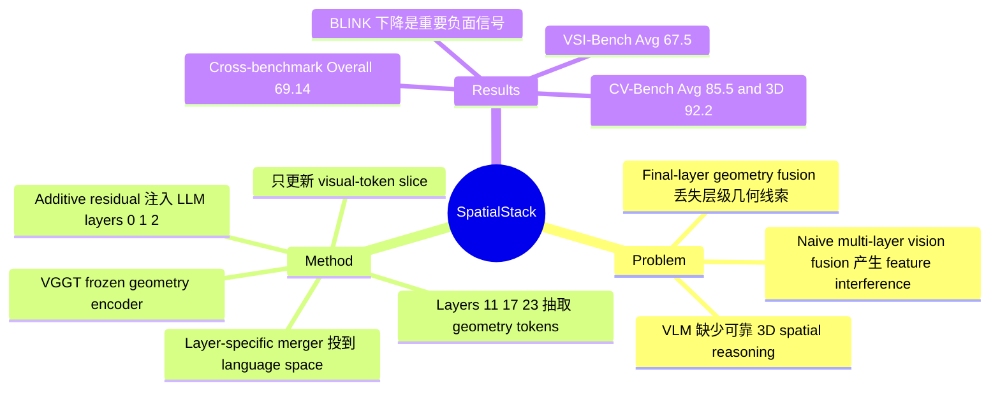

## Summary

SpatialStack 针对 3D VLM spatial reasoning 中 final-layer geometry fusion 丢失 hierarchical geometry cues 的问题，提出把 VGGT 多层 geometry features 逐层注入 LLM decoder 的 geometry-language fusion。VLM-SpatialStack 在 VSI-Bench、CV-Bench 等 benchmark 上提升 open-source 3D spatial reasoning，并通过 layer-wise ablation 显示 shallow/deep geometry layers 分别更利于低层几何感知和高层空间推理。

## Problem & Motivation

现有 VLM 在 3D spatial reasoning 上的主要瓶颈不是缺少语言能力，而是不能稳定编码 3D geometry 和 spatial relationships，并把这些几何信号同语言指令对齐。论文指出，3D-LLM、LEO 等方法依赖外部 point cloud 或 pre-processed RGB-D input，适用性受限；Spatial-MLLM、VLM-3R、VG-LLM 等近期方法引入 DUST3R/CUT3R/VGGT 这类 geometry encoder，但通常只把 final-layer geometry features 与 vision features 融合。

作者的核心动机是：geometry encoder 本身具有层级结构，DPT-style dense prediction 会利用不同 transformer layers 的 multi-level representations，而 spatial reasoning task 也有层级性，从 low-level depth/distance perception 到 high-level object relation/path reasoning。只取深层 geometry feature 会丢掉局部几何边界和细粒度深度线索；直接把多层 geometry features naive 地加到 vision pathway 又会出现 feature interference。因此问题被重新 formulation 为：multi-level geometry features 应该在 VLM 的哪里、以什么顺序进入语言推理过程？

## Method

论文先做了 layer-wise analysis，而不是直接提出架构。定性上，作者把 VGGT 不同层的 tokens 还原到空间网格，对 ROI 做 patch-wise similarity map：shallow geometry layers 保留更清晰的 local structures 和 geometric boundaries，deeper layers 的响应更 homogeneous，容易让物理上不同的区域在 latent space 中变得相似。定量上，作者沿用 VG-LLM 风格的 Geometry-Vision Fusion (GVF)，分别抽取 VGGT 第 4/11/17/23 层 feature 注入 vision encoder 后再进入 LLM，发现 low-level tasks 在 layer 11 最好，而 high-level tasks 随层数加深更好。

SpatialStack 的设计选择是把 geometry integration 从 vision pathway 移到 language side。具体实现 VLM-SpatialStack 时，base VLM 使用 Qwen2.5-VL-3B 或 Qwen3.5-4B，geometry encoder 使用 frozen VGGT-1B。模型从 VGGT layers {11, 17, 23} 抽取 patch-token outputs，去掉 camera/register tokens 后，分别通过 layer-specific geometry token merger 对齐空间分辨率和 `Dlang` 维度，再作为 additive residual 注入 LLM decoder layers {0, 1, 2}。

补充材料说明了更细的融合机制：geometry tokens 会按 merged vision tokens 的 traversal order 重排，经过 RMSNorm、window-wise merging 和 two-layer MLP 投到 language feature space；additive fusion 只更新 decoder hidden states 中的 visual-token slice，system prompt、instruction text 和 autoregressive text tokens 不被直接改写。训练目标是标准 next-token cross-entropy，不引入 auxiliary loss；vision encoder 和 VGGT 冻结，训练 language tower 与 fusion modules。

训练数据约 212k samples，来自 SPAR-234k 的 140k 子集、LLaVA-Hound-64k 的 38.3k 子集、VLM3R-ScanNet 的 31.1k 子集，以及 VSI-590K 中约 1.9k appearance-order samples。训练设置为 1 epoch、effective batch size 64、learning rate 1e-5、AdamW、cosine schedule、warmup 3%，硬件为 32xA100 80GB，sequence length 12,800 tokens。

## Key Results

**VSI-Bench**：SpatialStack-5B (Qwen3.5) 在 open-source models 中排名第一，Avg. 67.5，高于 Qwen3.5-4B 的 53.6、Cambrian-S-3B 的 57.3、VG-LLM-4B 的 47.3、Spatial-MLLM-4B 的 47.0。分项上，SpatialStack-5B 的 Object Count 71.0、Absolute Distance 55.6、Object Size 69.1、Room Size 68.2、Relative Distance 67.3、Relative Direction 84.1、Route Plan 41.2、Appearance Order 83.5；论文特别指出训练中没有 route-planning data，但 Route Plan 仍超过其他 open-source systems。

**CV-Bench**：SpatialStack-4B (Qwen2.5) 达到 2D 75.4、3D 87.0、Avg. 81.2，高于 Qwen2.5-VL-3B 的 Avg. 69.2、VG-LLM-4B 的 79.5、Cambrian-S-3B 的 76.2。SpatialStack-5B (Qwen3.5) 达到 2D 78.9、3D 92.2、Avg. 85.5，相比 Qwen3.5-4B 的 2D 79.7、3D 90.2、Avg. 85.0，主要增益来自 3D subset。

**Cross-benchmark ablation**：在 VSI-Bench / SPAR-Bench / BLINK-Spatial / CV-Bench 的总体平均上，SpatialStack 为 69.14，高于 Qwen3.5 fine-tuned baseline 68.52、GVF-L23 68.43、GVF-L11/17/23 67.99。更细看，SpatialStack 在 VSI-Bench 67.52、SPAR-Bench 71.39、CV-Bench 85.53 都是该表最高，但 BLINK-Spatial 只有 52.12，低于 Qwen3.5 baseline 的 56.10，说明 geometry-language fusion 并非对所有 fine-grained perception benchmark 都单调有效。

**Layer/fusion ablation**：single-layer GVF 中，geo enc layer 11 的 Low-Level Avg 最高，为 66.11；geo enc layer 23 的 High-Level Avg 最高，为 66.36。naive Multi-Layer Fusion 只有 Low-Level 64.69、High-Level 65.15、Overall 64.92，低于最好的 single-layer trade-off，支持作者关于 vision-pathway feature interference 的判断。fusion order ablation 中，SpatialStack final 的 overall 69.14 高于 Vision Fusion 68.38 和 Reverse order 68.52；但 Reverse order 在 SPAR-Bench 为 71.97，高于 final 的 71.39，说明 progressive order 是 overall 最优，不是每个 benchmark 都最优。

**General capability**：相比 Qwen3.5-4B，SpatialStack-5B 在 MMBench 从 83.25 到 83.42、Video-MME 从 62.44 到 63.74、TempCompass 从 66.84 到 69.37；但 BLINK 从 61.12 降到 55.46，overall 从 68.41 小降到 68.00。因此论文的 "no catastrophic forgetting" 有数据支持，但不能理解为所有通用感知能力无损。

**Additional zero-shot CV-Bench**：补充实验中，Ours 在 CV-Bench zero-shot spatial reasoning 上 Overall 86.5，高于 SpatialRGPT 72.7 和 Spatialbot 68.0；分项为 Count 69.0、Relation 92.5、Depth 93.7、Distance 90.7。

## Strengths & Weaknesses

**已知：方法亮点**

1. 论文的核心 insight 比单纯堆数据更有价值：它把 3D spatial reasoning 的层级性同 geometry encoder 的层级 representation 对齐，并用 layer-wise ablation 证明 shallow/deep geometry features 对不同任务层级的作用不同。
2. 架构改动相对简洁：VGGT frozen，多层 geometry tokens 经 projectors 后作为 additive residual 注入 LLM decoder，训练目标仍是 next-token prediction，没有额外 dense geometry loss 或 task-specific objective。
3. baseline 选择覆盖了 base VLM、geometry-aware MLLMs、proprietary models、general multimodal benchmarks 和 fusion variants；Table 1/2/6/7 对 "哪一层、在哪里融合、以什么顺序融合" 都给了直接证据。

**已知：局限与负面信号**

1. BLINK 结果是最明显的 counter-signal：cross-benchmark ablation 里 SpatialStack 的 BLINK-Spatial 52.12 低于 Qwen3.5 的 56.10；general capability 表里 BLINK 也从 61.12 降到 55.46。这说明引入 geometry branch 可能伤害某些 fine-grained visual perception。
2. 论文没有展示 explicit failure cases，也没有单独的 limitations section；因此只能从 ablation 和指标下降处推断边界，而不能知道模型具体错在什么空间关系或场景类型上。
3. 计算开销没有被充分量化。方法需要额外跑 VGGT-1B，并在 LLM decoder 多层注入 geometry residual；论文给了训练硬件、sequence length 和训练配置，但没有报告 inference latency、memory overhead 或相对 base VLM 的 cost。
4. 实验主要是 QA/VQA-style benchmark，不是 closed-loop embodied navigation/manipulation。论文把目标连接到 physical AI 和 embodied systems 是合理动机，但实际结果还没有证明模型能在真实 action loop 中提升成功率。

**推测**

- 对 GUI-agent 的直接价值有限，因为桌面/移动 GUI 多数不是 multi-view 3D geometry；但对 embodied GUI、XR assistant、robot navigation 中的 egocentric multi-view scene understanding 可能有启发：几何信息不一定要先压进 vision tokens，也可以作为 language decoder 中的分层 residual context。
- 如果未来的 computer-use agent 需要从 screen/video 推断 3D layout 或操作空间，SpatialStack 的 "layered geometry-language fusion" 可能比只在视觉侧拼接 depth/point tokens 更稳，但这篇论文没有验证该迁移。

**不知道**

- 论文正文没有给出 DOI，也没有在论文文本中给出 GitHub code link。
- 论文没有充分说明不同 benchmark 与训练数据源之间的 scene-level overlap 排查细节；从文本只能知道训练 mixture 和评测协议，不能独立确认每个 benchmark 的数据隔离强度。

## Mind Map

## Notes

- 这篇论文对 mental model 的更新：geometry-aware VLM 的关键不只是 "有没有 3D encoder"，而是 geometry signals 以什么 granularity、进入哪个 computation space。把 geometry feature 只当作 vision feature augmentation，可能会把不同抽象层级的信号混在一起；把它分层注入 decoder 则给语言推理过程更多控制空间。
- 值得后续追问的实验：如果只冻结 LLM、只训练 fusion modules，会保留多少收益？这能区分收益来自 SpatialStack 架构本身，还是来自 LLM decoder 被 spatial instruction tuning 重新塑形。
- 另一个缺口：缺少 "simple compute-matched baseline"，例如同样增加参数/算力但只用更多 visual tokens、depth map tokens 或 DeepStack-style visual stacking，才能更精确判断 geometry-language fusion 的边际贡献。
