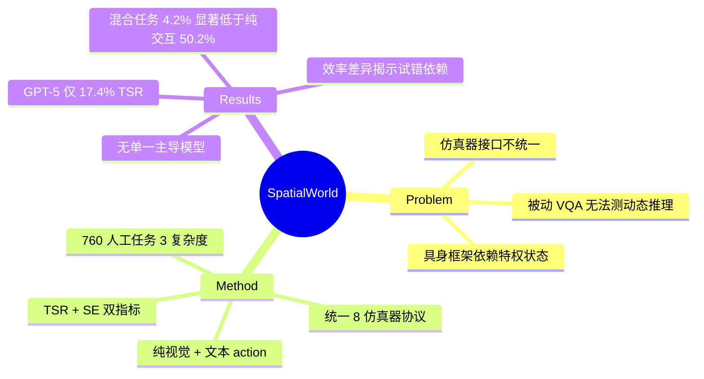

## Summary
提出 SpatialWorld，统一 8 个异构仿真器的交互式空间推理 benchmark，在纯视觉观察 + 文本 action 协议下评估 MLLM agent 的动态空间能力；最强模型 GPT-5 仅达成 17.4% 任务成功率，暴露 MLLM 在长时序物理推理上的严重不足。

## Problem & Motivation
现有空间推理评测存在两大缺陷：被动 VQA benchmark 仅考察静态场景识别，而具身仿真框架依赖特定仿真器且允许 agent 访问特权状态信息（如坐标、语义标签）。真正的交互式空间推理需满足：(1) 纯视觉部分可观察性，(2) 文本原生 action 接口，(3) 跨仿真器统一协议。作者认为从被动识别到主动探索与任务完成是评估 MLLM 物理世界能力的必经之路。

## Method

### 核心设计原则
SpatialWorld 遵循四项原则：
1. **纯第一人称视觉** — agent 仅接收 egocentric RGB 截图，无特权状态信息
2. **跨平台统一** — 将仿真器差异抽象为统一语言接口
3. **分解复杂度** — 同时纳入抽象 3D 游戏和真实具身环境，隔离几何推理与真实语义
4. **执行验证** — 通过终端环境状态而非轨迹匹配判定成功

### 系统架构
标准化五个模块：Environment、Verification、Agent Module、Observation、Action。观察空间为单张 egocentric RGB 截图（原生分辨率，无辅助模态）。动作空间分四类高层动作：Navigation（如 Move）、Viewpoint & Posture（如 Rotate）、Interaction（如 Pick/Place）、Task-Control & Coordination（如 EndTask）。

### 环境套件
整合 8 个仿真后端，分三族：
- **室内仿真**：AI2-THOR、ProcTHOR、VirtualHome — 测试物体定位、有序例程、多 agent 协作
- **室外导航**：CARLA、EmbodiedCity — 评估城市/空中拓扑的长距离路径规划
- **自定义数字游戏**：Block3D、Snake3D、Rubik's Cube — 受控探针，隔离抽象空间逻辑

### Benchmark 构建
包含 760 个人工标注任务，涵盖日常家务（350）、工作/学习（59）、娱乐（173）、旅行（132）、社交协作（46）。定义三级复杂度：Navigation（仅移动/探索）、Interaction（对象状态改变）、Hybrid（组合导航与操作）。构建流程三阶段：标注员设计任务 → 人类执行记录黄金轨迹 → 专家交叉验证。

### 评估指标
- **Task Success Rate (TSR)**：终端目标完全满足的任务比例
- **Step Efficiency (SE)**：成功任务上人类参考步数与 agent 步数的比值

## Key Results

**整体表现低迷**：最强模型 GPT-5 平均 TSR 仅 17.4%，最佳开源模型 Qwen-3.5-397B-A17B 达 14.1%。物理环境 TSR (Physical Overall) 更低：GPT-5 为 14.4%，成功案例多为短时序操作（如开设备）。

**效率揭示试错依赖**：相近 TSR 的模型效率差异巨大。Kimi-K2.5 与 GPT-5.4 在 Physical TSR 相近（9.2% vs 6.6%），但 GPT-5.4 的 SE 更高（0.569 vs 0.486），说明 Kimi-K2.5 更依赖冗余动作。

**无单一主导模型**：GPT-5 和 Qwen-3.5 在 Work 任务并列（16.9%），GPT-5 领先 Travel（6.8%），Gemini-3.1-Pro 领先 Digital 域（39.0%），表明需要多维度评估。

**复杂度瓶颈**：Navigation-Interaction 混合任务 TSR 仅 4.2%，纯 Interaction 达 50.2%，揭示复合瓶颈。不同模型在不同模式下领先，验证分类法捕捉正交能力。

**多 agent 环境**：GPT-5 在社交任务达 34.8% TSR，但大部分信号来自手工设计的 Multi-AI2THOR 布局；程序生成的 Multi-ProcTHOR 仍极难（最佳 5.9%）。

**数字游戏**：顶级模型在导航和 Snake 任务表现出强反应控制，但在需显式几何推理和多步状态变换的游戏（魔方、Block3D）上挣扎。

**感知因素**：分辨率对性能影响微小。更高视野（FOV）整体改善结果但增益饱和；默认 FOV 设为 60° 以近似人类视角。

## Strengths & Weaknesses

**亮点**：
1. **协议统一性**：首个横跨 8 个异构仿真器的统一 benchmark，既有真实具身环境（AI2-THOR、CARLA），又有抽象几何游戏（Block3D、魔方），有效解耦视觉语义与空间推理能力
2. **评测真实性**：强制纯视觉观察 + 文本 action，无特权状态泄露，更贴近 MLLM 实际部署场景
3. **人工标注质量**：760 任务含人类黄金轨迹，三阶段验证确保任务可解性
4. **多维度分析**：TSR + SE 双指标、跨场景/复杂度/模态的 breakdown，揭示不同模型的能力边界

**局限**：
1. **环境覆盖有限**：8 个仿真器无法穷尽真实世界空间场景，sim-to-real gap 仍存疑
2. **动作空间抽象**：文本高层 action 虽便于 MLLM 评测，但绕过了低级运动控制挑战（对比物理机器人）
3. **结果可解释性弱**：论文未深入分析失败模式的根因——是视觉 grounding 失败、规划失误还是探索策略缺陷？缺少定性案例和 error taxonomy
4. **Baseline 不足**：未与专门的具身 agent 方法（如 spatial memory、world model）对比，仅评测通用 MLLM，难以判断差距来自模型架构还是训练数据

## Mind Map

## Notes
- 这篇 benchmark 的价值在于揭示 MLLM 在交互式物理任务上的巨大 gap，但论文更像是"打脸秀"而非"修 bug 指南"——失败案例分析不足，难以指导下一步改进方向
- 统一协议的设计思路值得借鉴，但 8 个仿真器的选择略显拼凑（尤其数字游戏部分），缺乏系统性的能力分解框架
- SE 指标有启发：同样 TSR 下效率低可能意味着 agent 在暴力试错而非真正理解任务结构，这是 MLLM agentic 能力的重要信号
- 对 GUI agent 研究的启示：SpatialWorld 的部分任务（如室内多步操作）与 GUI 多步任务有结构相似性，但 GUI 场景的状态空间更离散、视觉语义更明确，可能不会遇到同样严重的探索瓶颈
