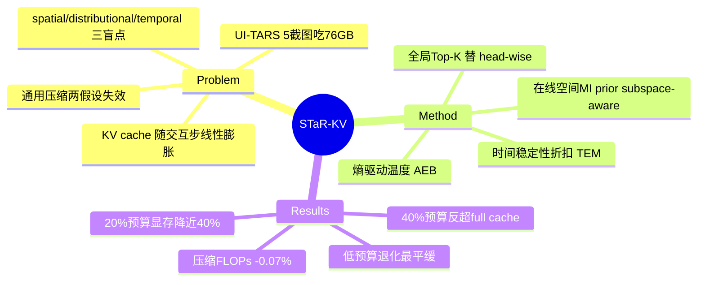

## Summary
STaR-KV 是一个 training-free 的 KV cache 压缩框架，针对 GUI VLM agent 把历史截图存进 KV cache、cache 随交互步数线性膨胀的显存瓶颈：它用三条校准轴（在线空间互信息驱动的 subspace-aware 打分、时间稳定性折扣、熵驱动温度重塑分数分布）替代现有方法"单一共享 saliency map + 固定 top-B 截断"两个结构性假设，在四个 GUI benchmark、匹配预算下取得压缩方法中最优平均精度，且压缩阶段几乎零 FLOPs 开销、20% KV 预算下峰值显存下降近 40%。

## Problem & Motivation
GUI agent 把历史高分辨率截图作为上下文，KV cache 随交互步数线性增长——UI-TARS-1.5-7B 仅 5 张截图就吃 76 GB 显存，逼近主流 80 GB 加速器上限（§1）。已有 KV 压缩方法（general LLM → general VLM → GUI-aware 的 GUIKV）共享两个结构性假设：(1) 把 visual-token 重要性聚合成单张共享 saliency map，把所有 attention head / GQA group 当作空间同质；(2) 对融合分数用固定 top-B 截断，假设分布形状跨帧稳定。

作者用两个 pilot 测量（UI-TARS-1.5-7B + AgentNetBench 轨迹）反驳两者：**空间**上，同层最强 vs 最弱 subspace 与 2D 屏幕坐标的互信息差 3–7×，且主导 subspace 逐层迁移、帧间排序稳定（Spearman ρ>0.85）——共享 saliency map 抹掉了这一层级的信号；**分布**上，归一化注意力熵沿轨迹单调上升、约第 10 步 plateau（渐进 flattening），且帧间方差带每步都跨 0.2–0.3——固定 top-B 无法同时适配跨任务与沿步数的漂移。由此再推出第三个 **temporal** 盲点：受时间稳定 subspace 支配的 token（如持久 toolbar）跨帧累积冗余 cache，单帧空间 profiling 捕捉不到。三个盲点分别对应 spatial / distributional / temporal 三条校准轴。

## Method
STaR-KV 是 inference-time、per-layer、无学习参数的重加权 + 全局 Top-K 淘汰。核心公式把 base score `s̄_t`（GQA group 平均注意力）依次经过三条轴：`s_t = max(s̄_t · β_t · D_t, 0)^(1/T)`，再做全局 Top-K。

- **① Online Spatial Profiling（MI prior，§3.4）**：用 plug-in 直方图估计每个 subspace 的 attention pattern 与 2D 屏幕坐标的互信息 `MI_g`，EMA 跨帧平滑后 softmax 成权重 `w_g`；每个 token 绑定到最响应它的 subspace `g*(t)=argmax_g S[g,t]`，用 `β_t = (1-λ) + λ·G·w_{g*(t)}` 放大 layout-sensitive 信号。`λ` 控制 prior 强度，初始帧线性 anneal。默认在 GQA group 粒度而非 per-head。
- **② Cumulative Temporal Stability Discount（TEM，§3.5）**：对历史 visual token 按其 governing subspace 的跨帧稳定性 `stab`（历史均值与当前的 cosine 相似度）打折，`D_t = D_min + (1-D_min)·e^{-δ·Δ_t·stab}`，压制来自持久 UI 结构的冗余 cache entry，同时保留动态 widget 的 token。只作用于 visual token（text token `D_t=1`），single-image 输入时跳过。
- **③ Adaptive Entropy-Based Sharpening（AEB，§3.6）**：从 base score 归一化熵 `Ĥ∈[0,1]` 导出温度 `T = T_min + (T_max-T_min)·Ĥ`，以 `1/T` 次幂在低熵（peaky）时 sharpen、高熵（flat）时 flatten，替代固定 top-B 截断，且不额外占内存预算。

最终 `TopK({s_t}, B)` 保留 B 个历史 token，再无条件拼接固定 recent window `W_rec`。效率关键：把 SnapKV 的 head-wise Top-K（`O(HL log k)`）换成单个 token-level 全局 Top-K（`O(L log k)`），省下的 head 轴成本抵消四个校准模块的开销。

## Key Results
- **主结果（Table 1）**：UI-TARS-1.5-7B 在 40% 预算下 STaR-KV 平均精度 **49.94（↑0.38%）反超 full-cache 49.75**，> GUIKV 48.92 > SnapKV 47.22 > PyramidKV 45.45；20% 预算 47.31 vs GUIKV 46.59。OpenCUA-7B 在 20% 预算 47.01 vs GUIKV 43.03（**+3.98**），低预算退化最平缓。
- **显存（Table 5，ScreenSpot-Pro / UI-TARS）**：full cache 37.36 GB → STaR-KV 20% 预算 22.97 GB（降约 38.5%，abstract 称"近 40%"），且精度 40.90% 高于同预算 SnapKV(39.22)/GUIKV(39.85)，显存差 ≤0.05 GB；40% 预算 25.43 GB / 41.70% 也略超 full-cache 41.68%。
- **解码 FLOPs（Table 4，AgentNetBench，5 截图）**：full 378.7 MFLOPs/token → 40% 239.8（-36.7%）、20% 187.4（-50.5%），与 GUIKV 差约 1%。
- **压缩阶段 FLOPs（Table 8）**：STaR-KV 155.29M vs SnapKV 155.40M，净 **-0.07%**（-110,269 FLOPs），校准开销被更便宜的选择路径完全摊平。
- **Ablation**：Table 2 组件消融，AgentNetBench 40% 预算 Base 17.2 → STaR-KV 21.1（↑3.9），三模块互补；Table 3 指数衰减优于 linear/gamma；熵驱动 AEB 优于 confidence-based（21.1 vs 19.5 @40%）；online group prior 优于 offline；GQA-group 粒度 ≥ MHA-head；超参在较宽范围内（δ∈[0.1,0.4]、λ∈[0.25,0.75]）不敏感。

## Evidence Ledger

| Claim ID | Claim | Type | Source locator | Evidence excerpt | Status |
|:--|:--|:--|:--|:--|:--|
| C1 | UI-TARS-1.5-7B 仅 5 张截图消耗 76 GB 显存，逼近 80 GB 加速器 | number | Abstract / §1 | "UI-TARS-1.5-7B consumes 76 GB of GPU memory on merely five screenshots, approaching... 80 GB accelerators" | source-verified |
| C2 | UI-TARS 40% 预算 STaR-KV 49.94（↑0.38%）反超 full 49.75，> GUIKV 48.92 > SnapKV 47.22 | comparison | Table 1 | "Full 49.75; STaR-KV 49.94; GUIKV 48.92; SnapKV 47.22" | source-verified |
| C3 | OpenCUA 20% 预算 STaR-KV 47.01 vs GUIKV 43.03（+3.98） | comparison | Table 1 | "OpenCUA-7B 20%: STaR-KV 47.01, GUIKV 43.03" | source-verified |
| C4 | ScreenSpot-Pro 峰值显存 full 37.36 GB → STaR-KV 20% 22.97 GB（≈38.5%），差 ≤0.05 GB | number | Table 5 | "Full 37.36 GB; STaR-KV 20% 22.97 GB; SnapKV/GUIKV 22.99" | source-verified |
| C5 | 压缩阶段 FLOPs STaR-KV 155.29M vs SnapKV 155.40M，净 -0.07% | number | Table 8 | "STaR-KV totals 155.29M FLOPs against SnapKV's 155.40M, a net difference of -0.07%" | source-verified |
| C6 | Pilot 1：同层最强/最弱 subspace MI 差 3-7×，主导 subspace 逐层迁移，帧间排序稳定 ρ>0.85 | causal-mechanism | §1 Pilot 1 / Fig 1a | "3-7x higher MI than the weakest, with the dominant subspace migrating across layers... Spearman ρ>0.85" | source-verified |
| C7 | 解码 FLOPs（5 截图）full 378.7 → 40% 239.8(-36.7%)、20% 187.4(-50.5%)，与 GUIKV 差 ~1% | number | Table 4 | "Full 378.7; STaR-KV 40% 239.8 (-36.7%), 20% 187.4 (-50.5%)" | source-verified |
| C8 | 组件消融 AgentNetBench 40% Base 17.2 → STaR-KV 21.1（↑3.9）；Full KV 25.1 | benchmark-setting | Table 2 | "Full KV 25.1; 40% Base 17.2, STaR-KV 21.1; 20% Base 14.1, STaR-KV 16.5" | source-verified |
| C9 | training-free，四个 GUI benchmark × 两个 7B 开源模型（UI-TARS-1.5-7B, OpenCUA-7B） | benchmark-setting | §4.1 | "two open-source GUI agents... ScreenSpot-Pro, ScreenSpot-v2, AndroidControl, AgentNetBench" | source-verified |

## Strengths & Weaknesses
**亮点**
- **Measurement-driven framing**：两个 pilot（subspace 层级空间 MI 异质性 + 逐层迁移、entropy drift）把"为什么通用 KV 压缩在 GUI 上失效"讲成了可证伪的假设，比单纯刷 SOTA 更有 insight；"空间专门化发生在 attention subspace 而非 head 平均层级"是可迁移的观察。
- **工程干净、部署友好**：training-free、零学习参数、per-layer，且用 token-level 全局 Top-K 替代 head-wise Top-K，使四个校准模块的压缩阶段开销几乎为零（-0.07% FLOPs）。这点比多数需要 head-wise policy 的 KV 压缩方法更适合直接落到现有 GUI VLM。
- **trade-off 有说服力**：40% 预算反超 full cache（暗示相当一部分历史 visual token 是可淘汰的噪声），低预算下退化曲线最平缓。

**局限 / 适用边界**
- **增量性**：相对最接近的 GUI-aware baseline GUIKV，多数预算下平均增益只有约 0.7–4 分；40% 反超 full cache 也仅 +0.19。真正的价值集中在低预算 regime，中高预算差距不大。
- **规模与闭源未验证**：只测两个 7B 开源模型；作者自陈更大 backbone / 闭源系统留待 future work。
- **激进压缩下绝对精度仍崩**：5% 预算 UI-TARS 平均掉到 32.74（full 49.75），方法缓解而非消除压缩损失。trajectory-heavy 的 AgentNetBench 绝对分很低（full KV 也才 25.1，STaR-KV 40% 21.1），headroom 与可比性有限。
- **依赖 online estimation 的稳定性假设**（ρ>0.85）；在 subspace ranking 不稳、或 UI 布局高度动态的场景，MI prior 与 TEM 折扣可能退化。
- **FLOPs ≠ wall-clock**：作者明确 Table 8 是 analytic FLOPs，不含 kernel launch、memory access、sort/gather 的实际延迟，未给端到端加速比或吞吐实测。

## Mind Map

## Notes
- 定位：这是一篇 **inference-efficiency** 论文——压缩的是存进 KV cache 的历史观察上下文，不改变 action 追溯到什么 belief source，与"action 必须追溯到 belief source（pixels/structure/memory/prior）并留下可验证 state change；hybrid observation 会放大 stale evidence"的 thesis 基本正交。唯一切点是 TEM 轴显式 down-weight 来自持久 UI 结构的 stale visual cache entry，但它按 **attention 稳定性（≈跨帧冗余）** 打折，而非按 evidence 是否仍反映当前真实 GUI 状态——因此不能当作 belief-source tracing 或 stale-evidence 检测；反例：若某 token 对应的 UI 已变但仍被高注意力 attended，STaR-KV 不会因此淘汰它。
- Connections：baseline GUIKV 已有笔记 [[2500-GuiKvEfficientGui]]（two-axis：residual-stream saliency + pairwise frame redundancy），本文正是对其"共享 saliency + 固定 cutoff"两假设的直接反驳与升级；可作为 CUA-Survey 中"GUI agent 部署/推理效率"支线的一条数据点。
- 待验证疑问：40% 预算反超 full cache 是普适现象还是 benchmark 特例？若成立，是否说明 GUI 历史 visual token 存在系统性冗余，可用更激进的 prefill-阶段裁剪而非只在 decode 侧压 cache？
