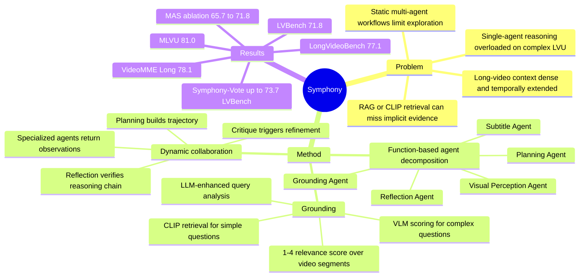

## Summary
Symphony 面向 long-form video understanding 中复杂问题的 grounding 与 multi-step reasoning bottleneck，提出一个 cognitively-inspired multi-agent system，把注意、感知、语言处理、推理/决策拆给不同 agents。它通过 Planning Agent 动态调度 Grounding、Visual Perception、Subtitle agents，并用 Reflection Agent 检查 reasoning trajectory，在 LVBench、LongVideoBench、VideoMME Long、MLVU 上达到论文报告的 SOTA。

## Problem & Motivation
Long-form video understanding 需要在长时间跨度和高信息密度下追踪实体、事件关系与跨片段证据。论文指出，RAG 或 embedding/CLIP retrieval 可以压缩时间上下文，但复杂问题的 retrieval query 难生成，且 noisy video database 会导致关键证据丢失或错配。另一类 agent-based 方法把任务拆成多步 tool interaction，但核心 reasoning 往往仍由单个 LLM 承担；当问题复杂度超过模型能力时，agent 容易退化成浅层动作选择。已有 multi-agent video 方法也存在边界：modality-specific agents 可能增加跨模态信息整合成本，固定/线性协作流程会限制复杂 solution space 的探索。

## Method
### Cognition-inspired agent decomposition
Symphony 按 human cognition 的功能维度拆分 LVU：Planning 与 Reflection agents 负责 reasoning 和 decision-making，Grounding Agent 对应 attention，Subtitle Agent 负责 language processing，Visual Perception Agent 负责 perception。论文强调这不是按 modality 粗拆，而是按能力维度解耦，以降低 agent 之间的信息整合成本。

Planning Agent 是 central coordinator，负责全局 task planning、agent scheduling、信息整合和最终回答。Grounding Agent 根据问题复杂度选择 CLIP-based retrieval 或 VLM-based relevance scoring；Subtitle Agent 分析字幕，支持 entity recognition、sentiment analysis、topic modeling；Visual Perception Agent 调用 frame inspector、global summary、multi-segment analysis 三类工具；Reflection Agent 回看 reasoning trajectory，如果发现逻辑不一致或证据不足，会生成 critique 触发下一轮 refinement。

### Reflection-enhanced dynamic collaboration
协作机制受 Actor-Critic 启发：Planning Agent 是 policy model，基于当前 state `S=(Q, trajectory)` 选择下一个 specialized action；Grounding、Visual Perception、Subtitle agents 执行子任务并把 observation 写入 trajectory。Planning Agent 认为证据足够后给出初始答案，Reflection Agent 再判断 reasoning process 与答案是否 credible。若不可信，Reflection Agent 生成 critique `C`，把它加入 trajectory，让 Planning Agent 重新探索 reasoning path；论文实验中 agent scheduling 与每个 agent 的 tool-call 上限均为 15，Reflection Agent 最大 scheduling rounds 为 3。

### Grounding Agent
论文把复杂 LVU 问题的 grounding 难点归为两类：question ambiguity，以及需要跨 scene 或隐含中间步骤的 multi-hop reasoning。对于简单、实体明确、单场景问题，Grounding Agent 使用 CLIP-based retrieval 返回 top-15 个 10 秒 clips；对于复杂问题，它先用 LLM 分析、扩展、具体化 query，再用 VLM 对非重叠 video segments 做 relevance scoring。VLM scoring 使用 1-4 分标准：4 表示核心元素可见且足以回答，3 表示部分证据，2 表示间接关联，1 表示无关；复杂问题会返回 relevance score 大于 1 的 segments。实现上，Planning/Reflection 使用 DeepSeek R1，Subtitle 使用 DeepSeek V3，Visual Perception/Grounding 使用 Doubao Seed 1.6 VL；VLM scoring 的 segment duration `T=60` 秒，每段采样 30 frames，输入最多 40 frames、分辨率上限 720p；MLVU 和 LVBench 无字幕时用 Whisper-large-v3 提取字幕。

## Key Results
- **主结果**：Symphony 在 LVBench / LongVideoBench (Val) / VideoMME Long / MLVU 上分别达到 **71.8% / 77.1% / 78.1% / 81.0%**。对比表中最强 agent baselines：LVBench 上超过 DVD **66.8%**，提升 **+5.0**；LongVideoBench 上超过 VideoDeepResearch **70.6%**，提升 **+6.5**；VideoMME Long 上超过 VideoDeepResearch **76.3%**，提升 **+1.8**；MLVU 上超过 VideoChatA1 **76.2%**，提升 **+4.8**。
- **LVBench capability breakdown**：Symphony 在 LVBench 的 ER / EU / KIR / TG / Rea / Sum / Overall 上分别为 **70.0 / 69.4 / 77.2 / 70.1 / 69.4 / 72.5 / 71.8**。相较 DVD 的 **68.2 / 65.3 / 76.0 / 70.5 / 63.1 / 61.1 / 66.8**，主要增益来自 EU、Rea 和 Sum；TG 略低于 DVD 的 **70.5**。
- **MAS ablation**：仅 Planning Agent 为 **65.7%**；加入 Reflection 为 **68.2%**；再加入 Subtitle Agent 为 **69.6%**；完整 Symphony 达到 **71.8%**。论文正文解释为：移除独立 Reflection 改为 planning self-reflection 会下降 **2.5%**，把字幕完整塞给 Planning Agent 会下降 **1.4%**，把 Visual Perception 的工具合并进 Planning Agent 会下降 **2.2%**。
- **Grounding ablation**：caption-based retrieval 为 **61.2%**（不含 database construction time，**8.2s**），CLIP-based retrieval 为 **52.2%**（**33.7s**）；Qwen2.5VL-7B + CLIP-based 为 **68.6%**（**37.4s**），Seed 1.6VL + CLIP-based 为 **71.8%**（**54.8s**），Seed 1.6VL-only 为 **72.1%**（**68.6s**）。这说明 VLM scoring 提高 grounding accuracy，但纯 VLM-only 的额外耗时更高，论文采用的是 accuracy-efficiency trade-off。
- **Sampling ablation**：在 LVBench EU subset 上，`FPS=0.5, clip interval=60s` 为 **68.6% / 69.4s**；提高到 `FPS=1, 60s` 为 **70.9% / 74.8s**，缩短到 `0.5, 30s` 为 **70.3% / 79.0s**；降低到 `0.25, 60s` 掉到 **62.1%**，拉长到 `0.5, 120s` 掉到 **64.7%**。
- **Voting upper bound**：三路独立 Symphony majority voting 得到 Symphony-Vote，在 LVBench / LongVideoBench / VideoMME / MLVU 上为 **73.7 / 80.5 / 82.1 / 83.6**，比标准 Symphony 的 **71.8 / 77.1 / 78.1 / 81.0** 高约 2-4 个点；它在 MLVU 上仍低于 LvAgent 的 **83.9**。
- **Foundation model control**：Appendix Table 8 在 LVBench 上重测不同 base models，Ours + Seed 1.6VL / Qwen2.5VL-72B / Qwen2.5VL-7B / GPT-4o 分别为 **71.8 / 68.2 / 65.1 / 67.1**，均高于同表 VideoTree、VideoAgent、VideoRAG、VDR 对应设置。
- **Cost**：Appendix C 报告在 LVBench 上 DeepSeek R1 平均每个 query 消耗 **0.22M tokens**、约 **$0.124**，比 DVD 使用 OpenAI o3 的 **$0.213** 低 **41.8%**；该数字只按论文描述覆盖其主要 LLM API 成本。

## Strengths & Weaknesses
**已知**

- 贡献点不是训练新 backbone，而是把 long-video QA 拆成 query grounding、subtitle analysis、visual perception、planning、reflection 几个功能模块，并用动态 trajectory + critique 扩展 reasoning search space。
- 实验覆盖 commercial VLMs、open-source VLMs、agent-based methods、RAG、token compression 等 baselines；主表、LVBench 细分能力和 ablation 都支持 function-based decomposition 与 reflection 的有效性。
- Grounding Agent 的设计针对复杂问题的 ambiguity 和 multi-hop reasoning，而不是只做 text-image similarity；Fig. 3 的例子展示 CLIP query 无法捕捉 "bribe" 和 temporal sequence，VLM scoring 能把 money/guard/city-entry 等线索纳入。
- 论文提供了推理成本证据，但主要是 DeepSeek R1 token cost；Table 5 同时显示 VLM scoring 带来的 latency trade-off。

**推测**

- 这种按 cognitive function 而非 modality 切分 agent 的思路，可能比简单多模型投票更适合迁移到 GUI-agent trajectory review：先定位关键屏幕片段，再做细粒度视觉检查，最后用 reflection 检查证据链。但这只是类比启发，论文没有在 GUI 或 computer-use 任务上验证。
- Symphony 的提升可能依赖强 planner/verifier 与强 VLM scorer 的组合；Appendix Table 8 说明换 base model 仍有优势，但论文没有系统扫更弱、更小或本地部署模型下的退化曲线。
- Voting 版能继续涨分，说明标准 Symphony 仍有 stochastic / search-space 未充分探索的问题；但三路独立实例的额外成本没有在 Table 7 中量化。

**不知道 / 局限**

- 论文没有系统报告 Symphony 自身的 failure cases、错误类型分布，或 Reflection Agent 何时会给出错误 critique；Appendix 的 case study 主要展示 DVD 失败而 Symphony 成功。
- Benchmarks 都是 long-video understanding QA；对 open-ended dense captioning、temporal localization、online streaming video 或真实 agent 任务的泛化没有实验。
- 该系统依赖多个外部模型/API 与工具链，包括 DeepSeek R1/V3、Doubao Seed 1.6 VL、Whisper-large-v3；代码虽给出链接，但论文没有说明完全本地复现所需的等价开源配置。
- VLM scoring 的 relevance score 由 VLM 生成，论文没有单独评估 scoring rationale 的 calibration 或 segment relevance labels 的 precision/recall。

## Mind Map

## Notes
这篇论文对我的主要启发是：long-video agent 的关键不只是“多几个 agents”，而是把任务中的注意力分配、视觉证据获取、字幕语义处理、最终推理和 verifier 拆成可审计的 functional roles。它与 LVAgent 这类 multi-round collaboration 思路相邻，但 Symphony 更强调 centralized planning + independent reflection + query-aware grounding，而不是主要依赖多 agent 投票或线性讨论。下一步值得追问的是：Reflection Agent 评价的是 visual evidence-grounded reasoning，还是 language-level plausibility；如果要迁移到 GUI / web agent，可能需要让 verifier 强制引用具体 screen timestamp、UI element 或 action evidence，而不是只评价自然语言轨迹是否合理。
