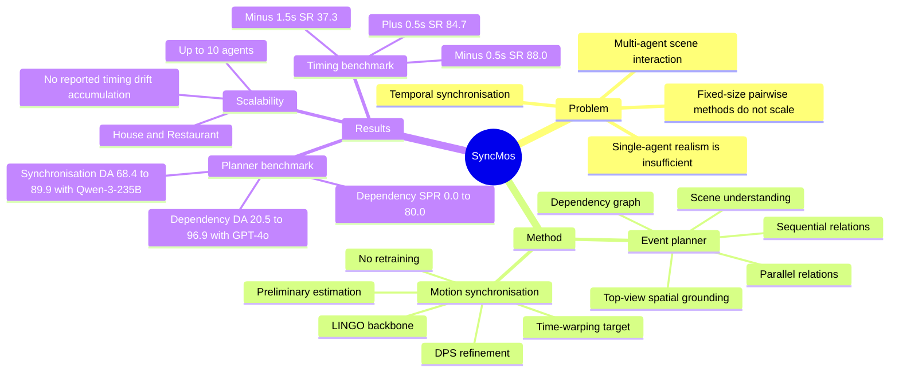

## Summary

SyncMos 解决 multi-agent human-scene interaction 中跨 agent 动作时序不同步的问题：用 LLM 把自然语言任务转成带 sequential/parallel dependency 的事件图，再用 time-warping + Diffusion Posterior Sampling 在不重训 single-agent motion generator 的情况下对齐动作时刻。核心价值是把 multi-agent motion generation 拆成高层 event planning 和低层 temporal synchronisation，从而把 LINGO 这类 single-agent diffusion model 扩展到 2-10 个 agent 的交互链。

## Problem & Motivation

论文关注的是 3D scene 中多个 human/agent 的协作动作生成，例如 handing、receiving、reacting 这类动作不仅要空间上合理，还要满足因果顺序和时间同步。已有 text-guided human-scene interaction 方法多偏 single-agent；已有 multi-agent 方法常固定 agent 数量或依赖 pairwise relationship，遇到新的关系结构或更多 agent 时需要 retraining 或 redesign。作者认为主要缺口在 temporal synchronisation：单个 agent 的动作看起来真实，不代表多个人之间的 handover、receive、respond 会发生在正确时间。

## Method

**Overall.** SyncMos 是一个两阶段框架：上层 text-guided event planner 负责把用户指令和 3D scene context 转成结构化事件图；下层 temporal synchronisation model 负责调用 single-agent diffusion-based motion generator，并在后处理阶段对齐各 agent 的关键交互时刻。实现中 motion backbone 使用 LINGO，但作者把框架描述为 model-agnostic，前提是底层 generator 是 diffusion-based autoregressive motion model。

**Text-guided Event Planner.** Planner 由三个模块组成。Scene Understanding Module 使用 LLM-based scene describer 提取 object relation、scene geometry，并构造 top-view grid，作为自然语言位置描述和 3D scene 的共享坐标系。Dependency-Aware Story Planner 用 few-shot + Chain-of-thought prompting，把用户叙事转成事件图 \(G=(E,R)\)，其中 \(E\) 是 single-actor events，\(R=R_{\text{seq}} \cup R_{\text{par}}\) 同时包含 sequential dependency 和 parallel dependency。Top-View Spatial Reasoner 再把每个事件 grounding 成 \((\texttt{grid}, \texttt{action}, \texttt{hand\_target})\)，为 motion generator 提供目标位置、动作类型和交互对象。

**Temporal synchronisation.** 下层模块先做 Auto-Regressive Preliminary Estimation：对每个 planned event 调用 LINGO 生成 coarse trajectory，但不完整 denoise 到终点，而是在 partial denoising step \(t=30\) 停下，并把中间 diffusion state、timestep 和 conditioning 存入 buffer。随后做 Temporally Guided Refinement：先用 spline-based time-warping 对 preliminary motion 生成目标轨迹 \(y\)，通过指定 key event frame \(l\) 和 offset \(\delta\) 来提前或延后关键动作；再把 \(y\) 当作 noisy temporal observation，用 DPS 的 gradient-guided denoising 优化 L2 timing constraint \(C(\hat{x}_0)=\|y-\hat{x}_0\|^2\)。这个设计的意图是避免直接 time-warping 带来的不自然形变，同时保持 diffusion prior 下的 motion realism。

## Key Results

**Dependency-Aware Story Planner benchmark.** 作者构造了 30 个 multi-character narratives，覆盖 House、Office、Restaurant 三类 scene，其中 Synchronisation subset 15 个场景测试 parallel multi-agent actions，Dependency subset 15 个场景测试 long-horizon causal chains；指标包括 Event Coverage (EC)、Dependency Accuracy (DA)、Passed Scenarios (PS)、Scenario Pass Rate (SPR)。在 Synchronisation subset 上，GPT-4o backbone 下 SyncMos planner 相比 Event-Driven Storytelling baseline 从 EC 88.2 / DA 67.1 / PS 5/15 / SPR 33.3% 提升到 EC 100.0 / DA 86.3 / PS 8/15 / SPR 53.3%；Qwen-3-235B 下 DA 从 68.4% 提到 89.9%，SPR 从 33.3% 到 53.3%。在 Dependency subset 上提升更大：GPT-4o 从 DA 20.5 / PS 0/15 / SPR 0.0% 提升到 DA 96.9 / PS 12/15 / SPR 80.0%；Qwen-3-235B 从 DA 17.2 / PS 1/15 / SPR 6.7% 提升到 DA 84.4 / PS 10/15 / SPR 66.7%；Qwen-3-8B 从 DA 11.8 / PS 1/15 / SPR 6.7% 提升到 DA 81.7 / PS 7/15 / SPR 46.7%。

**Controlled grasp timing benchmark.** Temporal synchronisation model 在 LINGO dataset scene 上构造 15 个 test cases，每个 offset condition 重复 10 次，成功标准是 temporal error 在目标 offset 的 0.1s 内；baseline LINGO 在所有 \(\pm0.5s,\pm1.0s,\pm1.5s\) offset 上成功率都是 0.0%。SyncMos 在 +0.5s / +1.0s / +1.5s 上成功率分别是 84.7% / 78.0% / 76.0%，在 -0.5s / -1.0s / -1.5s 上分别是 88.0% / 75.3% / 37.3%。Table 3 的 realised frame shift 也显示中等 offset 比较稳定，例如 +1.0s 的 mean/std 为 0.944/0.459，-1.0s 为 -0.837/0.262；-1.5s 条件 mean 为 -1.260，说明失败更多来自 shift 不足而非结果方差变大。

**Multi-agent scalability evaluation.** 端到端评估用 House 和 Restaurant 两个 scene 中的 chained handover，agent 数量为 \(N \in \{2,3,5,10\}\)，指标是 Temporal Synchronisation Magnitude (TSM)、Temporal Synchronisation Error (TSE) 和 Contact Distance (CD)。论文没有在正文给出 Figure 6 的精确数值，但文字结论是 TSM 随 agent 数量增加只 mild increase，TSE 没有 temporal error accumulation，CD 在高 agent counts 下仍保持在 reasonably stable range；因此已知证据支持“10-agent chain 上没有明显 timing drift”，但不能从正文精确比较每个 N 的数值差异。

## Strengths & Weaknesses

**已知 Strengths.** 方法把 multi-agent motion generation 的难点拆得比较清楚：LLM 负责 event dependency 和 spatial grounding，diffusion refinement 负责低层 timing 对齐。这个拆分避免了直接训练固定人数 multi-agent model，也解释了为什么它能复用 single-agent generator 并扩展到不同 agent 数量。

**已知 Strengths.** 实验不只报告 qualitative demos，而是把 planner、synchronisation module、end-to-end scalability 分开评估。Planner 表格覆盖 GPT-4o、GPT-4o-mini、Qwen-3-235B、Qwen-3-8B，说明 gain 不是单一 LLM backbone 上的偶然结果；timing benchmark 直接把 LINGO 作为 no-control baseline，并给出不同 offset 下的成功率。

**已知 Weaknesses / boundary.** 大 timing adjustment 会降低稳定性，最明显是 -1.5s offset 成功率只有 37.3%，论文也指出靠近 motion boundaries 时 diffusion process 容易不稳定。同步模块当前在 fixed motion duration 内做 time-warping，不能修改整体 motion length；这限制了需要真正拉长或缩短动作过程的交互。空间 grounding 主要依赖 2D top-view grid，作者明确承认它限制 fine-grained 3D contact reasoning；生成质量也受 LINGO 这个 single-agent backbone 的上限约束。

**已知 limitation / future work.** 作者在结论中列出几个后续方向：加入 physics- or contact-aware constraints，让 planning 和 generation 之间有更紧的 feedback，扩展到更多样或更 interactive 的场景，以及在更多 motion generator backbone 上验证 model-agnostic claim。正文没有给出系统性的 failure taxonomy，也没有说明 ambiguous narrative 下 LLM planner 的错误类型分布。

**推测.** 对 embodied agent / virtual agent simulation 来说，SyncMos 的启发不在于具体 motion metric，而在于“dependency graph + post-generation temporal control”这条路线：先把多 agent 协作变成可检查的 event graph，再把底层生成器当作可约束的 prior。这个思路可能迁移到 GUI/web agent 的 multi-actor workflow simulation 或 embodied benchmark generation，但论文没有验证这些场景。

**不知道.** 论文没有报告训练或推理成本的 wall-clock 数值，也没有给出 Figure 6 的可读表格数值；因此无法精确判断 10-agent chain 的 runtime scaling。论文正文没有提供 arXiv ID、DOI 或代码链接。

## Mind Map

## Notes

- 这篇论文更接近 embodied simulation / motion generation，而不是 GUI agent 或 VLM 主线；我给 3 分是因为它对 multi-agent coordination 和 scene-level planning 有参考价值，但离当前 GUI-agent/VLM/agentic-RL 研究问题还有一层迁移距离。
- 最值得借鉴的是 planner evaluation 的设计：把 dependency accuracy、event coverage、scenario pass rate 分开，能比单纯 demo 更清楚地暴露 LLM planner 是否真的理解 causal/parallel relation。
- 一个潜在问题是 planner 和 motion refinement 的误差传播没有被充分量化。论文证明了 end-to-end handover chain 的趋势稳定，但没有把失败归因拆成 event graph error、spatial grounding error、motion generator error 和 timing refinement error。
