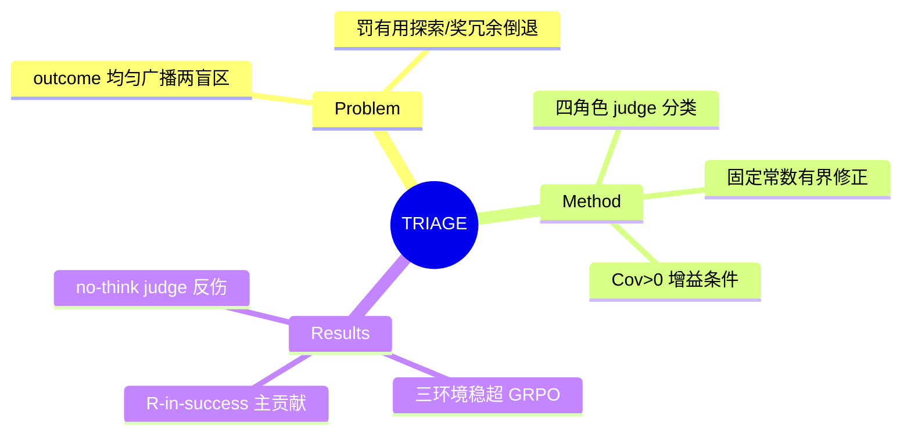

## Summary

TRIAGE 在 GRPO 的 outcome advantage 之上加一个"语义角色轴"：structured judge（Qwen3-8B-thinking）把每个 environment-facing segment 分类为 decisive/exploration/no-progress/regression 四角色，固定常数 (1, 0.5, −0.1, −0.5) 乘系数 λ 加到 outcome advantage 上，修正 outcome-only credit 的两个盲区（惩罚失败轨迹中的有用探索、强化成功轨迹中的冗余/倒退动作）；ALFWorld/Search-QA/WebShop 上稳定超 GRPO（7B +4.8~7.9pp、1.7B 最高 +18.4pp）。

## Problem & Motivation

标准 GRPO 把最终 verifier outcome 均匀广播到所有 action token：失败 rollout 里的有效探索被连坐惩罚，成功 rollout 里的冗余/倒退动作被搭车强化。已有修正路线要么学 value function（不稳定）、要么用 scalar judge process reward（无结构、易与 outcome 冗余）。TRIAGE 的立场：保留 verifier outcome 作为优化方向的唯一来源，process 信号只做**角色级的有界修正**。

## Method

- **Segment 定义**：一个 admissible 动作（一条 ALFWorld 命令 / 一次 WebShop search/click / 一次 Search-QA query 或提交）。
- **四角色**：Decisive（产生 verifier 可查进展）/ Exploration（揭示相关状态无即时完成）/ No-progress（无害但无进展，如重复点击）/ Regression（污染状态或无信息增益的重复）。
- **Judge**：Qwen3-8B thinking 模式，输入目标 segment 前后各 ≤5 个 action-observation 对，**不给最终 outcome**（防 judge 只回声结局）。
- **修正公式**：A = A_GRPO + λ·c_role，常数 (c_D,c_E,c_N,c_R)=(1,0.5,−0.1,−0.5) 从不调参，λ 每环境调（0.2–0.4），batch 内白化后广播到 token。
- **理论**：role-measurable 的最优修正是残差的条件期望 E[δ|ρ]（Prop 1）；固定常数版在 Cov(c,δ)>0 且 λ 在界内时降低 advantage 估计 MSE（Prop 2），等价于 admissible baseline 的方差缩减。**judge 不可靠时协方差可为负，TRIAGE 会差于 GRPO**——增益条件被显式刻画。

## Key Results

- **主结果**（vs GRPO）：ALFWorld 7B 79.6→87.5、1.7B 45.2→56.4；WebShop 7B 70.1→77.2、1.7B 37.5→**55.9（+18.4）**；Search-QA 7B 43.3→48.1。超过 scalar judge process reward（+2.7~5.1，角色类型化本身有增量）和 shared-backbone value baseline。
- **Ablation 的核心发现**：**成功轨迹内的 regression 抑制是主贡献**（去掉 c_R：ALFWorld −6.1、WebShop −4.1，几乎退回 GRPO）；exploration credit 是次要稳定增益（−1.7）。即最有价值的信号不是"给失败轨迹发探索分"，而是"在成功轨迹里找出不该强化的段"。
- **Judge 可靠性是硬前提**：no-thinking judge 的 R-in-success F1 从 86.1% 崩到 29.2%，整体性能掉到 **GRPO 之下**（ALFWorld 76.8 < 79.6）；135 segment 人工审计中双标注者一致率 88.1%。
- **效率副产品**：完成任务的 env-facing turns 减少 10.4%（ALFWorld）/14.8%（WebShop）。

## Strengths & Weaknesses

**亮点**：
- "增益条件化"做得诚实：理论（Cov>0 条件）与实验（no-think judge 反伤）双向刻画了 judge-based process reward 的适用边界，而非只报正面数——是 [[Papers/2607-GRPONullWebAgent]] 式受控叙事在 credit assignment 域的对应物。
- R-in-success 是被前人忽视的信号位：SOLAR-RL 找 first failure point（失败轨迹内），TRIAGE 证明成功轨迹内的 regression 检测贡献更大——对"失败轨迹一等资源化" insight 是一个补充视角：**成功轨迹也含需要抑制的坏段**。
- 固定常数不调参 + λ 单参数的设计克制，理论把它解释为残差在角色变量上的投影，避免了 reward shaping 的任意性。

**局限**：
- 三个环境全是文本态短程任务（ALFWorld/WebShop/Search-QA 均为经典弱 benchmark），无 GUI/视觉 agent、无长程（>30 步）场景；judge 的 ±5 步窗口在 200+ 步任务上是否够用未验证。
- 角色分类学是先验固定的四类——作者自认"role labels are semantic estimates, not ground truth"且 context-dependent；这正是 Supervisor "claim 不能建在先验分类学上"批评的适用对象（不过其分类被降为 reward 系数而非 claim 本身，且有 ablation 支撑主贡献来自 R 类，比纯分类学 claim 扎实）。
- 每 segment 一次 8B thinking judge 调用的训练开销未报告与 GRPO 的 wall-clock 对比。

## Mind Map

## Notes

- **对 RL direction 的定位**：credit assignment 赛道拥挤度再 +1（SOLAR-RL/GiGPO/ProxMO/ADMIRE/DAPO/GUI-Shepherd/TGPO 之后），且 TRIAGE 已把"judge 分类 + 有界修正 + 理论刻画"这个位置做扎实——进一步支持 5/6 的 pivot 判断（放弃 credit assignment、转 rule-based reward design）。
- **对 judge 可靠性 insight 的机制级数据点**：TRIAGE 显式给出"judge 精度 → Cov 符号 → 增益/反伤"的因果链，且量化了阈值现象（thinking 开关翻转成败）。这比 precision 数字本身更进一步：**judge 误差不是加噪声，而是可以翻转干预方向**——可在下次 memory-distill 时并入 "Judge/reward model 可靠性" insight。
- R-in-success 主贡献与 [[Papers/2605-DUDE]] 的非对称 reward（欺骗惩罚 ω=10）同构：process 信号最有价值的用法是**抑制坏行为**而非奖励好行为。
