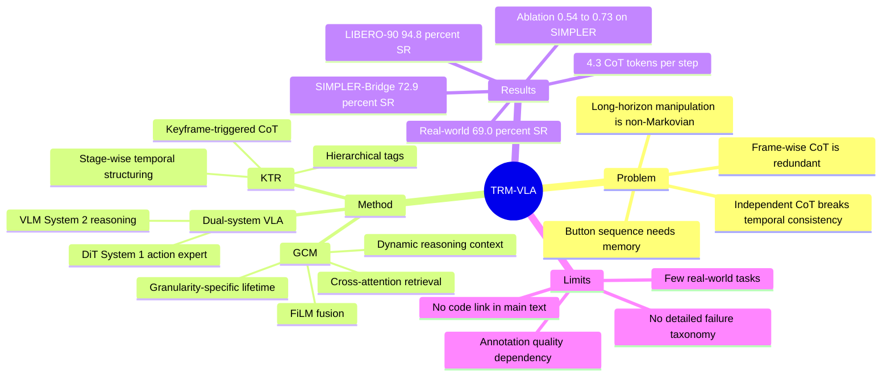

## Summary

TRM-VLA 针对 reasoning-augmented VLA 每帧生成完整 CoT 带来的冗余和跨帧不一致问题，提出 Keyframe-Triggered Reasoning (KTR) 与 Granularity-adaptable Context Memory (GCM)。它只在关键帧生成层级化 CoT，并把历史 reasoning trace 存入动态 memory 供 diffusion action policy 使用，在 SIMPLER、LIBERO-90 和四个真实机器人任务上同时提升成功率和 CoT token 效率。

## Problem & Motivation

现有 VLA 通常把视觉观测和语言指令直接回归到 action，缺少可解释的 intermediate reasoning；近期 CoT-style VLA 虽然引入 reasoning，但常见做法是在每个 timestep 或固定间隔独立生成完整 reasoning trace。论文指出这带来两个具体问题：第一，邻近帧视觉和语言上下文几乎相同时，逐帧 CoT 会产生重复 token 和推理开销；第二，独立逐帧 reasoning 没有历史依赖，容易在 long-horizon / compositional manipulation 中产生前后矛盾的 subgoal sequencing。

作者把问题表述为一个 temporal-aware reasoning formulation：当前 action 不只条件化于当前 observation 和 instruction，还应条件化于 memory-augmented reasoning state。典型例子是按顺序按红、绿、蓝按钮，静态视觉不能告诉模型哪些按钮已完成，因此 frame-wise Markovian reasoning 会重复或跳步。

## Method

**Backbone / dual-system design.** TRM-VLA 建在 CogACT 风格架构上：VLM reasoning module 扮演较慢的 System 2，Diffusion Transformer action expert 扮演快速的 System 1。视觉编码器结合 DINOv2 和 SigLIP，语言侧使用 LLaMA-2 处理 instruction、visual tokens 和 learnable cognition token；action expert 接收融合后的 cognition feature，通过 denoising 生成 action chunk。

**Keyframe-Triggered Reasoning (KTR).** KTR 的核心是只在关键决策点生成 sparse hierarchical CoT，而不是每帧生成完整 CoT。论文沿 ECoT protocol 把 embodied reasoning label 拆成 `task`、`plan`、`perception`、`subtask reasoning`、`subtask`、`move reasoning`、`move`、`gripper position` 等 tag，并用 keyframe indicators 标记三种 granularity：perception keyframe 对应显著场景/物体状态变化，subtask keyframe 对应子目标切换，move keyframe 对应细粒度运动或 gripper 调整。

**Stage-wise Temporal Structuring (STS).** 每条 episode 被分成 early / middle / late 三个阶段：early stage 生成高层 task、plan、perception、subtask/move reasoning；middle stage 在 perception keyframe 上更新感知与中层 reasoning；late stage 在 subtask 或 move keyframe 上更新 low-level command 和 gripper control。训练目标是 causal attention 下的 next-token prediction，使模型同时学习什么时候 reason、reason 哪个层级。

**Granularity-adaptable Context Memory (GCM).** GCM 维护一个 dictionary-style dynamic memory buffer，在新 keyframe 产生 reasoning component 时写入或覆盖同 tag 的条目。不同层级有不同 lifetime：task/plan 主要在 early stage 生成并保留到任务结束；perception、subtask reasoning、move reasoning 中等时长；subtask、move、gripper position 更新更频繁。

**Temporal Reasoning Integration (TRI).** 当前 timestep 用 learnable thinking query 对 memory 中的 reasoning feature 做 cross-attention retrieval，再用 FiLM 把 retrieved feature 与当前 cognition token feature 融合，作为 downstream DiT action policy 的 conditioning signal。这个设计试图避免重复 VLM forward，同时把历史 reasoning 注入当前 action generation。

**Data / annotation.** SIMPLER-WidowX 使用 BridgeData V2 并采用 ECoT annotation；LIBERO-90 使用 ECoT-Lite annotation；真实机器人实验使用 Qwen3-VL 从 video-language-action sequences 自动生成 embodied CoT label。作者还提到用 temporal tracking model 对齐 gripper/object trajectory，并用 unified VLM 做 detection、captioning 和 reasoning，但主文把更多实现细节放在 appendix。

## Key Results

**SIMPLER-Bridge.** TRM-VLA 在 SimplerEnv-Bridge 上达到 **72.9% Avg. SR**，高于 CogACT-Base 的 **51.3%**（+21.6）和 π0 的 **69.2%**。分任务数字为 Put Spoon **83.3% SR**、Put Carrot **75.0% SR**、Stack Cube **41.7% SR**、Put Eggplant **91.7% SR**；对应 grasp rate 分别为 **91.7% / 79.2% / 79.2% / 91.7%**。

**LIBERO-90.** TRM-VLA 报告 **94.8% success rate**，高于 CogACT-Base **88.4%**（+6.4）、CogACT-ECoT **92.1%**、π0-Fast **83.1%**、OpenVLA **73.5%** 和 SpatialVLA **46.2%**。

**Real-world tasks.** 在 AIRBOT Player 的四个真实任务上，TRM-VLA 平均 **69.0% SR**、平均 **4.3 CoT tokens/step**；CogACT-Base 为 **50.0% SR / 1.0 tokens**，CogACT-ECoT 为 **44.0% SR / 26.3 tokens**，ECoT 为 **28.0% SR / 26.8 tokens**。单项成功数为 Place Toy Bear **15/20**、Push Buttons in Order **12/20**、Clean Table **11/20**、Scoop Washers **17/20**。

**Memory-dependent / long-horizon gains.** Push Buttons in Order 需要记住按钮顺序，TRM-VLA 成功率 **67%**，高于 CogACT-ECoT **45%**；Clean Table 为 multi-step long-horizon task，TRM-VLA **72%**，高于 CogACT-ECoT **41%**。

**Ablation on SIMPLER.** 完整 KTR+GCM 在 SIMPLER ablation 中 Avg. SR 为 **0.73**；去掉 KTR/GCM 的基础设置为 **0.54**，有 STS 但无 KBA/GCM 为 **0.60**，有 KBA+STS 但无 GCM 为 **0.65**。作者据此报告 STS 和 KBA 分别带来约 **+6% / +5%**，GCM 中 Dynamic Reasoning Context 和 Temporal Reasoning Integration 分别带来约 **+4% / +5%**。

**Ablation on real-world tasks.** 真实任务 ablation 中，无 KTR/GCM 为 **0.50 Avg. SR**，仅 KTR 为 **0.59 Avg. SR**，KTR+GCM 为 **0.69 Avg. SR**。这支持论文的核心 claim：keyframe reasoning 和 temporal memory 都有贡献，而不是只靠更强 action policy。

**OOD robustness.** 论文在真实世界 lighting、background、distractors、spatial layout、camera pose shift 下比较了成功数下降；主文明确给出的例子是 Push Buttons in Order 在 camera pose variation 下 CogACT success drop 为 **7 trials**，TRM-VLA drop 为 **4 trials**。

## Strengths & Weaknesses

**已知 Strengths.** 这篇论文的 problem formulation 比“给 VLA 加 CoT”更进一步：它指出 embodied control 的 reasoning 不是独立单帧文本生成，而是带有阶段、粒度和历史依赖的 temporal process。KTR 把 reasoning 触发点和 task progress 对齐，GCM 则把高层 plan、中层 perception/subtask reasoning、低层 gripper/move command 的 lifetime 区分开，这个设计比固定间隔 CoT 更贴近 manipulation episode 的结构。

**已知 Strengths.** 实验覆盖了 simulation、LIBERO-90、真实机器人任务、OOD robustness 和 ablation，且关键结果同时报告 success rate 与 CoT tokens/step。尤其 real-world table 中 TRM-VLA 用 **4.3 tokens/step** 获得 **69.0% Avg. SR**，相对 CogACT-ECoT 的 **26.3 tokens/step / 44.0% Avg. SR**，确实支持“少想但在关键处想，并记住之前怎么想”的 efficiency claim。

**已知 Weaknesses / boundary.** 主文没有给出独立的 failure case taxonomy，也没有详细展开失败轨迹；OOD 分析主要是定性图和少量成功数下降例子。它能说明 TRM-VLA 比 CogACT 更稳，但还不足以判断在什么具体视觉/控制失误下 GCM 会误用旧 memory，或 KTR 漏掉 keyframe 会造成什么类型的 cascading failure。

**已知 Weaknesses / boundary.** 真实任务只有四类，每类 20 次评估，且真实数据为 410 expert demonstration trajectories；这足以说明方法在 AIRBOT Player 上可执行，但还不能证明跨 embodiment 或跨场景泛化。SIMPLER 和 LIBERO 的 reasoning labels 来自 ECoT / ECoT-Lite，真实任务 labels 由 Qwen3-VL 自动生成，因此方法效果可能依赖 annotation quality 和 keyframe label quality。

**已知 Weaknesses / boundary.** 论文把 appendix 作为 dataset、metrics、implementation details、holistic ablations 和 visualizations 的来源；主文没有给出完整 hyperparameters、training cost、latency 或 memory buffer 大小。作者用 generated CoT tokens/step 作为 computational cost proxy，因为对比模型共享 backbone，但这不是完整 wall-clock latency 或部署算力开销。

**推测.** 对 GUI agent / computer-use agent，TRM-VLA 的启发不在机器人 action space 本身，而在 temporal reasoning policy：长任务中不应每个 screen 都重新生成完整 plan，而应在 state transition / subgoal boundary 触发 reasoning，并把 task plan、UI state、last action outcome 分层存入 memory。这个外推没有在论文中验证，仍需在 GUI benchmark 上单独实验。

**不知道.** 正文没有给出 code release / GitHub 链接，也没有在页眉出现 arXiv id 或 DOI。也不知道 KTR 的 keyframe detection 在严重 annotation noise 下是否稳健、GCM 在更长任务里 memory overwrite 是否会丢失必要中间状态、以及自动 CoT labels 中错误 reasoning 会如何影响最终 policy。

## Mind Map

## Notes

- 这篇和 ECoT / Fast ECoT 的关键差异是 temporal structure：不是简单复用 thoughts 或减少生成频率，而是把 reasoning granularity 与 task phase、keyframe 和 memory lifetime 绑定。
- GCM 的 dictionary overwrite 设计值得进一步追问：对机器人任务可能足够，因为当前 subtask/move/gripper state 通常覆盖旧状态；但对 web / GUI agent，某些历史状态（例如已提交表单、已切换账号、已下载文件）可能不能被简单 overwrite。
- 如果后续做 GUI agent memory，可以借鉴它的分层 lifetime：global task plan 长期保留，screen-level perception 中期保留，click/type action reasoning 短期保留；关键问题是如何可靠检测 keyframe / subgoal boundary。
