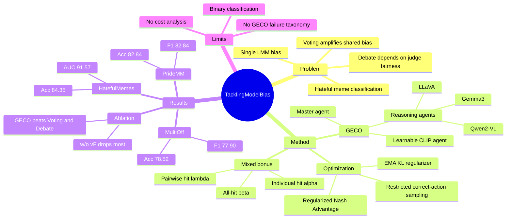

## Summary

GECO 把 hateful meme classification 中的 LMM model bias 问题建模为 heterogeneous agents 之间的 game-theoretic collaboration，用 individual correctness、pairwise agreement 和 all-agent agreement 共同塑造 reward。它在 PrideMM、HatefulMemes、MAMI、HarMeme、MultiOff 五个 benchmark 上超过作者选取的 CLIP-based 和 LMM-based baselines，但证据主要限于二分类 meme benchmark，还不能直接外推到通用多模态 agent 协作。

## Problem & Motivation

Hateful meme classification 需要同时理解图像、文本以及二者之间隐含的社会语义；论文认为 LMMs 的 multimodal reasoning 能力使其适合该任务，但单个 LMM 会受训练数据和训练范式影响产生 cognitive/model bias。已有 multi-agent ensemble 主要是 voting-based 或 debate-based：voting 在多数模型共享同类偏差时会放大错误，debate 则依赖 judge/referee 的公平性和稳定性，judge 自身也可能引入偏差。

作者的核心问题不是“再训练一个更强单模型”，而是：当 LLaVA、Qwen、Gemma 这类 LMM 给出相互冲突的 meme 解释时，系统如何奖励正确解释并推动整体决策向正确共识收敛。论文用 Figure 1 的案例说明，Qwen 和 LLaVA 错判，Gemma 正确识别 latent hateful sentiment；简单多数投票会失败，而 GECO 希望通过 game payoff 让正确 agent 的信号影响整体。

## Method

**Agents.** GECO 包含三类 agent。Reasoning agents 是 LLaVA-1.5、Qwen2-VL 和 Gemma3：它们先用 LoRA 做 lightweight fine-tuning，使输出目标 label token，然后在 game 阶段冻结，只提供最后 token hidden state，经投影进入统一 decision space。Learnable agent 是一个 CLIP-based multimodal classifier：CLIP text/image encoders 产生 token/patch embeddings，再经 Transformer encoder 建模 cross-modal interaction，并用 feature-space fusion 得到表示。Master agent 把 LLaVA、Qwen、CLIP、Gemma 四个 agent 的表示拼接，作为最终 decision-maker 产生二分类 policy。

**Game formulation.** 每个 agent 的 action space 是二元标签 `{0, 1}`，policy head 给出 temperature-scaled softmax policy；最终预测由 master agent 的 policy argmax 得到。论文把策略 profile 记为所有 agents 的 policy 分布，并用 expected utility 优化整体。

**Mixed bonus scheme.** Reward 由三项组成：individual hit bonus `alpha` 奖励 agent 自己预测正确，pairwise hit bonus `lambda` 奖励 agent 与其他 agent 一起预测正确，all-hit bonus `beta` 奖励所有 agent 同时预测正确。默认设置为 `alpha=1.0`、`lambda=0.5`、`beta=1.0`。这比普通 game objective 更直接地鼓励“在正确标签上达成共识”，目标是缓解单一模型或多数模型的偏差。

**Efficient policy learning and stabilization.** 由于每个 agent 是二分类，作者只对 correct actions 做 restricted sampling，并采用 single-step updates 来减少多次采样噪声。训练目标包括 Regularized Nash Advantage loss：用 expected conditional utility 构造 regularized advantage，并通过 stop-gradient 的 centered advantage 更新 policy。另一个稳定项是对 master policy 和 EMA reference policy 之间的 symmetric KL-style regularizer，最终 loss 为 `L_RNA + J_gamma`；实现中 `eta=0.35`、`gamma=0.5`、decision space 维度为 768。

## Key Results

**Main benchmarks.** GECO 在五个公开数据集上报告 SOTA：PrideMM、HatefulMemes、MAMI、HarMeme、MultiOff。Table 1 的主要数值如下；MAMI 列在表中是 Acc/AUC，正文一句话称 “81.50% accuracy and 82.84% F1” 与表格口径不一致，因此这里按表格记录。

| Benchmark | Metric | RA-HMD | GECO | Gain |
|---|---:|---:|---:|---:|
| PrideMM | Acc / F1 | 78.10 / 78.70 | 82.84 / 82.84 | +4.74 Acc |
| HatefulMemes | Acc / AUC | 82.10 / 91.10 | 84.35 / 91.57 | +2.25 Acc |
| MAMI | Acc / AUC | 79.90 / 90.40 | 81.50 / 91.80 | +1.60 Acc |
| HarMeme | Acc / AUC | 88.10 / 93.20 | 89.11 / 93.95 | +1.01 Acc |
| MultiOff | Acc / F1 | 71.11 / 64.80 | 78.52 / 77.90 | +7.41 Acc |

**Agent ablation.** 在 PrideMM / MultiOff 上，full GECO 为 82.84 / 82.84 和 78.52 / 77.90。移除 master/classification agent `vF` 下降最大：PrideMM 到 62.88 Acc / 62.16 F1，MultiOff 到 62.42 Acc / 42.97 F1。单独移除 LLaVA `vL`、CLIP `vC`、Qwen `vQ`、Gemma `vG` 都会降分；两两移除也均低于 full model，例如移除 `{vL, vG}` 时 MultiOff 只剩 72.48 Acc / 67.16 F1。

**Against non-game ensembles.** 在 PrideMM 上，Voting 为 79.49 Acc / 79.37 F1，Debate 为 79.88 / 79.87，GECO 为 82.84 / 82.84；在 MultiOff 上，Voting 为 69.80 / 59.46，Debate 为 73.15 / 70.72，GECO 为 78.52 / 77.90。这个结果支持作者的主张：简单 voting 和 debate 不能充分处理 heterogeneous agents 的 reliability 差异与 judge bias。

**SFT vs GECO variants.** 对单个 LMM backbone，GECO variant 通常优于 SFT：LLaVA 在 PrideMM 从 78.70 / 78.74 提到 81.45 / 81.64，Qwen 从 77.51 / 77.20 到 78.90 / 78.90，Gemma 在 MultiOff 从 65.10 / 65.79 到 76.51 / 71.54。但不是所有指标都提升：LLaVA 在 MultiOff 上 Acc 从 67.79 到 70.46，F1 却从 58.62 降到 57.10，这一点削弱了“所有单模型都稳定改善”的强表述。

**Parameter / case analysis.** All-hit bonus `beta` 在 `[0.9, 1.2]` 范围内表现稳定；pairwise hit bonus `lambda` 过小（`<=0.3`）或过大（`>=0.9`）都会显著降低 ACC 和 F1。Case study 中，voting 和 debate 在 agent disagreement 下给出错误分类，debate confidence 为 `p=8.99%`，GECO 以 `p=99.99%` 正确分类；另一个 visualized case 显示 Qwen 虽初始错判，但 adopting correct action 的 potential utility 为 3.20，高于当前 payoff，而已达正确共识的 agents 处于 `U_i(0)=1.90` 的稳定状态。

## Strengths & Weaknesses

**已知 Strengths.** 方法动机清楚：它不是把 multi-agent collaboration 当作简单投票，而是显式把 individual correctness 与 cross-agent agreement 写进 payoff。这个设计直接针对论文开头指出的 failure mode：多数 agent 共享偏差时 voting 会错，debate judge 也可能被偏差带偏。

**已知 Strengths.** 实验覆盖了主 benchmark、agent removal、reward mechanism、SFT vs GECO、voting/debate comparison、parameter analysis 和 case study。尤其是 `w/o vF` 的大幅下降说明 master agent 不是可有可无的融合头；Voting/Debate/GECO 对比也给出了非 game-theoretic ensemble 的直接 baseline。

**已知 Weaknesses / boundary.** 任务仍是 hateful meme binary classification，不是 open-ended GUI / web / embodied agent interaction；这里的 “agents” 本质上是多个 multimodal classifiers/reasoners，不执行多步 tool use 或环境交互。因此它对 GUI-agent research 的相关性主要在“multi-model consensus under bias”，而不是 action grounding 或 long-horizon autonomy。

**已知 Weaknesses / reporting issues.** 论文没有给出 GECO 自身的系统性 failure taxonomy，也没有报告 variance / statistical significance；部分 baselines 在 Table 1 中有缺失项，跨 benchmark 的比较并不完全均衡。正文在 MAMI 指标上疑似把 F1 与表格 AUC 口径混淆；Section 5.4 文字也把 pairwise hit bonus 与 all-hit bonus 的符号说反，而 Method 和 Figure 4 caption 使用的是 `lambda`=pairwise、`beta`=all-hit。

**已知 limitations from paper.** 作者在 Conclusion and Future Work 中只说未来会 refine optimization and collaboration mechanisms，以支持 more complex multimodal learning scenarios；这相当于承认当前验证还停留在相对受控的 meme classification 场景。

**推测.** GECO 的思想可能启发 GUI/VLM agent ensemble：当多个模型对 screenshot 或网页状态给出冲突解释时，可以奖励“正确且能形成共识”的 agent，而不是固定信任多数票或单个 judge。但这个迁移需要新的 reward definition，因为 GUI/web/embodied 场景的 action space 不是二分类，correctness 也未必每步都有显式 ground-truth label。

**不知道.** 论文没有说明 GECO 的额外训练/推理成本相对单 LMM 或 voting/debate ensemble 增加多少，也没有展示在分布外 meme、不同文化语境、细粒度 target group fairness 上的效果。因此“mitigating model bias”在本文证据中主要等价于提升 benchmark classification accuracy/agreement，而不是更广义的社会偏见消除。

## Mind Map

## Notes

- 和 GUI-agent 的连接点不在任务本身，而在“heterogeneous VLMs disagreement 时如何聚合决策”。可以把 GECO 看成一个 bias-aware ensemble objective 的例子，而不是直接可用的 agent framework。
- 值得追问：如果把 binary label action 扩展到 GUI action schema（action type、target element、coordinate/value），mixed bonus 如何定义才不会奖励表面一致但错误的操作？
- 对未来阅读的提示：需要找有没有工作把 game-theoretic 或 Nash-style objective 用在 multi-agent VLM planning / web-agent decision making 上，而不是只在分类任务中验证。
