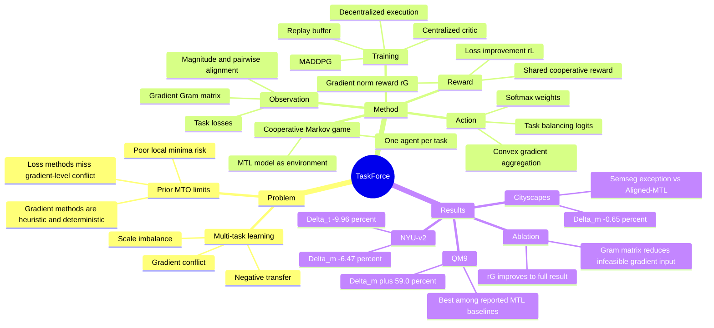

## Summary

TaskForce 把 multi-task optimization 表述为 cooperative Markov game：每个任务对应一个 agent，基于 task losses 和 gradient Gram matrix 输出该任务梯度的 aggregation weight。它用 loss improvement 与 gradient convex-minimization signal 组成 hybrid reward，在 NYU-v2、Cityscapes、QM9 上相对现有 MTL optimization baseline 取得更好的整体指标，但与 GUI-agent / VLM / embodied research 的直接联系较弱。

## Problem & Motivation

Multi-task learning 同时优化多个 task-specific losses，常见问题是 gradient conflict 和 scale imbalance：不同任务的梯度方向冲突或尺度主导会造成 negative transfer。现有 gradient-based MTO 方法直接处理梯度冲突，但多依赖 deterministic heuristic aggregation，论文认为这类方法缺少 stochasticity，可能陷入 poor local minima；loss-based 方法更直观，却通常不显式处理 gradient-level conflict。TaskForce 的核心动机是把 gradient-level 信息、loss-level 进展和 RL exploration 结合起来，让任务级 agents 学习动态的梯度聚合策略。

## Method

**Cooperative Markov game formulation.** TaskForce 将 MTL model 视为 environment，为每个任务设置一个 task-specific agent。第 $t$ 个 agent 的目标不是直接预测模型参数更新，而是输出一个连续 action $a_t$，再经 softmax 得到权重 $w_t$；最终 aggregated gradient 为 $G=\sum_{t=1}^T w_t g_t$，从而保持在 task gradients 的 convex hull 内。

**Compact observation.** 直接把完整 task gradients $g \in \mathbb{R}^{T \times |\theta|}$ 输入 agent 代价过高，因此论文用 gradient Gram matrix $gg^\top \in \mathbb{R}^{T \times T}$ 加 task losses 构造 observation。对每个 agent 而言，observation 包含本任务 gradient magnitude、与其他任务的 pairwise alignment，以及当前 task loss；这个设计依赖 $T \ll |\theta|$，用较小表示保留优化相关信息。

**Hybrid reward.** TaskForce 的 shared reward 是 $R=\lambda_L r_L+\lambda_G r_G$。其中 $r_L$ 衡量 log-transformed task losses 的相对改善，提供 per-iteration loss convergence feedback；$r_G=-\|\sum_t w_t g_t\|_2^2$ 来自 multi-objective optimization 中寻找 common descent direction 的 convex minimization objective，用来鼓励更稳定的梯度组合。实验设置中 $\lambda_L=1.0$，$\lambda_G=1\times10^{-3}$。

**MARL training.** 论文采用 MADDPG 风格的 centralized training with decentralized execution：每个 agent 有 decentralized policy，critic 在训练时访问 joint observations 和 actions。transition 存入 replay buffer 后，先用 agents 的 actions 更新 MTL model，再从 buffer 采样更新 actor/critic。为降低开销，next observation 使用下一条 data point 计算，而不是对同一 batch 额外执行一次 forward/backward。

## Key Results

**NYU-v2 3-task setup.** 在 MTAN architecture、3 random seeds 下，TaskForce 在 NYU-v2 上取得 Semseg mIoU 41.77 / PAcc 66.73、Depth Abs. 0.51 / Rel. 0.22、Normal Mean 24.83 / Median 19.19 / 11.25° 29.27 / 22.5° 56.85 / 30° 69.29，整体 $\Delta_m=-6.47\%$、$\Delta_t=-9.96\%$。对比强 baseline，Aligned-MTL 为 $\Delta_m=-4.93\%$、$\Delta_t=-8.40\%$，NashMTL 为 $\Delta_m=-4.04\%$、$\Delta_t=-7.56\%$。

**Cityscapes 3-task setup.** 在 PSPNet architecture、3 random seeds 下，TaskForce 的 Cityscapes 结果为 Semseg mIoU 66.63、Instseg L1 10.55、Disparity MSE 0.32，$\Delta_m=-0.65\%$。Aligned-MTL 的 $\Delta_m=-0.02\%$，且 Semseg mIoU 为 67.06，高于 TaskForce 的 66.63；论文也明确指出 Cityscapes segmentation 是 TaskForce 相对 Aligned-MTL 的一个例外指标。

**QM9 11-task setup.** 在 MPNN architecture、3 random seeds 下，TaskForce 在 QM9 上的整体 $\Delta_m=+59.0\%$，低于所有报告 baseline：NashMTL 为 +62.0%，IGBv2 为 +67.7%，Aligned-MTL 为 +81.9%，LS 为 +177.6%。需要注意的是，QM9 上 TaskForce 仍是相对 STL 的正向 performance decrement，并不是超过 single-task learning。

**Ablation on cooperative MARL components.** NYU-v2 ablation 显示，加入 Gram matrix observation 后为 $\Delta_m=-2.89\%$、$\Delta_t=-4.05\%$；再加入 multi-agents 后为 -4.26% / -7.19%；加入 centralized training 后为 -5.23% / -8.31%，但 training cost 变为 $\times3.21$；加入 decentralized execution 后 cost 回到 $\times1.00$，结果为 -5.18% / -8.26%；完整加入 gradient reward $r_G$ 后达到 -6.47% / -9.96%。不使用 Gram matrix 的配置因 MTAN shared parameter 约 44.1M，论文只给出 rough training cost $\times2.59$M 且标注 Out-of-Memory issue，没有报告性能。

**Computational overhead.** Per-epoch wall time 表中，TaskForce 在 NYU-v2 / Cityscapes / QM9 上分别为 111 / 257 / 304；对应 MGDA 为 114 / 261 / 332，IMTL 为 112 / 258 / 294，NashMTL 为 109 / 258 / 286，Aligned-MTL 为 111 / 255 / 279，说明它与 gradient/hybrid MTO 方法接近，但明显慢于 LS 的 85 / 168 / 85。组件开销表中，NYU-v2 上 MTL Network gradient computation 为 154.01，Agents inference & compute loss 为 27.84，Agents update 为 17.04；论文据此认为 agent learning 开销小于 task gradient computation。

## Strengths & Weaknesses

**已知 Strengths.** 方法把每个任务显式建模为 agent，并让 agent 基于 gradient alignment 与 loss dynamics 决定梯度权重；这比只在 loss level 重加权更直接触及 negative transfer 的主要来源。Gram matrix observation 是一个清晰的压缩设计：保留 gradient magnitude 和 pairwise alignment，同时避免把 $|\theta|$ 维梯度直接喂给 RL agent。Ablation 支持主要模块的贡献，尤其是 multi-agent specialization、centralized critic、decentralized execution 和 gradient-based reward。

**已知 Strengths.** 实验覆盖 indoor scene understanding、urban scene understanding、molecular property prediction 三类 setting，且 baseline 包含 LS、RLW、DWA、UW、MGDA、GradDrop、PCGrad、CAGrad、IGBv2、IMTL、NashMTL、Aligned-MTL。结果最有说服力的部分不是某一个单项指标，而是 NYU-v2 的 $\Delta_m/\Delta_t$、Cityscapes 的 overall $\Delta_m$、QM9 的 11-task setting 都优于报告的 MTO baseline。

**已知 Weaknesses / boundary.** 论文正文没有系统的 failure case taxonomy 或负例分析；可见的边界包括 Cityscapes segmentation mIoU 不如 Aligned-MTL（66.63 vs 67.06），以及 QM9 上虽然优于 MTL baseline，但仍比 STL 有 +59.0% relative decrement。TaskForce 对 LS 这类简单方法有额外训练开销，在 QM9 上也略慢于 IMTL、NashMTL、Aligned-MTL。实验每个 benchmark 只使用一个主要 architecture（NYU-v2: MTAN，Cityscapes: PSPNet，QM9: MPNN），论文结论不能自动外推到 LLM agent、GUI agent 或 embodied control。

**推测.** 对当前研究兴趣的启发更偏方法论：如果一个 agentic / embodied system 需要同时优化多个目标或 skill，可以考虑把不同 objectives 作为 cooperative agents，并用 compact optimization statistics 而非完整模型梯度来协调。但这只是迁移方向，论文没有在 GUI、VLM、tool-use、robotics 或 embodied benchmark 上验证。

**不知道.** 论文正文没有给出 arXiv id、DOI 或 code URL；也没有报告 reward 权重 $\lambda_L,\lambda_G$ 的敏感性实验、不同 MARL algorithm 的对比、或任务数超过 QM9 11 tasks 时的扩展曲线。由于方法依赖 task gradients，如何应用到非可微目标、online interaction reward 或 long-horizon agent trajectories，论文没有直接回答。

## Mind Map

## Notes

这篇论文对 GUI/VLM/embodied 方向不是直接相关论文，更适合作为 multi-objective / multi-task optimization 的方法储备。最值得带走的 insight 是：当直接观察完整梯度不可行时，Gram matrix 可能是一个足够紧凑的 coordination state，让多个 task-level policies 仍能看到冲突关系。

另一个值得追问的问题是 reward 设计。TaskForce 用 $r_L$ 连接短期 loss reduction，用 $r_G$ 连接 Pareto-style gradient property；如果迁移到 agentic RL，类似结构也许对应 outcome reward 与 process/optimization-shape reward 的组合，但需要新的实验证据支持。
