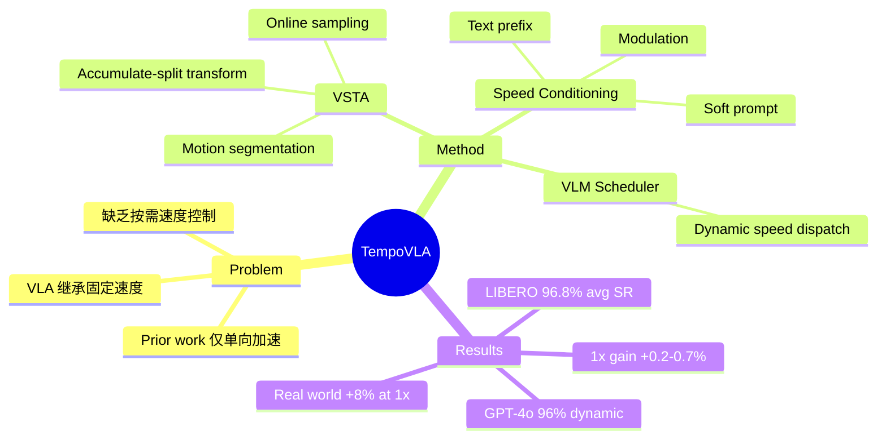

## Summary

现有 VLA 模型从训练演示中继承固定的执行速度，无法按需控制。TempoVLA 通过数据侧的 VSTA（变速度轨迹增强）和模型侧的速度条件机制，使单个 VLA 政策能够在任意速度下执行任务，且 1x 默认性能也获得提升。

## Problem & Motivation

机器人操作任务交替出现低风险 transit phase（需要快速执行）和高风险 contact stage（需要慢速精确），但现有 VLA 模型只能继承演示数据的单一固定速度。此前通过模型压缩、KV-cache reuse、RL finetuning 等加速方法仅能将政策从一个固定速度转移到另一个，且几乎未探索减速场景。核心挑战：让单个 VLA 拥有显式、双向的速度控制能力，无需重新训练基础架构。

## Method

TempoVLA 包含两个轻量级组件：

**1. VSTA (Variable-Speed Trajectory Augmentation)** - 数据侧在线增强策略：
- Motion-consistent segmentation：将演示轨迹按运动模式（still/translate/rotate/translate-and-rotate）和方向变化分割为一致性片段
- Chunk-level speed transform：通过 accumulate-then-split 操作，将 q 帧映射为 p 帧（s = q/p），实现加速或减速，保持累积运动不变
- Online chunk-start sampling：随机化 chunk 起始偏移，确保所有源帧都能成为训练样本

**2. Speed Conditioning** - 模型侧条件注入（三种方案效果相近）：
- Textual prefix：在指令前添加速度描述，无需架构改动
- Speed-modulated RMSNorm：通过 MLP 将速度嵌入添加到 flow-matching timestep embedding
- Soft prompt with speed anchors：为每个训练速度锚维护可学习的软提示 token

**3. VLM Scheduler**：GPT-4o 等大型多模态模型观察场景，为每个 action chunk 分配速度，实现动态速度控制。

## Key Results

**LIBERO 仿真实验**：
- VSTA 可行性：重定时演示在各速度下 replay success rate 从 67.5%（2x）到 97.6%（1x）
- 三种速度注入方案 tied：Text 96.8%、Modulation 96.8%、Soft Prompt 96.5%
- 相比单速度 baseline（96.7%），VSTA 训练的 1x 提升 0.2-0.7 个百分点
- Peak performance 在 1.25x-1.5x，而非 1x（97.0-97.4%）
- 宽速度范围 + 精细粒度最优（{0.5,0.75,1,1.25,1.5,1.75,2}x）
- Model Ratio 在高速端略有 under-shoot（2x command → 1.56x realized）

**真实机器人实验（Franka 7-DoF）**：
- 1x success rate：80%（baseline）→ 88%（TempoVLA），+8 points
- Model Ratio 紧跟 command：0.75x → 0.63x realized，1.25x → 1.29x，1.5x → 1.48x
- GPT-4o 动态调度：96% success rate（+8 over best fixed-speed），平均 1.21x speedup

## Strengths & Weaknesses

**亮点**：
- 方法简洁优雅：核心洞察是 action magnitude governs speed，无需复杂架构改动
- 双向控制：首次系统探索 VLA 的减速能力
- 额外收益：VSTA 作为数据增强提升 1x 性能（+0.2-0.7% sim，+8% real）
- Peak performance shift：揭示演示数据中存在 "pacing slack"，适度加速反而更优
- 动态调度有效：VLM scheduler 显著提升 success rate

**局限**：
- 高速端饱和：low-level controller tracking bandwidth 限制，政策预测的超大 action magnitude 无法准确执行
- 仅限线性可加 action space：VSTA 对 Cartesian translation、joint velocity、axis-angle 有效，但对 quaternion/rotation matrix 需额外处理
- VLM scheduler 偏保守：GPT-4o 大多数决策落在 1x 或 1.25x，1.5x rarely dispatched
- 速度范围有限：2x 以上未充分探索，极端速度 stress test 显示性能下降明显

## Mind Map

## Notes

- 关键洞察简单但有效：无需改变架构，仅通过 action magnitude scaling 控制速度
- Peak performance shift（1.25x > 1x）是一个有趣发现，暗示 teleoperation 数据存在固有 slack
- VLM scheduler 的保守倾向值得深思：是否反映了 GPT-4o 对机器人操作风险的过度谨慎？
- 未来方向：co-tuning low-level controller 以突破高速端瓶颈
- VSTA 的 "线性可加" 限制对多数 action space 不构成问题（EEF pose delta、joint velocity）