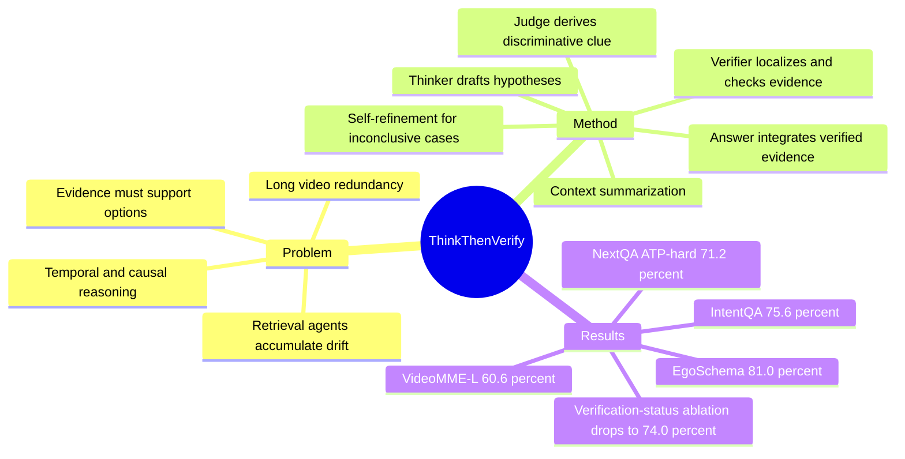

## Summary
VideoHV-Agent 把 long-form VideoQA 从相关性检索改写为 hypothesis-verification：先把每个候选答案转成可验证假设，再生成 discriminative clue、定位证据并验证。论文在 EgoSchema、NextQA、IntentQA 和 supplementary 的 VideoMME-L 上报告 zero-shot SOTA 或强于近邻 agent baseline，同时给出组件 ablation 和时间开销对比。对 VLM / video agent 研究的价值在于，它把“找相关片段”变成“先定义什么证据能证明答案”，但验证质量仍依赖 captioner、LLM 和 clue localization。

## Problem & Motivation
长视频理解的难点不只是视频长，而是 dense visual redundancy、long-range temporal dependencies，以及 CoT / retrieval-based agent 在多轮检索中容易出现 semantic drift 和 correlation-driven errors。已有 long video agent 通常先检索语义相关 clip，再基于检索结果重规划；论文认为这会忽略问题本身的 compositional constraints、temporal ordering 和 causal preconditions，也没有显式检查证据是否支持或反驳某个候选答案。

核心动机是把 VideoQA 的推理顺序倒过来：不要先“搜索看起来相关的信息”，而要先说明“如果某个答案正确，视频里必须出现什么可观察证据”。这个 formulation 对需要跨时间、跨事件判断的 long video QA 比较重要，因为早期检索偏差会在后续推理中级联放大。

## Method
VideoHV-Agent 包含 context summarization、two-step reasoning 和 evidence integration 三个阶段，主要由 Thinker、Judge、Verifier、Answer 四类 agent 协作。

1. Context Summarization：先以 1 fps 抽帧，用 frame-level captioner 得到帧描述，再生成 query-conditioned video summary。论文强调 frame captions 只用于 clip grounding，summary 用于 global reasoning，从而避免把所有 frame captions 拼成一个长上下文。

2. Hypothesis Generation：Thinker 根据问题、选项和 summary，把每个候选答案 `oi` 改写为 hypothesis `hi`。每个 hypothesis 需要明确 key entities / objects、actions / events，以及 temporal / causal constraints；明显不合上下文的选项可以被过滤。

3. Clue Generation：Judge 不逐个验证所有 hypothesis，而是从 hypothesis set 中归纳一个 discriminative clue `κ`，描述最小的可观察差异，例如某个 object interaction、event order 或 visual outcome。这个 clue 是后续检索和验证的目标。

4. Hypothesis Verification：Verifier 用 clue 在 frame-level captions 中定位最可能的 temporal window，然后回到 raw frames 做 fine-grained captioning；每次 detailed captioning 最多处理 5 帧。Verifier 输出 `VERIFIED`、`PARTIAL` 或 `NOT VERIFIED`，并附带 timestamps、entities、relations 等 rationale。

5. Self-Refinement Loop：如果 verification inconclusive，系统可以触发额外检索；如果 `NOT VERIFIED`，则重新生成 hypothesis 和 clue。论文给出两类 regeneration prompt：specificity enhancement 让 hypothesis 更具体可测，discriminability enhancement 增强 hypothesis 间的语义和证据差异。

6. Evidence Integration：Answer agent 综合 summary、clue、verification evidence 和 candidate options，检查 evidence conflict，并输出最终答案与 reasoning chain。

实现细节：EgoSchema 使用 LaViLa 做 frame-level captioner，NextQA / IntentQA 使用 CogAgent；四个 agent 的 LLM backbone 均为 GPT-4o，verification 阶段的 detailed captioning 也使用 GPT-4o。Supplementary 还报告了 Claude-3-Haiku、GPT-3.5、GPT-4o 等不同 backbone / captioner 组合下的对比。

## Key Results
主实验采用 accuracy。已知结果如下：

- EgoSchema subset zero-shot：VideoHV-Agent 达到 81.0%，高于 VideoAgent2 80.6%、VideoMultiAgents 75.4%、LifelongMemory 72.0%、LVNet 68.2% 和 VideoTree 66.2%。
- NextQA：VideoHV-Agent zero-shot 在 val set 为 80.7%，略高于 VideoAgent2 80.5%，低于 supervised LinVT-Qwen2-VL 的 85.5%；在 ATP-hard subset 上为 71.2%，高于 VideoAgent2 68.2% 和 supervised LinVT-Qwen2-VL 69.1%。
- IntentQA zero-shot：VideoHV-Agent 为 75.6%，高于 VideoAgent2 73.9%、VideoINSTA 72.8%、LVNet 71.7%、ENTER 71.5%。
- VideoMME-L supplementary：在 GPT-4o 设置下，Ours 为 60.6%，高于 VCA 56.3%、VideoTree 54.2% 和 CoT 46.7%。
- Component ablation（EgoSchema subset）：full VideoHV-Agent 为 81.0%；w/o hypothesis 为 76.0%；w/o clue 为 78.6%；w/o verification status 为 74.0%。这说明 hypothesis、clue 和 explicit verification status 都不是纯解释性装饰，尤其去掉 verification status 后下降 7.0 points。
- Operational efficiency（EgoSchema subset）：VideoHV-Agent 平均 123.66s / question，accuracy 81.0%；VideoAgent 为 129.46s / 60.2%，VideoTree 为 160.21s / 66.2%，VideoMultiAgents 为 134.90s / 75.4%。Supplementary 还报告 NextQA 74.48s、EgoSchema 123.67s、VideoMME-L 181.82s，且 VideoMME-L 平均视频长度为 2466.7s。
- Backbone-controlled supplementary：GPT-4o + GPT-4o setting 下 Ours 为 81.0%，高于 CoT 66.0%、LVNet 68.2%、LifelongMemory 72.0%；GPT-3.5 + LaViLa setting 下 Ours 为 76.2%，高于 CoT 60.4 和 LifelongMemory 64.0；Claude-3-Haiku + LaViLa setting 下 Ours 为 65.4%，略高于 LifelongMemory 64.8 和 CoT 60.9。

论文还声称在 NextQA 的 Causal、Temporal、Descriptive question types 上都优于 VideoAgent 和 VideoMultiAgents；但正文提取出的 Fig. 6 没有给出可读的具体百分比，因此这里不补写数字。

## Strengths & Weaknesses
已知的优点：

- Problem formulation 清楚：论文把 long video VideoQA 的核心难点从“检索更多片段”重表述为“先定义什么证据能区分候选答案”，这比单纯多轮检索更贴近 causal / temporal QA 的需求。
- 模块贡献有 ablation 支撑：hypothesis generation、clue generation、verification status 分别移除都会降低 EgoSchema subset accuracy，其中去掉 verification status 从 81.0% 降到 74.0%。
- 效率论证有具体时间对比：在 EgoSchema subset 上比 VideoAgent、VideoTree、VideoMultiAgents 都更快，同时 accuracy 更高；supplementary 的 VideoMME-L 时间也支持其不随视频长度线性爆炸的主张。
- Qualitative case 展示了不确定性处理：早期 0:03-0:08 帧无法确认 sewing technique 时，Verifier 输出 `NOT_VERIFIED` 并请求更多 evidence；后续 0:31-0:35 才验证 sewing machine 证据。

已知的局限：

- 方法依赖外部 captioner 和 LLM backbone。主实验中 GPT-4o 同时承担四个 agent 和 detailed captioning，虽然 supplementary 做了 backbone-controlled 对比，但仍不能完全排除 prompt / tool choice 对结果的影响。
- 论文没有提供系统性的 failure case taxonomy。它展示了一个成功的 self-refinement qualitative case，但没有报告失败样本中常见错误来源，例如 temporal localization 错、caption hallucination、clue 过窄或 summary 丢失关键信息。
- `PARTIAL`、`NOT VERIFIED` 的决策可靠性依赖 LLM 自评。论文报告移除 verification status 会显著降分，但没有独立标注 verifier status 的准确率，也没有量化 false verification / false rejection。
- NextQA val set 上 zero-shot VideoHV-Agent 80.7% 仅略高于 VideoAgent2 80.5%，且低于 supervised LinVT-Qwen2-VL 85.5%；因此“整体 SOTA”需要限定在 zero-shot agent / comparable setting 下理解。

推测：

- Hypothesis-verification 对 GUI-agent / embodied video memory 可能有迁移价值，尤其适合把长历史观察中的 action trace 转成“可验证 clue + evidence retrieval”；但论文没有在 GUI、web、robotics 或 embodied benchmark 上实验。
- 该范式可能最适合 answer options 明确的 multiple-choice QA；开放式问答或需要生成长计划的任务中，如何构造 hypothesis set 仍不清楚。

不知道：

- 不知道 VideoHV-Agent 在无人工候选答案的 open-ended VideoQA 中是否仍有效。
- 不知道不同 captioner 的错误是否会被 verifier 放大，还是能通过 self-refinement 缓解。
- 不知道 API cost / token cost 的具体数值；论文只报告了平均时间 cost。

## Mind Map

## Notes
这篇论文对我的启发主要是把 agent reasoning 的“计划”变成可证伪对象：先写出候选答案成立所需的 observable condition，再让检索服务于 verification，而不是让检索结果牵着推理走。

可以后续追问两件事。第一，hypothesis / clue 是否可以被训练出来，而不是完全靠 prompt；第二，verification status 能否用外部 checker 或 human-labeled evidence 来校准，避免 LLM 自评把错误证据包装成 verified。
