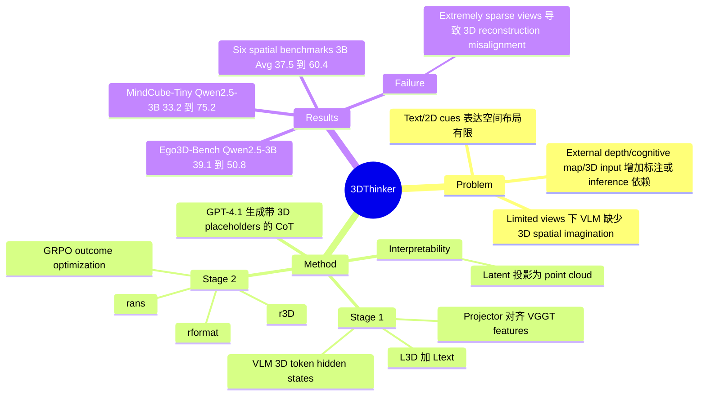

## Summary
这篇论文提出 3DThinker：让 VLM 在推理轨迹中生成 3D special tokens，并将这些 token 的 hidden states 对齐到 VGGT 的 3D feature space，再用 outcome-based RL 优化整体推理。它的核心价值不是多加一个外部 3D 输入，而是在 limited views 的 spatial reasoning 中把几何 latent 变成模型内部可生成、可投影、可可视化的中间状态。

## Problem & Motivation
VLM 在通用 multimodal tasks 上进展很快，但从有限视角理解 3D spatial relationships 仍然困难，尤其是 embodied AI、自动驾驶等场景常见的 ego-centric multi-view observation。已有路线要么依赖纯文本/2D visual cues，表达复杂空间布局的能力有限；要么使用 depth maps、point clouds、camera parameters、cognitive maps 或外部工具，在标注、输入条件和 inference overhead 上有额外约束。作者把目标明确为三点：能从 limited 2D images 中学习 3D geometry，不依赖 dense manual geometric annotations，并且 inference 时不需要外部 geometry encoder 或 auxiliary priors。这个问题对 VLM 和 embodied spatial reasoning 都重要，因为它触及的不是 benchmark trick，而是模型是否能在内部形成可用于推理的空间表征。

## Method
3DThinker 的训练分两阶段，前提是先把普通 question-image-answer 样本改造成带 3D placeholders 的 CoT 数据。给定 multi-view images、question 和 ground-truth response，作者用 GPT-4.1 生成包含 `<|latent start|>...<|latent end|>` 这类 3D special tokens 的 step-by-step reasoning；这些 token 本身不是文本解释，而是用来承载 VLM 内部的 3D latent。

Stage 1 是 supervised training。模型取 3D special tokens 对应的最后一层 hidden states 作为 `F_latent`，结合 image encoder features，经 projector 映射到 VGGT aggregator 的 feature space，并用 Frobenius loss `L_3D` 对齐 VGGT features；同时用 cross-entropy loss 保持 3D token 前后文本的生成连贯性。这里的 "annotation-free" 需要精确定义：论文没有使用 manual geometric annotations 或 cognitive maps，但训练阶段仍依赖 VGGT 作为 3D foundation model teacher，并依赖 GPT-4.1 生成带 placeholder 的 CoT 格式。

Stage 2 是 reinforced spatial mentaling。作者用 GRPO 优化采样轨迹，reward 由三部分组成：`r_3D` 是 projected latent 与 VGGT features 的 cosine similarity，`r_format` 奖励输出格式正确，`r_ans` 是最终答案是否匹配 ground truth 的 0/1 reward；projector 在这一阶段冻结。这样做的意图是让模型在只看 outcome signal 的情况下继续改进 3D latent，而不是只学会一个固定格式。

可解释性来自 VLM-to-VGGT projector：inference 时抽取 3D special tokens 的 hidden states，投影到 VGGT feature space，再经 VGGT 的 DPT 解码成 point clouds。论文的 visualization 显示，重建点云大致覆盖场景结构，清晰区域通常与 prompt-relevant objects 相关；这说明 latent 至少编码了某种 prompt-guided 3D mental scene，但不等价于证明它完全因果地驱动了答案。

## Key Results
- **MindCube-Tiny / Ego3D-Bench**：以 Qwen2.5-VL-3B 为 base，MindCube-Tiny Overall 从 33.2 提升到 62.7（Stage 1）和 75.2（Stage 1+2）；Ego3D-Bench Avg. 从 39.1 提升到 46.7 和 50.8。InternVL3-78B 版本的 3DThinker-S1+S2 在 MindCube-Tiny / Ego3D-Bench 上达到 78.9 / 73.3，高于 o3-2025-04-16 的 56.6 / 73.0。
- **跨 spatial benchmarks**：在 VSI-Bench、SPBench、CV-Bench、SPAR-Bench、ViewSpatial-Bench、MMSI-Bench 的平均分上，Qwen2.5-VL-3B base 为 37.5，SpatialLadder-3B 为 49.6，3DThinker-S1 为 55.3，3DThinker-S1+S2 为 60.4；Qwen2.5-VL-7B setting 中，base / VILASR-7B / 3DThinker-S1 / 3DThinker-S1+S2 分别为 41.1 / 48.4 / 59.4 / 64.7。
- **对 Ego3D-VLM baseline**：3DThinker 在 Ego3D-Bench Avg. 上超过使用 GroundingDINO 和 DepthAnything-V2 构建 cognitive map 的 Ego3D-VLM，例如 Qwen2.5-VL-3B 为 50.8 vs. 44.4，Qwen2.5-VL-32B 为 68.1 vs. 65.5，InternVL3-78B 为 73.3 vs. 71.8；但 InternVL3-38B 上二者同为 68.0，提升并非所有 setting 都显著。
- **training strategy ablation**：在 MindCube-Tiny 上，3DThinker-S1Qwen2.5-3B 的 Overall 为 62.7，高于 raw-QA SFT 52.3、CoT SFT 53.4、Plain-CGMap-FFR-Out-SFT 60.8；Stage 2 后达到 75.2，高于 cognitive-map-based SFT+RL baselines 的 70.7。
- **关键设计 ablation**：latent size 12 最好，MindCube-Tiny 为 62.7；size 32 / 64 降到 25.1 / 15.5，作者归因于过大 latent 破坏自然表达并导致重复 `<|latent start|>`。3D token 放在 middle 时 Accuracy 只有 42.0，放在 end 为 74.3，完整设计为 75.2；去掉 `r_ans` 降到 64.2，去掉 `r_3D` 降到 68.3，去掉 `r_format` 仍有 74.8。
- **3D loss 与泛化**：去掉 `L_3D` 后 Qwen2.5-VL-3B 在 MindCube-Tiny 上从 62.7 降到 54.1，但仍略高于 CoT SFT 的 53.4。补充实验中，3DThinker 在 3DSRBench 上为 65.6，高于 SpatialReasoner 60.3、SpatialReasoner-R1 55.7、SpatialThinker 56.4；在通用 VLM benchmarks 上，POPE 从 85.9 到 88.4，SEED-I 从 77.0 到 78.9，但 MMEC 从 623 降到 610。

## Strengths & Weaknesses
**已知的强点**：方法抓住了 limited-view spatial reasoning 的核心瓶颈：不是让 VLM 多说几步文字，而是让推理轨迹中出现一个可对齐到 3D foundation model 的 latent channel。相比 cognitive map 方法，它不需要 BEV/cognitive-map annotations；相比 depth/tool-use 方法，它在 inference 时不调用外部 3D tools。实验覆盖 Qwen2.5-VL、InternVL3、Qwen3-VL、LLaVA-OneVision-1.5，以及 single-image / multi-view spatial benchmarks，证据面比较宽。

**已知的局限**：论文的 "annotation-free" 不是完全无监督，它仍需要 GPT-4.1 生成 CoT placeholders，并在 Stage 1/`r_3D` 中依赖 VGGT features。失败案例显示，在极稀疏视角下，重建点云会把带两幅照片的墙放错到窗口右侧，从而导致 rear object spatial position 推理错误；这说明 3D mentaling 的质量受输入视角约束。作者也报告 Travel Time 等需要 richer contextual information 的子任务相对弱，latent size 过大还会破坏文本生成。训练成本并不轻：Qwen2.5-VL-3B 在单张 H200 上 supervised training 约 21.84 h，RL 约 12.85 h。

**推测**：这类 latent 3D token 对 embodied agent 和 GUI/world interaction 的潜在价值在于把 spatial memory / scene representation 放进推理轨迹，而不是只作为输入 feature；但是否能迁移到 navigation、mobile manipulation 或 GUI automation 的 long-horizon action planning，还需要 action-grounded benchmark 证明。

**不知道**：论文没有证明可视化出来的 point cloud 与最终答案之间存在严格因果关系，也没有系统回答在真实机器人传感器噪声、动态场景、更多视角或连续视频下是否仍稳定。它主要报告 spatial QA / multiple-choice / numerical QA 结果，还没有展示闭环 embodied task success rate。

## Mind Map

## Notes
这篇论文对我的主要启发是：spatial reasoning 的中间表征不一定要显式写成 textual map，也不一定要把 depth/point cloud 当输入；可以把 3D representation 作为 reasoning trajectory 中的 latent token，并用可解释 projector 约束它。需要继续追踪的问题是，这个 latent channel 是否只是 improved spatial QA 的训练技巧，还是能成为 embodied agent 中可复用的 spatial memory / planning substrate。
