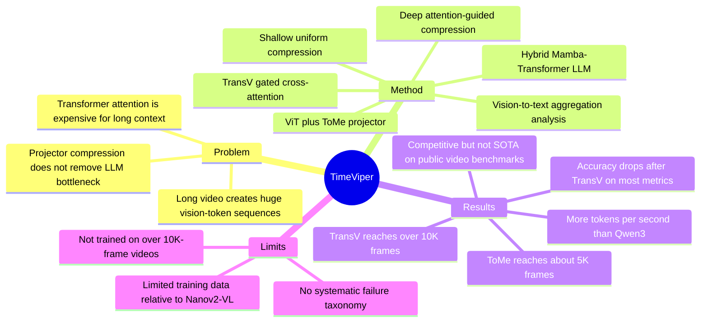

## Summary
TimeViper 是一个面向 long video understanding 的 hybrid Mamba-Transformer MLLM：用 hybrid backbone 获得更低长上下文成本，用 TransV 在 LLM 内部把 vision token 信息转移并压缩到 instruction token。论文的主要 insight 是 hybrid MLLM 中存在 vision-to-text aggregation 和深层 vision token redundancy，并用这个现象换取 `>10K` frame 输入能力；但作者也承认当前性能仍低于部分 SOTA，且模型没有在 `>10K` frames 视频上训练。

## Problem & Motivation
长视频理解的核心瓶颈不是只在视觉 encoder 端。论文给出的例子是：一小时视频按 1 FPS 采样、每帧 768 个 vision tokens，会产生约 2.7M tokens，甚至超过 Gemini 的 million-token context 量级。现有方法常在 projector 之前或 projector 层做视觉压缩，但 long video MLLM 的主要计算瓶颈仍然在 LLM 内部，因为压缩后的长序列还要经过数十亿参数的语言模型。

作者把问题拆成两个子问题：第一，Transformer attention 的二次复杂度不适合很长的视频上下文，因此需要更高效的 backbone；第二，即使有更高效的 backbone，长视频 vision tokens 仍有大量冗余，需要在 LLM 内部继续压缩。TimeViper 的动机不是证明 Mamba 一定优于 Transformer，而是探索 hybrid Mamba-Transformer LLM 是否能在长视频场景里同时保留 attention 的表达能力和 SSM 的效率。

## Method
**Model architecture.** TimeViper 遵循标准 MLLM 结构：ViT visual encoder、projector、hybrid Mamba-Transformer LLM。LLM backbone 包含 27 个 Mamba-2 layers、4 个 self-attention layers 和 25 个 MLP layers。projector 使用 ToMe 做 token merging，把每帧从 768 个 vision tokens 压缩到 16 个 tokens。

**Information-flow analysis.** 作者先训练一个 hybrid MLLM，然后在 VideoMME 的 MCQ、Charades 的 temporal video grounding 和 VDC 的 detailed captioning 上分析 token 信息交换。具体做法是在 autoregressive generation 中用 attention mask 阻断 vision-to-instruction (V2I) 或 vision-to-response (V2R) 的信息流。观察结果是：MCQ/TVG 这类 instruction-centric tasks 中，视觉信息会随着层深逐渐被 instruction tokens 吸收；VDC 这类 vision-centric task 中，浅层 vision tokens 对 response generation 仍更直接重要。

**Vision token redundancy.** 作者在不同层用 uniform dropping 和 attention-guided dropping 移除 vision tokens，发现 redundancy 随层深增加。论文声称在深层即使丢弃全部 vision tokens，模型仍可依赖 instruction tokens 保持较高性能；但浅层 vision tokens 仍关键，尤其 TVG 在第一个 attention layer 之前过度丢 token 会伤害性能。

**TransV.** TransV 是 LLM 内部的 token information transfer module。它用 Gated Cross-Attention 让 instruction tokens 作为 query，vision tokens 作为 key/value，把被认为冗余的视觉信息转移到 instruction tokens 中，然后丢弃部分 vision tokens。默认配置是在第 7 层用 uniform TransV、drop rate `p=50%`，在第 39 层用 attention-guided TransV、drop rate `p=90%`；TransV 额外引入约 100M 参数。

**Training.** 训练分两阶段：第一阶段用 3M CC12M + PixelProse image-text pairs 只训练 projector 做 image-text alignment，禁用 token compression；第二阶段在约 4.8M multimodal instruction pairs 上 fine-tune projector、LLM 和 compression modules，其中包括 1.8M video instruction data、2.8M single-image instruction data、26K dense video captioning samples 和 250K temporal video grounding samples。训练和评测按 1 FPS 采样；训练时超过 256 frames 的视频被 uniform sampling 到 256 frames。

## Key Results
**Efficiency / capacity.**

- 在 32k input tokens（约 2k frames，每帧 16 tokens）、1k output tokens、batch size 32 的设置下，TimeViper 比 Qwen3 多生成 40.1% tokens/s。
- vanilla model 在 128 frames 就 OOM；仅用 ToMe 的 TimeViper 可扩展到约 5K frames；加入 TransV 后可处理 `10K+` frames。
- 在 4,096 frames 时，TransV 相比仅 ToMe 的 TimeViper 降低 54.8% GPU memory，并降低 15.7% prefilling time。64 frames 时 vanilla prefilling latency 为 4.5s，TimeViper 降到 0.4s。

**Main benchmark table.**

- TimeViper w/ TransV 支持 `>10K frame input`，在 Table 2 中取得：MVBench 56.2 avg.acc、LongVideoBench 52.0 val、MLVU 63.1 M-Avg、VideoMME 56.9 overall / 48.2 long、LVBench 35.6 avg.acc、Charades-STA 37.9 mIoU、VDC 39.1 avg.acc。
- 不加 TransV 的 TimeViper 在相同表中更高：MVBench 57.2、LongVideoBench 54.1、MLVU 65.6、VideoMME 58.8 overall / 48.8 long、LVBench 35.5、Charades-STA 40.5、VDC 39.7。也就是说，TransV 的主要收益是 frame capacity 和效率，不是无损提升准确率。
- 与部分 baselines 相比，TimeViper 的亮点集中在若干任务：不加 TransV 的 TimeViper 在 Charades-STA 上 40.5 mIoU，高于 VTimeLLM-13B 的 34.6；VDC 上 39.7，高于 AuroraCap 的 39.0；TimeViper w/ TransV 在 LVBench 上 35.6，高于 Gemini-1.5-Pro 的 33.1。
- 但它不是整体 SOTA：VideoChat-Flash 在 MVBench 73.2、LongVideoBench 64.2、MLVU 74.5、VideoMME 64.0、LVBench 47.2、Charades-STA 48.4 上明显更强；Qwen2.5-VL 在 VideoMME 65.1、Charades-STA 43.6 上也高于 TimeViper。

**Ablations.**

- Table 1 中，baseline `none` 可处理 5K frames，VideoMME 58.8、VDC 39.8、Charades 40.5。
- 只做 uniform token dropping `TDuni 7 0.5` 可到 8K frames，但 Charades 从 40.5 掉到 26.1；对应的 TransV `uni 7 0.5` 也是 8K frames，Charades 为 38.1，说明 transfer 比直接 drop 更能保留 TVG 信息。
- 单层高压缩 `uni 7 0.9` 可到 `>10K` frames，但 VideoMME 从 56.7 掉到 53.4，VDC 37.9，Charades 34.6。
- 两层压缩 `uni 7 0.5-attn 39 0.9` 可到 `>10K` frames，并保持 VideoMME 56.6、VDC 39.1、Charades 37.9；相比深层 uniform 版本，attention-guided deep TransV 在 VideoMME 上 56.6 vs 56.2，差异不大但略好。
- Appendix Table 4 显示 TransV 也可用于 Qwen2.5：Qwen2.5-7B 从 MVBench 57.6、LongVideoBench 55.4、MLVU 64.9、VideoMME 56.6、VDC 42.0 变为 w/ TransV 的 55.7、53.7、63.3、55.7、40.7；LVBench 从 36.6 升到 37.0，但 VDC 降幅比 Nano 更大。

## Strengths & Weaknesses
**已知的优点。**

1. **问题切得清楚。** 论文没有只说“长视频需要更长上下文”，而是指出 projector 前压缩不能解决 LLM 内部长序列计算瓶颈。
2. **方法和分析有闭环。** vision-to-text aggregation 的 blocking analysis 先给出观察，再用 TransV 把这个观察工程化为 LLM 内部 compression module。
3. **效率结果具体。** `40.1%` tokens/s 提升、`54.8%` memory reduction、`15.7%` prefilling reduction、`5K` 到 `10K+` frames 的容量变化，都是比较清楚的工程证据。
4. **baseline 选择有一个关键控制。** 作者用同样 training recipe 训练 Qwen2.5-7B baseline，用于隔离 architecture 和数据规模；结果显示 Qwen2.5 与 TimeViper 接近，因此论文没有强行声称 hybrid backbone 在所有质量指标上碾压 Transformer。

**已知的局限。**

1. **TransV 有明确 accuracy tradeoff。** Table 2 中 TimeViper w/ TransV 在 MVBench、LongVideoBench、MLVU、VideoMME、Charades、VDC 上都低于不加 TransV 的 TimeViper，只有 LVBench 35.6 略高于 35.5。
2. **`>10K frames` 更像 capacity claim，不等于已证明模型学会 hour-long reasoning。** Appendix 明确说虽然 TransV 允许处理超过 10,000 frames，模型并没有在这种长度的视频上训练。
3. **训练数据和算力限制影响结论。** 作者说明多数 baseline fine-tune ViT，而 TimeViper 因计算限制没有 fine-tune ViT；Nanov2-VL 使用 46.7M samples，而 TimeViper 使用 7.8M samples，因此 Nanov2-VL 被视作 hybrid model upper bound。
4. **failure cases 仍偏少。** 论文有 qualitative examples，也提到 VDC 中可能出现 hallucination / factual errors，但没有系统化 failure taxonomy。
5. **表文有一个小不一致。** 正文称 TimeViper w/ TransV 在 VideoMME 上为 56.2、比 Video-XL 55.5 高 0.7；但 Table 2 中 TimeViper w/ TransV 的 56.2 对应 MVBench，VideoMME overall 是 56.9。

**推测。**

- 对 GUI agent / embodied agent 的价值主要在“长时视觉历史压缩”而不是 GUI grounding 本身。若 agent 需要从长 screen recording、egocentric video 或操作日志中检索历史状态，TransV 这类把视觉信息汇入 text/instruction tokens 的机制可能有用；但论文没有在 GUI benchmark、computer-use task 或 embodied control task 上测试。
- hybrid Mamba-Transformer 对长视频的优势可能会随输入长度变得更明显，但在主 benchmark 上，质量仍强烈受训练数据、ViT fine-tuning 和 compression strategy 影响。

**不知道 / 未验证。**

- 不知道 TransV 在真实 `>10K` frames 视频语义任务上是否比 retrieval / frame sampling 更强，因为论文承认没有在这种长度上训练。
- 不知道该方法是否能稳定处理字幕、音频、多轮 agent trace 或带 action 的 video history；本文只覆盖 video QA、temporal grounding 和 detailed captioning。
- 不知道 project page 是否会发布完整训练代码；论文正文只给出 project page，没有在文本中给出 GitHub code repository 或 DOI。

## Mind Map

## Notes
- **我的判断**：rating=4。它不是因为 SOTA 必读，而是因为它把 hybrid Mamba-Transformer、长视频 token redundancy、LLM 内部视觉压缩和 interpretability 放在了同一个实验闭环里，对 video-LLM 方向有参考价值。
- **对研究方向的启发**：如果把 GUI / embodied agent 的长期观察历史看作 video memory，TimeViper 的问题 formulation 很有价值：关键可能不是“保留所有 frame”，而是识别哪些视觉信息已经迁移到 task/instruction state，哪些信息必须保留为可检索视觉证据。
- **我不完全买账的地方**：论文的效率收益很实在，但主表已经显示 compression 牺牲性能；后续引用时应把它表述为 efficient long-context capacity 方法，而不是更强的 long-video understanding model。
- **后续可查**：project page 是否发布代码、是否有训练 recipe 细节、是否能在字幕/音频/agent trace 上复现 vision-to-text aggregation，以及 `>10K` frames 真实任务上的性能曲线。
