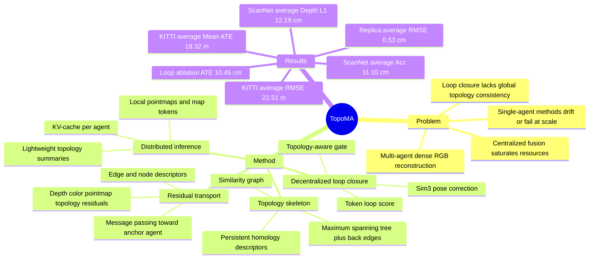

## Summary
TopoMA 面向多 agent dense RGB 3D reconstruction，把场景拓扑显式建成 topology skeleton，并用它约束 tracking、loop closure、submap fusion 与 residual transport。核心贡献是把 end-to-end pointmap reconstruction 从单 agent / centralized setting 推到 fully distributed inference：每个 agent 维护本地 map，只交换轻量拓扑摘要，同时通过 topology-guided correction 维持全局一致性。

## Problem & Motivation
多 agent 3D reconstruction 对大规模 VR/AR、robot swarms、digital twins 很重要，因为单个 agent 覆盖复杂场景效率低，且容易被遮挡和长轨迹 drift 限制。已有 end-to-end 3D reconstruction / dense RGB SLAM 方法主要为单相机、单轨迹设计，直接扩展到多 agent 时会遇到 unstable tracking、memory consumption 过高、loop closure failure 和跨 agent scale inconsistency。

作者特别区分了两类不理想方案：一种是各 agent 独立建图，结果容易出现 scale drift 和 map inconsistency；另一种是 centralized server 汇总计算，容易 saturate GPU/CPU resources，而且 loop closure 仍依赖局部几何启发式，无法强制全局 topology consistency。因此论文的 problem formulation 不是单纯并行化 SLAM，而是在通信受限和异构轨迹下学习一个 scene-level topology skeleton 来指导分布式建图。

## Method
**Topology-Geometric Modeling and Optimization.** 每个 agent 接收 RGB images 后，front-end 的 causal incremental attention 生成 local point clouds $P_{m,t}$ 和 map tokens $F_{m,t}$，并用 KV-cache 复用历史 point clouds / tokens。系统用 persistent-homology-based descriptors 计算 pairwise topological distance / similarity，构造 similarity graph，再通过 maximum spanning tree 加 candidate back edges 得到 topology skeleton $T=(V,E_T)$；当 topological similarity 超过阈值时才融合 point clouds，并额外每 100 frames 做一次 regular global update。

**Topology-regularized global attention.** 各 agent 的 local point clouds 和 features 被映射到 global memory pool $Z$。Back-end global attention 不只看 token similarity，还把 topological distance 作为 attention bias，鼓励模型关注拓扑相近的 point clouds；更新后的 token 被用于回归每个 agent / timestep 的 Sim(3) pose correction $\Delta T_{m,t}$ 和 fusion weight $w_{m,t}$，进而得到 globally aligned point cloud。

**Decentralized Loop Closure.** 对任意 view pair，系统用 map tokens 经小 MLP 得到 loop score，并用 topology-aware gate 过滤 spurious matches：只有 appearance score 超过 $\tau_{loop}$ 且 skeleton geodesic distance 小于 $\delta_{topo}$ 的 pair 才成为 loop edge。Loop edge 与 skeleton tree edges 一起进入 topology-regularized pose refinement；论文强调这是 server-free / asynchronous 的设计，不依赖 centralized global optimizer。

**Residual Transport.** 对每条 topology / loop edge，TopoMA 计算 depth、color、pointmap、topology 四类 residual，再用 permutation-invariant aggregator 压缩成 edge descriptor；节点再聚合 incident edge descriptors，并沿 topology skeleton 做 message passing。实现上以 designated anchor agent 为根，把 residual 信息向 anchor transport，使其他 agent 只保留 local summaries；对应 loss $E_{trans}$ 与 pose refinement energy $E_{pose}$ 合成 back-end objective $E_{total}$，少量 gradient-descent steps 被 unroll 到 global attention block 内。

## Key Results
**KITTI odometry tracking（Table 1，RMSE / Mean ATE，meters）**：TopoMA 的 average RMSE / Mean 为 **22.51 / 18.32**，优于 VGGT-Long 的 24.36 / 19.68、TTT3R 的 42.75 / 36.16、SLAM3R 的 71.71 / 58.93、MASt3R-SLAM 的 84.48 / 73.93 和 VGGT-SLAM 的 94.23 / 77.26。需要注意，TopoMA 是 average 最好，但不是每个 subsequence 都最优：KITTI-08 上 VGGT-Long 为 45.32 / 36.29，TopoMA 为 45.51 / 36.98；KITTI-10 上 VGGT-Long 为 21.57 / 17.93，TopoMA 为 25.20 / 20.44。

**ScanNet reconstruction（Table 2，Depth L1 / Accuracy，cm）**：TopoMA 的 average Depth L1 / Acc 为 **12.19 / 11.10**，优于 VGGT-SLAM 的 13.80 / 12.60、MASt3R-SLAM 的 15.71 / 12.58、SLAM3R 的 19.11 / 13.44、TTT3R 的 26.08 / 16.99 和 VGGT-Long 的 60.83 / 28.81。分场景上，TopoMA 在 ScanNet-000、054、059、465、233 的 Depth L1 分别为 7.92、11.21、15.08、18.37、8.39 cm。

**Replica multi-agent tracking（Table 3，RMSE，cm）**：TopoMA 在 apartment-02、frlapart-04、hotel-00、office-01 上分别为 **0.85 / 0.31 / 0.38 / 0.59 cm**，average **0.53 cm**；multi-agent baselines 中 MAGiC-SLAM average 为 1.06 cm，CP-SLAM 为 1.39 cm，single-agent VGGT-SLAM 为 1.17 cm。

**Loop closure ablation（Table 4，Replica apartment-00，5 runs average）**：NoLoop 的 ATE 为 23.81 cm、FPS 7.35；NaiveLoop 为 17.94 cm、FPS 6.82；ICP 为 15.73 cm、FPS 6.70；Single-Loop 为 11.68 cm、FPS 6.45；TopoMA 为 **10.45 cm**、FPS **6.21**、GPU **5.92 GB**、CPU **9.96 GB**。这说明 topology-aware loop closure 的主要收益是降低 drift 和 global misalignment，但代价是相对 NoLoop 增加 resource usage 并降低 FPS。

**Residual transport ablation（Table 5，Replica apartment-00，5 runs average）**：NoTrans-Single 最快且最省资源（18.34 cm ATE、7.42 FPS、5.10 GB GPU、8.50 GB CPU），但 accuracy 最差；NoTrans-Center 为 14.82 cm ATE、5.83 FPS、6.50 GB GPU、11.00 GB CPU；MNE-SLAM 为 16.71 cm ATE；Trans-500 为 12.32 cm ATE；TopoMA 为 **10.48 cm ATE**、**6.23 FPS**、**5.90 GB GPU**、**9.93 GB CPU**。作者据此认为 frequent topology-aware residual transport 比 centralized / coarse fusion 更适合 server-free multi-agent reconstruction。

## Strengths & Weaknesses
**已知 Strengths.** 论文的核心强点是 formulation 明确：它没有把 multi-agent reconstruction 简化成多个 single-agent SLAM 的拼接，而是把 scene topology 当成 tracking、loop detection、fusion 和 residual propagation 的共同结构。Topology skeleton、decentralized loop closure、residual transport 三个模块之间有清晰接口，且都对应多 agent setting 中的具体痛点：scale drift、loop mismatch、communication / memory overhead。

**已知 Strengths.** 实验覆盖 outdoor driving、synthetic indoor、real indoor 三类 setting，baseline 包含 VGGT-Long、TTT3R、SLAM3R、MASt3R-SLAM、VGGT-SLAM，以及 multi-agent MAGiC-SLAM / CP-SLAM。Ablation 没有只报告最终分数，而是把 loop closure 和 residual transport 分开验证，并同时报告 ATE、FPS、GPU usage、CPU usage，这对判断部署 trade-off 有价值。

**已知 Weaknesses / boundary.** 作者在 conclusion 明确写出当前框架设计面向 static or near-static scenes，strong dynamic object interference 会降低性能，dynamic modeling 被留作 future work。这是对 embodied deployment 很关键的边界：真实机器人场景中的行人、车辆、可移动物体可能破坏 topology skeleton 与 residual transport 的稳定性。

**已知 Weaknesses / boundary.** 主结果支持 average improvement，但不支持“每个序列都最优”的强表述：KITTI-08 和 KITTI-10 上 VGGT-Long 的 RMSE / Mean ATE 都低于 TopoMA。Loop closure 和 residual transport ablations 只在 Replica apartment-00 上报告，尚不能说明这些设计在所有 KITTI / ScanNet / large-scale field scenes 中都有同等幅度收益。

**已知 Weaknesses / boundary.** Figure 1 展示了四个 agent 的 large-scale real-world deployment 和 RTK trajectories，但正文没有给出对应的 quantitative RTK trajectory error table；因此这部分更像 qualitative evidence，而不是严格 benchmark 结论。论文也没有在正文给出 code URL、DOI 或 arXiv identifier。

**推测.** 对 embodied agent / spatial memory 的启发在于，topology skeleton 可以作为比 raw dense map 更轻的 inter-agent shared state：它既能承载 connectivity，又能作为 residual / correction 的传播图。但这篇论文没有把 topology 与 semantic map、language instruction、VLA policy 或 task planning 连接起来，所以对 GUI-agent / VLM agent 的关联是间接的。

**不知道.** 论文反复强调 lightweight topological communication，但正文没有系统报告通信 payload size、bandwidth constraint、latency、packet loss 或 agent 数量扩展曲线。也不知道 persistent-homology-based topology descriptors 对传感器噪声、严重视角差、动态遮挡和低纹理区域的 failure taxonomy 是什么。

## Mind Map

## Notes
TopoMA 最值得借鉴的不是某个单点 module，而是把 topology 当成 cross-agent state abstraction：它压缩了 map 间关系，也约束了后端优化的传播路径。这个思路可以和 embodied spatial memory / semantic map 结合，但下一步关键问题是把 purely geometric topology 扩展到 dynamic + semantic topology，否则它对真实开放环境 agent 的帮助会受限。

需要谨慎解读“distributed”：论文给出了 fully distributed inference 的架构描述和资源 ablation，但没有充分量化通信条件变化下的鲁棒性。因此它证明了 topology-guided distributed reconstruction 在给定实验协议下有效，但还没有证明在真实网络约束、更多 agent 或高动态环境下稳定。
