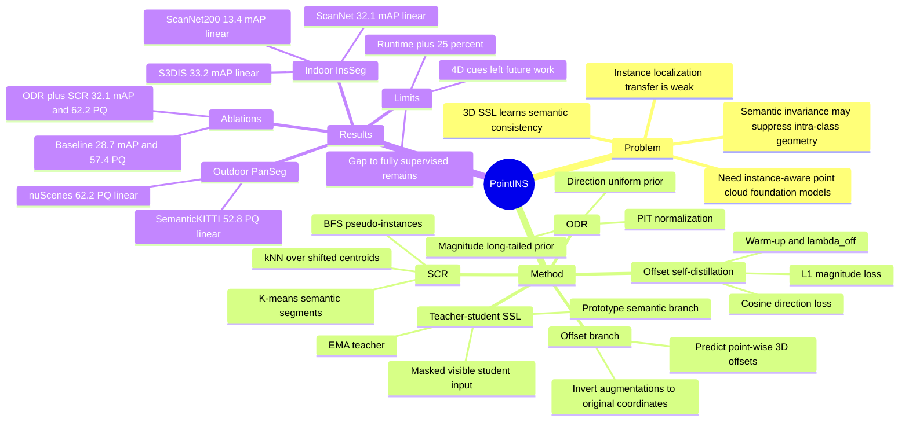

## Summary

PointINS 针对 point cloud SSL 主要学习 semantic consistency、但迁移到 instance / panoptic segmentation 时 instance awareness 不足的问题，提出在 teacher-student self-distillation 中加入 offset branch，并用 ODR + SCR 约束无标签 offset 学习。论文在 ScanNet、ScanNet200、S3DIS、nuScenes、SemanticKITTI 上报告 indoor instance segmentation 平均 +3.5 mAP、outdoor panoptic segmentation 平均 +4.1 PQ，但仍承认 linear probing 与 fully supervised performance 之间存在明显差距。

## Problem & Motivation

现有 3D self-supervised learning 方法通常通过 contrastive learning、masked modeling 或 multi-view consistency 学习语义不变性，能在 semantic segmentation 上表现较强，但对 instance localization 的迁移较弱。作者认为问题不只是缺少更大的 backbone，而是目标函数倾向于压缩同类点的特征，抑制了 instance-level 所需的 intra-class geometric variation。

论文的核心动机是：3D foundation model 不应只支持 category-level understanding，还应支持 instance / panoptic segmentation 这类需要 geometric grouping 的任务。作者借鉴 supervised instance / panoptic segmentation 中 shared backbone + semantic branch + offset branch 的结构，提出在 SSL 预训练阶段就让特征学习“点应该朝哪个 instance centroid 偏移”的 geometric reasoning。

这个问题对 embodied AI / autonomous driving / robotics 有直接关系：这些场景有大量未标注 3D point cloud，但 instance 与 panoptic understanding 才能支撑对象级感知、可操作场景分解和安全决策。它不是 GUI-agent 论文，也不是 VLM 论文；相关性主要在 3D scene understanding 和 embodied perception。

## Method

**Backbone and semantic branch.** PointINS 建立在 teacher-student self-distillation 框架上，具体实现基于 DOS 和 decoder-free Point Transformer V3。输入 point cloud 被随机增强成两个 view，student 只看 masked visible subset，teacher 看 full point cloud；semantic branch 用 learnable prototypes 做 prototype-based clustering，并用 KL divergence 对齐 student / teacher 的 soft assignment，以维持跨 view 的 semantic consistency。

**Offset branch.** 论文新增一个 orthogonal offset branch，为每个点预测 3D offset vector，目标是指向其 underlying instance 的 geometric center。因为 offset 对 rotation、flipping、scaling 等空间变换敏感，作者跟踪 augmentation transformation，并把预测 offset 映射回原坐标系来保持 geometric consistency。

**Offset Distribution Regularization (ODR).** 无标签直接回归 offset 容易 collapse。作者观察真实场景中 offset magnitude 呈稳定 long-tailed distribution，offset direction 在 unit sphere 上近似均匀分布，于是用 probabilistic integral transform (PIT) 将预测 offset 的 magnitude / direction 对齐到经验几何先验。ODR 是 global distribution constraint：它不告诉每个点属于哪个 instance，但约束 offset 的整体统计形态，使 teacher offset 不至于退化成任意散乱向量。

**Spatial Clustering Regularization (SCR).** ODR 缺少 local coherence，因此 PointINS 用 teacher features 做 K-means 得到 coarse semantic segments，再在 ODR-shifted centroids 上构建 kNN graph，并用 BFS 切分 connected components 作为 pseudo-instance masks。每个 pseudo-instance 重新计算 centroid，并生成新的 offset target $O_i^* = \bar{c}_{k,j} - x_i$，让局部相邻且语义一致的点预测会聚到共同中心。

**Offset self-distillation.** ODR 和 SCR 都作用在 teacher side，生成较稳定的 offset targets；student offset 通过 $\ell_1$ magnitude loss + cosine direction loss 学习这些 targets，并加入 cross-view offset consistency。作者将 offset loss 延迟到 warm-up 后加入，默认 $\lambda_{off}=0.25$、K-means clusters $K=20$、offset loss warm-up ratio 为 0.1。

**Design rationale.** 论文的关键设计不是把 instance labels 偷渡进 SSL，而是把 instance-aware learning 变成 regularized self-distillation：ODR 提供 global geometry prior，SCR 提供 local pseudo-instance coherence。作者还测试了用 HDBSCAN 从无标签 point clouds 拟合 magnitude prior，结果接近有标注 prior，支持“只需粗略 object scale prior，而不需要 fine-grained annotation”的主张。

## Key Results

**Indoor instance segmentation.** 在 ScanNet val linear probing 下，PointINS 为 32.1 mAP / 55.2 AP50 / 73.6 AP25，高于 DOS 的 28.7 / 49.8 / 68.7 和 Sonata 的 25.0 / 46.1 / 64.6；decoder probing 下为 40.2 mAP，高于 DOS 38.9、Sonata 37.1；full finetuning 下为 41.5 mAP，高于 DOS 40.5、Sonata 39.5。ScanNet200 val linear probing 中，PointINS 为 13.4 mAP，高于 DOS 10.9 和 Sonata 8.7；S3DIS Area5 linear probing 中为 33.2 mAP，高于 DOS 28.6 和 Sonata 24.2。

**Outdoor panoptic segmentation.** 在 nuScenes val linear probing 下，PointINS 为 62.2 PQ / 84.5 SQ / 72.8 RQ，高于 DOS 的 57.4 / 82.8 / 68.5 和 Sonata 的 50.7 / 79.8 / 61.6；论文文本总结为 +4.8 PQ over DOS。SemanticKITTI val linear probing 中，PointINS 为 52.8 PQ，高于 DOS 49.6 和 Sonata 34.5；论文文本总结为 +3.2 PQ over DOS。full finetuning 下，PointINS 在 nuScenes 为 72.3 PQ，高于 DOS 70.5 和 Sonata 70.0；在 SemanticKITTI 为 60.5 PQ，高于 DOS 59.2 和 Sonata 58.2。

**Component ablation.** 在 ScanNet linear probing / nuScenes linear probing 的组件消融中，DOS-style baseline 为 28.7 mAP / 57.4 PQ；只加 offset loss 为 28.9 mAP / 58.5 PQ；+ ODR 为 30.2 mAP / 60.4 PQ；+ SCR 为 30.5 mAP / 60.1 PQ；ODR + SCR 完整组合为 32.1 mAP / 62.2 PQ。这个结果支持作者关于 ODR 和 SCR 互补的 claim，而不是单个 regularizer 起主要作用。

**ODR prior sensitivity.** ODR 使用不同 magnitude distribution 时性能变化较小：无 regularization 为 28.9 mAP / 57.8 PQ；Dist.1 为 31.2 / 60.8；Dist.2 为 31.7 / 61.2；ScanNet prior 为 32.1 / 62.0；nuScenes prior 为 31.3 / 62.2；HDBSCAN unsupervised prior 为 31.8 / 62.1。作为对照，semi-supervised w/o regularization 的 +1% labels 为 29.8 mAP / 59.3 PQ，+10% labels 为 32.3 mAP / 62.0 PQ。

**Framework compatibility and scale.** 将 PointINS 接到 PSA 上，ScanNet linear probing 从 42.9 mIoU / 9.7 mAP 提升到 47.5 / 14.2；接到 Sonata 上，从 67.4 mIoU / 25.0 mAP 提升到 68.6 / 28.4。多数据预训练后，PointINS 在 ScanNet / S3DIS / nuScenes / SemanticKITTI linear probing 分别达到 34.6 mAP、37.0 mAP、64.7 PQ、55.0 PQ，高于 Sonata 和 DOS 的同设置结果。

**Label efficiency and transfer.** nuScenes panoptic segmentation 在 0.1% labels 下，PointINS finetuning 为 34.9 PQ，高于 PTv3 supervised baseline 24.3、NOMAE 30.4、Sonata 27.1、DOS 33.6；1% labels 下为 42.5 PQ，高于 DOS 41.2。Appendix 还报告 nuScenes object detection：decoder probing 中 PointINS 为 56.7 mAP / 62.5 NDS，高于 DOS 55.4 / 61.5 和 Sonata 44.6 / 55.0；1% annotation finetuning 中 PointINS 为 50.8 mAP / 60.2 NDS。

**Unsupervised instance segmentation.** 不训练下游 instance head、直接用 PointINS 预测 offsets 做 BFS clustering 时，ScanNet 上为 10.8 mAP / 18.7 AP50 / 43.4 AP25，高于 HDBSCAN 的 1.7 / 4.2 / 16.4 和 Felzenszwalb 的 1.2 / 2.3 / 13.4。这个结果证明 offset branch 学到了一定 class-agnostic instance separation，但绝对 mAP 仍远低于有下游训练的结果。

## Strengths & Weaknesses

**已知 Strengths.** 这篇论文的 formulation 比“再做一个 point cloud SSL benchmark”更有针对性：它指出 semantic consistency 与 instance awareness 之间的 tension，并把 supervised instance segmentation 中有效的 offset reasoning 转成自监督训练信号。ODR / SCR 的分工清楚，实验也覆盖 indoor / outdoor、linear probing / decoder probing / finetuning、single-dataset / multi-dataset pretraining、label-efficient training 和 object detection transfer。

**已知 Strengths.** 消融比较扎实：只加 offset branch 收益很小，ODR 或 SCR 单独有效但有限，组合收益最大；ODR prior 的跨数据集、合成 distribution、HDBSCAN unsupervised prior 都仍优于无 regularization；PSA 和 Sonata 集成实验说明它不是只对 DOS backbone 生效。作者还报告 runtime 增量约 25%，没有隐藏额外 branch / regularization 的训练成本。

**已知 Weaknesses / boundary.** PointINS 仍未消除与 fully supervised model 的差距。论文 limitations 明确说，尽管 linear probing 下较现有 SSL 有明显提升，和 fully supervised performance 之间仍有 noticeable gap；作者建议扩大预训练数据、联合 indoor/outdoor datasets，并探索 4D spatiotemporal cues。这个边界很重要：PointINS 更像让 SSL representation 更 instance-aware，而不是替代 dense annotation 的完整解决方案。

**已知 failure / sensitivity.** Figure 6 给出训练配置的失败模式：无 regularization 时 predicted centroids 散乱；ODR only 与 scene structure 更一致但缺少 local grouping；SCR only 有部分 grouping 但仍 spatially scattered；ODR + SCR 才会围绕 instances 聚集。Table 8 还显示 regularization layout 很敏感：先 SCR 后 ODR 会让 ScanNet linear probing 从 32.1 mAP 降到 30.0；把 ODR 加到 student side 为 30.9 mAP，也低于 teacher-side ODR + SCR。

**已知 Baseline caveat.** 论文为了公平比较，在 main table 中让 SSL baselines 使用同一 PTv3 backbone 且不加额外数据；这有利于隔离方法贡献。但与真实 foundation-model scaling 相比，main setting 的数据量仍有限，multi-dataset setting 也只到 indoor 约 24k point clouds、outdoor 约 116k point clouds；因此“towards foundation models”更应理解为方向性 claim，而不是已经证明大规模通用 3D foundation model 已形成。

**推测.** 对 embodied agent 来说，PointINS 的启发在于：如果上游 3D representation 已经携带 instance-aware offset geometry，后续 VLA / navigation / manipulation stack 可能更容易得到对象级 affordance 或可分割 workspace。但这是从 point cloud perception 任务外推；论文没有评估机器人 manipulation、navigation policy，也没有结合 language grounding。

**不知道.** 论文正文没有给出 code release 或 GitHub 链接，也没有报告跨传感器、跨机器人平台、动态场景或 long-horizon embodied task 的结果。它也没有系统分析 failure cases 里的具体对象类别、遮挡、稀疏 LiDAR 区域或 small object 是否仍是主要瓶颈。

## Mind Map

## Notes

- 最值得跟进的是 ODR / SCR 如何为无标签 3D data 提供 instance-level inductive bias：它不是做 mask reconstruction，而是让表示直接学习 object-centric geometric grouping。
- 对 embodied 方向，下一步可关注这类 instance-aware SSL representation 是否能与 language grounding、spatial memory 或 object-level planning 结合；当前论文没有验证这些下游链路。
- 需要后续确认是否有官方 code release；当前论文正文未给出链接。
