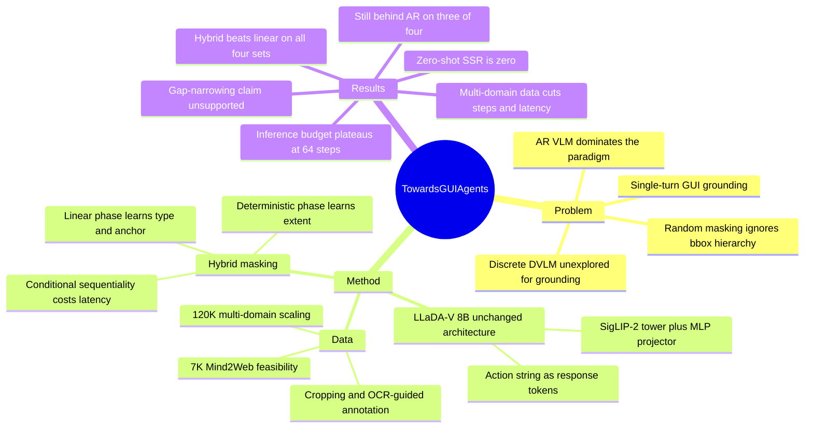

## Summary
把 discrete diffusion VLM（LLaDA-V 8B）适配成 single-turn GUI grounding 模型，用 hybrid masking 显式建模 bounding box 的 anchor→extent 层级，在四个 GUI grounding 数据集上相对 linear masking 稳定提升 SSR（+1.5 至 +6.1）。这是 discrete DVLM 用于 GUI grounding 的首个系统研究，但在同一份 120K 训练语料下，diffusion 变体在四个数据集中的三个上仍显著落后于 Qwen2.5-VL，且推理延迟高 4-6 倍。论文正文关于"把与 AR 的差距从约 25 分收窄到 15 分以内"的表述无法由其自身 Table 4 复现（见 Evidence Ledger C16）。

## Problem & Motivation
GUI grounding 是把自然语言指令 + 截图映射为可执行 GUI action 的基础能力，当前几乎全部由 AR VLM 承担。AR 范式带来两个结构性属性：sequential decoding 与 unidirectional attention。discrete DVLM（LLaDA-V、MMaDA）提供了相反的三条性质——bidirectional attention、parallel token generation、iterative refinement——并在 multimodal reasoning 上已展示竞争力，但没人验证过它们在 GUI grounding 这类**短、强结构化输出**任务上的表现。

作者的问题设定因此不是"造一个更强的 GUI agent"，而是"discrete DVLM 能不能做 GUI grounding，以及它的行为受哪些因素支配"。这个切法本身是合理的：GUI action string 的输出长度只有十几个 token，恰好是 diffusion 并行解码理论上最有利、而 AR 的顺序开销相对最不重要的区间——如果 diffusion 在这里都拿不到优势，那它在长输出的 agent 场景更难成立。

论文进一步提出一个具体的结构假设：随机 linear masking 把 action type、括号、坐标当成彼此独立的 token，而 `B = (x1, y1, x2, y2)` 实际有几何层级——`(x1, y1)` 锚定动作位置，`(x2, y2)` 定义空间范围。随机 masking 很少稳定地制造出"extent 被 mask、anchor 可见"的训练情形，因而学不到 `p(x2, y2 | a_type, x1, y1, I, N)` 这个条件分布。

## Method
**任务形式**：输入截图 `I` + 指令 `N`，输出 action string `a = [a_type, B]`，`a_type ∈ {lclick, hover, type_in}`，`B = (x1, y1, x2, y2)` 按屏幕尺寸归一化到 `[0, 1000]`。判正条件是 action type 匹配**且**预测框的**中心点**落在 ground-truth 框内（center-point 判据，非 IoU、非面积重叠）。研究范围明确限定为 single-turn，multi-step planning 与 dependent action 留作 future work。

**基础模型**：LLaDA-V 8B，架构完全不改——LLaDA language tower + SigLIP-2 vision tower + 两层 MLP projector。GUI action string 作为 response token，模型在 image、instruction 与 masked response 条件下重建 action type、坐标与可选的输入文本。

**Hybrid masking schedule**（本文唯一的方法贡献，两阶段）：

1. **Linear Masking Phase**——沿用 LLaDA-V 默认线性调度（`p_mask = (1-ε)t + ε`），学 action type 与 anchor `(x1, y1)`，对应 coarse grounding。
2. **Full Deterministic-Masking Phase**——在 `I`、`N`、`a_type`、`(x1, y1)` 全部给定的条件下，把剩余目标 token 全部 mask，强制模型学 `p(x2, y2 | a_type, x1, y1, I, N)`，对应 extent refinement。

两阶段构成 coarse-to-fine：先高频学锚点，再在锚点条件下补全框。代价在推理侧——第二阶段依赖第一阶段的输出，作者称之为 conditional sequentiality，这正是 hybrid 延迟高于 linear 的原因。

**推理参数**：Diffusion Steps / Generation Length / Block Length 三者，全部设为 64 时精度-效率最优；论文另报告 Converged Steps（denoising 实际收敛所需步数）作为更真实的计算量指标。

**训练数据**：
- 可行性实验：Mind2Web 7K 子集，10 epochs。
- 规模化实验：120K 多域混合——Mind2Web 20K、WebLinX 20K、OS-Atlas 60K（web/mobile/desktop 各 20K）、Rico Widget Caption 20K。
- 预处理：Mind2Web 高分辨率截图做 random cropping（保证目标可见）；全部数据集使用 OCR-guided target annotation，因为 icon-level 紧框标注会让模型频繁定位到错误目标。

## Key Results

**可行性（Table 2，7K Mind2Web，无 crop / 无 OCR 标注）**

| Diff/Gen/Block | Conv Steps | SSR (%) | Action-Type F1 (%) | Avg Lat (s) |
|:---|---:|---:|---:|---:|
| 32 / 32 / 32 | 13 | 78.15 | 99.00 | 2.56 |
| 64 / 64 / 64 | 25 | 80.67 | 99.00 | 4.84 |
| 128 / 128 / 128 | 25 | 80.63 | 99.87 | 5.01 |

推理预算的收益在 64 步后消失：32→64 换来 +2.52 SSR 但延迟近乎翻倍；128 步 SSR 反而微降。Appendix C 补充 256 步为 SSR 80.69 / 4.84s，进一步确认平台期由输出长度和收敛步数（25）而非预设步数决定。Appendix B 报告未微调的 LLaDA-V 8B 在 Mind2Web 上 SSR 为 0.00、F1 约 0.10-0.12——论文没有把 fine-tuning 得来的能力包装成基座原生能力。

**视觉预处理与标注质量（Table 3，同为 7K Mind2Web，64/64/64）**：加入 cropping + OCR-based target annotation 后 SSR 80.67 → 83.31，延迟 4.84 → 4.46s，F1 保持 99。注意正文写作 "+2.68-point"，与表内实际差值 2.64 不符（C7）。

**数据规模化（Figure 3，7K web-only → 120K multi-domain，linear masking）**

| Benchmark | SSR 7K → 120K | Conv Steps | Avg Lat (s) |
|:---|:---|:---|:---|
| Mind2Web | 83.3 → 83.2 | 25 → 16 | 4.46 → 3.02 |
| ScreenSpot-Web-Text | 54.4 → 73.5 | 25 → 17 | 4.38 → 3.20 |
| ScreenSpot-Web-Icon | 19.9 → 57.8 | 26 → 18 | 4.54 → 3.36 |
| VisualWebArena | 32.4 → 61.4 | 24 → 16 | 4.28 → 3.05 |

增益全部来自域外泛化（in-domain 的 Mind2Web 基本持平），且**精度与延迟同向改善**——多域数据让去噪更快收敛（少 8-9 步），这是本文最干净的一条机制性结果。

**AR vs NAR（Table 4，全部模型训练于同一份 120K 语料）**

| Dataset | Metric | Phi (3B) | Qwen2.5-VL (3B) | Qwen2.5-VL (7B) | LLaDA-V 8B (Lin) | LLaDA-V 8B (Hybrid) |
|:---|:---|---:|---:|---:|---:|---:|
| Mind2Web | SSR | 56.80 | 79.30 | 81.90 | 82.40 | **83.90** |
| | F1 | 94.40 | 99.60 | 99.90 | 98.50 | 100.00 |
| | Lat (s) | – | – | 1.10 | 3.02 | 5.44 |
| ScreenSpot-Web-Icon | SSR | 62.60 | 79.10 | **85.40** | 57.80 | 63.10 |
| | Lat (s) | – | – | 1.10 | 3.36 | 6.50 |
| ScreenSpot-Web-Text | SSR | 77.00 | **83.00** | **83.00** | 73.50 | 74.80 |
| | Lat (s) | – | – | 1.10 | 3.20 | 4.20 |
| VisualWebArena | SSR | 68.50 | **88.90** | 87.20 | 61.40 | 67.50 |
| | Lat (s) | – | – | 1.10 | 3.05 | 5.49 |

Hybrid 对 Linear 的增益：Mind2Web +1.50、ScreenSpot-Web-Icon +5.30、ScreenSpot-Web-Text +1.30、VisualWebArena +6.10（正文写作 "+1.6 (Mind2Web)"，与表内 +1.50 不符）。四个数据集方向一致，支持 anchor→extent 层级假设。

**与 AR 的实际差距**（按各 benchmark 最强 AR baseline 计算）：Linear 为 −0.5 / 27.6 / 9.5 / 27.5（均值 16.0），Hybrid 为 −2.0 / 22.3 / 8.2 / 21.4（均值 12.5）。也就是说，diffusion 只在 in-domain 的 Mind2Web 上超过 AR，在两个 icon/视觉密集型数据集上仍落后 21-22 分。论文正文"把差距从约 25 收窄到 15 以内"的表述在任何一种读法下都无法由 Table 4 得出（C16）。

**延迟代价（Appendix F / Table 7）**：把 hybrid 的收敛步数压到 11-15 步可将延迟降到 2.74-3.00s，但 SSR 全面回落——Mind2Web 83.90 → 81.00，ScreenSpot-Web-Icon 63.10 → 59.60，ScreenSpot-Web-Text 74.80 → 70.00，VisualWebArena 67.50 → 59.20。即 hybrid 的精度增益不能在与 linear 相当的延迟预算下保留。

## Evidence Ledger

| Claim ID | Claim | Type | Source locator | Evidence excerpt | Status |
|:--|:--|:--|:--|:--|:--|
| C1 | 基座为 LLaDA-V 8B（LLaDA tower + SigLIP-2 + 两层 MLP projector），架构未改 | causal-mechanism | p.3 §3.2、p.4 §4.1 | "a language tower LLaDA, a vision tower SigLIP-2, and a two-layer MLP projector" | source-verified |
| C2 | action 空间 {lclick, hover, type_in}，bbox 归一化到 [0,1000] | benchmark-setting | p.3 §3.1 | "bounding-box coordinates normalized to [0,1000] relative to screen size" | source-verified |
| C3 | 判正 = action type 匹配且**预测框中心**落在 GT 框内（center-point，非 IoU） | benchmark-setting | p.3 §3.1、p.6 §5.4 | "the center of the predicted bounding box lies within the ground-truth bounding box" | source-verified |
| C4 | Hybrid masking = linear 阶段学 (x1,y1) + full deterministic 阶段在 anchor 条件下学 (x2,y2) | causal-mechanism | p.5 §4.2.1-4.2.2 | "conditioned on the image I, instruction N, and anchor (x1,y1) ... predict the remaining coordinates (x2,y2)" | source-verified |
| C5 | 7K Mind2Web 无 crop/OCR：32→78.15/99.00/2.56s；64→80.67/99.00/4.84s；128→80.63/99.87/5.01s | number | p.6 Table 2 | "32 32 32 13 78.15 99.00 2.56 \| 64 64 64 25 80.67 99.00 4.84" | source-verified |
| C6 | crop+OCR 使 SSR 80.67→83.31、延迟 4.84→4.46s，F1 维持 99 | number | p.7 Table 3 | 高亮行 "64 64 64 25 83.31 99 4.46" | source-verified |
| C7 | 正文称该改动带来 "+2.68-point SSR improvement" | number | p.8 §6.3 vs p.7 Table 3 | "yield a +2.68-point SSR improvement and a 0.38 s reduction in latency" | contradicted（表内实际为 +2.64；0.38s 延迟差正确） |
| C8 | Table 4 全部 SSR 数值（Phi / Qwen 3B / Qwen 7B / Lin / Hybrid，四数据集） | number | p.8 Table 4 | "56.80 79.30 81.90 82.40 83.90 ... 68.50 88.90 87.20 61.40 67.50" | source-verified |
| C9 | 延迟：Qwen2.5-VL 7B 四数据集均 1.10s；Lin 3.02/3.36/3.20/3.05；Hybrid 5.44/6.50/4.20/5.49 | number | p.8 Table 4 "Lat. (s)" | "– – 1.10 3.02 5.44 \| – – 1.10 3.36 6.50" | source-verified |
| C10 | 正文称 hybrid 增益 "+1.6 (Mind2Web)" | number | p.8 §6.5 vs Table 4 | "SSR gains of +1.6 (Mind2Web), +5.3 ..., +1.3 ..., and +6.1 (VisualWebArena)" | contradicted（Mind2Web 表内为 +1.50；其余三项 +5.30/+1.30/+6.10 与表一致） |
| C11 | 全部 AR baseline 与两个 LLaDA-V 变体训练于**同一份** 120K GUI grounding 语料 | benchmark-setting | p.6 §5.2 | "All AR models and the LLaDA-V linear and hybrid variants are trained on the same 120K-sample" | source-verified |
| C12 | 120K 组成：Mind2Web 20K + WebLinX 20K + OS-Atlas 60K（web/mobile/desktop 各 20K）+ Rico Widget Caption 20K | number | p.5 Table 1、§5.1.1 | "OS-Atlas (60K samples, 20K each from mobile, web, and desktop domains)" | source-verified |
| C13 | 7K→120K：SWT +19.1 SSR/+5.2 F1，SWI +37.9/+8.4，VWA +29 SSR，M2W 稳定在约 83、延迟降 1.4s，收敛步数少 8-9 | number | p.8 §6.4、p.7 Figure 3 | "ScreenSpot-Web-Text improves by +19.1 SSR and +5.2 F1, ScreenSpot-Web-Icon by +37.9 SSR" | source-verified |
| C14 | Figure 3 条形数值：7K 为 83.3/54.4/19.9/32.4，120K 为 83.2/73.5/57.8/61.4 | number | p.7 Figure 3 左图 | 柱标 "83.3 83.2 \| 54.4 73.5 \| 19.9 57.8 \| 32.4 61.4" | source-verified |
| C15 | 同一个 120K linear 模型的 Mind2Web SSR，Figure 3 为 83.2、Table 4 为 82.40（内部不一致） | number | p.7 Fig 3 vs p.8 Table 4 | Fig 3 柱标 "83.2"；Table 4 "(Lin) ... 82.40" | source-verified（SWT/SWI/VWA 与延迟均一致，仅 Mind2Web 冲突） |
| C16 | 论文称 hybrid 把与 AR 的差距"从约 25 分收窄到 15 分以内" | comparison | p.2 §1 Intro（数据在 p.8 Table 4） | "narrowing the gap to AR models from about 25 to under 15 points" | **unsupported**（按最强 AR 逐 benchmark：Lin −0.5/27.6/9.5/27.5 均值 16.0；Hybrid −2.0/22.3/8.2/21.4 均值 12.5。无任何读法给出"约 25 → 15 以内"） |
| C17 | 声称是首个探索 discrete DVLM 用于 GUI grounding 的研究 | sota-novelty | p.2 §1、p.8 §7 | "to the best of our knowledge, represent the first study exploring their use for GUI grounding" | source-verified（仅表示论文如此声称） |
| C18 | 评测仅四个数据集（Mind2Web test split、ScreenSpot-Web-Text、ScreenSpot-Web-Icon、VisualWebArena）；未用 ScreenSpot-Pro / ScreenSpot-V2 / OSWorld / AndroidWorld，也无任何 multi-step 或闭环执行评测 | benchmark-setting | p.5 §5.1.2、p.3 §3.1 | "we used four established GUI grounding benchmarks: Mind2Web (test split), ScreenSpot-Web-Text, ScreenSpot-Web-Icon, and VisualWebArena" | source-verified |
| C19 | 正文全篇无代码链接、无 project page、无 model/data license 声明 | license-code | 全文（p.1 脚注至 §7） | 脚注仅有 "Work done while at AWS Agentic AI. skumbha4@asu.edu, liahaofu@amazon.com" | source-verified |
| C20 | 不存在任何 budget-matched（同参数量、同预训练）的 AR vs diffusion 对照，用以把增益归因到 diffusion 目标本身 | causal-mechanism | p.6 §5.2、p.8 Table 4、arXiv suppl. §8 | Limitations 承认 AR 领先或因 "extensive grounding-specific pretraining and optimized decoding strategies" | source-verified（训练数据已对齐 120K；参数量、预训练语料、解码预算均未控制） |
| C21 | 未微调的 LLaDA-V 8B 在 Mind2Web 上 SSR 0.00、F1 约 0.10-0.12 | number | arXiv Appendix B, Table 5 | "0.00 \| 0.10 ... 0.00 \| 0.12 ... 0.00 \| 0.10" | source-verified |
| C22 | 256 diffusion steps → SSR 80.69、延迟 4.84s（相对 64 步无实质增益） | number | arXiv Appendix C, Table 6 | "256 \| 64 \| 64 \| 25 \| 80.69 \| 99.87 \| 4.84" | source-verified |
| C23 | 压低 hybrid 步数至 11-15 → 延迟 2.74-3.00s，SSR 降至 M2W 81.00 / SWI 59.60 / SWT 70.00 / VWA 59.20 | number | arXiv Appendix F, Table 7 | "M2W ... 11.00 \| 81.00 ... 2.74; VWA ... 11.00 \| 59.20 ... 2.87" | source-verified（收敛步数为 11/11/15/11，SWT 是 15 不是 11） |
| C24 | hybrid 延迟更高源于 conditional sequentiality——linear 阶段输出喂给 deterministic 阶段 | causal-mechanism | p.8 §6.5 | "its conditional sequentiality, where the output of the linear phase ... serves as input for the full deterministic phase" | source-verified |
| C25 | 研究范围显式限定 single-turn，multi-step planning 与 dependent action 留待未来 | benchmark-setting | p.3 §3.1 | "We restrict our study to single-turn grounding ... left for future work" | source-verified |
| C26 | arXiv:2603.26211，v1 提交 2026-03-27，comments 为 "Accepted to CVPR 2026"；作者 1 属 ASU，作者 2-4 属 AWS Agentic AI | metadata | arXiv abs 页 + p.1 title block | "Comments: Accepted to CVPR 2026"；"1Arizona State University 2AWS Agentic AI" | source-verified |

> 补充（**仅 finder 核对、未经独立 verifier 复核**）：正文 §5.1.2 只写 "Mind2Web (test split)"，未指明使用的是 cross-task / cross-website / cross-domain 中的哪一个 split；这一点在与文献中 Mind2Web 数字横向对比时构成口径缺口。
>
> `source-verified` 仅表示 primary source 确实包含该信息，不表示结果已被独立复现。

## Strengths & Weaknesses

**已知亮点**

- **问题切口选得对**。single-turn grounding 的输出只有十几个 token，是 diffusion 并行解码理论上最有利的区间；把范围收窄反而让 masking schedule、推理预算、数据规模、标注质量四个变量各自可观察。作者也没有把 fine-tuning 得到的能力说成基座原生能力——Appendix B 明确报告 zero-shot SSR 为 0.00（C21）。
- **Hybrid masking 是一次干净的组件级 ablation**。它与 linear 变体共享同一基座、同一 120K 语料、同一推理配置，唯一差异是 masking schedule，四个数据集方向一致（C10）。这条结论的内部效度是全文最强的一处——它支持"bbox token 有 anchor→extent 层级、随机 masking 学不到该条件分布"这个具体假设。
- **训练数据在 AR 与 NAR 之间是对齐的**（C11）。这在 GUI grounding 论文里并不常见，很多工作直接拿 off-the-shelf AR checkpoint 与自己精调的模型比。此处 Qwen2.5-VL / Phi 都在同一份 120K 上训过，数据配方这一项变量被控住了。
- **数据规模化那条结果有机制含量**。多域数据同时把精度提上去、把收敛步数从 25 降到 16-18、把延迟降 1.2-1.4s（C13/C14）——精度与延迟同向改善，说明模型对目标区域的置信度上升导致 low-confidence remasking 更早停止。这比"加数据涨点"信息量高。
- **失败模式描述具体可操作**：极高分辨率截图超出 SigLIP-2 的有效处理范围；icon-level 紧框标注让模型频繁定位到周边描述文字而非图标本身，扩到 OCR text region 后缓解（C6）。这两条对任何做 GUI grounding 数据的人都直接有用。

**已知局限**

- **budget-matched 对照缺失，增益无法归因到 diffusion 目标本身**（C20）。数据配方对齐了，但参数量（8B NAR vs 3B/7B AR）、预训练语料、解码预算三项都没控。LLaDA-V 8B 比 Qwen2.5-VL-7B 大，延迟高 4-6 倍（C9），却在四个数据集里三个落后。论文自己的 Limitations 也承认 AR 领先可能来自 grounding-specific pretraining 与优化过的解码——这等于承认核心对照不成立。同理，无法区分增益来自 diffusion 目标、并行解码、坐标文本表示，还是 crop/OCR 数据配方。
- **正文的核心比较性表述与自身表格不符**（C16）。"把差距从约 25 分收窄到 15 分以内"在任何一种读法下都推不出来：按最强 AR 逐 benchmark 算，Linear 均值差距是 16.0 而非 25，Hybrid 收到 12.5；而两个真正大的缺口（ScreenSpot-Web-Icon、VisualWebArena）在 hybrid 之后仍有 21-22 分。另有三处内部数值不一致（C7 的 +2.68 vs +2.64、C10 的 +1.6 vs +1.50、C15 的 83.2 vs 82.40），单个都不改变结论，但合起来说明表格与正文没有对账。
- **benchmark 口径被换过，横向数字不可比**。三点：(1) 判正用 center-point-in-GT-box 且**额外**要求 action type 匹配（C3），与 ScreenSpot 原始 protocol 不是同一件事；(2) 只用了 ScreenSpot 的 Web-Text / Web-Icon 两个子集，没有 mobile / desktop 切片，也没有 ScreenSpot-V2 / ScreenSpot-Pro（C18）——恰好回避了 [[2504-ScreenSpotPro]] 揭示的高分辨率专业界面这一最难区间，而论文自己承认对分辨率敏感；(3) VisualWebArena 本是交互式执行 benchmark，这里被当成单步 grounding 数据集使用（C18/C25），其 SSR 与文献中的 VWA task success rate 不是同一量纲。
- **没有 execution externality，也没有闭环**（C18/C25）。全部结果是离线单步预测，没有真实浏览器/OS 执行、没有状态转移、没有 oracle 或 verifier 参与。这既是优点（无 execution 混淆）也是硬边界。
- **hybrid 的精度增益在等延迟预算下保不住**（C23）。把收敛步数压到 11-15 步以逼近 linear 的延迟，四个数据集 SSR 全面回落，VisualWebArena 甚至跌到 59.20——低于 linear 的 61.40。换句话说，hybrid 相对 linear 的比较本身也不是延迟对齐的。
- **无代码、无 license、无 project page**（C19），复现需要自行重建 120K 混合、cropping 策略与 OCR-guided 标注流程；OCR 引擎与标注扩展规则正文未给参数。

**推测（未经验证）**

- Hybrid masking 起作用的机制未必是"diffusion 学到了几何层级"。它同时改变了训练时的条件分布覆盖率——deterministic 阶段人为制造了大量"anchor 可见、extent 被 mask"的样本，这本质上是一种**训练分布重加权**，与 diffusion 目标本身并不强耦合。同样的重加权理论上可以在 AR 模型上通过 token 顺序或 loss reweighting 实现，论文没有做这个对照。
- 增益在 icon 类数据上最大（SWI +5.30、VWA +6.10）而在文本类上最小（SWT +1.30），指向 hybrid 主要救的是**没有 OCR 文字锚点**的目标——即模型缺少稳定 anchor 线索时，显式的 anchor-then-extent 分解才有价值。这与 §6.3 说 OCR 标注扩展能改善 icon 定位是同一件事的两个面。

**不知道**

- 若把同一个 AR 基座（如 Qwen2.5-VL-7B）转成 diffusion 解码器再在同一 120K 上训练，diffusion 是否还有任何优势。这是 [[2604-FastdVLM]] 已经证明可行的路径，本文没走。
- Hybrid masking 在多步 GUI 任务、真实浏览器闭环、无 verifiable reward 的条件下是否仍提升 task success。单步 SSR 与真实任务成功率之间的落差在 [[2504-OnlineMind2Web]] 中已被系统量化。
- 加入 grounding-specific pretraining 后，LLaDA-V 与 Qwen2.5-VL 的差距会缩小多少、还是会反向扩大。
- Mind2Web 用的是哪个 test split（见 Evidence Ledger 补充说明），因此本文 Mind2Web 数字与文献中同名数字能否比较未知。

## Mind Map

## Notes

**库内关联**
- [[Topics/CUA-Survey]] — GUI canonical survey；本文属 §6 architecture 轴下"grounding 输出表示"的一个分支，可作为 decoding paradigm 的对照点纳入。
- [[2604-FastdVLM]] — 最直接的方法论对照。Fast-dVLM 把 Qwen2.5-VL-3B **直接转换**成 block-diffusion VLM，因此天然是同基座、同预训练的 AR-vs-diffusion 比较；它得出的两条结论对本文有直接约束力：加速主要来自系统栈（SGLang + FP8）而非算法（算法层仅 1.98×），且 long-form 生成是 block-diffusion 的结构性短板。本文选择从零适配一个独立的 8B diffusion 基座，恰好放弃了这种可归因性。
- [[2500-GuiActorCoordinateFree]] — 正面对立的设计选择。GUI-Actor 认为"文本生成坐标"本身就是病灶（空间语义对齐弱、监督歧义、patch/coordinate 粒度失配），改用 `<ACTOR>` token + attention head 在视觉 patch 上直接预测区域；本文则保留坐标即文本，只在 masking 调度上做文章。两者对同一瓶颈给出了相反的处方，值得并置。
- [[2504-ScreenSpotPro]] — 本文回避的评测区间。ScreenSpot-Pro 面向高分辨率专业软件的密集小图标，而本文明确承认对 GUI 分辨率敏感、且只评测了 ScreenSpot 的 web 子集。
- [[2401-VisualWebArena]] — 本文把 VWA 当作单步 grounding 数据集使用，与其原生的交互式执行评测不是同一量纲，引用其数字时需注明。
- [[2504-OnlineMind2Web]] — 单步指标与真实任务成功率之间落差的系统性证据；本文全部结论停留在单步 SSR，这条落差是其外推到 agent 闭环时的主要风险。
- [[2410-OSAtlas]] — 本文 120K 混合中占比最大的数据源（60K，三平台各 20K）。
- [[2606-CGL]] — 已互相反链；一个问 "action 是否 ground 对"，一个问 "学新 app 时旧 app 会不会忘"。
- [[2606-DecodableNotGrounded]] — 方法论上的警示。它证明"能解码"不等于"依赖视觉"；本文四个数据集上近 100% 的 action-type F1 与 60-84% 的 SSR 并存，暗示 action type 分类可能相当程度上由指令文本 prior 决定而非视觉——若做 vision-ablation 对照（灰图输入），F1 掉多少是个值得测的量。

**最该做而没做的实验（一句话）**：把 Qwen2.5-VL-7B 按 Fast-dVLM 的 direct-conversion 路线转成 diffusion 解码器，在同一份 120K GUI 语料上训练，并在**对齐的 token/延迟预算**下与它自己的 AR 版本对比——这是唯一能把增益从参数量、预训练语料和数据配方中剥离出来、真正归因到 diffusion 目标的对照。

**其他**
- arXiv 预印本：`https://arxiv.org/abs/2603.26211`（v1 提交 2026-03-27，comments = "Accepted to CVPR 2026"）。Appendix B-F 只在 arXiv 版本中，CVF 出版版本为 10 页正文、不含附录。
- 对 GUI Grounding Robustness 方向最可迁移的一条：本文最稳的两个发现都不在 diffusion 上——分辨率处理与标注边界（icon 紧框 vs OCR text region）对 grounding 精度的影响幅度（+2.64 SSR）与整个 hybrid masking 的贡献同量级。grounding 的鲁棒性瓶颈可能更多在数据侧口径而非解码范式。
