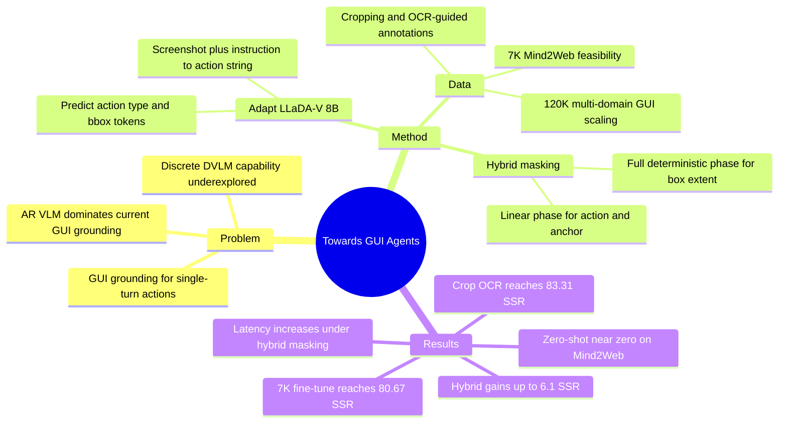

## Summary
这篇论文研究 discrete diffusion VLM 是否能作为 AR VLM 之外的 GUI grounding 建模范式，并把 LLaDA-V 适配为 single-turn action + bounding-box text generation。核心方法是 hybrid masking：先用 linear masking 学 action type 和 anchor 坐标，再用 full deterministic masking 在 anchor 条件下预测 box extent，从而显式建模 GUI bbox 的几何层级。

## Problem & Motivation
GUI agent 需要把自然语言指令和截图映射到可执行 GUI action；本文聚焦 single-turn grounding，即预测 `lclick` / `hover` / `type_in` 及目标 bounding box。已有 GUI grounding 主流依赖 AR VLM，它们有强大的视觉语言预训练和 grounding-specific supervision，但也继承 sequential decoding 与 unidirectional attention 的结构特性。

作者关注的问题不是再造一个 SOTA GUI agent，而是验证 discrete DVLM 是否能处理 GUI grounding 这种短结构化输出任务。动机来自 LLaDA-V / MMaDA 等 diffusion VLM 在 multimodal reasoning 上的进展：bidirectional attention、parallel token generation、iterative refinement 可能适合坐标 token 的联合建模，但此前没有系统评估其 GUI grounding 能力。

## Method
**任务形式**：输入 GUI screenshot `I` 和自然语言指令 `N`，输出 action string `a = [a_type, B]`，其中 `a_type` 属于 `lclick`、`hover`、`type_in`，`B = (x1, y1, x2, y2)` 是归一化到 `[0, 1000]` 的 bounding box。预测正确需要 action type 匹配，且预测 box 的 center 落在 ground-truth box 内。

**基础模型**：使用 LLaDA-V 8B，保留原架构：LLaDA language tower、SigLIP-2 vision tower、两层 MLP projector。适配时把 GUI action string 当作 response token，让模型在 image、instruction 和 masked response 条件下重建 action type、坐标和可选输入文本。

**Hybrid masking** 是主要方法：

1. **Linear Masking Phase**：沿用 LLaDA-V 默认 linear masking，让模型在部分 token 被 mask 的条件下学习 action type 和 anchor `(x1, y1)`，对应 coarse grounding。
2. **Full Deterministic-Masking Phase**：在 image、instruction、action type 和 anchor 已知的条件下，把剩余目标 token fully masked，让模型学习 `p(x2, y2 | a_type, x1, y1, I, N)`，对应 box extent refinement。
3. 这个设计基于一个明确假设：GUI bbox 有几何层级，`(x1, y1)` 定位 action anchor，`(x2, y2)` 表达 spatial extent；随机 linear masking 很少稳定地产生"extent 被 mask、anchor 可见"的训练情形。

**训练数据**：
- 初始可行性实验：Mind2Web 7K train subset，训练 10 epochs。
- 数据扩展实验：120K multi-domain GUI 数据，包含 Mind2Web 20K、WebLinX 20K、OS-Atlas 60K（mobile/web/desktop 各 20K）和 Rico Widget Caption 20K。
- 对 Mind2Web 高分辨率截图使用 cropping；所有数据使用 OCR-guided target annotations，因为作者观察到这比 icon-level tight annotation 更稳定。

## Key Results
**可行性：LLaDA-V 从 zero-shot 近乎不可用，到少量 GUI fine-tuning 后可 grounding。**

| Setting | Benchmark | Diff/Gen/Block | SSR | Action-Type F1 | Avg Latency |
|:---|:---|:---:|---:|---:|---:|
| Zero-shot LLaDA-V 8B | Mind2Web | 64/64/64 | 0.00 | 0.12 | 未报告 |
| 7K Mind2Web fine-tune, no crop/OCR | Mind2Web | 32/32/32 | 78.15 | 99.00 | 2.56s |
| 7K Mind2Web fine-tune, no crop/OCR | Mind2Web | 64/64/64 | 80.67 | 99.00 | 4.84s |
| 7K Mind2Web fine-tune, no crop/OCR | Mind2Web | 128/128/128 | 80.63 | 99.87 | 5.01s |

**Inference ablation：更多 diffusion steps / generation length / block length 会提升到平台期，但延迟上升。** 在 no crop/OCR 的 7K Mind2Web 设置中，32→64 将 SSR 从 78.15 提到 80.67，但 latency 从 2.56s 增到 4.84s；128 steps 时 SSR 基本不再提升（80.63），latency 仍为 5.01s。Appendix C 还报告 256/64/64 的 SSR 为 80.69、latency 4.84s，说明收益主要受输出长度和收敛步数约束。

**视觉预处理与 annotation quality 很关键。** 在 Mind2Web 7K 上，加入 cropping 和 OCR-based target annotation 后，SSR 从 80.67 提升到 83.31，F1 保持 99，latency 从 4.84s 降到 4.46s。作者给出的 failure case 是：高分辨率 GUI 和 icon-level tight annotations 会让模型更难定位目标，OCR text region 监督更稳定。

**数据扩展带来跨 benchmark 增益。** 从 7K Mind2Web 扩展到 120K multi-domain GUI 数据后，作者报告平均 SSR 提升 17-20 points、F1 提升约 5 points、latency 降低 1-1.5s；具体包括 ScreenSpot-Web-Text SSR +19.1 / F1 +5.2，ScreenSpot-Web-Icon SSR +37.9 / F1 +8.4，VisualWebArena SSR +29，并且 Mind2Web 保持约 83% SSR、latency 降低 1.4s。

**Hybrid masking 相对 linear masking 稳定提升 SSR，但明显增加 latency。**

| Benchmark | Metric | Phi 3B | Qwen2.5-VL 3B | Qwen2.5-VL 7B | LLaDA-V Linear | LLaDA-V Hybrid |
|:---|:---|---:|---:|---:|---:|---:|
| Mind2Web | SSR | 56.80 | 79.30 | 81.90 | 82.40 | 83.90 |
| Mind2Web | F1 | 94.40 | 99.60 | 99.90 | 98.50 | 100.00 |
| Mind2Web | Latency | - | - | 1.10s | 3.02s | 5.44s |
| ScreenSpot-Web-Icon | SSR | 62.60 | 79.10 | 85.40 | 57.80 | 63.10 |
| ScreenSpot-Web-Text | SSR | 77.00 | 83.00 | 83.00 | 73.50 | 74.80 |
| VisualWebArena | SSR | 68.50 | 88.90 | 87.20 | 61.40 | 67.50 |

Hybrid 相对 linear 的 SSR 增益分别为 Mind2Web +1.6、ScreenSpot-Web-Icon +5.3、ScreenSpot-Web-Text +1.3、VisualWebArena +6.1；但 latency 也从 3.02/3.36/3.20/3.05s 增至 5.44/6.50/4.20/5.49s。Table 7 显示降低 hybrid diffusion steps 可把 latency 降到约 2.74-3.00s，但会带来 SSR 下滑，例如 Mind2Web 83.90→81.00，VisualWebArena 67.50→59.20。

## Strengths & Weaknesses
**已知亮点**：
- 问题切得很窄：不是完整 GUI agent，而是 single-step GUI grounding；因此实验能集中观察 diffusion decoding、masking schedule、数据规模和 annotation quality 对 grounding 的影响。
- Hybrid masking 的设计有明确结构假设：bbox 坐标不是平坦 token，而有 anchor-to-extent 的依赖。这个假设与结果一致：四个 benchmark 上 SSR 都高于 linear masking。
- Baseline 选择比较清楚：AR baselines 包括 Phi-3-Vision / Phi-ground 和 Qwen2.5-VL 3B/7B；NAR baselines 包括 LLaDA-V linear 与 hybrid。论文也报告 zero-shot LLaDA-V near-zero performance，没有把 GUI fine-tuning 的效果包装成原生能力。
- Ablation 信息有价值：inference budget、cropping/OCR annotation、data scaling、hybrid masking latency trade-off 都有具体数字。

**已知局限**：
- Hybrid 仍然没有整体追上强 AR VLM。除 Mind2Web 外，Qwen2.5-VL 在 ScreenSpot-Web-Icon、ScreenSpot-Web-Text、VisualWebArena 上的 SSR 明显更高；例如 VisualWebArena 上 Qwen2.5-VL 3B 为 88.90，而 hybrid LLaDA-V 为 67.50。
- Latency 是主要代价。Hybrid masking 引入 conditional sequentiality，Table 4 中所有 benchmark 的 latency 都高于 linear LLaDA-V，也高于 Qwen2.5-VL 7B 报告的 1.10s。
- 研究范围只覆盖 single-turn / atomic action。作者明确说 multi-step planning 和 dependent actions 留给未来工作；长输出场景下 diffusion latency 和 coherence 可能呈现不同结论。
- 当前模型缺少 grounding-specific pretraining 与高效 diffusion decoding；作者在 limitation 中认为这可能是其 accuracy / latency 落后 AR 方法的原因之一。

**推测**：
- 这篇的真正贡献更像 feasibility + design probe，而不是可直接替换 AR GUI grounding stack 的系统。Hybrid masking 证明"坐标层级建模"有用，但如果没有更强预训练和解码优化，diffusion GUI agent 的优势还不充分。

**不知道**：
- Hybrid masking 在 multi-step GUI tasks、long-horizon web/mobile automation、真实 agent loop 中是否仍然提升 task success。
- 如果加入 grounding-specific pretraining，LLaDA-V 与 Qwen2.5-VL 之间的差距会缩小多少。
- 论文正文没有给出代码链接或 DOI；复现细节依赖文中训练数据组合、cropping/OCR annotation 处理和 LLaDA-V fine-tuning 实现。

## Mind Map

## Notes
- 这篇对 GUI agent 方向最有用的 insight 是：action grounding 的输出虽然是 text tokens，但 bbox token 有结构，不能完全当普通序列处理。
- 对后续 idea 的启发：可以把 GUI grounding 输出拆成更显式的 latent structure，例如 anchor / extent / action type 分头预测，再比较 text-generation-only formulation 是否是瓶颈。
- 与 AR baseline 的差距说明 DVLM 的 bidirectional refinement 不是免费午餐；在 GUI agent 场景里，decoding latency 和 task-level success 可能比单步 SSR 更关键。
