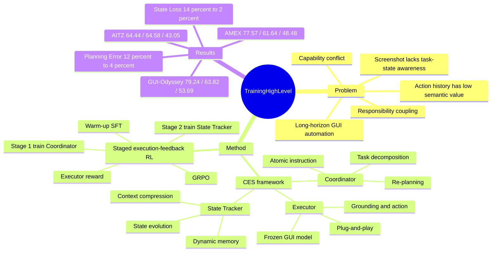

## Summary

本文针对 long-horizon GUI automation 中的责任耦合与任务状态丢失问题，提出 CES：用训练过的 Coordinator 和 State Tracker 给冻结的低层 Executor 提供 atomic instruction 与高语义状态记忆。核心训练策略是 staged execution-feedback RL：不直接评价 planner/state summary 的文本质量，而是让它们通过 Executor 产生可验证 action，再用 execution reward 反向优化高层调度模块。

## Problem & Motivation

作者认为 long-horizon GUI task 的难点不只是 grounding，而是单模型同时承担 high-level planning、task progress tracking、GUI perception 与 precise execution 时会出现 responsibility coupling 和 capability conflict。现有 SFT/RL 单 agent 方法通常依赖历史 action 序列或当前 screenshot 推断进度，但低层 action 如 `Click(x, y)` 缺少语义状态，重复界面和 OOD 界面会让 agent 不知道任务走到哪里。论文用 temporal judgement experiment 支持这一动机：三个 GUI agents 判断同一轨迹中两张 screenshot 的时间顺序时，邻近步骤准确率高，但间隔拉大后明显下降；论文没有给出该图的数值表。这个问题重要，因为跨应用、多步骤任务的失败往往来自进度丢失和错误恢复失败，而不是单步点击能力本身。

## Method

CES 将 GUI automation loop 拆成三个角色：

- **Coordinator**：输入用户 high-level instruction `q`、State Tracker 给出的上一时刻高语义状态 `m^{t-1}` 和当前 screenshot `s^t`，输出当前给 Executor 的 atomic instruction `l^t`。它承担 task decomposition、dynamic planning 和异常后的 re-plan。
- **Executor**：冻结、可替换的低层 GUI model，只负责把 atomic instruction 和当前 screenshot 转成 physical action。论文训练时用 GUI-R1-7B 作为 reward executor，评测时也验证了 UI-R1-3B、GUI-Owl-7B、GUI-Owl-32B 等不同 Executor。
- **State Tracker**：一个 language model，不直接看 GUI screenshot，而是基于用户意图、上一状态和 Executor 输出更新自然语言状态 `m^t`。它的作用是把冗余视觉/动作历史压缩成低维、高语义的 dynamic memory。

训练分两步。第一步是 warm-up SFT：从 GUI-Odyssey 随机取 1K samples，给 Coordinator 学习 `<think>description.intention</think><answer>low level instruction</answer>`，给 State Tracker 学习下一步 `context`。第二步是 staged execution-feedback RL：从 GUI-Odyssey 取 3K samples，仅用 action/parameter ground truth 计算 reward；基础算法为 GRPO，reward 为 `R = alpha_1 R_format + alpha_2 R_executor`，其中 `R_executor = gamma_1 R_type + gamma_2 R_param`。Stage 1 冻结 Executor，用 ground-truth state 训练 Coordinator；Stage 2 冻结 Coordinator 和 Executor，用最终 Executor action 的 reward 训练 State Tracker。作者使用 Qwen2.5-VL-7B 作为 Coordinator backbone，Qwen3-4B 作为 State Tracker backbone；SFT 训练 1 epoch，RL 中 Coordinator 10 epochs、State Tracker 5 epochs，实验使用 8 x 80G GPUs。

## Key Results

- **主结果（Table 1）**：以 GUI-R1-7B 为 Executor，CES 在 AITZ 上达到 Type/GR/SR = **64.44/64.58/43.05**，高于 GUI-R1-7B baseline 的 52.73/54.92/30.59，也高于 +GPT-5 prompting 的 62.50/59.10/40.55。在 AMEX 上，CES 为 **77.57/61.64/48.48**，高于 GUI-R1-7B 的 67.26/57.12/43.69；在 GUI-Odyssey 上，CES 为 **79.24/63.82/53.69**，高于 GUI-R1-7B 的 65.49/43.64/38.79，也高于 SWIRL 的 SR 51.65，但 SWIRL 的 GUI-Odyssey GR 66.39 高于 CES 的 63.82。
- **相对 GPT-5 prompting**：论文报告把 GPT-5 作为 Coordinator/State Tracker 的 prompting 版本只带来有限且不稳定收益；表中 AMEX 的 +GPT-5 SR 为 35.80，低于 GUI-R1-7B baseline 的 43.69，而 CES SR 为 48.48。
- **泛化到不同 Executor（Table 2）**：UI-R1-3B + CES 在 AMEX SR 从 35.81 提升到 **43.38**，GUI-Odyssey SR 从 32.49 提升到 **38.04**；GUI-Owl-7B + CES 在 GUI-Odyssey SR 从 35.82 提升到 **46.65**；GUI-Owl-32B + CES 在 GUI-Odyssey SR 从 39.60 提升到 **56.75**。但单纯 CES-P prompting 会伤害小模型：UI-R1-3B 在 GUI-Odyssey SR 从 32.49 降到 **14.44**。
- **组件/训练消融（Table 3）**：完整 CES 在 AMEX/GUI-Odyssey 的 SR 为 **48.48/53.69**；去掉 Coordinator 后降为 **33.27/39.15**，去掉 State Tracker 后为 **42.08/42.52**，只做 SFT 不做 RL 为 **36.54/42.89**。这支持两个核心 claim：高层规划和状态压缩都必要，execution-feedback RL 不是可有可无的 fine-tuning。
- **失败类型分析（Figure 5）**：相对 GUI-R1-7B baseline，CES 将 State Loss 从 **14%** 降到 **2%**，Planning Error 从 **12%** 降到 **4%**。论文同时指出 frozen Executor 相关的 Perception Error 和 Generalization Failure 基本没有被解决，瓶颈转移到 Executor 自身感知/泛化能力。

## Strengths & Weaknesses

**已知**：
- 亮点在于 reward design：不要求人工判断 atomic instruction 或 state summary 好不好，而是用冻结 Executor 的 action correctness 作为 execution-feedback reward，避免了高层文本输出难评价的问题。
- CES 的分工很干净：Coordinator 负责规划，Executor 负责 grounding/action，State Tracker 负责 semantic memory；这比把所有能力压进同一个 policy 更符合 long-horizon GUI task 的结构。
- 消融较有信息量：去掉 Coordinator、去掉 State Tracker、去掉 RL 都明显掉点，说明收益不是单纯 prompt packaging。
- 局限也清楚：论文的主指标仍是 Type/GR/SR 这类 action-level evaluation，没有报告真实在线环境中的完整任务成功率；State Tracker 不直接看 screenshot，因此它依赖 Executor output 和历史状态的语义质量；当 frozen Executor 发生 perception/grounding/generalization 错误时，CES 不能从根本上修复。
- Appendix 的 failure cases 暴露了边界：Step 3 中 Coordinator 没把 "business meeting" 转成 `TYPE:Business`，而是给出 scroll instruction；Step 12 中 Coordinator 正确要求打开 Tumblr messages，但 Executor 选错图标坐标。

**推测**：
- CES 最适合"低层 grounding/action 已经相对强，但长程状态和任务分解不稳"的 Executor；如果 Executor 本身 perception 很弱，execution-feedback 会把瓶颈暴露出来但未必能消除。
- 这种 staged training 可能比端到端联合训练更稳定，但也可能因为冻结 Executor 而学到某个 Executor 偏好的 state/instruction 风格，跨更异质 executor 或桌面/web 环境时需要重新验证。

**不知道**：
- 不知道该方法在真实手机/网页/桌面环境中的 end-to-end completion rate、延迟和成本如何。
- 不知道 State Tracker 的自然语言 summary 在更长任务中是否会累积错误，论文没有系统给出 memory drift 分析。
- 不知道 joint training 或 synergetic evolution 是否优于当前 staged freezing；论文只把它作为 future direction。

## Mind Map

## Notes

- 对 GUI-agent 研究的启发：long-horizon 不应只堆更强 VLM；显式 semantic state 和可执行 atomic instruction 是可训练的中间接口。
- 对 agentic-RL 的启发：高层 agent 的 reward 可以来自下游工具/Executor 的可验证结果，而不是直接标注 planner 文本质量。
- 需要后续追问：若把 State Tracker 改成能看 screenshot 的 VLM，会增强状态纠错，还是重新引入感知-记忆耦合？若用多个 Executor 做 reward ensemble，是否能减少对单个 Executor 偏好的过拟合？
