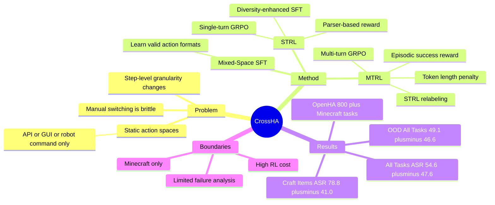

## Summary

CrossHA 把 agent 的 action-space selection 从人工规则变成可学习的 policy：同一个 VLM-based agent 在 Minecraft 中根据当前 step 在 Raw、Motion、Grounding、Language、Latent 等 heterogeneous action spaces 之间切换，并用 Single-Turn GRPO + Multi-Turn GRPO 优化成功率和执行效率。核心价值在于把“什么时候用 high-level action、什么时候退回 low-level precise control”形式化为 agentic RL 问题，而不是固定 action interface。

## Problem & Motivation

现有 agent 通常绑定在静态 action space 上：computer-use / GUI agent 依赖鼠标键盘或 GUI event，tool-use agent 依赖 API / MCP，embodied agent 依赖 robotic commands。论文指出这种固定接口有两个问题：一是 action translator / controller 本身可能脆弱，例如 API 被 CAPTCHA 阻断或低层控制不能精确执行；二是任务甚至同一条 trajectory 的不同阶段所需 action granularity 会变化，人工指定 action space 会限制 agent 的适应性。

作者关注的问题不是“设计一个更强的单一 action space”，而是训练一个 native agentic model，让它在每一步自主选择合适的 action interface。这个问题对 GUI-agent / embodied-agent 都重要，因为真实任务常常需要 high-level efficiency 和 low-level precision 之间动态折中。

## Method

**Problem formulation.** CrossHA 把环境建模为 MDP，action space 是多个子空间的并集，每个子空间对应一个 controller。优化目标包含任务 reward 和 action cost penalty，因此模型不仅要完成任务，也被鼓励在可行时选择更简洁的 action 表达。

**Stage 1: Mixed-Space SFT.** 第一阶段在 balanced mixed-action-space trajectories 上做 SFT，让模型先学会解码和生成多种 action format。论文明确说这个阶段得到的 `M_mix` 还不会自主选择最优 action space，目标只是避免多模态 action 表达之间互相干扰。

**Stage 2: Single-Turn RL (STRL).** 作者先用 Diversity-Enhanced SFT warm-up，让模型针对同一输入生成来自多个 action spaces 的候选动作，并用 rejection sampling 保留能成功执行的动作。随后用 GRPO 做 single-turn optimization：确定性 parser `g` 把不同 surface form 的 action string 映射到 canonical raw action，只要 parsed raw action 和 ground truth 一致就给 reward。因此 reward 是 action-space agnostic 的，模型被鼓励忽略原始标注偏好，选择当前输入下最可靠的 action space。

**Stage 3: Multi-Turn RL (MTRL).** 论文先把 STRL 模型的 action-space preference distill 回监督数据：如果 `M_strl` 预测的 action 与 ground truth 在 canonical raw representation 上一致，就用模型选择的 action surface 替换原标签，否则保留原标签，得到 `M_cs2`。之后在 30 个 OpenHA training tasks 上做 multi-turn GRPO，episodic reward 是 binary success，目标函数额外加入 trajectory token length penalty，促使模型在不牺牲成功率时偏向更短、更高层的 action。

**Environment and action spaces.** 实验在 Minecraft 1.16.5 中进行，observation 是 640x360 RGB first-person images，20 Hz，不提供 voxel grid、坐标等 privileged state。论文讨论的 action spaces 包括 Raw Actions、Language Skills、Motion Actions、Grounding Actions、Latent Actions；case studies 中主要展示 Motion、Grounding、Raw 三类 action 随任务阶段切换。

## Key Results

**OpenHA / Minecraft benchmark.** 论文在 OpenHA benchmark 的 800+ Minecraft tasks 上报告 Finished Tasks (FT) 和 Average Success Rate (ASR)。CrossHA 的 All Tasks ASR 为 **54.6±47.6**，高于 Game-TARS **42.2**、UI-TARS-1.5 **33.8**、OpenHA **31.5±12.5**、JARVIS-VLA **24.5±28.4**。但 All Tasks FT 为 **58.7**，低于 JARVIS-VLA **63.8** 和 OpenHA **62.8**，所以“state-of-the-art”更准确地说主要体现在 ASR 和若干类别指标上，不是所有 coverage 指标都领先。

| Benchmark / setting | CrossHA 结果 | 对照 |
|---|---:|---:|
| OpenHA 800+ tasks, All Tasks ASR | **54.6±47.6** | Game-TARS 42.2, OpenHA 31.5±12.5 |
| OpenHA 800+ tasks, Craft Items ASR | **78.8±41.0** | OpenHA 31.9±13.7, JARVIS-VLA 25.1±23.9 |
| OpenHA 800+ tasks, Kill Entities ASR | **45.1±43.5** | OpenHA 32.5±9.2, Game-TARS 38.1±24.6 |
| OpenHA 800+ tasks, Mine Blocks ASR | 40.0±48.3 | Game-TARS 50.14±20.7, UI-TARS-1.5 42.1±20.4 |

**STRL ablation.** 去掉 STRL stage 后，Table 1 中 CrossHA(w/o STRL) 的 All Tasks ASR 是 **41.6±47.9**，完整 CrossHA 是 **54.6±47.6**；Craft Items ASR 从 **58.0±48.4** 提升到 **78.8±41.0**。Table 2 的 OOD evaluation 也显示完整 CrossHA 的 All Tasks success rate 为 **49.1±46.6**，高于 w/o STRL 的 **39.7±48.1**，Craft Items OOD 从 **58.0±48.4** 提升到 **78.8±41.0**。

**ID/OOD generalization.** MTRL 只使用 30 个 training tasks，每轮 6400+ environment interactions，训练 80+ iterations，但评估覆盖 800+ tasks。Table 2 中 CrossHA 在 OOD All Tasks 上达到 **49.1±46.6**，高于 RawHA-RL **42.4±45.1**、GroundingHA-RL **39.4±44.3**、MotionHA-RL **39.1±42.0**；不过在 ID All Tasks 上 CrossHA 是 **68.8±30.5**，略低于 RawHA-RL **70.1±33.6**，说明 mixed action space 的优势更明显地体现在 OOD transfer，而不是所有 ID 指标。

## Strengths & Weaknesses

**已知 Strengths.** 这篇论文的关键贡献是把 action-space switching 作为可学习 decision，而不是工程规则或 fixed hierarchy。STRL 的 parser-based reward 设计比较干净：不同 action surface 只要落到同一 raw action 就得到同样 credit，因此 credit assignment 对 action format 更公平。MTRL 进一步用 episodic success + token penalty 把“完成任务”和“少生成、用高层动作提升效率”放在同一个目标里，这与 long-horizon agent 的实际需求一致。

**已知 Weaknesses / boundary.** 实验证据主要来自 Minecraft 1.16.5 和 OpenHA task suite，虽然包含 embodied view 和 GUI crafting interface，但还不能直接证明在真实 OS GUI、web、robotics 场景中有效。训练成本不低：Appendix D 报告 MTRL 使用 **1.41B training tokens**、**1.3M images**，在 **8 NVIDIA A800-SXM4-80GB GPUs** 上训练；这限制了方法作为轻量 post-training recipe 的可复现性。Table 1 的 All Tasks FT 不如 OpenHA 和 JARVIS-VLA，Mine Blocks ASR 也不如 Game-TARS / UI-TARS-1.5，因此论文的 SOTA claim 需要按指标拆开看。

**已知未充分展开的部分.** 论文有 qualitative case studies，但没有系统的 failure-case taxonomy，也没有报告 statistical significance 或 matched compute / matched token budget 下的比较。作者提到 mixed-action annotations 因 grounding / motion annotation 无法覆盖每条 trajectory 而不平衡，但没有深入分析这种数据不平衡对各 action space 的选择偏置。future work 明确提到需要提升 multi-turn RL efficiency，并扩展到 real-world robotics，其中会出现 safety 和 latency 挑战。

**推测.** 这个 formulation 对 computer-use / GUI agent 很有启发：API、MCP、terminal、GUI click/type 可以类比为不同 action spaces，STRL/MTRL 可能用于学习何时走 symbolic tool、何时退回 visual GUI 操作。但这是从 Minecraft 结果外推，论文没有在真实 browser / desktop benchmark 上验证。

**不知道.** 不知道 CrossHA 在长任务失败时主要卡在 perception、action-space choice、controller execution 还是 sparse-reward exploration。也不知道不同 action spaces 的调用成本如果按真实 wall-clock latency 而非 token length 计量，策略是否会选择相同的接口。

## Mind Map

## Notes

- 最值得带走的 insight：action abstraction 不应该只在 system design 层面固定，而可以进入 policy learning 的 action choice 本身。对 long-horizon agent 来说，选择“用哪种接口行动”本身就是 task planning 的一部分。
- STRL 的 canonical raw action reward 是这篇里最简洁的设计：它避免把某个 action format 当成唯一正确答案，适合用于训练跨接口 agent。
- 后续如果迁移到 GUI / computer-use，可以重点观察三件事：是否能用 parser 把 GUI action、API call、terminal command 映射到共同 outcome；token penalty 是否应换成 latency / risk / reversibility cost；以及 failure 是否来自 router 选错接口还是底层 controller 执行失败。
