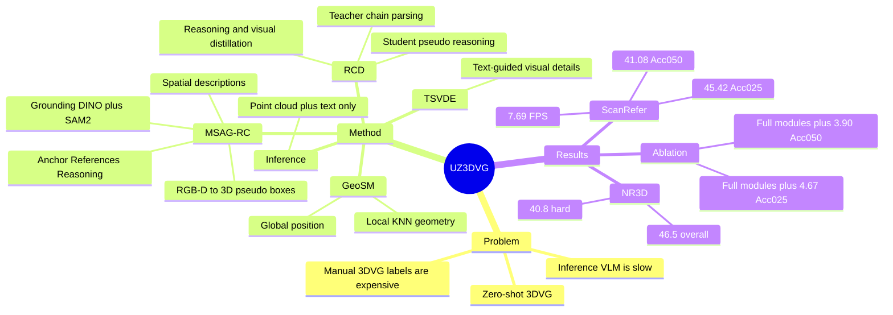

## Summary
UZ3DVG 解决 Zero-Shot 3D Visual Grounding 中推理阶段依赖 2D 图像、LLM/VLM 交互导致慢和部署复杂的问题。核心做法是把 VLM 放到训练阶段生成 3D spatial pseudo-labels 与 structured reasoning chains，再通过 RCD、TSVDE、GeoSM 训练轻量 3DVG 模型，使推理只需要 point cloud 与文本描述。

## Problem & Motivation
3D visual grounding 的目标是在 3D scene 中根据自然语言描述定位目标物体，论文将其动机连接到 indoor robotic visual navigation、VR 和 AR。已有 fully supervised 3DVG 方法依赖 ScanRefer、ReferIt3D 这类人工语言-3D 对齐标注，标注成本高，限制 novel scenes 上的泛化与部署。

Zero-shot 3DVG 方向尝试用 LLM/VLM 的语义和推理能力绕开人工 instance-wise description annotations，但 ZSVG3D、SeeGround、VLM-Grounder 等方法通常在推理阶段调用 LLM/VLM、使用 2D images 或多轮交互。作者指出这些设计带来 latency、computational overhead、cost 与 deployment complexity，且现有 zero-shot 3DVG 通常低于 TSP3D 使用的 6 FPS real-time threshold。UZ3DVG 的问题设定是：能否把 expensive VLM reasoning 移到训练时，用 generated language conditions 监督一个推理阶段 unaided 的 3DVG 模型。

## Method
UZ3DVG 分为训练阶段和推理阶段。训练时使用 MSAG-RC 生成 spatial description pseudo-labels 与 reasoning chains，再用 RCD 将 chain 中的空间推理知识蒸馏到轻量 student；推理时 MSAG-RC 和 teacher 不参与，只输入 point clouds 与 localization descriptions。

**MSAG-RC（Open-Vocabulary Multi-Source Spatial Annotation and Reasoning Chain Generator）** 从 RGB-D video sequence 或 projected 3D point clouds 得到 2D 输入。流程是：Grounding DINO 生成 open-vocabulary 2D boxes，SAM2 转成 pixel-level masks，结合 depth map、camera intrinsics/pose 与 axis-aligned scene coordinates back-project 成 object-level 3D pseudo boxes。随后 VLM 接收带目标框和 identifier 的 RGB image、3D box info、category 与 target-specific spatial context，生成 room-level spatial description，并被 prompt 要求输出 structured reasoning chain，包含 Anchor、References、Reasoning，同时给出 confidence score 并自检 description 与 reasoning chain 的一致性。

**RCD（Reasoning Chain Distillation）** 使用 teacher-student 双路径蒸馏。Teacher 先用 frozen RoBERTa 编码 reasoning chain 的 Anchor / Reference / Reasoning components，再通过 quality gating、self-attention、cross-attention 与 bidirectional cross-modal attention 得到 reasoning-enhanced text/visual features。Student 不直接读取生成的 chain，而是从真实 localization description 中生成 pseudo reasoning components，并用 component/global reasoning loss、reasoning gain loss 以及 foreground-background visual distillation loss 对齐 teacher。

**TSVDE（Text-Semantic-Guided Visual Detail Enhancement）** 在 upsampling 时根据 textual semantics 和 reasoning-enhanced visual features 做 similarity-based sampling，强化与文本相关的细粒度 visual details。**GeoSM（Geometry-Aware Spatial Modeling）** 同时建模 global 3D spatial context 与 local geometry：前者用 normalized coordinates 的 sinusoidal positional encoding，后者用 KNN neighborhood 中的 relative displacement 与 neighbor features，经 MLP 和 max pooling 得到 local relational features，再通过 residual connection 加回 visual features。

训练目标由 referring localization loss 与 distillation losses 组成：`Ltotal = lambda_rec Lrec + lambda_g Lg + lambda_v Lv + lambda_r Lr`，其中 `Lrec` 包含 bounding box regression 与 classification。论文还说明，在与 Mask3D-based zero-shot 方法公平比较时，推理阶段使用 Mask3D 做 post hoc bounding box refinement；同时也报告了 non-Mask3D 设置。

## Key Results
- **ScanRefer validation, Mask3D-based zero-shot setting**：UZ3DVG overall Acc@0.25/Acc@0.5 为 **45.42%/41.08%**，高于 SeeGround 的 **44.10%/39.40%**；Multiple subset 为 **40.49%/36.33%**，高于 SeeGround 的 **34.00%/30.00%**。速度为 **7.69 FPS**，相比 SeeGround 的 **0.20 FPS** 约 **38x**；但 Unique subset 上 UZ3DVG 的 **73.57%/68.15%** 低于 SeeGround 的 **75.70%/68.90%**。
- **ScanRefer validation, non-Mask3D zero-shot setting**：UZ3DVG overall Acc@0.25/Acc@0.5 为 **43.13%/35.05%**，高于 ZSVG3D 的 **20.00%/17.60%**；速度为 **9.43 FPS**，高于 ZSVG3D 的 **0.21 FPS**。VLM-Grounder 的结果标注为 250-query subset，论文未将其作为同规模 full validation 直接比较。
- **NR3D validation**：使用同一个在 ScanRefer pseudo-labels 上训练的 checkpoint，且不做 NR3D fine-tuning，UZ3DVG overall accuracy 为 **46.5%**，高于 ZSVG3D 的 **39.0%** 和 SeeGround 的 **46.1%**。Hard subset 为 **40.8%**，高于 ZSVG3D 的 **31.7%** 和 SeeGround 的 **38.3%**；View-Independent 为 **50.1%**，高于 ZSVG3D 的 **40.0%** 和 SeeGround 的 **48.2%**，但 Easy 和 View-Dependent 上分别低于 SeeGround（**52.2% vs 54.5%**，**39.3% vs 42.3%**）。
- **Module ablation on ScanRefer**：没有 TSVDE/RCD/GeoSM 时为 **40.75%/37.18%**；加入 TSVDE 后为 **41.83%/38.21%**；加入 TSVDE+RCD 后为 **43.26%/39.65%**；加入 TSVDE+GeoSM 后为 **43.15%/39.47%**；完整模型达到 **45.42%/41.08%**，相对无三模块 baseline 提升 **+4.67/+3.90**。
- **Generated supervision ablation**：直接用 2D boxes 生成 spatial descriptions 只有 **34.16%/22.83%**；MSAG-RC without reasoning chains 达到 **43.15%/39.47%**；加入 reasoning chains 后达到 **45.42%/41.08%**。VLM choice 也影响结果：Qwen3-VL-Plus 为 **43.87%/39.62%**，Doubao-seed-1.6 为 **45.42%/41.08%**。
- **Pseudo-label quantity**：从 **10K** 到 **20K** pseudo-labels，Acc@0.25/Acc@0.5 从 **25.71%/21.14%** 到 **36.88%/30.65%**；**30K** 达到 **43.36%/39.52%**；**40K** 为 **45.42%/41.08%**。作者指出 40K 的增益变小，说明 pseudo-label noise 会削弱继续扩展数据量的收益。

## Strengths & Weaknesses
**已知**：UZ3DVG 的核心优势是将 VLM reasoning 从推理阶段移到训练阶段，在 zero-shot 3DVG 中同时提升 ScanRefer/NR3D 的 overall accuracy 与推理速度。与 SeeGround 相比，它在 ScanRefer Multiple subset 的提升明显，说明 RCD 和 GeoSM 对多实例空间区分有帮助；qualitative analysis 也显示 ZSVG3D 和 SeeGround 在复杂空间关系或同类多实例时容易 mislocalize，而 UZ3DVG 定位正确。

**已知**：论文的 zero-shot 并不等于完全不使用外部模型。Grounding DINO、SAM2、Qwen3-VL-Plus 或 Doubao-seed-1.6 被用于训练数据生成；Mask3D-based setting 中还用 Mask3D 做 post hoc bounding box refinement。换言之，"unaided" 主要指推理阶段不需要 2D images 或 LLM/VLM interaction，而不是训练阶段无外部 foundation models。

**已知**：结果并非所有子集都优于 strong zero-shot baseline。ScanRefer Unique subset 上 UZ3DVG 低于 SeeGround，NR3D Easy 和 View-Dependent 也低于 SeeGround；论文的优势集中在 overall、harder spatial disambiguation、non-Mask3D setting 与 inference speed。与 fully supervised 方法相比，UZ3DVG 仍低于 PC-CrossDiff、MCLN、TSP3D 等部分结果，但它不依赖人工 3DVG 标注。

**已知**：pseudo-label 质量是关键变量。VLM choice 会改变 ScanRefer accuracy，MSAG-RC 相比直接 2D info 提升很大，reasoning chains 进一步提升；同时 pseudo-label 数量到 40K 后边际收益下降，作者将其归因于 pseudo-label noise。

**推测**：对 embodied agent 和 GUI/3D grounding 的启发在于，可以把 expensive multimodal reasoning 用作训练期 supervision generator，而把在线部署压缩成轻量 local perception-grounding model。这个推测与论文的训练/推理拆分一致，但论文实验只覆盖 ScanRefer 和 NR3D，没有验证 closed-loop robot navigation、interactive embodied tasks 或 GUI agent 场景。

**不知道**：论文没有给出 UZ3DVG 自身的系统性 failure cases，也没有报告生成 40K pseudo-labels 的实际成本、耗时或不同 detector/segmenter 选择的敏感性。论文正文中未出现 arXiv id 或 DOI。

## Mind Map

## Notes
这篇论文值得跟 GUI grounding / computer-use agent 的 synthetic supervision 思路对照：如果 GUI element grounding 也能把 VLM 的 chain-style spatial reasoning 离线蒸馏到轻量模型，可能降低在线 agent 的 latency 和 API 依赖。需要注意，这只是跨任务启发；UZ3DVG 的证据来自 3D indoor scene grounding，不直接证明 GUI 场景有效。
