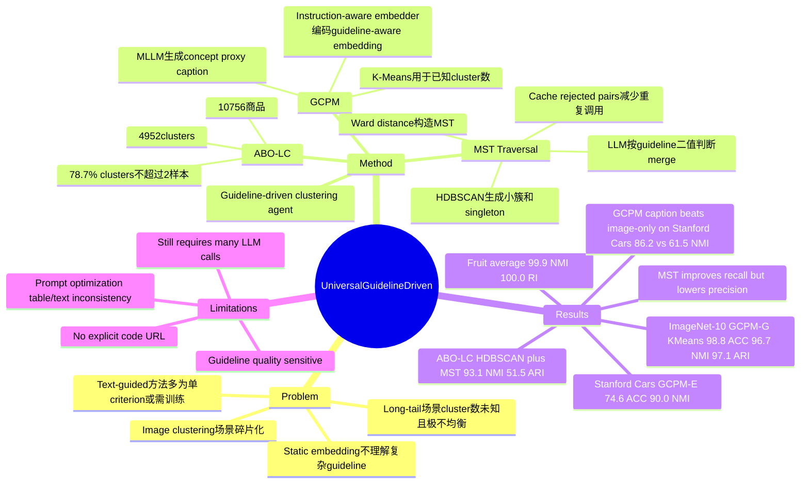

## Summary

这篇论文提出一个 training-free 的 Guideline-Driven Image Clustering Agent，用 natural language guideline 统一 general clustering、multiple clustering、fine-grained clustering 和 long-tail e-commerce clustering。核心方法是先用 MLLM 生成 guideline-aware concept proxy caption，再用 instruction-aware embedder 得到聚类表示，并在未知 cluster 数时用 MST-based LLM Traversal 选择性合并 HDBSCAN 的小簇。它对 VLM/LLM agentic pipeline 有参考价值，但主任务是 image clustering，不是 GUI-agent 或 embodied agent 的直接问题。

## Problem & Motivation

现有 image clustering 方法通常绑定某一种场景：general object clustering 依赖静态视觉表示和 K-Means/DBSCAN，fine-grained clustering 需要区分细粒度属性，multiple clustering 关注同一数据的不同划分视角，long-tail 场景又需要处理未知 cluster 数和极端不均衡分布。作者认为这些场景之间的 gap 使得 task-specific solution 很难部署到真实业务需求中。

论文的 problem formulation 是：给定一组样本 `X` 和 textual guideline `G`，学习或构造一个函数 `f(G, X)`，按 guideline 指定的语义标准输出 clusters。这个 formulation 的关键不是追求无监督聚类的单一“自然类别”，而是让用户用 guideline 指定 clustering criteria，例如 color、species、brand、model、intended activity 或 SOP-style rules。

已知动机包括两点：第一，直接用 static encoder 得到的视觉距离无法表达复杂语义 guideline；第二，已有 text-guided / multiple clustering 方法多半只能处理单一具体 criterion、需要 task-specific training，或假设 cluster 数已知。作者希望用一个 hybrid LLM/VLM agent 在不做 task-specific training 的情况下覆盖多种 clustering regime。

## Method

方法由两段组成：Generative Concept Proxy Modeling (GCPM) 和 MST-based LLM Traversal。

**GCPM** 先从 guideline 中抽取或生成 attributes，再用 MLLM 作为 captioning model，把每张图转成 concept proxy caption。这个 caption 明确暴露 guideline 关心的属性，例如 bird species 里的 bill shape、wing color、tail shape，或 e-commerce item 里的 brand、model name、product type、style。随后，caption 被送入 instruction-aware embedder 得到 guideline-aware embedding；作者测试了 INSTRUCTOR-large、E5-Mistral 和 GME-Qwen2-VL。若 cluster 数已知，直接对这些 embedding 跑 K-Means。

**MST-based LLM Traversal** 用于 cluster 数未知或 long-tail 场景。流程是先用 HDBSCAN 在 GCPM embedding 上得到保守的小簇和 singleton，再计算簇间 Ward distance，构造 Minimum Spanning Tree，并按边权从小到大让 LLM 判断两个簇是否应该 merge。每个 cluster 用离 centroid 最近的 Top-K GCPM captions 表示，主实验用 `K=5`；被 LLM 拒绝过的 pair 会缓存，避免后续重复调用。作者给出的复杂度论证是：naive pairwise comparison 需要 `O(M^2)` 次 LLM 判断，而 MST traversal 在其 adaptive merge-rate model 下期望为 `O(M log M)`。

当没有明确 guideline 时，作者使用 heuristic prompts 让 LLM 从用户给出的基本 clustering objective 推导 key attributes。例如 Stanford Dogs 只需要用户说明目标是 dog breeds，LLM 先列出 major difference categories，再细化成可观察 visual attributes，最后形成 guideline prompt。这个环节仍依赖 LLM 的先验知识和 prompt quality。

作者还构造了 **ABO-LC** long-tail e-commerce clustering benchmark：从 Amazon Berkeley Objects 数据中过滤出 10,756 个商品，按 brand、color、item id、model name、product type、style 的组合形成 4,952 个 ground-truth clusters，其中 78.7% 的 clusters 只有 2 个或更少样本。这个 benchmark 用来测试未知 cluster 数和极端 long-tail 分布下的 clustering。

## Key Results

- **General clustering / CIFAR-10, STL-10, ImageNet-10**：在已知 cluster 数、K-Means 设置下，GCPM-G 分别达到 CIFAR-10 `94.1 ACC / 87.5 NMI / 84.5 ARI`，STL-10 `98.8 / 96.9 / 97.4`，ImageNet-10 `98.8 / 96.7 / 97.1`。作者指出 ImageNet-10 的 98.8% ACC 比 IDCTCL 的 97.2% 高 1.6pp。
- **Multiple clustering / Fruit, Card, CIFAR10-MC**：Fruit 上 GCPM-G+K-Means 达到 average `99.9 NMI / 100.0 RI`，高于 Multi-Sub 的 `98.5 / 99.8`；Card 上 GCPM-E+K-Means 达到 average `90.0 NMI / 98.2 RI`，其中 number criterion 是 `91.1 NMI / 99.1 RI`，suits criterion 是 `89.0 / 97.2`；CIFAR10-MC 上 GCPM-G+K-Means 为 average `52.6 NMI / 73.2 RI`，略高于 Multi-Sub 的 `50.5 / 72.5`。
- **Fine-grained clustering / CUB Birds, Stanford Dogs, Stanford Cars, Oxford Flowers**：GCPM-G+K-Means 在 CUB Birds 达到 `72.9 ACC / 89.9 NMI`，Stanford Dogs `75.1 / 85.9`，Oxford Flowers `86.0 / 94.9`；Stanford Cars 上最佳 K-Means 结果是 GCPM-E 的 `74.6 ACC / 90.0 NMI`，而 DiFiC 是 `47.2 / 68.0`，UFCL 只报告 `46.5 NMI`。
- **Long-tail clustering / ABO-LC**：IC|TC baseline 是 `5.5 ACC / 35.3 NMI / 5.3 ARI`。在已知 cluster 数的 K-Means 设置下，GCPM-I 达到 `55.7 ACC / 92.9 NMI / 38.4 ARI`；在未知 cluster 数的 HDBSCAN+MST 设置下，GCPM-E+MST 达到 `93.1 NMI / 51.5 ARI`，且该设置不需要先验 cluster count。
- **MST Traversal ablation**：ImageNet-10 上，GCPM-G 的 HDBSCAN ARI 从 `30.9` 经 MST Traversal 提升到 `72.1`；GCPM-E 从 `0.3` 到 `70.3`。Card multiple clustering 中，GCPM-E average NMI 从 `38.1` 提升到 `75.4`，GCPM-G average NMI 从 `40.1` 到 `54.5`。
- **BCubed / merge behavior**：ImageNet-10 上，HDBSCAN before 是 `7034` clusters、`99.7 B-Prec. / 19.9 B-Rec.`，MST after 变为 `251` clusters、`93.5 / 62.3`；Card-Number 上 before 是 `4191` clusters、`98.6 / 3.1`，after 是 `151` clusters、`90.6 / 42.3`。这说明 MST Traversal 用 precision 换 recall，主要解决 HDBSCAN 只形成 tiny clusters 的问题。
- **GCPM caption ablation**：使用 GME-Qwen+K-Means 时，GCPM Caption 的 NMI 在 ImageNet-10 / Card-Number / Stanford Cars 分别为 `96.7 / 82.0 / 86.2`，高于 Image Only 的 `94.7 / 71.9 / 61.5` 和 Standard Caption 的 `93.7 / 73.3 / 69.2`。
- **LLM call 数量**：MST Traversal 在 ImageNet-10 用 `11232` 次 LLM calls / `13000` samples，ratio `0.86`；Card-Number 用 `6506 / 8029`，ratio `0.81`；Stanford Cars 用 `10803 / 8041`，ratio `1.34`。这比 naive pairwise cluster comparison 更省，但仍不是 low-cost 推理。
- **More ablations**：Card-Number 上 Top-K `K=3/5/7` 的 NMI 是 `70.7 / 72.1 / 72.4`，作者选择 `K=5` 作为性能和效率折中；Claude-3.5-Sonnet 替代 QWen-VL 做 MST Traversal 时，Card-Number 从 `72.1 NMI / 95.1 RI` 到 `79.4 / 96.3`，Stanford Cars 从 `80.9 NMI / 33.2 ARI` 到 `82.2 / 41.0`。

## Strengths & Weaknesses

**已知亮点**：

- 问题 formulation 有价值：把 clustering 从“固定数据集上的无监督类别发现”改写为 guideline-conditioned grouping，更接近真实业务里的“按某套规则组织图像”。
- 方法相对简洁：GCPM 把 visual input 转成 guideline-aware textual proxy，再用 instruction-aware embedding；MST Traversal 只在 HDBSCAN 产生的 candidate merge 上调用 LLM，不要求训练一个新的 clustering model。
- 实验覆盖面广：GC、MC、FC、LC 四类任务都有结果，且同时比较了已知 cluster 数的 K-Means 和未知 cluster 数的 HDBSCAN+MST。
- GCPM 的 ablation 比较直接：Table 7 显示 GCPM caption 在 ImageNet-10、Card-Number、Stanford Cars 上都优于 image-only 和 standard caption，支持“显式暴露 guideline-relevant attributes”这个设计。

**已知局限**：

- guideline quality 是硬依赖。作者在 Limitations 中明确说，ambiguous 或 incomplete guideline 会让 clustering 不符合用户意图。
- MST Traversal 虽然减少了 naive pairwise comparison，但仍要多次调用 LLM；在 Stanford Cars 上 LLM/sample ratio 是 `1.34`，大规模部署仍有成本问题。
- HDBSCAN+MST 的收益伴随 precision drop：ImageNet-10 的 B-Prec. 从 `99.7` 降到 `93.5`，Card-Number 从 `98.6` 降到 `90.6`。这不是纯提升，而是 recall/precision trade-off。
- 论文对 Prompt Optimization 的文字和 Table 9 有不一致：Table 9 显示 Oxford Flowers 的 NMI 从 `88.6` 到 `90.2`、B-Prec. 从 `90.1` 到 `95.7`，但 B-Rec. 从 `67.9` 降到 `65.9`；正文却说 precision 和 recall 都 increase。这里应以表格数字为准，并把它视为 paper consistency issue。
- code 没有明确 URL；论文只说 project page 存在，并在 appendix 写明 complete codes 和 processed ABO-LC dataset will be released upon acceptance。

**推测**：

- 这套 pipeline 对 GUI-agent memory / screen collection organization 可能有启发：agent 可以用 natural language guideline 对 screenshots、states 或 UI elements 做 task-conditioned grouping，而不是只按视觉 embedding 聚类。
- GCPM 的优势可能主要来自“把视觉纠缠属性拆成文本槽位”；在需要细粒度视觉判别但 captioner 本身不可靠的场景，error 会从 caption stage 传导到 embedding 和 merge stage。
- MST Traversal 的实际成本可能强依赖初始 HDBSCAN 的 granularity；若初始簇太碎，LLM calls 仍然会很高，若初始簇错合并，后续 binary merge 很难纠正。

**不知道 / 不应推断**：

- 论文没有提供 DOI。
- 论文没有给出明确 GitHub/code URL，也没有报告开源后的复现实验。
- 论文没有证明该方法能处理任意自然语言 guideline；实验中的 guideline attributes 多数是作者设计或由 heuristic prompts 生成。
- 论文没有报告真实业务用户如何编写 guideline，也没有 user study 或 human-in-the-loop 成本分析。

**个人判断**：评分给 3。它不是 GUI-agent 主线论文，但对 VLM+LLM agentic data organization、instruction-aware embedding、LLM-as-semantic-merge-judge 都有参考价值；核心风险是 guideline/caption/LLM judge 的误差链和推理成本。

## Mind Map

## Notes

- 这篇可以和 instruction-aware embedding、VLM retrieval、LLM-as-judge / LLM-as-router 的工作一起看。它的关键不是 clustering algorithm 本身，而是把 guideline 作为中间语义接口，让 MLLM 负责 attribute extraction，让 embedding model 负责 scalable nearest-neighbor structure，让 LLM 只处理边界 merge。
- 对 agent research 的启发：很多 agent memory / trajectory archive / screenshot archive 可能不应该只做 global semantic clustering，而应该根据当前任务 guideline 动态重组。
- 一个后续问题：如果 guideline 来自用户 SOP，怎样验证 guideline 本身是否 operationalizable？这篇主要用 prompt optimization 和少量 false positive pairs 修 prompt，但没有形成完整的 guideline validation protocol。
