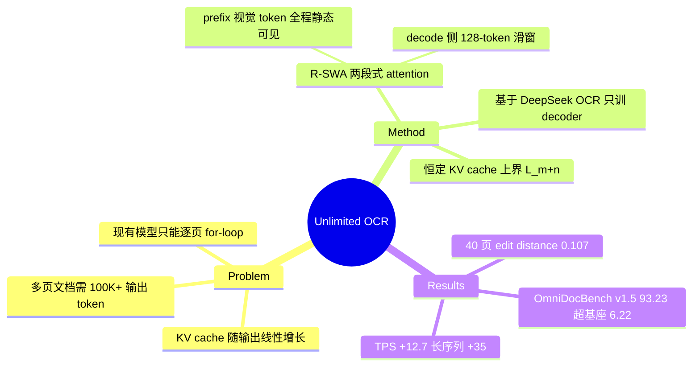

## Summary

针对 LLM-based OCR decoder 在长文本生成时 KV cache 线性膨胀、解码越来越慢的问题，提出 Reference Sliding Window Attention (R-SWA)：视觉 token 作为静态 "reference" 全程可见，生成侧只保留固定宽度（n=128）的 causal sliding window，实现全程恒定 KV cache，在 32K context 内单次 forward 解析数十页文档。

## Problem & Motivation

- LLM decoder 的标准 MHA KV cache 随输出长度线性增长：C(T) = L_m + T。多页文档 OCR 场景下（20-30 页 ≈ 10K 视觉 token），输出常需超过 100K token，内存与延迟随每步解码持续恶化。
- 现有模型连 10 页都无法单次 forward 解析，只能 page-by-page for-loop、每页重置 memory，丢失跨页上下文且吞吐低。
- 作者的直觉类比：人类做长时抄写任务时效率不衰减，因为只需盯着"眼前的局部上下文"加上一份始终在手边的原稿（reference）。OCR 本质是 reference-based 生成——输出内容几乎完全由输入图像决定，不需要对已生成的远距离文本做全局 attention。

## Method

**R-SWA（Reference Sliding Window Attention）**：把 attention 窗口切成两段——

- **m 段（prefix/reference）**：全部视觉 token + prompt，对所有后续 token 全程全局可见。视觉 token 编码一次后保持静态，不做任何 recurrent 状态更新，避免 causal sliding window 类方法对视觉特征的 progressive blurring。
- **n 段（decode window）**：对已生成文本只保留最近 n=128 token 的 causal 滑窗。

每个 token t 的可见集合 N(t) = P ∪ D_n(t)，其中 P 为全部 prefix 位置，D_n(t) 为最近 n 个输出位置。KV cache 上界为 L_m + n（常数），对比 MHA 的 L_m + T 无界增长；T ≫ n 时 cache 占比趋近 0。

**实现**：
- 基座为 DeepSeek OCR（3B total / 500M activated 的 MoE），保留 DeepEncoder（16× token 压缩，1024×1024 页面 ≈ 256 token），把 decoder 所有 attention 层替换为 R-SWA。
- 训练：冻结 DeepEncoder 只训 LLM；2M 文档 OCR 样本（90% 单页 / 10% 多页），4K steps，batch 256，max seq 32K，8×16 A800，AdamW 1e-4 + cosine。
- 推理在 Transformers 和 SGLang 均做了适配，附 Flash Attention v3 kernel 分析。

## Key Results

- **OmniDocBench v1.5**：overall 93.23%（比 DeepSeek OCR +6.22），text edit distance 0.038（-0.035），formula CDM 92.61%（+9.24），table TEDS 90.93%（+5.96），reading order edit 0.045（-0.041）。
- **OmniDocBench v1.6**：93.92% overall，超过 DeepSeek OCR 2（90.25%），与 Qianfan-OCR（93.90%）持平。
- **吞吐**：OmniDocBench 推理 5,580 TPS vs DeepSeek OCR 4,951 TPS（+12.7%）；输出 6,144 token 时理论 TPS 上限 7,848 vs 5,823（+35%），且延迟曲线全程恒定，而 baseline 随解码步数上升并在 cache 对齐边界出现 spike。
- **长程解析**（多页单次 forward）：2/5/10/20 页 edit distance 稳定在 0.036-0.057，40+ 页升至 0.107 但仍可用；40+ 页的重复错误归因于 DeepEncoder Base 模式（1024×1024）对小字的分辨率不足，而非 R-SWA 本身。

## Strengths & Weaknesses

**Strengths**：
- 问题选得准：OCR 是典型 reference-based 任务，输出对远距离已生成文本的依赖极弱，sliding window 假设在这里天然成立——这是"任务结构决定 attention 结构"的干净案例。
- 方法极简：不加模块、不加参数，只改 attention mask + 少量微调（4K steps），换来恒定 KV cache 和数十页单次 forward，符合 simple & scalable 的品味。
- 恒定延迟曲线（Flash Attention v3 分析）是比平均 TPS 更有说服力的证据。

**Weaknesses**：
- 无 formal ablation：n=128 怎么选的、纯 SWA（无 reference 段）会掉多少、reference 段是否必要，全都没有实验支撑，核心设计的贡献拆解缺失。
- 精度提升（v1.5 上 +6.22 overall）与 R-SWA 的因果关系存疑——训练数据（2M 样本，10% 多页）和微调本身可能贡献了大部分，论文没有 "DeepSeek OCR + 同样数据微调（全 attention）" 的对照。
- "Unlimited" 是营销词：prefill 侧视觉 token 仍随页数线性增长，32K context 下 40+ 页已到极限，作者自己也承认需要 128K context + "prefill pool" 才能继续 scale。
- ASR/translation 的泛化性只是 claim，零实验。translation 对已生成文本的长程依赖比 OCR 强得多（指代、一致性），128-token 窗口是否够用非常可疑。

**推测**：R-SWA 本质是 StreamingLLM/attention-sink 思路在 vision-referenced 生成上的任务特化（prefix 全可见 ≈ sink token 的极端版本），新颖性主要在任务适配而非机制本身。

## Mind Map

## Notes

- 与 GUI agent 的潜在关联：GUI trajectory 生成同样是 "静态 reference（screenshot）+ 结构化输出" 模式，R-SWA 式的 reference attention 或可用于长 action 序列/长文档 screen parsing 的高效解码。
- 待验证：reference 段随页数增长时 prefill 成本如何摊销（作者提的 "prefill pool" 方向值得跟踪）。
