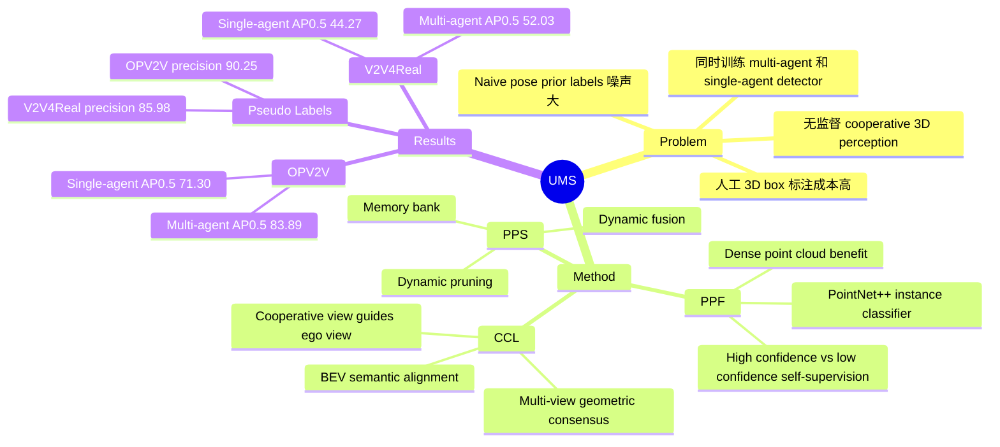

## Summary
这篇论文提出 UMS，一个利用 cooperative LiDAR views 在无人工标注条件下同时训练 multi-agent detector 和 single-agent detector 的 3D object detection 框架。核心思想是把多车共享点云带来的 density benefit 用于更可靠的 proposal filtering / stabilization，并把 cooperative view 作为 single-agent view 的 cross-view supervision。实验在 V2V4Real 和 OPV2V 上显示 UMS 明显优于 DBSCAN、OYSTER、CPD、DOtA 等 unsupervised baselines，但在真实长距离场景和多类别扩展上仍有清晰边界。

## Problem & Motivation
Multi-agent cooperative perception 可以通过共享 LiDAR 点云扩大感知范围，但现有 multi-agent 和 single-agent 3D perception 通常依赖大量人工 3D bounding box 标注。作者要解决的问题是：能否只依赖 agents 之间的通信和 sensor sharing，同时训练 multi-agent perception 与 single-agent perception。

论文指出 naive 做法是用 communicated agents 的位置 / 姿态先验自动生成 3D boxes，再训练 detector；但这种方式会产生大量 false positives 和 false negatives。作者观察到 cooperative views 有两个可利用信号：共享点云提升 point cloud density，使无监督 object classification 更容易；multi-agent cooperative view 与 single-agent view 之间存在几何和语义一致性，可作为 single-agent detection 的无监督指导。

## Method
UMS 训练两个 detector：multi-agent detector `Dm` 使用多车共享点云，single-agent detector `De` 只使用 ego-agent 点云。训练起点是由 communicated vehicle poses 生成的 weak pseudo labels；之后通过三个模块迭代 refinement。

1. **Proposal Purifying Filter (PPF)**：利用 multi-agent dense point clouds 中 high-confidence proposals 多为 true positives、low-confidence proposals 多为 false positives 的统计差异，构造 self-supervised binary classification。PPF 使用 PointNet++ 做 instance-level hierarchical point cloud feature extraction，对每个 proposal crop 输出 `q_i`，训练时用 Binary Cross Entropy，测试时保留 `q_i >= 0.5` 的 proposals。

2. **Progressive Proposal Stabilizing (PPS)**：为 multi-agent branch 维护 pseudo label memory bank，用 easy-to-hard curriculum 逐步稳定 proposals。Dynamic Pruning 用 sigmoid confidence threshold 从低到高筛选当前 proposals；Dynamic Fusion 将历史 proposals 与当前 proposals 按动态权重融合，再通过 rotated-IoU NMS 得到 stabilized pseudo labels。

3. **Cross-View Consensus Learning (CCL)**：用于把 cooperative view 的信息迁移给 single-agent detector。Multi-View Geometric Consensus 先用 rotated-IoU 匹配 single-view / multi-view filtered proposals，再把 ego 点云中有足够 point support 的 unmatched multi-view proposals 加入 single-view pseudo labels；BEV Semantic Alignment 则在 visibility mask 下最小化 single-agent 和 multi-agent BEV feature maps 的 L2 difference。

实现上，论文使用 PointPillars 作为 detector backbone、AttFuse 作为 cooperative feature fusion，训练设置为 `T = 20` refinement iterations、每轮 `E = 10` epochs；候选 proposals 的 minimum confidence threshold 为 `0.01`。

## Key Results
- **V2V4Real / OPV2V main benchmark**：在 V2V4Real multi-agent setting，UMS 达到 `58.12 / 52.03` AP@0.3 / AP@0.5，高于 DOtA 的 `54.60 / 48.84`；在 OPV2V multi-agent setting，UMS 达到 `86.71 / 83.89`，显著高于 DOtA 的 `66.14 / 52.37`。
- **Single-agent perception**：在 V2V4Real single-agent setting，UMS 为 `49.72 / 44.27` AP@0.3 / AP@0.5，高于 DOtA 的 `45.40 / 40.41`；在 OPV2V single-agent setting，UMS 为 `76.31 / 71.30`，高于 DOtA 的 `59.01 / 46.87`。
- **Range-wise V2V4Real single-agent**：UMS 在 `0-30m`、`30-50m`、`50-100m` 上分别为 `70.26 / 65.66`、`36.26 / 30.05`、`9.03 / 7.74` AP@0.3 / AP@0.5；长距离 AP 仍然很低，但比 DOtA 的 `7.77 / 5.23` 略好。
- **Pseudo-label quality**：在 IoU=0.5 的 multi-agent pseudo labels 上，UMS 在 V2V4Real 达到 `53.71` recall / `85.98` precision，高于 DOtA 的 `43.91 / 60.42`；在 OPV2V 达到 `70.21 / 90.25`，高于 DOtA 的 `51.87 / 65.74`。
- **Ablation**：OPV2V multi-agent AP@0.5 从 weak detector 的 `19.33` 提升到 `59.55`（+PPF），再到 `83.89`（+PPS）；single-agent AP@0.5 从 `66.44`（PPF+PPS）提升到 `71.30`（+CCL）。V2V4Real 上也有同向提升：multi-agent AP@0.5 从 `16.87` 到 `46.02` 到 `52.03`，single-agent AP@0.5 最终到 `44.27`。
- **Robustness / extension**：V2V4Real 加入 GPS pose error 后 UMS 为 `56.21 / 49.05`，加入 100 ms latency 后为 `57.67 / 48.38`，仍高于无监督 baselines；V2X-Real multi-class AP@0.3 上 UMS 的 Car / Pedestrian 为 `40.10 / 17.71`，高于 DOtA 的 `34.27 / 14.33`。

## Strengths & Weaknesses
**已知：** UMS 的主要贡献是把 cooperative LiDAR views 同时用于 multi-agent pseudo-label refinement 和 single-agent cross-view supervision。主结果、pseudo-label quality、component ablation、iteration ablation、`tau` ablation 和 `mu_3` ablation 都支持三个模块的有效性；其中 PPF/PPS 主要驱动 multi-agent gains，CCL 进一步提升 single-agent detector。

**已知：** 方法在 OPV2V 上提升非常大，但在 V2V4Real 上提升更小。论文自己的解释是 OPV2V synthetic LiDAR 更干净、几何一致性更强，而 V2V4Real 存在 noisy、sparse、irregular real-world LiDAR returns，这使 instance-level feature learning 更难。

**已知：** 方法依赖 communicated vehicle poses、共享 LiDAR、GPS pose transformation，以及训练阶段可用的 cooperative views。single-agent detector 测试时只用 ego point cloud，但其训练信号来自 cooperative view；这与完全孤立的 single-agent unsupervised learning 不同。

**已知：** 长距离真实场景仍是弱点。V2V4Real `50-100m` single-agent AP@0.5 只有 `7.74`，说明 cooperative supervision 不能完全解决远距离 sparse LiDAR 的可观测性问题。定性图中 UMS 相比 OYSTER / CPD 更干净，但示例仍有两个 missed objects。

**已知：** 多类别实验只覆盖 V2X-Real 的 Car 和 Pedestrian，且论文说明 PPF filter 使用 Waymo open dataset 中带标签的 Car / Pedestrian point clouds 预训练；因此 multi-class extension 的监督假设与主实验的 target-domain no-human-annotation setting 不完全相同。

**推测：** cooperative-view-as-supervision 的思路可能对 multi-robot / embodied perception 有迁移价值，尤其适合有可靠 pose sharing 的场景；但论文没有验证 camera-only、VLM-grounded perception、GUI-agent 或非车辆场景。

**不知道：** 论文没有给出代码链接、DOI，也没有详细报告训练计算成本、通信带宽开销或在更大 agent 数量下的 scaling behavior。鲁棒性实验覆盖了 `0.2m` GPS pose noise 和 `100ms` latency，但没有系统展开更严重定位误差、通信丢包或异步感知条件。

## Mind Map

## Notes
这篇论文对我的主要启发不是具体 detector，而是 supervision source 的重新表述：cooperative view 不只是提升推理时感知范围，也可以在训练时充当 cross-view teacher。对 embodied / agent perception 来说，一个值得继续追问的问题是：当多个 embodied agents 共享的是 heterogeneous observations，例如 camera、screen、map、language memory，而不是 aligned LiDAR point clouds，是否也能构造类似的 cross-view consensus signal。
