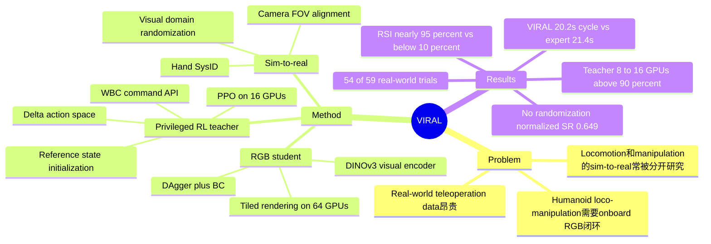

## Summary

VIRAL 是一个 RGB visual sim-to-real framework：先在 simulation 里用 privileged RL teacher 学 humanoid loco-manipulation，再用 DAgger + behavior cloning 蒸馏成只看 RGB + proprioception 的 student，并通过大规模 tiled rendering、visual randomization、hand SysID / camera alignment 零样本部署到 Unitree G1。它的主要贡献不是单个新算法，而是把 teacher-student、WBC command API、reference state initialization、delta action、visual randomization 和 GPU-scale training 串成可工作的全栈 recipe；实机连续 place-pick-turn loop 成功 54/59 次，接近 expert teleoperation。

## Problem & Motivation

Humanoid loco-manipulation 的核心难点在于 locomotion 和 manipulation 必须在 onboard perception 下长时域闭环耦合：机器人要走到合适位姿、放置物体、抓取新物体、转身并重复。论文指出现有 humanoid 系统常落在三类局部能力里：blind locomotion、固定 tabletop manipulation、依赖 human teleoperation 或 non-onboard sensors 的 demo；它们很少展示真实世界中自主、持续、基于 onboard RGB 的 loco-manipulation。

作者的动机是：如果把 humanoid mobile manipulation 当作纯 real-world teleoperation data scaling 问题，数据成本会因为 humanoid 硬件复杂度、DoF、safety constraints 和 teleoperation overhead 变得很高。Simulation 在 legged locomotion 上已经是主流路径，但 manipulation 的 sim-to-real 成功多局限于 tabletop / narrow tasks；因此论文要回答的问题是：visual sim-to-real 能否让 humanoid 在真实世界中完成有用的 onboard-perception loco-manipulation？

## Method

### Teacher-student pipeline

VIRAL 采用两阶段 privileged learning。第一阶段训练 privileged RL teacher：teacher 可以访问 full-state proprioception 和 exteroception，输出给 pretrained WBC policy HOMIE 的 high-level command，而不是从低层 motor control 学起。第二阶段训练 RGB-based student：student 只能看到真实机器人可获得的 proprioception 和 RGB image，通过 mixed online DAgger + behavior cloning imitation teacher action。

Teacher training 在 simulation 中不做视觉渲染，论文使用两台 8-GPU L40S nodes（共 16 GPUs）和 customized TRL / PPO 训练。Student training 使用 Isaac Lab tiled rendering，在八台 8-GPU L40S nodes（共 64 GPUs）上进行大规模 visual distillation。Supplement 中给出的规模是 teacher 32,768 environments（2048 * 8 GPUs * 2 nodes），student 65,535 environments（1024 * 8 GPUs * 8 nodes）。

### Teacher design

Teacher 的 observation 包含 privileged proprioception（base velocity、gravity、last action、joint position/velocity、fingertip forces）和 privileged exteroception（stage、target、object/table relative transforms）。Action 不是 absolute joint target，而是 delta WBC command：delta linear velocity、delta yaw velocity、delta arm target 和 delta finger target。论文认为 delta action space 对 humanoid loco-manipulation training 的稳定性很关键。

Reward 按 walking、placing、grasping、turning 等 stage 设计；supplement 进一步列出 termination、action smoothness、heading、object distance、place force、lift z、turn-around 等 reward terms。为了解决长时域 exploration，作者收集 200 条 teleoperated simulation demonstrations，并在 episode reset 时从 demonstration snapshot 初始化 robot、object 和 table 状态，即 reference state initialization（RSI）。这让 teacher 在尚未能从头走完整任务前，就能接触到 grasp / place 等高 reward 中间状态。

### Student design

Student 用 RGB image + sim-to-real proprioception imitation teacher。论文把 DAgger 和 BC 写成同一个 MSE distillation objective，只是 data collection 的 observation distribution 不同：teacher rollouts 提供 clean demonstrations，student rollouts 暴露 learner 自己会进入的 off-distribution states。作者最终采用 teacher rollout ratio alpha = 0.5，理由是 pure BC 收敛快但部署时 brittle，加入 student rollouts 后 correction robustness 更好。

视觉 backbone 使用 DINOv3 image encoder，输入 RGB image 大小为 108 x 192，得到 128-dimensional visual feature，再与 113-dimensional student proprioceptive state 拼接给 policy head。论文还比较 single-step MLP、feed-forward history model 和 LSTM；结论是 history-aware models consistently outperform single-step baseline，longer temporal windows 在资源允许时更好。

### Sim-to-real transfer

真实平台是 29-DoF Unitree G1 humanoid，配 7-DoF three-finger dexterous hands；感知用 Intel RealSense D435i，推理运行在 Intel i9-14900K CPU + NVIDIA RTX 4090 GPU 的 desktop workstation。Sim-to-real 侧做三类对齐 / randomization：

- **Dexterous hand SysID**：Unitree G1 的 3-finger hand 是 high gear ratio，作者用真实 grasp-release primitive 与 simulation replay 对齐 finger armature、stiffness、damping。
- **Camera FOV alignment**：相机 intrinsics 依据厂家参数匹配，extrinsics 通过 visually matching rendered and real images 做 lightweight real-to-sim calibration，并在训练中 randomize extrinsics。
- **Visual / simulation randomization**：训练中随机 image brightness、contrast、hue、saturation、Gaussian noise / blur、dome-light intensity / rotation / texture、robot/floor/table/object materials、table dimensions 和 camera extrinsics；supplement 给出的 camera position noise 范围包括 X/Z +/-0.02m、Y +/-0.05m，pitch +/-0.1 rad。

## Key Results

- **Real-world continuous loco-manipulation task**：Unitree G1 在两张桌子之间重复 walking -> placing -> grasping -> turning。VIRAL 在 59 个 consecutive real-world trials 中成功 54 次，success rate 约 91.5%。
- **Human teleoperation comparison**：同一 HOMIE policy 下，expert teleoperator（1000+ hours G1 teleoperation）success rate 为 100%，cycle time 21.4s；VIRAL 的 cycle time 是 20.2s，成功率略低但速度更快；non-expert teleoperator（约 1 hour experience）success rate 为 73%，且执行更慢。
- **Real-world generalization evaluation**：论文系统改变 tray start position、robot start pose、table height、lighting、tablecloth、table type / color 和 object category；正文只报告 VIRAL "consistently completes the task"，没有给出这些因素下的分项 success rate。
- **Teacher training ablation (Figure 9)**：without RSI 的 teacher success rate plateau below 10%；full VIRAL teacher with RSI reaches nearly 95% success。delta action space 也被报告为 critical：delta-action teacher reliably solves the task，而 absolute-action variant fails to reach high success，但正文没有给出 absolute-action 的具体数值。
- **DAgger / BC ablation (Figure 11)**：pure BC（alpha = 1）loss 下降快，但在 Isaac-to-MuJoCo 和 real-world evaluations 中 brittle；alpha = 0.5 的 mixed rollout 部署成功率更好。正文没有列出各 alpha 的具体 success rate。
- **IsaacSim visual randomization ablation (Figure 13)**：在 IsaacSim、200 episodes、normalized success rate 评估下，full randomization 设为 1.0；关闭所有 randomization 降到 0.649，即 35.1% decrease。移除 material randomization、dome-light randomization 或 camera-extrinsics randomization 任一单项也会降低表现，但正文没有给具体分项数值。
- **GPU scaling ablations (Figure 14 / 15)**：teacher training 从 1 到 16 GPUs 扩展时，1-2 GPUs plateau far below desired performance，8-16 GPUs consistently drive policy above 90% success；student training 从 1 到 64 GPUs 扩展时，更多 GPUs 带来更快 convergence、更平滑 loss curves 和略高 final success，但正文没有给 final success 的精确数值。
- **Object generalization ablation (Figure 16)**：grasping subtask 中，multi-object training 使用 10 distinct objects，测试同 10 个 objects；multi-object policy 在每个 category 上都高于 cylinder-only baseline。正文报告的是 normalized success rates 趋势，没有列出各 object category 的数字。

## Strengths & Weaknesses

**已知 Strengths。** 论文最有价值的是 system-level recipe，而不是 claim 一个新 RL algorithm：WBC command as API 降低低层控制难度，RSI 解决长时域 exploration，delta action 让 teacher training 更稳定，DAgger/BC mixture 处理 student distribution shift，大规模 visual randomization + real-to-sim alignment 处理 RGB sim-to-real gap。这些 component 都有对应 ablation 或工程证据支撑，尤其是 RSI、randomization 和 GPU scaling 的数字比较清楚。

**已知 ablation / failure evidence。** Ablation 暴露出几个硬条件：没有 RSI 时 teacher 卡在 <10% success；pure BC 容易在 deployment 中不能纠错；关闭所有 visual randomization 时 normalized success 从 1.0 降到 0.649；低 compute regime（1-2 GPUs teacher training）无法到达高 success。换言之，VIRAL 的成功不是 "simulation automatically solves it"，而是强依赖 demonstrations for reset、domain randomization、WBC prior 和 large-scale compute。

**已知 Limitations。** 作者在讨论中明确列出四个 coverage gaps。Physics coverage：长尾物理（deformable objects、granular food、油污、衣物等）需要 bespoke tuning，工程成本可能超过真实数据采集。Task coverage：simulation task generation 受限于 object geometry、functional affordances、dirty/clean states、interaction logic 和 unknown unknowns。Reward / policy coverage：dense reward 容易陷入 local optima 或 simulator exploits，sparse reward 又难 bootstrap，手工 reward engineering 不可扩展。Hardware coverage：dexterous manipulation hardware 的 friction、backlash、thermal throttling、sensor noise 等未建模因素会限制 precision tasks 的 transfer。

**推测。** 对 embodied research 的启发是：visual sim-to-real 仍然适合 bounded state-space 的技能，比如这篇中的两桌 place-pick-turn loop；但它不太可能单独覆盖 open-ended household loco-manipulation。论文自己的 outlook 也倾向于把 simulation 重新定位成 broader data ecosystem 的一部分，与 real-world imitation learning 和 foundation models 互补，而不是替代真实数据。

**不知道 / 未报告。** 论文没有给出不同 generalization factor 的分项 trial counts / success rates，也没有给出 object generalization 各类别的 raw normalized numbers。正文没有报告跨机器人平台迁移、无需 HOMIE 类 WBC 的版本、长期运行超过 59 trials 的统计、真实部署 latency breakdown，也没有给出 code release 或 GitHub URL。

## Mind Map

## Notes

- 这篇对 [[2606-GRAIL]] 是互补关系：GRAIL 关注生成 humanoid loco-manipulation data / trajectories，VIRAL 关注如何把 visual sim-to-real pipeline 直接训练到 RGB-based real robot policy。
- 与 [[2512-WholeBodyVLA]] 的差别也清楚：WholeBodyVLA 走 language / latent action / VLA framing，VIRAL 不引入 language policy，而是把 compact RGB visuomotor policy 蒸馏到 WBC command interface 上。
- 值得 follow 的问题：如果把 VIRAL 的 student 换成 VLA / diffusion policy，上层是否会吃掉 WBC API 的 simplicity？还是 WBC command interface 本身就是 humanoid loco-manipulation 的关键抽象边界？
- 项目页提供视频 evidence，但论文正文没有给 code link；后续如果作者释放 policy / training stack，优先检查 ablation 图中的 raw numeric tables 和 hardware alignment procedure。
